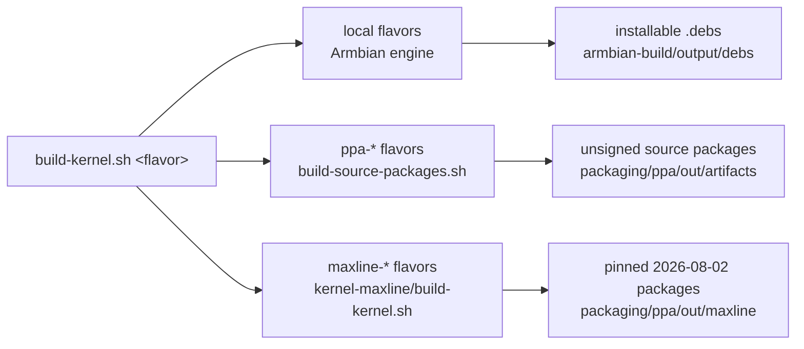

# Kernel builds — the unified map

Every ysp kernel build starts from **one entry point**:

```bash
bash kernel-drivers/scripts/build-kernel.sh <flavor>
```

This page is the map: what each flavor builds, from which source tree, with
which config, and where its install/validation runbook lives. The deep
material stays in the linked pages; this page only routes.



## Package slots

Each local flavor installs into its **own** slot, so all four kernels can be
installed side by side and installing one never disturbs another. The slot name
is the Armbian `BRANCH`, which is the whole mechanism: Armbian derives both the
package name (`linux-image-${BRANCH}-${LINUXFAMILY}`) *and* the kernel release
string (`LOCALVERSION=-${BRANCH}-${LINUXFAMILY}`, hence `/boot/vmlinuz-*`,
`/lib/modules/*`, the headers dir) from it.

| Flavor | Slot / package suffix | Release string |
|--------|----------------------|----------------|
| `forward-port` | `video-port-rockchip64` | `6.18.y-video-port-rockchip64` |
| `forward-port-debug` | `video-port-kasan-rockchip64` | `6.18.y-video-port-kasan-rockchip64` |
| `rewrite` | `video-rewrite-rockchip64` | `6.18.y-video-rewrite-rockchip64` |
| `rewrite-debug` | `video-rewrite-kasan-rockchip64` | `6.18.y-video-rewrite-kasan-rockchip64` |

Installing does not require naming a slot: `install-kernel.sh` takes the
`PHASH` that identifies one build and infers the slot from the deb filename,
so the slot and the build cannot disagree. `SLOT=` exists only to
disambiguate, and the installer refuses the two slots below outright.

Two slots are **not** ours and must never be written by these scripts:
`current-rockchip64` belongs to Armbian's own stock kernel, and
`ysp-rockchip64` is the PPA lineage
([`kernel-forward-port/`](../../packaging/ppa/kernel-forward-port/README.md)).

Making a custom `BRANCH` work needs three `declare -g` lines in each flavor's
`config-rock5b-*.conf.sh` — `KERNEL_MAJOR_MINOR`, `LINUXFAMILY`, `LINUXCONFIG`.
Armbian's `rockchip64_common.inc` sets those from a `case $BRANCH in
current|edge|bleedingedge`, and a branch it does not know falls straight through,
after which the build aborts with *"BAD config, missing KERNEL_MAJOR_MINOR"*.

`LINUXCONFIG` deliberately does **not** follow the slot for production flavors:
it names the config *file* Armbian reads, and production builds keep using
Armbian's stock `linux-rockchip64-current.config` so the config hash stays
comparable across the re-slot. (Pointing it at a slot-named file seeded from
`/boot/config-$(uname -r)` silently moved `C####` `b831` → `435e`.) The debug
flavors do seed per-slot configs, deliberately, and each under its own slot name.

## Flavors

| Flavor | Builds | Source tree (branch) | Config | Output / install path |
|--------|--------|----------------------|--------|----------------------|
| `forward-port` | Production forward-port kernel (vendor MPP/RGA/AV1 port, self-contained DT) | `../rock-5b/kernel/linux-6.18-rkvenc-av1-fwport` (HEAD) | stock Armbian `rockchip64-current`; opt-in `IOMMU_DEBUG=yes` extension | `.debs`; install via [`install-combined-kernel.sh`](../scripts/README.md#the-scripts), validate via `validate-combined.sh` |
| `forward-port-debug` | KASAN/lockdep debug build of the forward-port kernel ("Kernel A") | same as `forward-port` | [`config-rock5b-debug-kernel.conf.sh`](../scripts/debug-kernel/config-rock5b-debug-kernel.conf.sh) + shared [instrumentation fragment](../scripts/debug-kernel/ysp-debug-instrumentation.conf.sh), seeded from `/boot/config-$(uname -r)` | `.debs`; install/hold/rollback via [`debug-kernel/`](../scripts/debug-kernel/README.md) |
| `rewrite` | Non-debug clean-room rewrite candidate (rewrite drivers, vendor MPP/RGA off) | `../rock-5b/kernel/linux-6.18-rkvenc` (**must be on `rk3588-rewrite-6.18`, clean**) | stock Armbian `rockchip64-current` | `.debs`; install via `SLOT=video-rewrite install-combined-kernel.sh`. This is the performance-valid candidate flavor, not a production-readiness claim; current-tip hardware qualification is open. |
| `rewrite-debug` | KASAN/lockdep debug build of the clean-room rewrite kernel (rewrite drivers + 244 KUnit cases built in, vendor MPP/RGA off) | `../rock-5b/kernel/linux-6.18-rkvenc` (**must be on `rk3588-rewrite-6.18`, clean**) | [`config-rock5b-rewrite-debug-kernel.conf.sh`](../scripts/debug-kernel/config-rock5b-rewrite-debug-kernel.conf.sh) + the same shared fragment | `.debs`; same [`debug-kernel/`](../scripts/debug-kernel/README.md) install flow |
| `ppa-forward-port` | Unsigned source package `linux-rockchip64-ysp` for the normal PPA | patched Armbian worktree (see [`kernel-forward-port/`](../../packaging/ppa/kernel-forward-port/README.md)) | package `debian/config` | source artifacts under `packaging/ppa/out/artifacts` |
| `ppa-rewrite-6.18` | Unsigned source package `linux-rockchip64-ysp-alpha-6.18` (co-installable rewrite kernel) | pinned composite commit of `linux-6.18-rkvenc` (see [`kernel-rewrite-alpha-6.18/`](../../packaging/ppa/kernel-rewrite-alpha-6.18/README.md)) | package `debian/config` | source artifacts under `packaging/ppa/out/artifacts` |
| `ppa-rewrite-7.2-rc3` | Unsigned source package `linux-rockchip64-ysp-alpha-7.2-rc3` | pinned composite commit of `linux` (see [`kernel-rewrite-alpha-7.2-rc3/`](../../packaging/ppa/kernel-rewrite-alpha-7.2-rc3/README.md)) | package `debian/config` | source artifacts under `packaging/ppa/out/artifacts` |
| `maxline-public` / `maxline-wip` | Maximum-mainline packages pinned to Linux `7.2-rc6`, Torvalds `master@075b74841bd0` | `../rock-5b/kernel/linux` at pinned integration commits; separate `next-20260731` validation branches (see [`kernel-maxline/`](../../packaging/ppa/kernel-maxline/README.md)) | maxline `config/` | `packaging/ppa/out/maxline/package-<profile>` |

Not flavors of this entry point, but part of the same delivery picture:

- **DKMS channel** ([`packaging/dkms/`](../../packaging/dkms/README.md)) —
  out-of-tree modules for a stock kernel; **mutually exclusive** with the
  built-in local flavors on one installed kernel.
- **YSP Armbian builder VM** — exact-production image rebuilds
  ([builder finding](../../findings/2026-07-08-armbian-builder-setup.md)).

## Modes and knobs (local flavors)

```bash
build-kernel.sh <flavor> --stage-only    # regenerate + stage patches/config, no compile
build-kernel.sh <flavor> --patch-only    # stage the shared kernel worktree, no compile
build-kernel.sh --restore                # reset Armbian patch archive + userpatches
build-kernel.sh <flavor> --install-deps  # debug flavors: apt-install missing host deps
IOMMU_DEBUG=yes build-kernel.sh forward-port          # DMA/IOMMU observability extension
ARMBIAN_USE_CCACHE=no build-kernel.sh <flavor>        # clean retry
ARMBIAN_CLEAN_LEVEL=make-kernel build-kernel.sh <flavor>  # drop all Kbuild metadata
BASE_TAG=v6.18.42 build-kernel.sh rewrite-debug       # expert patch-base override
```

By default, `build-kernel.sh` selects the newest final `v6.18.x` tag reachable
from the chosen flavor tree, falling back to `v6.18` when the tree is based on
the initial release. This keeps a rebased tree's upstream stable history out of
the generated userpatch series: the current forward-port tree resolves to
`v6.18`, while the current rewrite tree resolves to `v6.18.42`. An explicit
`BASE_TAG=` is validated as an ancestor and prints a warning when it differs
from the automatic boundary.

This patch boundary does **not** choose the kernel Armbian compiles. The
forward-port tree correctly exports its 92 commits from `v6.18`, and Armbian
then applies those patches to its rolling `linux-6.18.y` checkout — 6.18.42 at
the 2026-08-05 tips. The rewrite tree already contains the 6.18.42 stable
history, so its
automatic patch boundary is `v6.18.42`; Armbian still compiles it on the same
rolling 6.18.42 base. `ARMBIAN_KERNELBRANCH=commit:<sha>` is the separate knob
for pinning that compiled base.

### `--patch-only`: staging the shared worktree for a source-package cut

`--stage-only` and `--patch-only` sound alike and are not interchangeable.
`--stage-only` prepares userpatches and core-patch exclusions and exits *before*
`compile.sh` runs, so it never touches the shared kernel worktree.
`--patch-only` passes Armbian's `PATCH_ONLY=yes` through, which returns from
`compile_kernel` immediately after `kernel_main_patching`
(`lib/functions/compilation/kernel.sh:57`): the worktree ends up holding exactly
this flavor's series, and nothing is compiled.

That matters because `packaging/ppa/build-source-packages.sh` cuts the
forward-port orig from that worktree, not from the flavor's git tree. Staging it
is the only reason a *source-only* PPA upload ever needed a local build; with
`--patch-only` it takes minutes instead of the better part of an hour.

Two behaviours specific to this mode:

- **Armbian exits non-zero and that is expected.** Once patching stops early its
  artifact packer has nothing to pack and fails. Patching has already succeeded
  by then, so the exit code is not the signal — the staged worktree is, and
  STEP 6 verifies it. Every other mode still fails hard on a failed compile.
- **STEP 6 verifies the worktree instead of a deb**, which is the check a full
  build never performed and whose absence
  [shipped a rewrite-composite orig and panicked the board](../../findings/2026-07-29-production-6-18-40-orig-is-rewrite-composite-snapshot.md).
  It compares `rockchip_iommu_set_fault_handler()` body-to-body against the
  flavor tree, rejects a forward-port staging that carries the rewrite-only
  `rockchip_iommu_sync_fault_handler`, and purges leftover `*-rewrite` driver
  directories from a previous flavor's build.

Do **not** whole-file compare the worktree against a flavor tree. The worktree is
an Armbian stable base plus Armbian's patches plus the series; a flavor tree may
sit on `v6.18` or a later stable tag selected by the automatic patch boundary.
They differ for legitimate reasons, and a byte compare fails closed on a
correctly staged worktree.

Mechanics preserved from the validated engine: rolling `linux-6.18.y` by
default with `ARMBIAN_KERNELBRANCH=commit:<sha>` for reproducible rebuilds,
core media patch exclusions for the self-contained DT, `USE_CCACHE` **as a
compile.sh argument** (the Docker relaunch drops env vars — [ccache
guide](./kernel-build-ccache.md)), stale debug-config sweep with
`CLEAN_LEVEL=make-kernel` escalation on config-class transitions, and the final
`P####-C####` hash print consumed by the installers.

## Debug-flavor specifics

Both `*-debug` flavors stage the ramoops DT patch and seed the base config
from the running kernel, then apply the shared instrumentation fragment
(KASAN inline, lockdep/PROVE_LOCKING, DMA-API debug, fault injection, pstore,
stall detectors — full rationale in [`debug-kernel.md`](./debug-kernel.md) §3).
The rewrite flavor additionally forces the rewrite/KUnit options on and the
vendor MPP/RGA drivers off, mirroring the validated
[rewrite package config](../../packaging/ppa/kernel-rewrite-alpha-6.18/README.md).
Because the two debug flavors share one instrumentation fragment, they share a
config class (`C####`); the patch hash (`P####`) is what distinguishes their
artifacts. Flavors no longer share package names — each has its own
[slot](#package-slots), so a debug install cannot clobber a production one — but
still pin installs by the printed `PHASH` (successive builds *within* a slot
share a name), prepare recovery first ([`install.md`](../../install.md) §3), and
never benchmark on a debug kernel ([`debug-kernel.md`](./debug-kernel.md) §8).

Since builds within a slot do share a package name, `uname -v` now carries the
**real wall-clock build time** to tell them apart: the `ysp-build-stamp`
extension overrides Armbian's reproducible-build stamp (which pins
`KBUILD_BUILD_TIMESTAMP` to the kernel git revision date, making every rebuild
look identical). The trade-off is deliberate — `SOURCE_DATE_EPOCH` stays pinned,
but two builds of identical source no longer produce a byte-identical vmlinux.

## Validation pointers

- Local production kernel: [`kernel-validation-runbook.md`](./kernel-validation-runbook.md).
- Debug kernels: [`debug-kernel.md`](./debug-kernel.md) §4–§7 (crash capture, install, rollback).
- Rewrite kernels: [`conformance.md`](../tests/conformance.md) and the
  [conformance-gap audit](./rewrite-conformance-gap-audit.md) hardware gates
  (244-case booted KUnit report, paired suites).
- PPA packages: per-package READMEs above; publication state in
  [`packaging/ppa/`](../../packaging/ppa/README.md) and watchlist W05.
- Maxline: [recovery-first install order](../../packaging/ppa/kernel-maxline/README.md#install-and-test-order).
