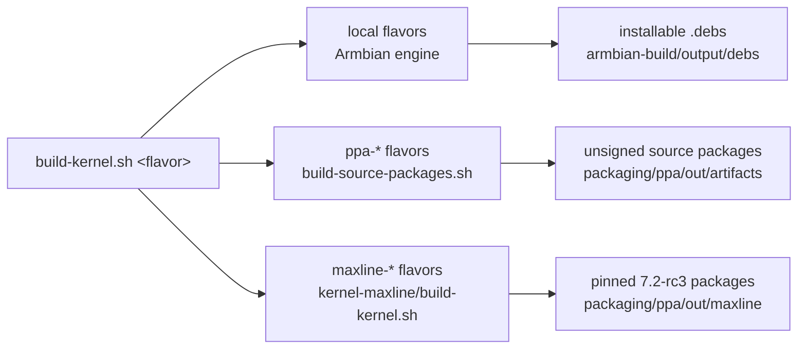

# Kernel builds — the unified map

Every ysp kernel build starts from **one entry point**:

```bash
bash kernel-drivers/scripts/build-kernel.sh <flavor>
```

This page is the map: what each flavor builds, from which source tree, with
which config, and where its install/validation runbook lives. The deep
material stays in the linked pages; this page only routes.



## Flavors

| Flavor | Builds | Source tree (branch) | Config | Output / install path |
|--------|--------|----------------------|--------|----------------------|
| `forward-port` | Production forward-port kernel (vendor MPP/RGA/AV1 port, self-contained DT) | `../kernel/linux-6.18-rkvenc-av1-fwport` (HEAD) | stock Armbian `rockchip64-current`; opt-in `IOMMU_DEBUG=yes` extension | `.debs`; install via [`install-combined-kernel.sh`](../scripts/README.md#the-scripts), validate via `validate-combined.sh` |
| `forward-port-debug` | KASAN/lockdep debug build of the forward-port kernel ("Kernel A") | same as `forward-port` | [`config-rock5b-debug-kernel.conf.sh`](../scripts/debug-kernel/config-rock5b-debug-kernel.conf.sh) + shared [instrumentation fragment](../scripts/debug-kernel/ysp-debug-instrumentation.conf.sh), seeded from `/boot/config-$(uname -r)` | `.debs`; install/hold/rollback via [`debug-kernel/`](../scripts/debug-kernel/README.md) |
| `rewrite-debug` | KASAN/lockdep debug build of the clean-room rewrite kernel (rewrite drivers + 208 KUnit cases built in, vendor MPP/RGA off) | `../kernel/linux-6.18-rkvenc` (**must be on `rk3588-rewrite-6.18`, clean**) | [`config-rock5b-rewrite-debug-kernel.conf.sh`](../scripts/debug-kernel/config-rock5b-rewrite-debug-kernel.conf.sh) + the same shared fragment | `.debs`; same [`debug-kernel/`](../scripts/debug-kernel/README.md) install flow |
| `ppa-forward-port` | Unsigned source package `linux-rockchip64-ysp` for the normal PPA | patched Armbian worktree (see [`kernel-forward-port/`](../../packaging/ppa/kernel-forward-port/README.md)) | package `debian/config` | source artifacts under `packaging/ppa/out/artifacts` |
| `ppa-rewrite-6.18` | Unsigned source package `linux-rockchip64-ysp-alpha-6.18` (co-installable rewrite kernel) | pinned composite commit of `linux-6.18-rkvenc` (see [`kernel-rewrite-alpha-6.18/`](../../packaging/ppa/kernel-rewrite-alpha-6.18/README.md)) | package `debian/config` | source artifacts under `packaging/ppa/out/artifacts` |
| `ppa-rewrite-7.2-rc3` | Unsigned source package `linux-rockchip64-ysp-alpha-7.2-rc3` | pinned composite commit of `linux` (see [`kernel-rewrite-alpha-7.2-rc3/`](../../packaging/ppa/kernel-rewrite-alpha-7.2-rc3/README.md)) | package `debian/config` | source artifacts under `packaging/ppa/out/artifacts` |
| `maxline-public` / `maxline-wip` | Pinned upstream 7.2-rc3 maximum-mainline packages | `../kernel/linux` at pinned integration commits (see [`kernel-maxline/`](../../packaging/ppa/kernel-maxline/README.md)) | maxline `config/` | `packaging/ppa/out/maxline/package-<profile>` |

Not flavors of this entry point, but part of the same delivery picture:

- **DKMS channel** ([`packaging/dkms/`](../../packaging/dkms/README.md)) —
  out-of-tree modules for a stock kernel; **mutually exclusive** with the
  built-in local flavors on one installed kernel.
- **YSP Armbian builder VM** — exact-production image rebuilds
  ([builder finding](../../findings/2026-07-08-armbian-builder-setup.md), watchlist W14).

## Modes and knobs (local flavors)

```bash
build-kernel.sh <flavor> --stage-only    # regenerate + stage patches/config, no compile
build-kernel.sh --restore                # reset Armbian patch archive + userpatches
build-kernel.sh <flavor> --install-deps  # debug flavors: apt-install missing host deps
IOMMU_DEBUG=yes build-kernel.sh forward-port          # DMA/IOMMU observability extension
ARMBIAN_USE_CCACHE=no build-kernel.sh <flavor>        # clean retry
ARMBIAN_CLEAN_LEVEL=make-kernel build-kernel.sh <flavor>  # drop all Kbuild metadata
```

Mechanics preserved from the validated engine: exact 6.18.38 source pin
(`ARMBIAN_KERNELBRANCH`), core media patch exclusions for the self-contained
DT, `USE_CCACHE` **as a compile.sh argument** (the Docker relaunch drops env
vars — [ccache guide](./kernel-build-ccache.md)), stale debug-config sweep
with `CLEAN_LEVEL=make-kernel` escalation on config-class transitions, and the
final `P####-C####` hash print consumed by the installers.

## Debug-flavor specifics

Both `*-debug` flavors stage the ramoops DT patch and seed the base config
from the running kernel, then apply the shared instrumentation fragment
(KASAN inline, lockdep/PROVE_LOCKING, DMA-API debug, fault injection, pstore,
stall detectors — full rationale in [`debug-kernel.md`](./debug-kernel.md) §3).
The rewrite flavor additionally forces the rewrite/KUnit options on and the
vendor MPP/RGA drivers off, mirroring the validated
[rewrite package config](../../packaging/ppa/kernel-rewrite-alpha-6.18/README.md).
Because the two debug flavors share one instrumentation fragment, they share a
config class (`C####`); the patch hash (`P####`) is what distinguishes their
artifacts. All debug/production flavors reuse the same
`linux-*-current-rockchip64` package names — pin installs by the printed
`PHASH`, prepare recovery first ([`install.md`](../../install.md) §3), and never
benchmark on a debug kernel ([`debug-kernel.md`](./debug-kernel.md) §8).

## Validation pointers

- Local production kernel: [`kernel-validation-runbook.md`](./kernel-validation-runbook.md).
- Debug kernels: [`debug-kernel.md`](./debug-kernel.md) §4–§7 (crash capture, install, rollback).
- Rewrite kernels: [`rewrite-conformance.md`](../tests/rewrite-conformance.md) and the
  [conformance-gap audit](./rewrite-conformance-gap-audit.md) hardware gates
  (208-case booted KUnit report, paired suites).
- PPA packages: per-package READMEs above; publication state in
  [`packaging/ppa/`](../../packaging/ppa/README.md) and watchlist W05.
- Maxline: [recovery-first install order](../../packaging/ppa/kernel-maxline/README.md#install-and-test-order).
