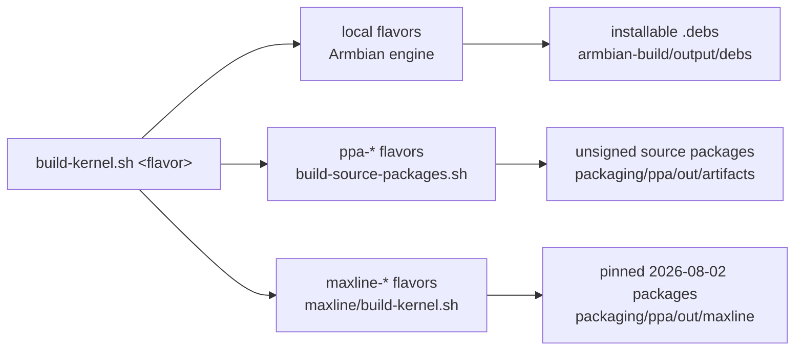

# Kernel builds — the unified map

Every ysp kernel build starts from **one entry point**:

```bash
bash kernel-drivers/scripts/build-kernel.sh <flavor>
```

This page is the map: what each flavor builds, from which source tree, with
which config, and where its install/validation runbook lives. The deep
material stays in the linked pages; this page only routes.



## Package slots

Each local flavor installs into its **own** slot, so all four kernels can be
installed side by side and installing one never disturbs another. The slot name
is the Armbian `BRANCH`, which is the whole mechanism: Armbian derives both the
package name (`linux-image-${BRANCH}-${LINUXFAMILY}`) *and* the kernel release
string (`LOCALVERSION=-${BRANCH}-${LINUXFAMILY}`, hence `/boot/vmlinuz-*`,
`/lib/modules/*`, the headers dir) from it.

| Flavor | Slot / package suffix | Release string |
|--------|----------------------|----------------|
| `forward-port` | `video-port-rockchip64` | `6.18.y-video-port-rockchip64` |
| `forward-port-debug` | `video-port-kasan-rockchip64` | `6.18.y-video-port-kasan-rockchip64` |
| `rewrite` | `video-rewrite-rockchip64` | `6.18.y-video-rewrite-rockchip64` |
| `rewrite-debug` | `video-rewrite-kasan-rockchip64` | `6.18.y-video-rewrite-kasan-rockchip64` |

Installing does not require naming a slot: `install-kernel.sh` takes the
`PHASH` that identifies one build and infers the slot from the deb filename,
so the slot and the build cannot disagree. `SLOT=` exists only to
disambiguate, and the installer refuses the two slots below outright.

Two slots are **not** ours and must never be written by these scripts:
`current-rockchip64` belongs to Armbian's own stock kernel, and
`ysp-rockchip64` is the PPA lineage
([`kernel-forward-port/`](../../packaging/ppa/kernel-forward-port/README.md)).

Making a custom `BRANCH` work needs three `declare -g` lines in each flavor's
`config-rock5b-*.conf.sh` — `KERNEL_MAJOR_MINOR`, `LINUXFAMILY`, `LINUXCONFIG`.
Armbian's `rockchip64_common.inc` sets those from a `case $BRANCH in
current|edge|bleedingedge`, and a branch it does not know falls straight through,
after which the build aborts with *"BAD config, missing KERNEL_MAJOR_MINOR"*.

`LINUXCONFIG` deliberately does **not** follow the slot for production flavors:
it names the config *file* Armbian reads, and production builds keep using
Armbian's stock `linux-rockchip64-current.config` so the config hash stays
comparable across the re-slot. (Pointing it at a slot-named file seeded from
`/boot/config-$(uname -r)` silently moved `C####` `b831` → `435e`.) The debug
flavors do seed per-slot configs, deliberately, and each under its own slot name.

## Flavors

| Flavor | Builds | Source tree (branch) | Config | Output / install path |
|--------|--------|----------------------|--------|----------------------|
| `forward-port` | Production forward-port kernel (vendor MPP/RGA/AV1 port, self-contained DT) | `../rock-5b/kernel/linux-6.18-rkvenc-av1-fwport` (HEAD) | stock Armbian `rockchip64-current`; opt-in `IOMMU_DEBUG=yes` extension | `.debs`; install via [`install-combined-kernel.sh`](../scripts/README.md#the-scripts), validate via `validate-combined.sh` |
| `forward-port-debug` | KASAN/lockdep debug build of the forward-port kernel ("Kernel A") | same as `forward-port` | [`config-rock5b-debug-kernel.conf.sh`](../scripts/debug-kernel/config-rock5b-debug-kernel.conf.sh) + shared [instrumentation fragment](../scripts/debug-kernel/ysp-debug-instrumentation.conf.sh), seeded from `/boot/config-$(uname -r)` | `.debs`; install/hold/rollback via [`debug-kernel/`](../scripts/debug-kernel/README.md) |
| `rewrite` | Non-debug clean-room rewrite candidate (rewrite drivers, vendor MPP/RGA off) | `../rock-5b/kernel/linux-6.18-rkvenc` (**must be on `rk3588-rewrite-6.18`, clean**) | stock Armbian `rockchip64-current` | `.debs`; install via `SLOT=video-rewrite install-combined-kernel.sh`. This is the performance-valid candidate flavor, not a production-readiness claim; current-tip hardware qualification is open. |
| `rewrite-debug` | KASAN/lockdep debug build of the clean-room rewrite kernel (rewrite drivers + 248 KUnit cases built in, vendor MPP/RGA off) | `../rock-5b/kernel/linux-6.18-rkvenc` (**must be on `rk3588-rewrite-6.18`, clean**) | [`config-rock5b-rewrite-debug-kernel.conf.sh`](../scripts/debug-kernel/config-rock5b-rewrite-debug-kernel.conf.sh) + the same shared fragment | `.debs`; same [`debug-kernel/`](../scripts/debug-kernel/README.md) install flow |
| `ppa-forward-port` | Unsigned source package `linux-rockchip64-ysp` for the normal PPA | production patches staged automatically by the separate `armbian-build-ppa` checkout in its `ppa-forward-port` kernel lane (see [`kernel-forward-port/`](../../packaging/ppa/kernel-forward-port/README.md)) | package `debian/config` | source artifacts under `packaging/ppa/out/artifacts` |
| `ppa-rewrite-6.18` | Unsigned source package `linux-rockchip64-ysp-alpha-6.18` (co-installable rewrite kernel) | pinned composite commit of `linux-6.18-rkvenc` (see [`kernel-rewrite-alpha-6.18/`](../../packaging/ppa/kernel-rewrite-alpha-6.18/README.md)) | package `debian/config` | source artifacts under `packaging/ppa/out/artifacts` |
| `ppa-rewrite-7.2-rc3` | Unsigned source package `linux-rockchip64-ysp-alpha-7.2-rc3` | pinned composite commit of `linux` (see [`kernel-rewrite-alpha-7.2-rc3/`](../../packaging/ppa/kernel-rewrite-alpha-7.2-rc3/README.md)) | package `debian/config` | source artifacts under `packaging/ppa/out/artifacts` |
| `maxline-public` / `maxline-wip` | Maximum-mainline packages pinned to Linux `7.2-rc6`, Torvalds `master@075b74841bd0` | `../rock-5b/kernel/linux` at pinned integration commits; separate `next-20260731` validation branches (see [`maxline/`](../../kernel-versions/maxline/README.md)) | maxline `config/` | `packaging/ppa/out/maxline/package-<profile>` |

Not flavors of this entry point, but part of the same delivery picture:

- **DKMS channel** ([`packaging/dkms/`](../../packaging/dkms/README.md)) —
  out-of-tree modules for a stock kernel; **mutually exclusive** with the
  built-in local flavors on one installed kernel.
- **YSP Armbian builder VM** — exact-production image rebuilds
  ([builder finding](../../findings/2026-07-08-armbian-builder-setup.md)).

## Modes and knobs (local flavors)

```bash
build-kernel.sh <flavor> --stage-only    # regenerate + stage patches/config, no compile
build-kernel.sh <flavor> --patch-only    # stage the selected kernel worktree, no compile
build-kernel.sh --restore                # reset Armbian patch archive + userpatches
build-kernel.sh <flavor> --install-deps  # debug flavors: apt-install missing host deps
IOMMU_DEBUG=yes build-kernel.sh forward-port          # DMA/IOMMU observability extension
ARMBIAN_USE_CCACHE=no build-kernel.sh <flavor>        # clean retry
ARMBIAN_CLEAN_LEVEL=make-kernel build-kernel.sh <flavor>  # drop all Kbuild metadata
BASE_TAG=v6.18.42 build-kernel.sh rewrite-debug       # expert patch-base override
```

By default, `build-kernel.sh` selects the newest final `v6.18.x` tag reachable
from the chosen flavor tree, falling back to `v6.18` when the tree is based on
the initial release. This keeps a rebased tree's upstream stable history out of
the generated userpatch series: the current forward-port tree resolves to
`v6.18`, while the current rewrite tree resolves to `v6.18.42`. An explicit
`BASE_TAG=` is validated as an ancestor and prints a warning when it differs
from the automatic boundary.

This patch boundary does **not** choose the kernel Armbian compiles. The
forward-port tree correctly exports its 92 commits from `v6.18`, and Armbian
then applies those patches to its rolling `linux-6.18.y` checkout — 6.18.43 at
the 2026-08-07 tips. The rewrite tree already contains the 6.18.42 stable
history, so its
automatic patch boundary is `v6.18.42`; Armbian still compiles it on the same
rolling 6.18.43 base. `ARMBIAN_KERNELBRANCH=commit:<sha>` is the separate knob
for pinning that compiled base.

### `--patch-only`: staging a selected worktree for a source-package cut

`--stage-only` and `--patch-only` sound alike and are not interchangeable.
`--stage-only` prepares userpatches and core-patch exclusions and exits *before*
`compile.sh` runs, so it never touches a kernel worktree.
`--patch-only` passes Armbian's `PATCH_ONLY=yes` through, which returns from
`compile_kernel` immediately after `kernel_main_patching`
(`lib/functions/compilation/kernel.sh:57`): the worktree ends up holding exactly
this flavor's series, and nothing is compiled. It also passes
`ARTIFACT_IGNORE_CACHE=yes` and `ARTIFACT_WILL_NOT_BUILD=yes`. Those are
Armbian's native controls for a non-artifact operation: staging cannot be
silently replaced by a stale binary-cache hit, and the artifact layer does not
try to archive nonexistent `.deb`s after patching.

That matters because `packaging/ppa/build-source-packages.sh` cuts the
forward-port orig from an Armbian-patched worktree, not from the flavor's git
tree. `setup-ppa-armbian-worktree.sh` creates a linked Armbian Git worktree at
`$WORKSPACE/armbian-build-ppa`; bootstrap runs it automatically, and the
canonical `ppa-forward-port` flavor checks it before every source cut. The PPA
checkout owns its `patch/`, `userpatches/`, config, output/log, and temporary
state. Only `cache/` is linked to the primary checkout, preserving the single
kernel Git mirror and the central ccache. Within that cache,
`KERNEL_EXTRA_DIR=ppa-forward-port` gives PPA staging its own kernel source
worktree.

The wrapper first removes any previous PPA kernel lane through the local
Armbian Docker image, including its Git worktree record, then creates, patches,
and verifies
`6.18__rockchip64__arm64__ppa-forward-port` and exports only from that lane.
Local builds and PPA staging now take different Armbian-state locks, so the PPA
patch-only run, export, signing, and upload can proceed while an already-staged
kernel compiles. Git's shared repository still serializes its own brief ref and
worktree metadata updates; the two long operations no longer share mutable
patch inputs or a wrapper lock. The complete PPA sequence retains its own lock,
so two source cuts cannot race each other.

Measured on 2026-08-07, the primary Armbian checkout was 312 MiB excluding
cache/output, including a 101 MiB shared Git database. The installed linked
checkout measures 203 MiB (allow about 0.2–0.4 GiB as logs evolve). The 1.8 GiB
PPA kernel lane already existed in the prior design, and source export plus
independent extraction remain about 2.3 GiB + 2.1 GiB transient; the change
does not duplicate those. A fully duplicated kernel mirror would add another
3.8 GiB and is intentionally avoided.

The installed layout was exercised before handoff: a fresh PPA lane checkout
and all 92 forward-port patches completed in 493 seconds while the 6.18.43
`rewrite-debug` KASAN `make -j12` remained active in the primary track. The PPA
verifier matched both IOMMU helpers, found zero rewrite paths, and the
non-artifact controls left no hashed-cache tar in the PPA output.

Setup and inspection are idempotent:

```bash
bash kernel-drivers/scripts/setup-ppa-armbian-worktree.sh
bash kernel-drivers/scripts/setup-ppa-armbian-worktree.sh --check
```

The setup advances a clean detached PPA worktree to the primary Armbian HEAD,
but refuses tracked modifications or an unmanaged cache path. The exporter also
rejects a kernel worktree whose `make kernelversion` does not match the
package's upstream-version prefix.

Docker owns the files it creates inside these worktrees. If a lane becomes
suspect, remove the complete lane and its Git registration through the
allowlisted [Docker cleanup helper](../scripts/README.md#docker-owned-armbian-state-cleanup)
rather than recursively changing ownership; Armbian will recreate it from the
shared bare repository. The same helper backs the retention tool's
`--docker-apply` mode for root-owned output artifacts. The canonical PPA path
does this complete lane refresh automatically before every source cut, so no
untracked file or interrupted-build product can survive into a later orig.

Two behaviours specific to this mode:

- **The staged worktree is the authoritative result.** Current Armbian honors
  the non-artifact controls and exits zero after patching. Older revisions may
  still enter their artifact packer, find no `.deb`s, and exit non-zero after a
  successful patch pass; the wrapper reports that compatibility case and STEP 6
  still verifies the staged tree. Every real compile remains gated by its exit
  status.
- **STEP 6 verifies the worktree instead of a deb**, which is the check a full
  build never performed and whose absence
  [shipped a rewrite-composite orig and panicked the board](../../findings/2026-07-29-production-6-18-40-orig-is-rewrite-composite-snapshot.md).
  It compares `rockchip_iommu_set_fault_handler()` body-to-body against the
  flavor tree, judges `rockchip_iommu_sync_fault_handler` against that selected
  tree instead of assuming which flavor owns it, and purges leftover
  `*-rewrite` driver directories from a previous flavor's build.

Do **not** whole-file compare the worktree against a flavor tree. The worktree is
an Armbian stable base plus Armbian's patches plus the series; a flavor tree may
sit on `v6.18` or a later stable tag selected by the automatic patch boundary.
They differ for legitimate reasons, and a byte compare fails closed on a
correctly staged worktree.

Mechanics preserved from the validated engine: rolling `linux-6.18.y` by
default with `ARMBIAN_KERNELBRANCH=commit:<sha>` for reproducible rebuilds,
core media patch exclusions for the self-contained DT, `USE_CCACHE` **as a
compile.sh argument** (the Docker relaunch drops env vars — [ccache
guide](./kernel-build-ccache.md)), stale debug-config sweep with
`CLEAN_LEVEL=make-kernel` escalation on config-class transitions, and the final
`P####-C####` hash print consumed by the installers.

## Debug-flavor specifics

Both `*-debug` flavors stage the ramoops DT patch and seed the base config
from the running kernel, then apply the shared instrumentation fragment
(KASAN inline, lockdep/PROVE_LOCKING, DMA-API debug, fault injection, pstore,
stall detectors — full rationale in [`debug-kernel.md`](./debug-kernel.md) §3).
The rewrite flavor additionally forces the rewrite/KUnit options on and the
vendor MPP/RGA drivers off, mirroring the validated
[rewrite package config](../../packaging/ppa/kernel-rewrite-alpha-6.18/README.md).
Because the two debug flavors share one instrumentation fragment, they share a
config class (`C####`); the patch hash (`P####`) is what distinguishes their
artifacts. Flavors no longer share package names — each has its own
[slot](#package-slots), so a debug install cannot clobber a production one — but
still pin installs by the printed `PHASH` (successive builds *within* a slot
share a name), prepare recovery first ([`install.md`](../../install.md) §3), and
never benchmark on a debug kernel ([`debug-kernel.md`](./debug-kernel.md) §8).

Since builds within a slot do share a package name, `uname -v` now carries the
**real wall-clock build time** to tell them apart: the `ysp-build-stamp`
extension overrides Armbian's reproducible-build stamp (which pins
`KBUILD_BUILD_TIMESTAMP` to the kernel git revision date, making every rebuild
look identical). The trade-off is deliberate — `SOURCE_DATE_EPOCH` stays pinned,
but two builds of identical source no longer produce a byte-identical vmlinux.

## Validation pointers

- Local production kernel: [`kernel-validation-runbook.md`](./kernel-validation-runbook.md).
- Debug kernels: [`debug-kernel.md`](./debug-kernel.md) §4–§7 (crash capture, install, rollback).
- Rewrite kernels: [`conformance.md`](../tests/conformance.md) and the
  [conformance-gap audit](./rewrite-conformance-gap-audit.md) hardware gates
  (248-case booted KUnit report, paired suites).
- PPA packages: per-package READMEs above; publication state in
  [`packaging/ppa/`](../../packaging/ppa/README.md) and watchlist W05.
- Maxline: [recovery-first install order](../../kernel-versions/maxline/README.md#install-and-test-order).
