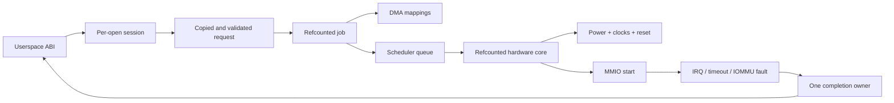
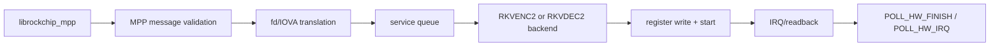
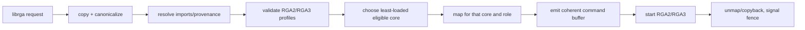

# Rewrite-driver architecture: a kernel-driver learning guide

This is a beginner-oriented tour of two Linux drivers for the Rockchip RK3588.
It assumes that you can read C, but it does not assume that you already know
how a platform driver, an ioctl, DMA, an IOMMU, an interrupt, a workqueue, or a
reference count fit together. Those terms are introduced at the point where
the driver needs them.

## What “rewrite kernel” means

The project often says **rewrite kernel** as shorthand. Linux itself was not
rewritten. The kernel is an otherwise normal Linux kernel in which two
Rockchip vendor-driver stacks are replaced:

| Replacement driver | Device file kept compatible | Hardware controlled |
|--------------------|-----------------------------|---------------------|
| `mpp-rewrite` | `/dev/mpp_service` | RK3588 RKVENC2 video encoders and RKVDEC2 video decoders |
| `rga-rewrite` | `/dev/rga` | RK3588 RGA2 and RGA3 2D image engines |

Applications still call the same userspace libraries. FFmpeg or GStreamer
calls `librockchip_mpp` for video work or `librga` for image work; the library
opens the familiar device file and sends the familiar ioctls. The change is
below that device-file boundary:

```text
application
  -> FFmpeg / GStreamer / direct test
  -> librockchip_mpp or librga
  -> ioctl on /dev/mpp_service or /dev/rga
  -> rewrite driver
  -> RK3588 hardware
```

The forward-port kernel takes the opposite approach: it carries the existing
Rockchip BSP drivers into a newer kernel with small compatibility changes. The
rewrite starts again from the documented userspace contract and uses public
kernel APIs. Only one implementation may own each hardware/device-file family
in a build. The comparison profiles select the forward-port pair or rewrite
pair; they cannot A/B the same device node during one boot.

That distinction explains the project goals:

- **Compatibility:** keep current Rockchip Linux media applications working
  without changing their device-file ABI.
- **Safety:** make buffer, job, hardware, interrupt, timeout, and teardown
  ownership explicit.
- **Maintainability:** use public Linux driver APIs instead of private BSP
  helpers.
- **Learning:** provide a smaller conceptual model for studying asynchronous
  DMA drivers.

It also explains what this is not. It is not an upstream submission, not a new
userspace API, not a rewrite of the codec libraries, and not a claim that every
historical Rockchip hardware block or legacy ioctl must be supported.

## Current status

This guide describes the sources committed on 2026-07-23:

| Kernel branch | Commit |
|---------------|--------|
| `rk3588-rewrite-6.18` | `1fe46df86f1ca` |
| `rk3588-rewrite-mainline` | `ec9a4a06ecf12` |

Both commits contain byte-identical rewrite sources:

```text
drivers/video/rockchip/mpp-rewrite/mpp_rewrite.c
drivers/video/rockchip/rga-rewrite/rga_rewrite.c
```

The two commits contain byte-identical MPP/RGA rewrite sources; the surrounding
kernel and device-tree integration differ. The current evidence is:

| Area | What exists now | What that proves |
|------|-----------------|------------------|
| Driver code | MPP and RGA implementations on both kernel branches | The same driver design is maintained on the 6.18 and current-mainline tracks. |
| ABI coverage | MPP covers the observed RK3588 RKVENC2/RKVDEC2 contract; RGA covers a broad current `librga`/FFmpeg/GStreamer subset and explicitly rejects recognized unsafe or unimplemented paths | Expected current requests can be parsed and represented; an explicit rejection is preferable to silently misprogramming hardware. |
| In-source tests | 85 MPP and 147 RGA KUnit cases, 232 total | Pure logic such as parsing, bounds, routing, register emission, and race-state transitions has executable coverage without requiring the board. |
| Build evidence | On 2026-07-23 all six normal, memory-safety, and race-oriented clean-source profiles passed without compiler warnings at the cited tips | Both branches build the IOMMU provider, KUnit-enabled rewrite objects, and ROCK 5B DTB under the intended configurations. A build is not hardware proof. |
| Latest recovery work | Generation-aware timeout/fault ownership, stricter CCU recovery, close/remove handoffs, and fail-closed MPP containment when a reset cannot prove that DMA stopped | The code has a defined terminal branch for dangerous recovery failures instead of assuming reset always works. |
| Hardware evidence | No current rewrite tip has a recorded, complete booted RK3588 conformance run | The rewrite is **not yet** the validated replacement for the forward port. |
| Packages | Existing rewrite package composites predate the current source tips | Those packages must not be treated as evidence for the code described here. |

The practical hardware scope is deliberately narrower than every name a
userspace library can advertise:

| Path | Rewrite scope |
|------|---------------|
| H.264/H.265 encode and decode | Required RKVENC2/RKVDEC2 paths |
| VP9 decode | Required decoder-parity path, still awaiting current-tip hardware evidence |
| AV1 through RKMPP | Not in this rewrite; RK3588 AV1 uses a separate hardware block, IOMMU, and backend |
| Older VDPU/VPU and JPEG blocks | Outside the current ROCK 5B rewrite profile |
| RGA | Current Linux `librga`, FFmpeg, GStreamer, RKNN/RKNPU preprocessing, and common display-shaped operations covered by the ABI ledger |
| Raw physical imports and unsupported legacy/RGA2-Pro modes | Rejected rather than accepted without safe ownership and command-emission support |

The hardware-evidence and package rows in the status table are the important
boundary. KUnit can prove that a function rejects an overflowing address or
that only one simulated completion path wins. It cannot prove that a register
recipe makes real silicon produce the correct pixels, that an interrupt
arrives, or that a reset stops a wedged DMA engine. Those claims require a
kernel built from the cited tip, booted on a ROCK 5B, followed by the
differential and fault-injection gates in the
[rewrite validation plan](./rewrite-validation-plan.md).

Until that evidence exists, the hardware-validated forward port remains the
runtime baseline. The rewrite is best described as **advanced bring-up with a
detailed safety architecture**, not production-ready hardware enablement.

Use [rewrite drivers](./rewrite-drivers.md) for the command-by-command ABI
ledger, [device tree](./device-tree.md) for the RK3588 hardware wiring, and the
[rewrite validation plan](./rewrite-validation-plan.md) for the production
qualification plan. This document focuses on how the driver code is organized
and why.

## How to read this guide

The guide has three layers:

1. Sections 1 and 2 establish the reusable driver ideas: ownership, trust
   boundaries, probing, power, interrupt context, and public kernel APIs.
2. Sections 3 and 4 follow the MPP and RGA implementations separately. Read
   only the one you care about first.
3. Sections 5 through 13 turn the implementation into design, review,
   debugging, and testing lessons that apply to other DMA-capable drivers.

If a term is unfamiliar, keep reading until the nearby explanation before
jumping to the glossary. The source-reading order in §10 is intentionally late:
understanding the lifetime model first makes the large C files much easier to
navigate.

---

## 1. The central lesson: a driver is an ownership machine

A first driver often looks like this:

```text
probe -> map registers -> write registers -> wait for interrupt -> done
```

Real drivers spend much more code answering harder questions:

- Who owns a userspace buffer after an ioctl returns?
- Can an interrupt run while `close()` is freeing the session?
- What happens if the device is removed while work is queued?
- What if a timeout from an old job fires after a new job starts?
- Which lock protects a pointer that is read in hard-IRQ context?
- When is DMA definitely stopped after reset fails?
- Can a file descriptor be reused for a different object during an ioctl?
- When may a fence be signaled relative to DMA unmapping and copyback?

The rewrite drivers use the following general shape:



The code is safest when each arrow has an explicit ownership rule. Register
programming is only one stage in the middle.

### 1.1 One submission from beginning to end

Before looking at structures and locks, follow one ordinary operation:

1. A process calls a userspace library. For example, it asks `librga` to resize
   an image.
2. The library opens `/dev/rga` and calls `ioctl()`. An ioctl is a syscall for
   device-specific commands; its argument points to a request in the process's
   address space.
3. The kernel copies the request. It must not keep the userspace pointer:
   another thread could change or unmap that memory as soon as the syscall
   continues.
4. The driver checks every count, offset, image dimension, format, flag, and
   arithmetic result. It resolves buffer handles into kernel objects and takes
   references that keep them alive.
5. The driver creates a **job**, a kernel-owned snapshot containing everything
   later asynchronous code needs.
6. A scheduler selects a compatible RGA core and puts the job on that core's
   queue.
7. When the core is free, the driver powers it, maps buffers into that device's
   address space, writes its registers, and finally writes the start bit.
8. `ioctl()` may already have returned for an asynchronous request. The job,
   mappings, and session must therefore survive independently of the original
   syscall stack.
9. The engine performs DMA: it reads and writes memory directly without the
   CPU copying every pixel.
10. The engine raises an interrupt. A short hard-interrupt handler acknowledges
    it; a sleep-capable interrupt thread performs the longer completion work.
11. The completion path stops using the hardware, makes device writes visible
    to the CPU, unmaps or copies back buffers, records the result, and only then
    signals a fence or wakes a waiting process.
12. References are dropped. The job is freed only when the queue, active slot,
    session, timeout, fence callbacks, and other possible owners have all let
    go.

MPP follows the same outline, but userspace supplies a mostly register-shaped
codec job and later polls for result registers instead of describing an image
operation and receiving an RGA release fence.

This walk-through introduces the main vocabulary:

| Term | Plain-language meaning here |
|------|-----------------------------|
| **request** | Data copied from one userspace command before it is accepted |
| **session** | Kernel state belonging to one open device file |
| **job** | Stable kernel snapshot of accepted work that may outlive the ioctl |
| **queue** | Jobs accepted by software but not yet running on a core |
| **active slot** | The one job a particular hardware core currently owns |
| **mapping** | A buffer made addressable by a particular DMA device |
| **IRQ/interrupt** | Hardware notifying the CPU that something happened |
| **fence/waitqueue** | A way to notify a dependent job or userspace that work completed |
| **reference** | A counted ownership claim that prevents an object from being freed |

A useful first principle follows: returning from `ioctl()` ends a syscall, not
necessarily the operation. Any object needed afterward requires an explicit
asynchronous owner.

### 1.2 Four boundaries to keep separate

Both rewrites separate four kinds of state:

1. **Service state** exists for the loaded module: registered hardware, global
   scheduling, counters, debugfs, and device-node registration.
2. **Session state** exists for one `open()`: client identity, imported
   resources, configured requests, and jobs visible to that file.
3. **Job state** is an immutable or mostly immutable snapshot of one
   submission. It retains everything asynchronous execution will need.
4. **Hardware state** exists for one platform device: MMIO, IRQ, clocks,
   resets, power state, queue/active slot, timeout work, and recovery state.

Do not collapse these lifetimes into one global structure. A file can close
while a job still exists, and a platform device can begin removal while a file
is still open. Refcounts and drain protocols bridge those lifetime gaps.

One concrete close race shows why:

```text
thread A                       thread B / hardware
--------                       -------------------
submit async job
ioctl returns
close(fd)
release session owner   <---- job still retains session + buffers
                               IRQ completes job
                               job drops final references
                               session and buffers may now be freed
```

If `close()` directly freed the session, the interrupt would dereference freed
memory. If `close()` waited without first preventing new submissions and
callbacks, it could wait forever. The correct design closes admission, cancels
or claims work, waits for asynchronous handoffs to drain, and then drops the
file's ownership reference.

### 1.3 The trust boundary

Every ioctl argument is untrusted. The driver must establish this ordering:

```text
copy fixed-size descriptor
  -> validate counts, flags, offsets, and integer arithmetic
  -> copy variable-sized payload
  -> resolve referenced kernel objects
  -> retain those objects
  -> validate the complete operation
  -> publish it to asynchronous code
```

Publishing before the snapshot is complete creates races in which another
thread can mutate, release, or replace part of the request.

“Untrusted” does not mean the normal library is malicious. It means the kernel
cannot make safety depend on every process being correct. A library bug, a
process killed midway through a request, a deliberately malformed test, and a
hostile local process all cross the same syscall boundary. Kernel validation
must make every one of them safe.

Validation also has two different levels:

- **Shape validation** asks whether data is well formed: sizes fit, arrays are
  bounded, flags are known, and arithmetic does not overflow.
- **Meaning validation** asks whether the operation is safe for this hardware:
  the selected core supports the format, every image plane fits its backing
  buffer, an IOVA belongs to a retained mapping, and source/destination aliases
  are legal.

Passing the first level is not permission to program hardware. Both must pass
before the job is published.

---

## 2. Linux plumbing shared by both rewrites

The drivers combine two Linux interfaces:

- A **platform driver** binds devices described by device tree and owns the
  physical hardware resources.
- A **misc character device** provides the userspace file in `/dev`.

These interfaces have different lifetimes and should not be confused.

Think of them as two views of the same driver:

| View | Question it answers | Typical lifetime |
|------|---------------------|------------------|
| Platform/hardware view | “Which physical cores exist, and where are their registers, interrupts, clocks, resets, and IOMMUs?” | From device probe until device removal |
| Character-device/user view | “What happens when a process opens, configures, submits, waits, and closes?” | One session per `open()` |

The device tree describes hardware, not open files. Conversely, opening
`/dev/rga` does not discover or construct an RGA core; it creates a session
that may route work to cores already found by the platform driver.

### 2.1 Module initialization

Each `module_init()` function follows this order:

1. Initialize the global service object and its locks/lists.
2. Register the platform driver.
3. Register a misc device:
   - MPP: `mpp_service`
   - RGA: `rga`
4. Create debugfs, and for MPP also compatibility procfs state.

Registering the platform driver causes the driver core to call `probe()` for
matching, already-present device-tree nodes. Multiple probes populate one
service.

On module exit, the character device is deregistered before the platform driver
is unregistered. That prevents new opens while hardware instances are being
removed.

There are therefore three related but distinct events:

```text
module loaded
  -> platform nodes probe and publish hardware
  -> process opens misc device and creates a session
  -> process closes session
  -> platform nodes remove and unpublish hardware
  -> module unload completes
```

Many embedded kernels build these drivers in, so module load/unload may never
occur at runtime. Probe, open, close, shutdown, and error recovery still need
correct lifetimes; a built-in driver is not exempt from teardown races.

### 2.2 Device-tree matching

The match table selects a small immutable hardware description:

```c
struct of_device_id {
        .compatible = "...",
        .data = &match_description,
};
```

The description tells probe which hardware family is present, its expected
register-window size, hardware ID/version, quirks, and backend behavior.

The MPP driver matches four kinds of nodes:

| Node kind | Role |
|-----------|------|
| RKVENC2 core | Executes encoder register jobs |
| RKVDEC2 core | Executes decoder register jobs |
| RKVENC2 CCU | Software-visible encoder coordinator |
| RKVDEC2 CCU | Decoder coordinator, including MMIO in hard/soft modes |

The RGA driver matches RGA2 and RGA3 cores. Every core becomes an independent
`struct rk_rga_hw`.

Device tree provides facts that software cannot safely guess: physical register
addresses, IRQ lines, power-domain links, clock names, reset lines, IOMMU
connections, and relationships between a core and a coordinator. The
`compatible` string chooses code; the remaining properties describe this
particular SoC instance.

A probe succeeds only when the node is both individually usable and consistent
with the topology around it. For example, two decoder cores can each have valid
register windows while still being unsafe in hard-CCU mode if their DMA
domains do not satisfy the coordinator's sharing rules.

### 2.3 What probe owns

A successful hardware probe typically establishes:

- `devm_ioremap_resource()` ownership of MMIO.
- `platform_get_irq*()` and `devm_request_threaded_irq()` ownership of IRQs.
- bulk clock handles.
- an optional reset-control array.
- a DMA mask appropriate to the hardware address width.
- runtime-PM enablement.
- an IOMMU-domain/fault-handler association.
- a refcounted hardware object published in the service registry.

`devm_*` removes much manual unwind code, but it does not solve logical races.
The driver must still stop jobs, cancel work, unregister callbacks, and wait for
references before devres releases MMIO and IRQ resources.

`devm_*` means “release this resource when the device is detached.” It does not
mean “the resource cannot be used after logical removal begins.” If an IRQ
thread, timeout worker, job, or mapping still holds a pointer into the hardware
object when probe's owner returns, automatic cleanup can turn that pointer into
a use-after-free. The driver's drain protocol must finish before devres becomes
the final cleanup mechanism.

### 2.4 Runtime power sequence

The common conceptual power-on sequence is:

```text
pm_runtime_resume_and_get()
  -> apply requested clock rates
  -> deassert reset
  -> enable clocks
  -> access MMIO
```

Power-off reverses the active parts and returns the runtime-PM reference:

```text
disable clocks
  -> mark last busy
  -> pm_runtime_put_autosuspend() or suspend
```

The rule for a learner is simple: an MMIO access is legal only while the
driver has proved the device is powered and clocked, except for registers whose
binding explicitly says otherwise.

Runtime PM is reference-counted permission to use the powered device. A
successful `pm_runtime_resume_and_get()` is an ownership event just like
getting a job or buffer reference; every successful get needs one matching
put. Error paths must know whether power was acquired before trying to release
it.

### 2.5 Hard IRQ versus threaded IRQ

Both drivers use threaded IRQs.

The **hard-IRQ handler**:

- reads and acknowledges status quickly;
- uses only spinlock-safe operations;
- records enough state for the thread;
- returns `IRQ_WAKE_THREAD` for terminal completion.

The **IRQ thread**:

- may take mutexes;
- claims the active job;
- cancels timeout work;
- performs readback or reset;
- powers down;
- completes the job and schedules more work.

This split keeps slow operations, sleeping locks, runtime PM, and memory
teardown out of hard-IRQ context.

The same source file can run in several execution contexts:

| Context | May sleep? | Typical work in these drivers |
|---------|------------|-------------------------------|
| Syscall/process context | Yes | copy and validate ioctl data, allocate, map, submit, close |
| Hard IRQ | No | read/acknowledge status, update small spinlock-protected state |
| Threaded IRQ | Yes | claim completion, reset if required, power down, unmap, wake |
| Workqueue | Yes | schedule queued work, handle timeout/IOMMU recovery, deferred fence work |
| IOMMU fault callback | Treat as constrained | identify the faulting source and queue recovery |

This is why “put a mutex around it” is not a complete concurrency design. A
hard IRQ cannot take a sleeping mutex, while holding a spinlock across runtime
PM or DMA unmap would be illegal. The drivers use a short spinlock operation to
publish or claim IRQ-visible state, then a mutex in a sleep-capable context to
perform the longer transaction.

### 2.6 Public API design

The rewrites intentionally use kernel APIs exported to ordinary drivers:

- DMA-BUF attach/map/unmap/detach
- the DMA mapping API
- IOMMU domain queries and group attachment
- runtime PM
- common clock and reset frameworks
- threaded IRQs
- `dma_fence` and `sync_file`
- `devm_*` resource management

This makes the dependency surface visible. A driver that depends on internal
helpers from another subsystem may compile in one vendor tree but fail as a
module or during a forward port.

“Public” here means a supported interface made available to ordinary kernel
drivers, not an interface callable from userspace. The userspace ABI is the
ioctl contract; the public kernel API is the set of in-kernel services used to
implement it. Keeping those two boundaries separate is one of the rewrite's
main maintainability choices.

---

## 3. MPP architecture

MPP userspace builds most codec-specific register recipes. The kernel therefore
acts primarily as a validated register-job transport:



The kernel is not deciding H.264 motion-search policy or constructing a decoder
recipe. It is protecting the kernel and hardware while transporting a recipe
normally created by `librockchip_mpp` through an untrusted syscall boundary.
The library is the expected producer, but the kernel applies the same checks if
a test or hostile process constructs the ioctl directly.

A simplified decode submission looks like this:

```text
userspace message: INIT_CLIENT_TYPE = RKVDEC
userspace messages:
    SET_REG_WRITE      (decoder register image)
    SET_REG_ADDR_OFFSET
    SET_RCB_INFO
    POLL_HW_FINISH
kernel:
    copy messages -> build job -> select decoder core
    translate designated dma-buf fds to that core's IOVAs
    validate VDPU38x register ranges and topology
    queue -> power -> write registers -> start
hardware:
    fetch bitstream/reference buffers -> decode -> IRQ
kernel:
    read requested result words -> mark job done -> wake poller
userspace:
    receive status/readback and use the decoded frame
```

The messages describe one operation, but they are not executed piecemeal as
they arrive. The driver first creates a complete, validated job. Otherwise an
early message could publish a half-built register image before a later message
fails.

### 3.1 MPP object graph

The principal objects are:

| Object | Created by | Owns or tracks |
|--------|------------|----------------|
| `rk_mpp_service` | module init | hardware registry, global queue, DMA groups, counters, work item |
| `rk_mpp_hw` | platform probe | device, MMIO, IRQ, clocks, resets, active job, timeout/fault work, CCU state |
| `rk_mpp_session` | `/dev/mpp_service` `open()` | client type, imports, active jobs, translation table, RCB and codec metadata |
| `rk_mpp_import` | fd translation | DMA-BUF, attachment, mapped scatterlist, device-specific IOVA |
| `rk_mpp_job` | ioctl message collection | copied requests, register image, imports, selected hardware, result/readback |
| `rk_mpp_dma_group` | hardware probe | IOMMU group, original DMA domain, preallocated empty isolation domain |

The important reference direction is:

```text
job -> session
job -> selected hardware
job -> every import used by its register image
job -> decoder CCU/link descriptor when required
```

Consequently, closing a file or removing a handle cannot free memory still
needed by an accepted job.

### 3.2 Session lifecycle

`rk_mpp_open()` allocates a session, initializes its locks, import list,
active-job list, waitqueue, state sequence, and reference count.

At first the session has no codec type. `MPP_CMD_INIT_CLIENT_TYPE` binds it to a
supported device type such as RKVENC or RKVDEC. Reinitializing an already-bound
session as another type returns `-EBUSY`.

The session's `state_seq` is a cancellation generation. A staged operation
copies the current sequence. Reset/teardown can change session state, and later
checks reject a job or mapping whose snapshot no longer matches. This is
stronger than testing a pointer for non-NULL because a pointer may be reused
across logical generations.

`rk_mpp_release()`:

1. cancels and drains the session's queued/active jobs;
2. releases its cached DMA imports;
3. drops the file's session reference.

Jobs retain their own session reference, so the allocation disappears only
after all asynchronous owners drain.

### 3.3 The MPP ioctl is a message stream

`MPP_IOC_CFG_V1` points at one or more fixed-layout messages. Each message has:

- a command;
- transport/job flags;
- payload size and offset;
- a 64-bit userspace pointer.

Static assertions pin structure sizes and offsets so a compiler or architecture
change cannot silently alter the ABI.

`rk_mpp_collect_msgs()` performs the transport layer:

1. copies one descriptor at a time;
2. validates command and flag combinations;
3. enforces maximum message/request counts;
4. handles multi-message and last-message framing;
5. converts the ABI descriptor to an internal `mpp_request`;
6. sends it to `rk_mpp_process_request()`;
7. executes the staged jobs only after the complete message group is valid.

The batch object is temporary ioctl state. It is not a hardware queue.

### 3.4 Building a job

Messages that describe one hardware operation are collected into an
`rk_mpp_job`:

- `SET_REG_WRITE` copies a register image fragment.
- `SET_REG_READ` records which bytes must be copied back.
- `SET_REG_ADDR_OFFSET` records address adjustments.
- `SET_RCB_INFO` supplies row/column-buffer descriptors.
- `POLL_HW_FINISH` or `POLL_HW_IRQ` records the wait/readback operation.

Before submission, the driver:

1. verifies the session generation and client type;
2. chooses an eligible core;
3. allocates/extends the kernel register image with overflow checks;
4. translates buffer references or validates explicit IOVAs;
5. applies address offsets;
6. applies RCB information;
7. calls the hardware backend's validator;
8. publishes the job to the queue.

The staged register image lives in kernel memory. Hardware and IRQ code never
dereference the original userspace pointer.

### 3.5 DMA-BUF import and register translation

MPP register images contain buffer references in selected register words.
Translation tables identify those words for each codec profile.

Three kinds of address are easy to confuse:

```text
userspace virtual address -- meaningful to the process/CPU
physical page address     -- location in system memory
IOVA                      -- address emitted by this DMA device
```

An IOMMU translates the last address to physical pages. The same DMA-BUF may
receive different IOVAs when attached to two devices, and an IOVA from one
domain is just an unproven number in another. That is why the mapping belongs
to a `(buffer, device)` pair rather than to the buffer alone.

For an fd-backed word, the driver:

1. calls `dma_buf_get(fd)`;
2. attaches the DMA-BUF to the selected core's `struct device`;
3. maps the attachment;
4. verifies the mapped scatterlist forms one contiguous device-address span;
5. verifies the span fits the hardware's 32-bit address space;
6. caches the import by the tuple `(fd, device, dma_buf object)`;
7. replaces the register word with the IOVA plus any validated offset;
8. retains the import in the job.

Including the `dma_buf` object in the cache identity matters. File descriptor
numbers can be closed and reused; `fd == old_fd` does not prove it is the same
buffer.

The device is also part of the identity because an IOVA is meaningful in the
mapping context of a particular DMA device/domain. A mapping produced for core
0 is not automatically a valid mapping for core 1.

The contiguous-span check is about the device-visible address range, not
whether the buffer occupies adjacent physical RAM. An IOMMU may map scattered
physical pages into one continuous IOVA window. The codec registers can then
walk that window, but only after the DMA mapping API and driver have proved it
covers the complete allocation and fits the 32-bit register aperture.

#### Explicit IOVA mode

Some ABI paths ask userspace to translate fds first and later submit literal
IOVAs. The session pins an `explicit_map_dev` when it performs this translation.
Later jobs using the explicit-IOVA flag must select the same device and prove
that every literal address falls inside a retained import. This prevents an
address translated in one IOMMU context from being sent to another core.

`explicit_map_lock` serializes mapping changes and core affinity. It is taken
outside `session->lock`.

### 3.6 Core selection and the service scheduler

The service holds one global list of queued jobs. Each job already retains its
selected hardware.

Core selection considers:

- session client type;
- online and non-quarantined state;
- CCU availability;
- hard-CCU shared-domain requirements;
- queue load;
- round-robin tie breaking;
- explicit mapping affinity.

Queue publication takes references for both the session-visible active list and
the service scheduler list. The scheduler work item removes a runnable job,
then calls the backend's `submit()` method.

MPP uses a small backend interface:

```c
struct rk_mpp_backend_ops {
        int (*validate)(struct rk_mpp_job *job);
        int (*submit)(struct rk_mpp_job *job);
        irqreturn_t (*irq)(struct rk_mpp_hw *hw);
        irqreturn_t (*thread)(struct rk_mpp_hw *hw);
};
```

This is a good use of an operations table: scheduling and lifetime rules are
common, while register layout, start, IRQ status, and readback differ between
encoder and decoder.

### 3.7 The active slot and generation numbers

Each core has one `active_job`. Publication is protected by `hw->lock`, a
spinlock visible to hard IRQ context. `hw->run_lock` serializes process-context
start, completion, timeout recovery, abort, and removal.

Every activation increments `active_generation`. Timeout and IOMMU-fault paths
capture that generation and act only if all of these still match:

```text
same hardware
AND same active job
AND same non-zero activation generation
```

This closes the classic stale-timer race:

```text
job A starts
timer A is delayed
job A completes
job B starts
timer A finally runs
```

Without a generation check, timer A could reset job B.

### 3.8 Encoder backend

The RKVENC2 backend:

1. validates required MMIO ranges, IRQ, core clock, writes, and readbacks;
2. claims the core's active slot under `run_lock`;
3. powers the core;
4. clears old state/counters;
5. patches dual-core DCHS identifiers;
6. writes all registers except the start register;
7. programs the hardware watchdog from resolution and clock rate;
8. arms the software timeout;
9. issues a write barrier;
10. writes the start value.

The start register is written last. This is a general hardware-driver rule:
fully construct visible state, use the required memory ordering, and only then
ring the doorbell/start bit.

Encoder slice mode is a second completion stream. The hard IRQ can push slice
length records into a per-job `kfifo` protected by a spinlock and wake
`POLL_HW_IRQ` waiters before final frame completion. The terminal interrupt
wakes the IRQ thread, which reads result registers and completes the job.

### 3.9 Decoder backend and CCU modes

RKVDEC2 is more complicated because two cores may be coordinated.

#### Soft CCU

In soft mode the selected core remains the software owner:

- power the core and coordinator;
- configure cache/RCB state;
- program the selected core in the CCU;
- write the core's register image;
- arm timeout;
- start that core.

Completion is attributed directly to the core's active job.

#### Hard CCU/link mode

In hard mode the driver creates a DMA-coherent link-table descriptor. The CCU
can execute the descriptor on a core different from the software-side owner.
The job therefore retains:

- the selected core;
- the exact coordinator;
- its link-table allocation;
- CCU list membership;
- power references for participating cores.

Hard-CCU admission and recovery use this lock order:

```text
ccu->ccu_recovery_lock
  -> core->run_lock
  -> core->lock only for short IRQ-visible state changes
```

The same order is used by submission, error recovery, and removal. Establishing
one order prevents an ABBA deadlock.

The threaded interrupt drains completed CCU descriptors rather than assuming
the interrupting core owns the completed job.

### 3.10 Completion and polling

The hard IRQ acknowledges hardware and records status. The threaded handler
claims the active job, cancels its timeout, reads requested registers, handles
error/reset requirements, powers down, and calls `rk_mpp_job_complete()`.

Completion:

1. records elapsed hardware time;
2. stores the result and changes state to `DONE` under the session lock;
3. releases DCHS/link resources;
4. drops the hardware reference;
5. wakes the session waitqueue;
6. schedules the next queued work.

The session's active-job list preserves userspace submission order.
`POLL_HW_FINISH` waits until the first job is done, removes it from that list,
copies only the previously validated readback spans to userspace, and drops the
list's job reference.

The visible state machine is:

```text
STAGED
  -> ACTIVE + on session list + on scheduler list
  -> ACTIVE + selected core's active_job
  -> DONE + still on session list
  -> reaped by poll
  -> freed when final reference drops
```

Queue/list placement distinguishes queued from running; the enum does not need
to encode every internal substate.

### 3.11 Timeout and IOMMU-fault recovery

Timeout and IOMMU fault processing runs in workqueue context, not in the fault
or timer callback's most constrained context.

The recovery path:

1. disables/synchronizes the IRQ as needed;
2. takes CCU recovery and core run locks in the defined order;
3. proves that the captured job/generation is still active;
4. records status;
5. stops or resets the exact core/coordinator;
6. flushes the IOMMU TLB when appropriate;
7. releases power only after DMA is known stopped;
8. completes the failed job;
9. reenables scheduling if the hardware remains usable.

The important rule is: **do not free DMA-visible memory merely because software
decided a job failed**. First prove the engine can no longer fetch from it.

### 3.12 Reset failure and permanent DMA isolation

Reset itself can fail. At that point the driver cannot assume DMA stopped.
MPP treats this as a terminal safety event:

1. mark the core or CCU and its dependents `recovery_failed`;
2. quarantine their IRQs;
3. stop admitting new work;
4. fail queued work;
5. attach the entire validated IOMMU group to a preallocated empty paging
   domain, or prove that a coordinator with no DMA group is physically off;
6. leave a successfully isolated group wedged until reboot.

Why the entire IOMMU group? Isolation is a group property. Attaching an empty
domain to only one conceptual core is not enough if a sibling or coordinator
shares the group and may still issue DMA.

An **IOMMU domain** is an address-translation table. An **IOMMU group** is the
kernel's statement that a set of devices cannot safely be isolated from one
another at finer granularity. Moving the group to an empty domain gives every
member a translation table with no valid memory mappings. A stray DMA request
then faults instead of reaching a buffer that software may soon free.

Why preallocate the empty domain at probe? Allocation may fail, sleep, or be
unsafe when the fatal path already needs a guaranteed containment mechanism.

Why intentionally leak the isolated domain/group reference at module unload?
Detaching or freeing the domain would reopen DMA after an unproved stop. A
reboot is safer than attempting recovery from an unknown hardware state.

This is an example of a deliberate fail-closed policy: availability is lost to
preserve memory safety.

### 3.13 MPP locking map

| Lock | Protects | Context |
|------|----------|---------|
| `service.hw_lock` | hardware registry, topology/support, admission vs removal | process/workqueue |
| `service.dma_group_lock` | IOMMU group registry and terminal isolation | process/workqueue |
| `service.sched_lock` | global queued-job list and queue counters | process/workqueue |
| `service.fault_lock` | fault-handler hardware list | hard/fault callback safe spinlock |
| `service.rkvenc_dchs_lock` | encoder DCHS ownership table | IRQ-safe spinlock |
| `session.explicit_map_lock` | explicit mappings and selected DMA device | process context |
| `session.lock` | session state, imports, active-job list, generations | process/workqueue |
| `hw.ccu_recovery_lock` | shared coordinator admission/recovery | process/IRQ thread |
| `hw.run_lock` | one core's start, completion, abort, recovery, removal | process/IRQ thread |
| `hw.lock` | active/timeout job, generations, IRQ status | hard IRQ and process |
| `job.rkvenc_slice_lock` | slice FIFO flags/data | hard IRQ and process |

Keep critical sections small. Never call a sleeping API while holding
`hw->lock` or another spinlock.

---

## 4. RGA architecture

RGA userspace describes image operations rather than raw register images. The
kernel must understand formats, planes, strides, rectangles, transforms,
blending, compression, fences, and core capabilities.



That semantic work explains why the RGA rewrite is larger than MPP.

A concrete NV12-to-RGB resize illustrates the difference:

```text
request says:
    source = NV12, 1920x1080, two planes, crop rectangle
    destination = RGB888, 640x360, one plane
    operation = scale + YUV-to-RGB conversion

driver must derive and prove:
    source luma/chroma strides and byte extents
    destination stride and byte extent
    crop and scaling ratios are legal
    every plane fits its retained backing buffer
    source and destination do not overlap illegally
    RGA2 and/or RGA3 can express this exact combination
    selected core can address each mapped buffer
    register fields encode the requested format, geometry, and conversion
```

MPP validates a mostly prebuilt register recipe; RGA has to translate a
semantic operation into a recipe. More of RGA's source is consequently format,
layout, feature, and command-emission code.

### 4.1 RGA object graph

| Object | Created by | Owns or tracks |
|--------|------------|----------------|
| `rk_rga_service` | module init | hardware/import/session registries, fence context, counters |
| `rk_rga_hw` | platform probe | one RGA core, queue, active job, MMIO/IRQ/power/recovery |
| `rk_rga_session` | `/dev/rga` `open()` | import IDR, request IDR, submitted-job list, close/dispatch state |
| `rk_rga_import` | import ioctl or direct request preparation | DMA-BUF or pinned user pages, provenance, persistent mapping state |
| `rk_rga_request` | request create/config | copied tasks, imports, acquire fences, Gaussian coefficients |
| `rk_rga_job` | request submit or legacy blit | immutable task snapshot, imports, mappings, command buffer, fences, progress |
| `rk_rga_job_mapping` | per task/core execution | role-specific DMA attachment or userptr mapping for one hardware core |

The session owns numeric handles; accepted requests and jobs own references to
the objects behind those handles. Removing an ID from an IDR prevents future
lookups but does not invalidate existing references.

### 4.2 Session and request model

`rk_rga_open()` creates a session, initializes two IDRs and the submitted-job
list, and links the session into the service registry.

RGA supports two submission styles:

- Legacy `RGA_BLIT_SYNC`/`RGA_BLIT_ASYNC` supplies one `rga_req` directly.
- Request ioctls create an ID, configure an array of tasks, then submit a
  snapshot of that configured request.

Configuration copies all variable data while holding the session's request
serialization:

- task array;
- import references and per-plane identities;
- acquire-fence references;
- optional Gaussian coefficient data;
- synchronization and request flags.

Submission clones configured state into a job. Later reconfiguration or cancel
of the numeric request ID cannot mutate the in-flight job.

### 4.3 Import types and provenance

The rewrite supports:

- DMA-BUF imports;
- pinned userspace memory (`USERPTR`);
- session handles referring to either of the above.

It deliberately rejects raw physical-address imports. A userspace-provided
physical address has no general ownership, lifetime, cache-coherency, or
isolation proof.

Every plane is canonicalized to an import identity before validation. This lets
the driver reason about aliasing based on the backing object rather than the
numeric address syntax userspace happened to use.

Examples:

- Two handles referring to one DMA-BUF are aliases.
- Reusing the same USERPTR range is an alias even if represented by different
  task fields.
- A handle and a direct fd can still refer to the same DMA-BUF.
- Two distinct DMA-BUF objects can map overlapping physical extents.

Validation rejects unsupported cross-type and overlapping layouts before the
hardware sees them.

### 4.4 Why an import is not an execution mapping

An import proves ownership and retains backing memory. It must not imply that
one IOVA remains valid forever on every core.

It helps to separate two questions:

1. **Import:** “Which memory object did userspace mean, how large is it, and
   what reference keeps it alive?”
2. **Execution mapping:** “At what IOVA may this particular core access that
   object for this particular read/write role right now?”

An import is like retaining a file; a mapping is like creating a temporary
device-specific view of its contents. The first can outlive many jobs. The
second ends when the task completes or the selected hardware disappears.

DMA-BUF exporters may move storage after an attachment is unmapped. RGA cores
may also have different DMA/IOMMU contexts. Therefore execution builds
job-owned mappings for the selected core and current task.

For each imported image role:

1. take `import->map_lock`;
2. reject an import invalidated by hardware removal;
3. attach/map it to the selected core's DMA device;
4. verify address width and contiguous device-visible span;
5. record physical/DMA extents for alias checks;
6. retain hardware/device/import ownership in `rk_rga_job_mapping`;
7. replace canonical import identities with this task's IOVAs.

Mappings use role-specific directions:

| Role | DMA direction |
|------|---------------|
| source-only | `DMA_TO_DEVICE` |
| destination, including blend read/modify/write | `DMA_BIDIRECTIONAL` |

This distinction is correctness, not just optimization. A source-only bounce
buffer must not be copied back over destination data through an alias.

At task completion, all mappings are unmapped before the next task is prepared.
Any exporter bounce-buffer copyback is therefore complete before progression
or fence signaling.

### 4.5 USERPTR and cache-line shadows

USERPTR is harder than DMA-BUF:

- pages must be pinned;
- page offsets and total size require overflow checks;
- an SG table must be built;
- the selected hardware/IOMMU must be able to address it;
- cache synchronization must bracket device ownership;
- pages must be dirtied/unpinned only after DMA stops.

The driver can use a driver-owned IOMMU route when the ordinary DMA mapping
does not provide the required contiguous IOVA. It allocates an IOVA, maps the
owned pages, and records the exact size so unmap can verify complete teardown.

Unaligned USERPTR boundaries can share cache lines with bytes outside the
submitted range. The rewrite creates shadow pages for affected head/tail
boundaries, copies data into them before DMA, and copies destination data back
after DMA. This prevents cache maintenance or device writes from corrupting
neighboring userspace bytes.

### 4.6 Image layout validation

Before command emission, the driver computes a checked layout:

- per-plane stride;
- per-plane byte size;
- total extent;
- chroma subsampling geometry;
- 8-bit/10-bit packing;
- compressed/tiled layout rules;
- offsets and active rectangles.

Every multiplication and addition that includes userspace values uses checked
arithmetic. A 16-bit width field does not guarantee `width * height * bytes`
fits the type used for allocation or address calculation.

Multi-plane rules also establish whether planes share one backing object or are
distinct. The driver rejects combinations for which it cannot prove safe
copyback and non-overlap.

### 4.7 Acquire and release fences

An acquire fence says, "do not read/write these buffers until prior work
finishes." A release fence says, "this RGA job and its memory side effects are
complete."

For example, a video decoder may be writing a frame that RGA will scale. RGA's
acquire fence prevents it from reading the half-written frame. A display or
encoder may then wait on RGA's release fence before consuming the scaled
result. Fences order independent devices without making the CPU synchronously
wait between every stage.

#### Synchronous submission

The caller waits for acquire fences, queues the job, then waits on the job's
waitqueue. Completion stores the result with release ordering before waking the
waiter.

#### Asynchronous submission

The driver:

1. allocates a release `dma_fence`;
2. tracks the job in the session;
3. inspects the acquire-fence state;
4. reserves a new file descriptor and creates a `sync_file`;
5. arms callbacks on unsignaled acquire fences when necessary;
6. publishes callback state;
7. rechecks hardware availability and import invalidation;
8. returns the release-fence fd to userspace;
9. installs the file only after the descriptor was copied out successfully.

If copyout fails, the driver rolls back its reserved fd rather than closing a
number that another thread might already have reused.

Acquire callbacks and cancellation use an atomic pending count with a sentinel.
Exactly one path observes the transition to zero and queues `acquire_work`.
This prevents both "nobody queued the work" and "two paths queued it" races.

The post-arm invalidation check is essential. Hardware removal can scan pending
jobs immediately before callback publication; the submitting thread then
rechecks invalidation after publication, closing both orderings of the race.

### 4.8 Capability validation and core selection

Every task is validated against concrete RGA2 and RGA3 profiles. The result is
a mask of hardware families that can execute it.

Validation includes:

- render mode;
- formats and layouts;
- dimensions, offsets, scaling limits, and alignment;
- rotate/flip combinations;
- blending and color-space conversion;
- compressed/tiled modes;
- required imports and plane relationships;
- the userspace core mask.

Unsupported semantics return `-EOPNOTSUPP`. Invalid arguments return an
argument/range error. No generic "hardware probably supports it" table is
allowed to route a job to a command emitter that does not implement it.

The scheduler then chooses the least-loaded eligible online core. Equal-load
choices rotate. A forced public core mask narrows the candidates.

The selected `rk_rga_hw` is refcounted before `hw_lock` is released.

### 4.9 Per-core queues

Unlike MPP's global queue, each RGA core owns:

- a priority-ordered `job_queue`;
- `queued_jobs`;
- one `active_job`;
- an activation generation;
- timeout and IOMMU-fault state.

`hw->job_lock` protects queue/active state shared with hard IRQ context.
`hw->run_lock` serializes dispatch, threaded IRQ completion, timeout/fault
recovery, abort, and removal.

Dispatch loops until either:

- the core has an active job;
- the queue is empty;
- the core is being removed;
- a backend start succeeds and hardware is running.

Jobs that cannot start are completed with an error outside the spinlock, then
dispatch considers the next queued job.

### 4.10 Command-buffer ownership

The selected job allocates a coherent command buffer against that core's DMA
device. The allocation retains both the device and hardware object until it is
freed.

The start path is:

```text
prepare task mappings
  -> sync USERPTR for device
  -> power core
  -> allocate/reuse job-owned coherent command buffer
  -> emit RGA2 or RGA3 command words
  -> verify cmd_ready
  -> write hardware command address/config
  -> arm timeout
  -> start
```

The command buffer is not a pointer into userspace and is not a shared global
scratch area. Job ownership makes timeout, close, and remove paths locally
auditable.

### 4.11 RGA2 and RGA3 emission

The same semantic operation can require different validation and register
layouts on RGA2 and RGA3.

The source has explicit validators and emitters rather than one giant
least-common-denominator path. Examples include:

- RGA2 bitblt, color fill, palette, and palette-update paths;
- RGA3 source/read-window, overlap/blend, and writeback paths;
- family-specific format, stride, rotation, scaling, CSC, compression, and
  error-status handling.

An emitter clears the command buffer first and sets `cmd_ready` only after all
required words are present. Backend start refuses to run an unready buffer.

This is another useful pattern: a partially emitted command is never
distinguishable from a complete one merely because allocation succeeded.

### 4.12 Multi-task requests

One RGA job contains `tasks[]` and `current_task`. Tasks in the same request run
serially:

```text
task 0 -> IRQ -> unmap/copyback
       -> select a core for task 1
task 1 -> IRQ -> unmap/copyback
       -> ...
final task -> release fence
```

Different requests can still run concurrently on different cores.

Serial progression simplifies one aggregate fence and preserves task order,
but independent tasks packed into one request do not execute concurrently.
The architectural tradeoff and current userspace calling patterns are analyzed
in [rewrite drivers](./rewrite-drivers.md#multi-task-request-model).

Fresh mappings are created for every task. This makes role/direction and
copyback ordering correspond exactly to the operation currently executing.

### 4.13 IRQ completion

The hard IRQ:

- reads family-specific interrupt/status registers;
- recognizes done, error, line, and spurious conditions;
- clears the interrupt;
- stores decoded status in the active job;
- returns `IRQ_WAKE_THREAD` for terminal completion.

The IRQ thread:

1. takes `run_lock`;
2. removes the exact `active_job`;
3. cancels timeout ownership;
4. records hardware elapsed time;
5. resets the core on a hardware error;
6. powers down;
7. synchronizes USERPTR for CPU;
8. unmaps all task mappings, completing copyback;
9. either advances/requeues the next task or completes the job;
10. dispatches the next queued job.

The order in steps 7-9 is load-bearing. Signaling the release fence before DMA
unmap/copyback would let consumers observe stale destination bytes.

### 4.14 Timeout and IOMMU-fault recovery

RGA uses two stale-worker defenses:

- timeout work retains the exact target job and recovers only if that job is
  still active and has not recorded an IRQ;
- IOMMU fault handling records the active slot's monotonically advancing
  generation and requires that generation to still match.

`run_lock` serializes both recovery checks with active-job replacement.

Recovery disables the IRQ, takes `run_lock`, snapshots status, removes the
active job, resets the core, powers down, completes the job, restores the IRQ,
and dispatches again.

If reset recovery fails, the core is quarantined:

- `recovery_failed` prevents new routing;
- the IRQ is left disabled;
- queued jobs fail;
- pending acquire-fence jobs are re-evaluated against the remaining cores.

This prevents a job waiting outside a hardware queue from surviving after its
last compatible core disappears.

### 4.15 Close and platform removal

RGA close uses an explicit handoff protocol:

1. unlink the session from the service registry;
2. mark it closing under `session->job_lock`;
3. wait for ioctl/acquire dispatch handoffs already in progress;
4. cancel jobs waiting on acquire fences;
5. remove/reset this session's queued and active hardware jobs;
6. wait for the submitted-job list to become empty;
7. release request and import IDRs;
8. free the session.

The `dispatching_jobs` count closes the gap between "an ioctl checked
`!closing`" and "the job became visible on a queue."

Hardware removal follows a different drain:

1. mark the core `removing` while holding registry and job locks;
2. remove it from routing;
3. abort pending acquire jobs that no longer have a compatible core;
4. unregister and flush IOMMU-fault work;
5. abort queued/active jobs;
6. detach persistent imports mapped against this core and mark DMA-BUF imports
   invalidated;
7. rescan pending acquire jobs for invalidated imports;
8. wait until the hardware refcount returns to the probe owner;
9. balance/free IRQ state and disable runtime PM.

Removal waits for logical references before devres can release MMIO.

### 4.16 RGA locking map

| Lock | Protects | Context |
|------|----------|---------|
| `service.hw_lock` | hardware registry, versions, core selection/removal | process/workqueue |
| `service.import_lock` | global list used to detach mappings on core removal | process/workqueue |
| `service.session_lock` | global session registry used for removal scans | process/workqueue |
| `service.fault_lock` | IOMMU fault-handler hardware list | fault callback safe spinlock |
| `service.fence_lock` | release-fence sequence numbers | IRQ-safe spinlock |
| `session.lock` | import/request IDRs and request configuration | process context |
| `session.job_lock` | closing flag, submitted jobs, dispatch handoffs | IRQ-safe spinlock |
| `import.map_lock` | persistent mapping, invalidation, exporter attachment state | process/workqueue |
| `hw.run_lock` | start, completion, recovery, abort, removal | process/IRQ thread |
| `hw.job_lock` | queue, active/timeout job, generations, IRQ-visible state | hard IRQ and process |

Two important nesting patterns are:

```text
service.import_lock -> import.map_lock
hw.run_lock -> hw.job_lock
```

Do not introduce the inverse order elsewhere.

---

## 5. Comparing the two designs

| Concern | MPP rewrite | RGA rewrite |
|---------|-------------|-------------|
| Userspace supplies | Register-oriented message stream | Semantic image operations |
| Kernel builds hardware recipe | Mostly no | Yes |
| Main queue | One service queue | One queue per core |
| Backend abstraction | `validate/submit/irq/thread` ops | Explicit RGA2/RGA3 validator/emitter dispatch |
| Buffer path | DMA-BUF fd to selected-core IOVA | DMA-BUF or USERPTR import plus per-task/core mapping |
| Async result | poll/readback; slice polling | `dma_fence`/`sync_file` and optional synchronous wait |
| Multi-operation model | Messages form one register job | Task array progresses serially inside one job |
| Multicore complication | Encoder DCHS; decoder soft/hard CCU | Capability/load routing across RGA2/RGA3 |
| Fatal reset failure | Quarantine plus permanent group isolation | Quarantine failed core and reroute/fail work |
| Close boundary | abort jobs, release imports, drop session ref | close flag, dispatch drain, cancel fences/jobs, release IDRs |

The common architecture is more important than the differences:

- copy user state into kernel-owned snapshots;
- validate before publication;
- make asynchronous ownership explicit;
- select a concrete DMA device before mapping;
- serialize each active hardware slot;
- use generation numbers for delayed recovery;
- do not complete until DMA-visible resources are safe;
- stop routing before teardown;
- wait for references before freeing device-managed resources.

---

## 6. How to design a driver like this

Several kernel mechanisms appear together because they solve different
problems:

| Mechanism | Question it answers | What it does not answer |
|-----------|---------------------|-------------------------|
| Reference count | “May this object be freed yet?” | Whether its fields may be changed concurrently |
| Lock | “Who may inspect or mutate this state now?” | Whether a pointer remains alive after the lock is dropped |
| Generation number | “Does this delayed event belong to the current activation?” | Whether the object itself remains allocated |
| Work cancellation/drain | “Can this callback still start or be running?” | Whether some other callback owns the same job |
| Fence/waitqueue | “When may another participant continue?” | Whether memory cleanup happened before the signal |

A robust design often needs all five. For example, a timeout worker retains a
job reference, takes a lock to compare the active slot, compares a generation
to reject stale work, is drained during removal, and completes through the same
path that eventually wakes the waiter. Replacing any of those steps with “the
pointer is probably still valid” leaves a different race open.

### 6.1 Start with an ownership table

Before writing functions, list every resource:

| Resource | Initial owner | Async owners | Final release condition |
|----------|---------------|--------------|-------------------------|
| file/session | open file | submitted jobs | file closed and job refs zero |
| imported buffer | session ID/list | configured request, job, mapping | all refs zero after DMA stops |
| job | ioctl submitter | session list, queue, active slot, timeout, callbacks | every owner drops its ref |
| hardware object | platform probe | jobs, mappings, command buffers, recovery | removed from routing and refs return to probe owner |
| IRQ | devres/probe | hard and threaded handlers | hardware quiesced and handlers synchronized |
| coherent command/descriptor | job or hardware | active engine | DMA stopped, then free |

If a resource has no named final-release condition, the design is incomplete.

### 6.2 Draw every asynchronous edge

Search for APIs that outlive the calling stack:

- `schedule_work()`
- `mod_delayed_work()`
- `dma_fence_add_callback()`
- `request_threaded_irq()`
- IOMMU fault callbacks
- waitqueues
- object publication to a global or per-core list

For each edge, answer:

1. What object does the callback dereference?
2. Which reference keeps it alive?
3. How is cancellation synchronized?
4. Can cancellation race with callback execution?
5. Who owns completion if both paths meet?

### 6.3 Separate state protection from operation serialization

A spinlock can protect `active_job` but cannot safely cover reset, PM, or DMA
unmap. A mutex can serialize reset but cannot be acquired in hard IRQ context.

The common two-lock pattern is:

```text
spinlock:
    publish/claim pointer and small scalar state

mutex:
    perform the slow start/stop/reset/unmap transaction
```

The IRQ top half records state under the spinlock; the IRQ thread performs the
transaction under the mutex.

### 6.4 Make one path own completion

IRQ, timeout, close, fault, and remove may all try to end one job. They must
first atomically claim the same active slot or transition.

Bad:

```text
IRQ sees job pointer
timeout sees job pointer
both free it
```

Good:

```text
IRQ/timeout/removal contend on protected active_job
winner removes it and owns completion
loser observes NULL or generation mismatch
```

References keep the object alive while contenders inspect it; the claim decides
who performs terminal actions.

### 6.5 Treat recovery as another state machine

Do not write recovery as a collection of best-effort calls after an error.
Define its invariants:

```text
running
  -> IRQ disabled/synchronized
  -> exact job claimed
  -> DMA stopped or reset proved
  -> mappings/descriptors may be released
  -> job completed
  -> hardware usable again

or

running
  -> stop/reset proof failed
  -> hardware quarantined
  -> DMA isolated/power proven off where required
  -> no future admission
```

The second branch is as important as the normal recovery branch.

### 6.6 Validate topology, not just individual resources

Probe should reject inconsistent systems early:

- undersized MMIO windows;
- missing IRQs or required clocks;
- wrong hardware IDs;
- duplicate/missing core aliases;
- invalid core masks;
- core pointing at an incompatible or disabled coordinator;
- hard-CCU cores not sharing the required DMA/IOMMU context;
- no IOMMU-group containment strategy for fatal recovery.

A device can have valid registers and still be unusable because its relationship
to sibling devices is wrong.

### 6.7 Preserve error meanings

Useful conventions in these drivers are:

- `-EINVAL`: malformed argument or inconsistent request.
- `-ERANGE`/`-EOVERFLOW`: address/size arithmetic cannot be represented.
- `-EOPNOTSUPP`: valid concept, but no implemented safe hardware path.
- `-ENODEV`: required hardware disappeared or no eligible core exists.
- `-EAGAIN`: nonblocking poll has no result yet.
- `-ECANCELED`/`-ESHUTDOWN`: a session generation or close transition won.
- `-EIO`: hardware/fault recovery failed.

Distinct errors make tests and field diagnosis much better than returning
`-EINVAL` for everything.

---

## 7. Error-path patterns worth copying

### 7.1 Fully initialize before publication

Allocate and initialize private state, then add it to a list/IDR only after all
required fields and references are valid.

### 7.2 Unwind in reverse ownership order

For a DMA-BUF mapping:

```text
dma_buf_get
  -> attach
  -> map
  -> validate
```

Failure unwinds:

```text
unmap
  -> detach
  -> dma_buf_put
```

Guard every step so partial initialization is safe.

### 7.3 Remove from lookup before dropping references

For IDRs and lists:

1. remove the object while holding the lookup lock;
2. release the lock;
3. perform potentially sleeping teardown;
4. drop the ownership reference.

This prevents new users from finding an object once teardown begins without
holding a broad lock across complex release code.

### 7.4 Disable admission before draining

Hardware remove first marks `online = false` or `removing = true` and removes
the core from routing. Only then does it abort queues and active work. Otherwise
new work can arrive forever while remove tries to drain.

### 7.5 Do not confuse cancel with synchronization

`cancel_delayed_work()` prevents pending execution but may not wait for an
already-running callback. Teardown paths that free callback state need
`cancel_delayed_work_sync()` or an equivalent ownership handshake, used from a
context where waiting cannot deadlock.

### 7.6 Do not signal completion before memory is coherent

The safe order is:

```text
hardware stopped
  -> device-to-CPU synchronization
  -> DMA unmap/bounce copyback
  -> publish result
  -> signal fence/wake waiter
```

Userspace treats a fence or wakeup as a memory-visibility promise.

---

## 8. Observability

Architecture is easier to debug when transitions are countable.

MPP exposes `rk_mpp_rewrite` debugfs state including:

- submitted, scheduled, dispatched, started, completed, failed, and aborted
  job counts;
- per-core scheduling/start counts;
- total/max hardware time;
- IRQ/spurious IRQ counts;
- timeout, IOMMU fault, IOMMU refresh, reset, and recovery-failure counts;
- bound hardware/support masks;
- a recent-event ring with lifecycle and error events.

RGA exposes `rk_rga_rewrite` state including:

- prepared, scheduled, dispatched, started, and completed counts;
- per-core scheduling/start counts and hardware time;
- IRQ/error/spurious counts;
- timeout, IOMMU fault/refresh, and recovery-failure counts;
- command allocations and power cycles;
- RGA2 parser/config errors;
- USERPTR IOMMU-route and shadow-page activity;
- unsupported-operation counts.

Counters should describe transitions, not merely ioctl traffic. A test can then
prove that it reached hardware by requiring `started_job_count` and hardware
time to increase, while also requiring timeout/fault counters to stay flat.

---

## 9. Testing architecture

The embedded KUnit suites test logic that does not require live RK3588 silicon.
At the documented source revisions:

- MPP registers 85 KUnit cases.
- RGA registers 147 KUnit cases.

The tests concentrate on boundaries that are difficult to reproduce reliably
on hardware:

- ABI structure sizes and command parsing;
- overflow and range validation;
- mapping/provenance/alias rules;
- core routing and topology;
- refcount and list ownership;
- fence callback/cancel races;
- timeout/fault generation matching;
- IRQ status decoding;
- reset/quarantine behavior;
- CCU/link/DCHS coordination;
- task progression and command emission;
- close/remove handoffs.

The evidence levels must not be collapsed:

| Level | Example | What it can establish | What it cannot establish |
|-------|---------|-----------------------|--------------------------|
| Source inspection | Review ownership and lock order | Intended invariants and obvious missing paths | That every race or hardware behavior matches the design |
| Compile/build gate | Build both drivers, provider, DTB, and KUnit objects | API compatibility and configuration coverage | That the tests ran or the board boots |
| KUnit execution | Boot and record all 232 cases | Pure helper/state-machine behavior in the running kernel | Correct pixels, bitstreams, IRQ wiring, or real reset behavior |
| Hardware smoke | Run one encode/decode/blit per backend and inspect counters | Basic probe, power, MMIO, DMA, and IRQ function | Broad ABI compatibility or stress safety |
| Differential conformance | Compare outputs and behavior with the forward port | Compatibility across real applications and data paths | Exhaustive recovery/security behavior |
| Fault/race/soak gates | KASAN, KCSAN, failure injection, close/unbind stress, long runs | Evidence for rare lifetime and recovery paths | A mathematical proof that no defect remains |

The build gate builds both kernel lines under normal, memory-safety, and
race/concurrency configurations:

```bash
REWRITE_BUILD_PROFILES='normal memory race' \
  kernel-drivers/tests/rewrite-build-gate.sh all
```

All six profiles completed without compiler warnings at the cited tips on
2026-07-23. That is current compile evidence, not a boot or hardware result.
For a release claim, also record the exact kernel configuration, boot identity,
KUnit log, suite logs, debugfs counter deltas, artifacts, and before/after
kernel-fatal scan.

KUnit and compile-time tests cannot establish that register programming matches
silicon. On-board conformance must additionally exercise:

- real encode/decode/transform output;
- every physical core;
- DMA-BUF and USERPTR paths;
- synchronous and asynchronous fences;
- timeout/fault injection;
- session close under load;
- driver unbind/rebind where safe;
- counters proving hardware execution.

The immediate status-changing milestone is therefore not “add another unit
test.” It is: build and package the cited source tip, boot it on the ROCK 5B,
record all 232 KUnit cases, prove that each expected hardware family starts,
then run paired rewrite-versus-forward-port conformance with clean kernel logs.
Timeout, IOMMU-fault, reset-failure, close, and removal stress follow before a
production-readiness claim.

---

## 10. A practical source-reading order

The sources are large because implementation and KUnit tests share one
translation unit. Read by concepts rather than top to bottom.

### 10.1 MPP

1. Read the top-level structures:
   `rk_mpp_service`, `rk_mpp_session`, `rk_mpp_job`, `rk_mpp_hw`,
   `rk_mpp_import`, and `rk_mpp_backend_ops`.
2. Read `rk_mpp_init()`, `rk_mpp_hw_probe()`, `rk_mpp_open()`.
3. Follow one ioctl:
   `rk_mpp_ioctl()` -> `rk_mpp_collect_msgs()` ->
   `rk_mpp_process_request()`.
4. Follow job construction:
   `rk_mpp_job_add_request()` -> register storage/translation ->
   `rk_mpp_job_submit()`.
5. Follow execution:
   `rk_mpp_scheduler_work()` -> backend `submit()`.
6. Follow one normal completion:
   backend hard IRQ -> backend IRQ thread -> `rk_mpp_job_complete()` ->
   `rk_mpp_session_poll_job()`.
7. Read timeout/fault recovery and then platform remove.
8. Read permanent DMA isolation last; it makes more sense after normal
   ownership is clear.

### 10.2 RGA

1. Read `rk_rga_service`, `rk_rga_session`, `rk_rga_request`, `rk_rga_job`,
   `rk_rga_import`, `rk_rga_job_mapping`, and `rk_rga_hw`.
2. Read `rk_rga_init()`, `rk_rga_hw_probe()`, `rk_rga_open()`.
3. Follow legacy `rk_rga_ioctl_blit()` first because it creates one task.
4. Then read request create/config/submit to see snapshot ownership.
5. Read import preparation and image-layout/provenance validation.
6. Follow `rk_rga_job_submit()` through acquire/release fence handling.
7. Follow `rk_rga_job_queue()` -> core selection -> `rk_rga_hw_dispatch()` ->
   `rk_rga_backend_start()`.
8. Read one RGA2 and one RGA3 validator/emitter.
9. Follow hard IRQ -> IRQ thread -> mapping clear -> task advance/completion.
10. Finish with timeout/fault recovery, close, and hardware remove.

Use `rg` to navigate by symbol:

```bash
rg -n 'rk_mpp_job_submit|rk_mpp_hw_recover_active|rk_mpp_hw_remove' \
  drivers/video/rockchip/mpp-rewrite/mpp_rewrite.c

rg -n 'rk_rga_job_submit|rk_rga_hw_dispatch|rk_rga_hw_recover_active' \
  drivers/video/rockchip/rga-rewrite/rga_rewrite.c
```

---

## 11. Questions to ask during review

For every new ioctl or feature:

1. Are all userspace counts and sizes bounded before allocation/copy?
2. Does checked arithmetic cover every size and address calculation?
3. Is all asynchronous input copied into kernel-owned memory?
4. Which object owns each buffer, fence, job, and hardware reference?
5. Is the selected DMA device fixed before mapping?
6. Can file-descriptor reuse defeat cache identity?
7. Is command emission complete before the start/doorbell write?
8. Can IRQ, timeout, close, fault, and remove all race for completion?
9. What atomic claim makes exactly one of them the winner?
10. Can stale delayed work affect a replacement job?
11. Is DMA stopped before mappings or command buffers are freed?
12. What happens if reset itself fails?
13. Does remove block admission before it drains?
14. Does remove wait for references before devres frees MMIO/IRQ state?
15. Is completion signaled only after cache sync and copyback?
16. Are lock order and callback context documented?
17. Is the error path covered by KUnit or fault injection?
18. Is there an observable counter proving the intended path ran?

If any answer is "the global pointer probably still exists," the ownership
model needs more work.

---

## 12. Glossary

| Term | Meaning in these drivers |
|------|--------------------------|
| **ABI/uAPI** | Binary ioctl contract between userspace and kernel |
| **device tree** | Firmware data describing which hardware exists and how its registers, IRQs, clocks, resets, power, and IOMMUs are wired |
| **platform driver** | Kernel driver that binds those device-tree hardware nodes |
| **misc device** | Simple character-device registration used to create `/dev/mpp_service` or `/dev/rga` |
| **probe/remove** | Platform-driver callbacks that acquire/publish a hardware instance and later stop/unpublish it |
| **ioctl** | Device-specific syscall used by a process to send an ABI command |
| **CCU** | Codec coordination unit for multicore scheduling/execution |
| **DCHS** | RKVENC2 dual-core handshake state patched per active encoder job |
| **DMA** | Hardware reading or writing memory directly, independently of CPU loads/stores |
| **DMA-BUF** | Refcounted shared-buffer object represented to userspace by an fd |
| **DMA mapping** | Device-specific translation/cache ownership for a buffer |
| **scatterlist/SG table** | Kernel description of the memory segments backing a DMA mapping |
| **IOMMU** | Translates an IOVA issued by hardware to physical memory |
| **IOVA** | Device-visible virtual address; meaningful only in its DMA/IOMMU context |
| **IDR** | Kernel integer-ID-to-pointer map used for RGA handles/requests |
| **MMIO** | Memory-mapped device registers accessed with `readl`/`writel` |
| **RCB** | Decoder row/column scratch buffer represented by DMA-coherent memory |
| **reference count** | Number of live ownership claims preventing an object from being freed |
| **mutex** | Sleep-capable lock used to serialize longer process/threaded operations |
| **spinlock** | Non-sleeping lock used for short state changes visible to hard IRQ context |
| **runtime PM** | Kernel framework that powers devices on demand |
| **devres/`devm_*`** | Device-managed resource lifetime that automatically releases probe resources after remove has logically drained them |
| **hard IRQ** | Non-sleeping interrupt top half |
| **threaded IRQ** | Sleep-capable interrupt continuation |
| **workqueue** | Process-context execution for deferred scheduling/recovery |
| **KUnit** | Linux in-kernel unit-test framework used for the hardware-independent cases |
| **acquire fence** | Dependency that must complete before this job starts |
| **release fence** | Completion object signaled after this job and memory effects finish |
| **quarantine** | Permanently stop routing work to hardware after unsafe recovery |
| **generation** | Monotonic activation identity used to reject stale callbacks |
| **provenance** | The actual backing object/range behind a submitted address or handle |
| **terminal isolation** | Fail-closed proof that a failed engine can no longer DMA |

---

## 13. The mental model to keep

For both drivers, reduce the architecture to this invariant:

```text
No untrusted request reaches hardware until it is copied, bounded, resolved,
retained, and validated.

No asynchronous path dereferences an object without a reference and a lock or
published-state rule.

No completion becomes visible until hardware has stopped using memory and all
required DMA synchronization/copyback has finished.

No teardown frees hardware resources until admission is closed, callbacks are
drained, active work is quiesced or isolated, and references are gone.
```

Those rules are the transferable part of the rewrite drivers. The register
definitions are RK3588-specific; the ownership discipline applies to almost
every kernel driver that performs asynchronous DMA.
