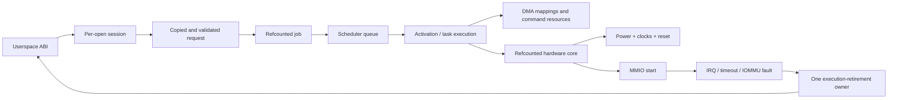

# Ownership and Linux driver foundations

[← Kernel development primer](00-kernel-development-primer.md) ·
[Guide home](README.md) · [Next: MPP rewrite driver →](02-mpp-driver.md)

This chapter builds the common model used by both rewrite drivers before
introducing either hardware-specific implementation.

## 1. The central lesson: a driver is an ownership machine

A first driver often looks like this:

```text
probe -> map registers -> write registers -> wait for interrupt -> done
```

Real drivers spend much more code answering harder questions:

- Who owns a userspace buffer after an ioctl returns?
- Can an interrupt run while `close()` is freeing the session?
- What happens if the device is removed while work is queued?
- What if a timeout from an old job fires after a new job starts?
- Which lock protects a pointer that is read in hard-IRQ context?
- When is DMA definitely stopped after reset fails?
- Can a file descriptor be reused for a different object during an ioctl?
- When may a fence be signaled relative to DMA unmapping and copyback?

The rewrite drivers use the following general shape:



The code is safest when each arrow has an explicit ownership rule. Register
programming is only one stage in the middle.

### 1.1 One submission from beginning to end

Before looking at structures and locks, follow one ordinary operation:

1. A process calls a userspace library. For example, it asks `librga` to resize
   an image.
2. The library opens `/dev/rga` and calls `ioctl()`. An ioctl is a syscall for
   device-specific commands; its argument points to a request in the process's
   address space.
3. The kernel copies the request. It must not keep the userspace pointer:
   another thread could change or unmap that memory as soon as the syscall
   continues.
4. The driver checks every count, offset, image dimension, format, flag, and
   arithmetic result. It resolves buffer handles into kernel objects and takes
   references that keep them alive.
5. The driver creates a **job**, a kernel-owned snapshot of the accepted
   userspace transaction. The job owns its aggregate result and user-visible
   completion.
6. A scheduler selects a compatible RGA core and puts the job on that core's
   queue.
7. When the core is free, the driver creates a **task execution** for the one
   task/core attempt. That narrower object owns the selected core, mappings,
   command image, timeout generation, IRQ observations, and copyback duty.
8. The driver powers the core, maps buffers into that device's address space,
   writes its registers, and finally writes the start bit.
9. `ioctl()` may already have returned for an asynchronous request. The job,
   execution, mappings, and session must therefore survive independently of
   the original syscall stack.
10. The engine performs DMA: it reads and writes memory directly without the
   CPU copying every pixel.
11. The engine raises an interrupt. A short hard-interrupt handler acknowledges
    it; a sleep-capable interrupt thread performs the longer completion work.
12. The execution-retirement path proves DMA stopped, makes device writes
    visible to the CPU, unmaps or copies back buffers, and destroys the command
    allocation. The job orchestrator then advances to the next task or records
    the aggregate result and signals the fence.
13. References are dropped. An execution is reclaimable only after its active,
    IRQ, timeout, and fault owners have let go; the job is freed only after its
    queue, session, acquire-fence, result, and other possible owners drain.

MPP follows the same outline, but userspace supplies a mostly register-shaped
codec job and later polls for result registers instead of describing an image
operation and receiving an RGA release fence.

This walk-through introduces the main vocabulary:

| Term | Plain-language meaning here |
|------|-----------------------------|
| **request** | Data copied from one userspace command before it is accepted |
| **session** | Kernel state belonging to one open device file |
| **job** | Stable kernel snapshot and aggregate result of accepted work that may outlive the ioctl |
| **activation / task execution** | One admitted trip through hardware: a codec attempt or one RGA task on one selected core |
| **queue** | Jobs accepted by software but not yet running on a core |
| **active slot** | A typed reference to the one activation or task execution a core currently owns |
| **mapping** | A buffer made addressable by a particular DMA device |
| **IRQ/interrupt** | Hardware notifying the CPU that something happened |
| **fence/waitqueue** | A way to notify a dependent job or userspace that work completed |
| **reference** | A counted ownership claim that prevents an object from being freed |

A useful first principle follows: returning from `ioctl()` ends a syscall, not
necessarily the operation. Any object needed afterward requires an explicit
asynchronous owner.

### 1.2 Five boundaries to keep separate

Both rewrites separate five kinds of state:

1. **Service state** exists for the loaded module: registered hardware, global
   scheduling, counters, debugfs, and device-node registration.
2. **Session state** exists for one `open()`: client identity, imported
   resources, configured requests, and jobs visible to that file.
3. **Job state** is an immutable or mostly immutable snapshot of one
   submission. It owns the user-visible transaction and aggregate result.
4. **Execution state** exists for one admitted hardware lifetime. MPP calls it
   an activation; RGA calls it a task execution. It owns the selected core,
   generation, attempt-specific DMA/command resources, terminal evidence, and
   the transition to retired, reclaimable, or quarantined.
5. **Hardware state** exists for one platform device: MMIO, IRQ, clocks,
   resets, power state, queue/active slot, timeout work, and recovery state.

Do not collapse these lifetimes into one global structure. A file can close
while a job still exists, and a platform device can begin removal while a file
is still open. Refcounts and drain protocols bridge those lifetime gaps.

The job/execution split deserves special attention. A job is the logical work
userspace will poll or fence; an execution is the physical attempt that can be
replaced by a hard-CCU retry, the next RGA task, or a same-task fallback. When
attempt-specific fields live in the job, a delayed callback can accidentally
observe the replacement attempt through the same broad pointer. Giving every
attempt distinct storage and a generation makes that confusion testable and
rejectable.

One concrete close race shows why:

```text
thread A                       thread B / hardware
--------                       -------------------
submit async job
ioctl returns
close(fd)
release session owner   <---- job still retains session + buffers
                               IRQ completes job
                               job drops final references
                               session and buffers may now be freed
```

If `close()` directly freed the session, the interrupt would dereference freed
memory. If `close()` waited without first preventing new submissions and
callbacks, it could wait forever. The correct design closes admission, cancels
or claims work, waits for asynchronous handoffs to drain, and then drops the
file's ownership reference.

### 1.3 The trust boundary

Every ioctl argument is untrusted. The driver must establish this ordering:

```text
copy fixed-size descriptor
  -> validate counts, flags, offsets, and integer arithmetic
  -> copy variable-sized payload
  -> resolve referenced kernel objects
  -> retain those objects
  -> validate the complete operation
  -> publish it to asynchronous code
```

Publishing before the snapshot is complete creates races in which another
thread can mutate, release, or replace part of the request.

“Untrusted” does not mean the normal library is malicious. It means the kernel
cannot make safety depend on every process being correct. A library bug, a
process killed midway through a request, a deliberately malformed test, and a
hostile local process all cross the same syscall boundary. Kernel validation
must make every one of them safe.

Validation also has two different levels:

- **Shape validation** asks whether data is well formed: sizes fit, arrays are
  bounded, flags are known, and arithmetic does not overflow.
- **Meaning validation** asks whether the operation is safe for this hardware:
  the selected core supports the format, every image plane fits its backing
  buffer, an IOVA belongs to a retained mapping, and source/destination aliases
  are legal.

Passing the first level is not permission to program hardware. Both must pass
before the job is published.

---

## 2. Linux plumbing shared by both rewrites

The drivers combine two Linux interfaces:

- A **platform driver** binds devices described by device tree and owns the
  physical hardware resources.
- A **misc character device** provides the userspace file in `/dev`.

These interfaces have different lifetimes and should not be confused.

Think of them as two views of the same driver:

| View | Question it answers | Typical lifetime |
|------|---------------------|------------------|
| Platform/hardware view | “Which physical cores exist, and where are their registers, interrupts, clocks, resets, and IOMMUs?” | From device probe until device removal |
| Character-device/user view | “What happens when a process opens, configures, submits, waits, and closes?” | One session per `open()` |

The device tree describes hardware, not open files. Conversely, opening
`/dev/rga` does not discover or construct an RGA core; it creates a session
that may route work to cores already found by the platform driver.

### 2.1 Module initialization

Each `module_init()` function follows this order:

1. Initialize the global service object and its locks/lists.
2. Register the platform driver.
3. Register a misc device:
   - MPP: `mpp_service`
   - RGA: `rga`
4. Create debugfs, and for MPP also compatibility procfs state.

Registering the platform driver causes the driver core to call `probe()` for
matching, already-present device-tree nodes. Multiple probes populate one
service.

On module exit, the character device is deregistered before the platform driver
is unregistered. That prevents new opens while hardware instances are being
removed.

There are therefore three related but distinct events:

```text
module loaded
  -> platform nodes probe and publish hardware
  -> process opens misc device and creates a session
  -> process closes session
  -> platform nodes remove and unpublish hardware
  -> module unload completes
```

Many embedded kernels build these drivers in, so module load/unload may never
occur at runtime. Probe, open, close, shutdown, and error recovery still need
correct lifetimes; a built-in driver is not exempt from teardown races.

### 2.2 Device-tree matching

The match table selects a small immutable hardware description:

```c
struct of_device_id {
        .compatible = "...",
        .data = &match_description,
};
```

The description tells probe which hardware family is present, its expected
register-window size, hardware ID/version, quirks, and backend behavior.

The MPP driver matches four kinds of nodes:

| Node kind | Role |
|-----------|------|
| RKVENC2 core | Executes encoder register jobs |
| RKVDEC2 core | Executes decoder register jobs |
| RKVENC2 CCU | Software-visible encoder coordinator |
| RKVDEC2 CCU | Decoder coordinator, including MMIO in hard/soft modes |

The RGA driver matches RGA2 and RGA3 cores. Every core becomes an independent
`struct rk_rga_hw`.

Device tree provides facts that software cannot safely guess: physical register
addresses, IRQ lines, power-domain links, clock names, reset lines, IOMMU
connections, and relationships between a core and a coordinator. The
`compatible` string chooses code; the remaining properties describe this
particular SoC instance.

A probe succeeds only when the node is both individually usable and consistent
with the topology around it. For example, two decoder cores can each have valid
register windows while still being unsafe in hard-CCU mode if their DMA
domains do not satisfy the coordinator's sharing rules.

### 2.3 What probe owns

A successful hardware probe typically establishes:

- `devm_ioremap_resource()` ownership of MMIO.
- `platform_get_irq*()` and `devm_request_threaded_irq()` ownership of IRQs.
- bulk clock handles.
- an optional reset-control array.
- a DMA mask appropriate to the hardware address width.
- runtime-PM enablement.
- an IOMMU-domain/fault-handler association.
- a refcounted hardware object published in the service registry.

`devm_*` removes much manual unwind code, but it does not solve logical races.
The driver must still stop jobs, cancel work, unregister callbacks, and wait for
references before devres releases MMIO and IRQ resources.

`devm_*` means “release this resource when the device is detached.” It does not
mean “the resource cannot be used after logical removal begins.” If an IRQ
thread, timeout worker, job, or mapping still holds a pointer into the hardware
object when probe's owner returns, automatic cleanup can turn that pointer into
a use-after-free. The driver's drain protocol must finish before devres becomes
the final cleanup mechanism.

### 2.4 Runtime power sequence

The common conceptual power-on sequence is:

```text
pm_runtime_resume_and_get()
  -> apply requested clock rates
  -> deassert reset
  -> enable clocks
  -> access MMIO
```

Power-off reverses the active parts and returns the runtime-PM reference:

```text
disable clocks
  -> mark last busy
  -> pm_runtime_put_autosuspend() or suspend
```

The rule for a learner is simple: an MMIO access is legal only while the
driver has proved the device is powered and clocked, except for registers whose
binding explicitly says otherwise.

Runtime PM is reference-counted permission to use the powered device. A
successful `pm_runtime_resume_and_get()` is an ownership event just like
getting a job or buffer reference; every successful get needs one matching
put. Error paths must know whether power was acquired before trying to release
it.

### 2.5 Hard IRQ versus threaded IRQ

Both drivers use threaded IRQs.

The **hard-IRQ handler**:

- reads and acknowledges status quickly;
- uses only spinlock-safe operations;
- records enough state for the thread;
- returns `IRQ_WAKE_THREAD` for terminal completion.

The **IRQ thread**:

- may take mutexes;
- claims the exact active activation/task execution;
- cancels timeout work;
- performs readback or reset and invokes the execution-retirement owner;
- powers down only after DMA-visible resources are safe;
- lets the logical-job completion/orchestrator schedule more work.

This split keeps slow operations, sleeping locks, runtime PM, and memory
teardown out of hard-IRQ context.

The same source file can run in several execution contexts:

| Context | May sleep? | Typical work in these drivers |
|---------|------------|-------------------------------|
| Syscall/process context | Yes | copy and validate ioctl data, allocate, map, submit, close |
| Hard IRQ | No | read/acknowledge status, update small spinlock-protected state |
| Threaded IRQ | Yes | claim completion, reset if required, power down, unmap, wake |
| Workqueue | Yes | schedule queued work, handle timeout/IOMMU recovery, deferred fence work |
| IOMMU fault callback | Treat as constrained | identify the faulting source and queue recovery |

This is why “put a mutex around it” is not a complete concurrency design. A
hard IRQ cannot take a sleeping mutex, while holding a spinlock across runtime
PM or DMA unmap would be illegal. The drivers use a short spinlock operation to
publish or claim IRQ-visible state, then a mutex in a sleep-capable context to
perform the longer transaction.

### 2.6 Public API design

The rewrites intentionally use kernel APIs exported to ordinary drivers:

- DMA-BUF attach/map/unmap/detach
- the DMA mapping API
- IOMMU domain queries and group attachment
- runtime PM
- common clock and reset frameworks
- threaded IRQs
- `dma_fence` and `sync_file`
- `devm_*` resource management

This makes the dependency surface visible. A driver that depends on internal
helpers from another subsystem may compile in one vendor tree but fail as a
module or during a forward port.

“Public” here means a supported interface made available to ordinary kernel
drivers, not an interface callable from userspace. The userspace ABI is the
ioctl contract; the public kernel API is the set of in-kernel services used to
implement it. Keeping those two boundaries separate is one of the rewrite's
main maintainability choices.

---

[← Kernel development primer](00-kernel-development-primer.md) ·
[Guide home](README.md) · [Next: MPP rewrite driver →](02-mpp-driver.md)
