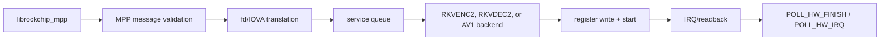

# MPP rewrite driver

[← Foundations](01-foundations.md) · [Guide home](README.md) ·
[Next: RGA rewrite driver →](03-rga-driver.md)

## 3. MPP architecture

MPP userspace builds most codec-specific register recipes. The kernel therefore
acts primarily as a validated register-job transport:



The kernel is not deciding H.264 motion-search policy or constructing a decoder
recipe. It is protecting the kernel and hardware while transporting a recipe
normally created by `librockchip_mpp` through an untrusted syscall boundary.
The library is the expected producer, but the kernel applies the same checks if
a test or hostile process constructs the ioctl directly.

A simplified decode submission looks like this:

```text
userspace message: INIT_CLIENT_TYPE = RKVDEC
userspace messages:
    SET_REG_WRITE      (decoder register image)
    SET_REG_ADDR_OFFSET
    SET_RCB_INFO
    POLL_HW_FINISH
kernel:
    copy messages -> build job -> select decoder core
    translate designated dma-buf fds to that core's IOVAs
    validate VDPU38x register ranges and topology
    queue -> power -> write registers -> start
hardware:
    fetch bitstream/reference buffers -> decode -> IRQ
kernel:
    read requested result words -> mark job done -> wake poller
userspace:
    receive status/readback and use the decoded frame
```

The messages describe one operation, but they are not executed piecemeal as
they arrive. The driver first creates a complete, validated job. Otherwise an
early message could publish a half-built register image before a later message
fails.

### 3.1 MPP object graph

The principal objects are:

| Object | Created by | Owns or tracks |
|--------|------------|----------------|
| `rk_mpp_service` | module init | hardware registry, global queue, stable reset-domain and shadow-cluster registries, DMA groups, counters, work item |
| `rk_mpp_hw` | platform probe | device, MMIO, IRQ, clocks, resets, active job, timeout/fault work, CCU state |
| `rk_mpp_session` | `/dev/mpp_service` `open()` | client type, imports, active jobs, translation table, RCB and codec metadata |
| `rk_mpp_import` | fd translation | DMA-BUF, attachment, mapped scatterlist, device-specific IOVA |
| `rk_mpp_job` | ioctl message collection | copied requests, register image, imports, selected hardware, result/readback, current CCU/DCHS participation, and a temporary cluster-power-lease pointer |
| `rk_mpp_reset_domain` | first matching hardware probe | immutable node identity, member lifetime, mutex, single-target reset state/epoch, responsible hardware, operation counters, one epoch for each cluster-validated hard-CCU pulse, and the epoch supplied to typed single-core recovery |
| `rk_mpp_cluster` | first matching CCU-identity probe | stable member topology, borrowed coordinator, learned core type, reset authority, derived DMA relationship count, hard-reset participant validation, coordinator running-list/link ownership, and soft/hard arm/START publication |
| `rk_mpp_cluster_power_lease` | first member-core power acquisition for a CCU chain | refcounted exact member-core power and hardware references; transfers unchanged to the next listed job and releases once |
| `rk_mpp_dma_group` | hardware probe | IOMMU group, original DMA domain, preallocated empty isolation domain, and terminal containment used by typed recovery |
| `rk_mpp_cluster_recovery_result` | one stack-scoped single-core recovery | reset effect/epoch, refresh and isolation errors, and separate quiesced/reusable decisions |

The important reference direction is:

```text
job -> session
job -> selected hardware
job -> every import used by its register image
job -> decoder CCU/link descriptor when required
```

Consequently, closing a file or removing a handle cannot free memory still
needed by an accepted job.

This is the as-built graph. The broad `rk_mpp_job` and `rk_mpp_hw` objects
still carry state that belongs to one admitted hardware activation or to the
whole decoder cluster. `rk_mpp_cluster` currently constructs topology, owns
validation for one hard-CCU reset-domain pulse, and funnels coordinator
running-list/link and soft/hard publication mechanics. Single-core reset and
idle-fault paths now refresh translations through one typed result before
reporting reusable; terminal isolation reports quiesced without reuse. The
cluster-validated power lease owns member-core holds, but remains temporarily
attached to a legacy job; the cluster does not own admission, coordinator
per-job power, hard-CCU multi-member DMA completion, or quarantine. The
proposed `rk_mpp_activation` in the
[ownership-refactor plan](../rewrite-ownership-refactor-plan.md) does not yet
exist.

### 3.2 Session lifecycle

`rk_mpp_open()` allocates a session, initializes its locks, import list,
active-job list, waitqueue, state sequence, and reference count.

At first the session has no codec type. `MPP_CMD_INIT_CLIENT_TYPE` binds it to a
supported device type such as RKVENC or RKVDEC. Reinitializing an already-bound
session as another type returns `-EBUSY`.

The session's `state_seq` is a cancellation generation. A staged operation
copies the current sequence. Reset/teardown can change session state, and later
checks reject a job or mapping whose snapshot no longer matches. This is
stronger than testing a pointer for non-NULL because a pointer may be reused
across logical generations.

`rk_mpp_release()`:

1. cancels and drains the session's queued/active jobs;
2. releases its cached DMA imports;
3. drops the file's session reference.

Jobs retain their own session reference, so the allocation disappears only
after all asynchronous owners drain.

### 3.3 The MPP ioctl is a message stream

`MPP_IOC_CFG_V1` points at one or more fixed-layout messages. Each message has:

- a command;
- transport/job flags;
- payload size and offset;
- a 64-bit userspace pointer.

Static assertions pin structure sizes and offsets so a compiler or architecture
change cannot silently alter the ABI.

`rk_mpp_collect_msgs()` performs the transport layer:

1. copies one descriptor at a time;
2. validates command and flag combinations;
3. enforces maximum message/request counts;
4. handles multi-message and last-message framing;
5. converts the ABI descriptor to an internal `mpp_request`;
6. sends it to `rk_mpp_process_request()`;
7. executes the staged jobs only after the complete message group is valid.

The batch object is temporary ioctl state. It is not a hardware queue.

### 3.4 Building a job

Messages that describe one hardware operation are collected into an
`rk_mpp_job`:

- `SET_REG_WRITE` copies a register image fragment.
- `SET_REG_READ` records which bytes must be copied back.
- `SET_REG_ADDR_OFFSET` records address adjustments.
- `SET_RCB_INFO` supplies row/column-buffer descriptors.
- `POLL_HW_FINISH` or `POLL_HW_IRQ` records the wait/readback operation.

Before submission, the driver:

1. verifies the session generation and client type;
2. chooses an eligible core;
3. allocates/extends the kernel register image with overflow checks;
4. translates buffer references or validates explicit IOVAs;
5. applies address offsets;
6. applies RCB information;
7. calls the hardware backend's validator;
8. publishes the job to the queue.

The staged register image lives in kernel memory. Hardware and IRQ code never
dereference the original userspace pointer.

### 3.5 DMA-BUF import and register translation

MPP register images contain buffer references in selected register words.
Translation tables identify those words for each codec profile.

Three kinds of address are easy to confuse:

```text
userspace virtual address -- meaningful to the process/CPU
physical page address     -- location in system memory
IOVA                      -- address emitted by this DMA device
```

An IOMMU translates the last address to physical pages. The same DMA-BUF may
receive different IOVAs when attached to two devices, and an IOVA from one
domain is just an unproven number in another. That is why the mapping belongs
to a `(buffer, device)` pair rather than to the buffer alone.

For an fd-backed word, the driver:

1. calls `dma_buf_get(fd)`;
2. attaches the DMA-BUF to the selected core's `struct device`;
3. maps the attachment;
4. verifies the mapped scatterlist forms one contiguous device-address span;
5. verifies the span fits the hardware's 32-bit address space;
6. caches the import by the tuple `(fd, device, dma_buf object)`;
7. replaces the register word with the IOVA plus any validated offset;
8. retains the import in the job.

Including the `dma_buf` object in the cache identity matters. File descriptor
numbers can be closed and reused; `fd == old_fd` does not prove it is the same
buffer.

The device is also part of the identity because an IOVA is meaningful in the
mapping context of a particular DMA device/domain. A mapping produced for core
0 is not automatically a valid mapping for core 1.

The contiguous-span check is about the device-visible address range, not
whether the buffer occupies adjacent physical RAM. An IOMMU may map scattered
physical pages into one continuous IOVA window. The codec registers can then
walk that window, but only after the DMA mapping API and driver have proved it
covers the complete allocation and fits the 32-bit register aperture.

#### Explicit IOVA mode

Some ABI paths ask userspace to translate fds first and later submit literal
IOVAs. The session pins an `explicit_map_dev` when it performs this translation.
Later jobs using the explicit-IOVA flag must select the same device and prove
that every literal address falls inside a retained import. This prevents an
address translated in one IOMMU context from being sent to another core.

`explicit_map_lock` serializes mapping changes and core affinity. It is taken
outside `session->lock`.

### 3.6 Core selection and the service scheduler

The service holds one global list of queued jobs. Each job already retains its
selected hardware.

Core selection considers:

- session client type;
- online and non-quarantined state;
- CCU availability;
- hard-CCU shared-domain requirements;
- queue load;
- round-robin tie breaking;
- explicit mapping affinity.

Queue publication takes references for both the session-visible active list and
the service scheduler list. The scheduler work item removes a runnable job,
then calls the backend's `submit()` method.

RKVDEC additionally holds one dispatch token per session from scheduler take
until complete hardware retirement. This forbids even in-order overlap between
frames of one decode session, while independent sessions can still occupy both
decoder cores. RESET_SESSION releases the token only after abort proves that
the dispatch can no longer start or own hardware; an unproved stop keeps it
held fail-closed.

MPP uses a small backend interface:

```c
struct rk_mpp_backend_ops {
        int (*validate)(struct rk_mpp_job *job);
        int (*submit)(struct rk_mpp_job *job);
        irqreturn_t (*irq)(struct rk_mpp_hw *hw);
        irqreturn_t (*thread)(struct rk_mpp_hw *hw);
        void (*quiesce_aux_irqs)(struct rk_mpp_hw *hw);
};
```

This is a good use of an operations table: scheduling and lifetime rules are
common, while register layout, start, IRQ status, auxiliary-IRQ shutdown, and
readback differ between encoder and decoder backends.

### 3.7 The active slot and generation numbers

Each core has one `active_job`. Publication is protected by `hw->lock`, a
spinlock visible to hard IRQ context. `hw->run_lock` serializes process-context
start, completion, timeout recovery, abort, and removal.

Every activation increments `active_generation`. Timeout and IOMMU-fault paths
capture that generation and act only if all of these still match:

```text
same hardware
AND same active job
AND same non-zero activation generation
```

This closes the classic stale-timer race:

```text
job A starts
timer A is delayed
job A completes
job B starts
timer A finally runs
```

Without a generation check, timer A could reset job B.

### 3.8 Encoder backend

The RKVENC2 backend:

1. validates required MMIO ranges, IRQ, core clock, writes, and readbacks;
2. claims the core's active slot under `run_lock`;
3. powers the core;
4. clears old state/counters;
5. patches dual-core DCHS identifiers;
6. writes all registers except the start register;
7. programs the hardware watchdog from resolution and clock rate;
8. arms the software timeout;
9. issues a write barrier;
10. writes the start value.

The start register is written last. This is a general hardware-driver rule:
fully construct visible state, use the required memory ordering, and only then
ring the doorbell/start bit.

Encoder slice mode is a second completion stream. The hard IRQ can push slice
length records into a per-job `kfifo` protected by a spinlock and wake
`POLL_HW_IRQ` waiters before final frame completion. The terminal interrupt
wakes the IRQ thread, which reads result registers and completes the job.

### 3.9 Decoder backends and CCU modes

RKVDEC2 is more complicated because two cores may be coordinated.

#### Soft CCU

In soft mode the selected core remains the software owner:

- power the core and coordinator;
- configure cache/RCB state;
- program the selected core in the CCU;
- write the core's register image;
- arm timeout;
- start that core.

Completion is attributed directly to the core's active job.

#### Hard CCU/link mode

In hard mode the driver creates a DMA-coherent link-table descriptor. The CCU
can execute the descriptor on a core different from the software-side owner.
The job therefore retains:

- the selected core;
- the exact coordinator;
- its link-table allocation;
- CCU list membership;
- power references for participating cores.

Hard-CCU admission and recovery use this lock order:

```text
ccu->ccu_recovery_lock
  -> core->run_lock
  -> core->lock only for short IRQ-visible state changes
```

The same order is used by submission, error recovery, and removal. Establishing
one order prevents an ABBA deadlock.

The threaded interrupt drains completed CCU descriptors rather than assuming
the interrupting core owns the completed job.

#### AV1/VSI admission and AFBC observation

AV1 uses the VSI IOMMU provider and a separate AFBC register/IRQ block. Its
START transaction is ordered as follows:

1. `vsi_iommu_prepare_dma()` catches an already-latched provider fault;
2. decoder and AFBC registers are programmed without ringing START;
3. `vsi_iommu_reserve_dma()` takes the provider admission mutex, resumes it,
   disables/drains its IRQ, and performs the final fault snapshot;
4. MPP publishes the active job and generation;
5. one raw-spinlocked auxiliary transaction drains stale AFBC status, requires
   it to deassert, publishes the AFBC generation, writes VCD START, and unmasks
   the dedicated AFBC IRQ;
6. `vsi_iommu_release_dma()` snapshots a fault once more before restoring the
   provider IRQ/PM state and may synchronously dispatch the consumer callback
   while the MPP job is still owned.

The provider retains fault address/status/domain state until exactly one
delivery path claims it. Callback in-flight accounting covers IRQ and
process-context replay, so consumer teardown is `set handler NULL -> sync ->
remove token/list state`. Paging-domain replacement and device release retire
pending fault records and drain callbacks before the old domain can be freed.

AFBC acknowledge bit 0 is treated as an **observation**, not as proof that
downstream writes retired. The BSP also completes jobs from the VCD interrupt
and only opportunistically acknowledges AFBC, but its source supplies no
architectural DMA-retirement guarantee. The rewrite therefore records
before/after-VCD, at-VCD, and final-quiesce observation counters without using
the AFBC bit to complete a job. A status bit that cannot be drained before
START is an unknown AFBC state: normal cleanup is forbidden, the AV1 engine is
reset and terminally isolated, and ownership is retained if isolation itself
cannot be proved.

### 3.10 Completion and polling

The hard IRQ acknowledges hardware and records status. The threaded handler
claims the active job, cancels its timeout, reads requested registers, handles
error/reset requirements, powers down, and calls `rk_mpp_job_complete()`.

Completion:

1. records elapsed hardware time;
2. stores the result and changes state to `DONE` under the session lock;
3. releases DCHS/link resources;
4. drops the hardware reference;
5. releases any RKVDEC session-dispatch token;
6. wakes the session waitqueue;
7. schedules the next queued work.

The session's active-job list preserves userspace submission order.
`POLL_HW_FINISH` waits until the first job is done, removes it from that list,
copies only the previously validated readback spans to userspace, and drops the
list's job reference.

The visible state machine is:

```text
STAGED
  -> ACTIVE + on session list + on scheduler list
  -> ACTIVE + selected core's active_job
  -> DONE + still on session list
  -> reaped by poll
  -> freed when final reference drops
```

Queue/list placement distinguishes queued from running; the enum does not need
to encode every internal substate.

### 3.11 Timeout and IOMMU-fault recovery

Timeout and IOMMU fault processing runs in workqueue context, not in the fault
or timer callback's most constrained context.

The recovery path:

1. disables/synchronizes the IRQ as needed;
2. takes CCU recovery and core run locks in the defined order;
3. proves that the captured job/generation is still active;
4. records status;
5. stops or resets the exact core/coordinator;
6. flushes the IOMMU TLB when appropriate;
7. releases power only after DMA is known stopped;
8. completes the failed job;
9. reenables scheduling if the hardware remains usable.

The important rule is: **do not free DMA-visible memory merely because software
decided a job failed**. First prove the engine can no longer fetch from it.
If a stop attempt cannot supply that proof, recovery restores the active job
and fault-generation marker, quarantines the engine, fails queued work, and
keeps the DMA-visible resources pinned for a later fail-stop remove/shutdown
retry.

### 3.12 Reset failure and permanent DMA isolation

Reset itself can fail. At that point the driver cannot assume DMA stopped.
MPP treats this as a terminal safety event:

1. mark the core or CCU and its dependents `recovery_failed`;
2. quarantine their IRQs;
3. stop admitting new work;
4. fail queued work;
5. attach the entire validated IOMMU group to a preallocated empty paging
   domain, or prove that a coordinator with no DMA group is physically off;
6. leave a successfully isolated group wedged until reboot.

Why the entire IOMMU group? Isolation is a group property. Attaching an empty
domain to only one conceptual core is not enough if a sibling or coordinator
shares the group and may still issue DMA.

An **IOMMU domain** is an address-translation table. An **IOMMU group** is the
kernel's statement that a set of devices cannot safely be isolated from one
another at finer granularity. Moving the group to an empty domain gives every
member a translation table with no valid memory mappings. A stray DMA request
then faults instead of reaching a buffer that software may soon free.

Why preallocate the empty domain at probe? Allocation may fail, sleep, or be
unsafe when the fatal path already needs a guaranteed containment mechanism.

Why intentionally leak the isolated domain/group reference at module unload?
Detaching or freeing the domain would reopen DMA after an unproved stop. A
reboot is safer than attempting recovery from an unknown hardware state.

This is an example of a deliberate fail-closed policy: availability is lost to
preserve memory safety.

### 3.13 MPP locking map

| Lock | Protects | Context |
|------|----------|---------|
| `service.hw_lock` | hardware registry, topology/support, admission vs removal | process/workqueue |
| `service.dma_group_lock` | IOMMU group registry and terminal isolation | process/workqueue |
| `service.sched_lock` | global queued-job list and queue counters | process/workqueue |
| `service.fault_lock` | fault-handler hardware list | hard/fault callback safe spinlock |
| `service.rkvenc_dchs_lifecycle_lock` | encoder DCHS consumer patch-through-START versus producer reset/completion/power-off | process/workqueue/IRQ thread mutex; nested inside one core's `run_lock` |
| `service.rkvenc_dchs_lock` | encoder DCHS ownership table | IRQ-safe spinlock |
| `session.explicit_map_lock` | explicit mappings and selected DMA device | process context |
| `session.lock` | session state, imports, active-job list, generations | process/workqueue |
| `hw.ccu_recovery_lock` | shared coordinator admission/recovery | process/IRQ thread |
| `hw.run_lock` | one core's start, completion, abort, recovery, removal | process/IRQ thread |
| `hw.lock` | active/timeout job, generations, IRQ status | hard IRQ and process |
| `hw.aux_lock` | AV1 AFBC mask/status/generation and START handoff | raw spinlock shared with dedicated hard IRQ |
| `job.rkvenc_slice_lock` | slice FIFO flags/data | hard IRQ and process |

Keep critical sections small. Never call a sleeping API while holding
`hw->lock` or another spinlock.

---

[← Foundations](01-foundations.md) · [Guide home](README.md) ·
[Next: RGA rewrite driver →](03-rga-driver.md)
