# RGA rewrite driver

[← MPP rewrite driver](02-mpp-driver.md) · [Guide home](README.md) ·
[Next: design lessons →](04-design-lessons.md)

## 4. RGA architecture

RGA userspace describes image operations rather than raw register images. The
kernel must understand formats, planes, strides, rectangles, transforms,
blending, compression, fences, and core capabilities.

```mermaid
flowchart LR
    L["librga request"] --> C["copy + canonicalize"]
    C --> I["resolve imports/provenance"]
    I --> V["validate RGA2/RGA3 profiles"]
    V --> S["choose least-loaded eligible core"]
    S --> X["create one task execution"]
    X --> M["map for that core and role"]
    M --> P["publish immutable task plan"]
    P --> E["emit coherent command buffer"]
    E --> H["start RGA2/RGA3"]
    H --> F["unmap/copyback, signal fence"]
```



That semantic work explains why the RGA rewrite is larger than MPP.

A concrete NV12-to-RGB resize illustrates the difference:

```text
request says:
    source = NV12, 1920x1080, two planes, crop rectangle
    destination = RGB888, 640x360, one plane
    operation = scale + YUV-to-RGB conversion

driver must derive and prove:
    source luma/chroma strides and byte extents
    destination stride and byte extent
    crop and scaling ratios are legal
    every plane fits its retained backing buffer
    source and destination do not overlap illegally
    RGA2 and/or RGA3 can express this exact combination
    selected core can address each mapped buffer
    register fields encode the requested format, geometry, and conversion
```

MPP validates a mostly prebuilt register recipe; RGA has to translate a
semantic operation into a recipe. More of RGA's source is consequently format,
layout, feature, and command-emission code.

### 4.1 RGA object graph

| Object | Created by | Owns or tracks |
|--------|------------|----------------|
| `rk_rga_service` | module init | hardware/import/session registries, fence context, counters |
| `rk_rga_hw` | platform probe | one RGA core, job queue, typed active/IRQ/timeout execution references, MMIO/IRQ/power/recovery |
| `rk_rga_session` | `/dev/rga` `open()` | import IDR, request IDR, submitted-job list, close/dispatch state |
| `rk_rga_import` | import ioctl or direct request preparation | DMA-BUF or pinned user pages, size, provenance, and logical identity; no hardware mapping |
| `rk_rga_request` | request create/config | copied tasks, imports, acquire fences, Gaussian coefficients |
| `rk_rga_job` | request submit or legacy blit | immutable raw task snapshot, imports, aggregate result/release fence, current task, retained execution list, and embedded first execution |
| `rk_rga_acquire_set` | job submission | acquire-fence array, callbacks, pending zero-crossing, work item, cancellation, and one owning job pointer |
| `rk_rga_task_exec` | first job initialization or successor allocation | one task/core attempt: selected hardware, typed generation, execution mappings, RGA2 MMU table, immutable plan, coherent command allocation, USERPTR ownership, timing, IRQ observations, power, and retirement state |
| `rk_rga_task_plan` | selected-core validation | immutable normalized semantics and concrete RGA2/RGA3 backend profile consumed by emitters |
| `rk_rga_job_mapping` | task execution | role-specific DMA attachment or USERPTR mapping for one hardware core, including direct/staged and copy-owner state |

The session owns numeric handles; accepted requests and jobs own references to
the objects behind those handles. Removing an ID from an IDR prevents future
lookups but does not invalidate existing references.

The first task execution is embedded in the job. Each next task or same-task
fallback gets distinct successor storage. A delayed IRQ, timeout, or fault can
therefore retain `{exec, generation}` for the exact attempt instead of
following a reused job pointer into a replacement task. The bounded successor
allocations remain on the job's retained-execution list until final job release;
`RECLAIMABLE` permits resource retirement but does not invite an eager free that
could race lockless final puts from several asynchronous observers.

### 4.2 Session and request model

`rk_rga_open()` creates a session, initializes two IDRs and the submitted-job
list, and links the session into the service registry.

RGA supports two submission styles:

- Legacy `RGA_BLIT_SYNC`/`RGA_BLIT_ASYNC` supplies one `rga_req` directly.
- Request ioctls create an ID, configure an array of tasks, then submit a
  snapshot of that configured request.

Configuration copies all variable data while holding the session's request
serialization:

- task array;
- import references and per-plane identities;
- acquire-fence references;
- optional Gaussian coefficient data;
- synchronization and request flags.

Submission clones configured state into a job. Later reconfiguration or cancel
of the numeric request ID cannot mutate the in-flight job.

A terminal configure-and-submit removes the exact request object from the IDR
while `session->lock` still protects its identity, then frees that captured
pointer after unlocking. A non-terminal configuration consumes no object and
must skip that free. Removing or freeing later by integer ID would let
concurrent ID reuse redirect cleanup to a replacement request.

### 4.3 Import types and provenance

The rewrite supports:

- DMA-BUF imports;
- pinned userspace memory (`USERPTR`);
- session handles referring to either of the above.

It deliberately rejects raw physical-address imports. A userspace-provided
physical address has no general ownership, lifetime, cache-coherency, or
isolation proof.

Every plane is canonicalized to an import identity before validation. This lets
the driver reason about aliasing based on the backing object rather than the
numeric address syntax userspace happened to use.

Examples:

- Two handles referring to one DMA-BUF are aliases.
- Reusing the same USERPTR range is an alias even if represented by different
  task fields.
- A handle and a direct fd can still refer to the same DMA-BUF.
- Two distinct DMA-BUF objects can map overlapping physical extents.

Validation rejects unsupported cross-type and overlapping layouts before the
hardware sees them.

### 4.4 Why an import is not an execution mapping

An import proves ownership and retains backing memory. It must not imply that
one IOVA remains valid forever on every core.

It helps to separate two questions:

1. **Import:** “Which memory object did userspace mean, how large is it, and
   what reference keeps it alive?”
2. **Execution mapping:** “At what IOVA may this particular core access that
   object for this particular read/write role right now?”

An import is like retaining a file; a mapping is like creating a temporary
device-specific view of its contents. The first can outlive many jobs. The
second ends when the task completes or the selected hardware disappears.

DMA-BUF exporters may move storage after an attachment is unmapped. RGA cores
may also have different DMA/IOMMU contexts. Both DMA-BUF and USERPTR execution
views are therefore created and destroyed per task execution for the selected
core. An import's `iova` field is a non-hardware identity until rebasing replaces
it with a selected-core address. USERPTR import pins pages, but deliberately
does not choose a core or install an IOMMU mapping.

That distinction is also a power-domain invariant. The selected core is powered
before any execution mapping is established, because the Rockchip IOMMU can skip its
TLB shootdown while runtime-suspended. Every mapping is released while the same
core is still powered, before its power reference is dropped.

For each execution-owned imported image role:

1. reuse an existing execution mapping only for the same import, role, and
   selected core;
2. build a USERPTR SG/IOMMU view, or serialize DMA-BUF attachment setup with
   `import->map_lock`;
3. map it to the selected core's DMA device;
4. verify the selected core's mapped-memory contract: one contiguous span for
   RGA3, or complete page-granular coverage for RGA2's internal MMU;
5. record physical/DMA extents for alias checks;
6. retain hardware/device/import ownership in an execution-owned
   `rk_rga_job_mapping`;
7. replace canonical import identities with this task's IOVAs.

DMA-BUF and execution-owned USERPTR mappings use role-specific directions:

| Role | DMA direction |
|------|---------------|
| source-only | `DMA_TO_DEVICE` |
| destination, including blend read/modify/write | `DMA_BIDIRECTIONAL` |

This distinction is correctness, not just optimization. A source-only bounce
buffer must not be copied back over destination data through an alias.

At task completion, all mappings are unmapped before the next task is prepared.
Any exporter bounce-buffer copyback is therefore complete before progression
or fence signaling.

Each mapping also records whether it is direct or staged and which mechanism
owns copyback: the DMA API, a USERPTR shadow, or none. Those states make the
future RGA2 large-segment staging route representable without pretending that
the staging algorithm itself has been implemented. Ownership can be complete
while a separate feature gate remains open.

An exact RGA2 DMA-BUF attachment `-EIO` can identify a mapping that this core
cannot consume, such as a high 1 MiB system-heap SG entry exceeding SWIOTLB's
per-map ceiling. If the task is independently valid on RGA3, dispatch excludes
RGA2 for that task, revalidates it, and requeues it on RGA3. This is a selected-
device fallback; it neither changes the global heap nor makes an RGA2-only
operation appear successful.

### 4.5 USERPTR and cache-line shadows

USERPTR is harder than DMA-BUF:

- pages must be pinned;
- page offsets and total size require overflow checks;
- an SG table must be built;
- the selected hardware/IOMMU must be able to address it;
- cache synchronization must bracket device ownership;
- pages must be dirtied/unpinned only after DMA stops.

The driver can use a driver-owned IOMMU route when the ordinary DMA mapping
does not provide the required contiguous IOVA. It allocates an IOVA, maps the
owned pages, and records the exact size so unmap can verify complete teardown.

For RGA2, the driver instead builds a page-granular internal-MMU table from the
selected-device DMA mapping. Its driver-owned USERPTR SG is split at
`dma_max_mapping_size()`, and RGA2 advertises a page-sized minimum DMA alignment
so a SWIOTLB bounce preserves the original page offset. Without both pieces, a
large entry can exceed the bounce limit or a discontinuity can land mid-page
and become unrepresentable in the RGA2 table.

Unaligned USERPTR boundaries can share cache lines with bytes outside the
submitted range. The rewrite creates shadow pages for affected head/tail
boundaries, copies data into them before DMA, and copies destination data back
after DMA. This prevents cache maintenance or device writes from corrupting
neighboring userspace bytes.

The full allocation → DMA mapping → IOVA/internal-MMU contract, including why
USERPTR permits a driver-owned fallback but DMA-BUF does not, is documented in
the [cross-version DMA mapping chapter](../../iommu/docs/04-dma-mapping-porting-contracts.md).

### 4.6 Image layout validation

Before command emission, the driver computes a checked layout:

- per-plane stride;
- per-plane byte size;
- total extent;
- chroma subsampling geometry;
- 8-bit/10-bit packing;
- compressed/tiled layout rules;
- offsets and active rectangles.

Every multiplication and addition that includes userspace values uses checked
arithmetic. A 16-bit width field does not guarantee `width * height * bytes`
fits the type used for allocation or address calculation.

Multi-plane rules also establish whether planes share one backing object or are
distinct. The driver rejects combinations for which it cannot prove safe
copyback and non-overlap.

### 4.7 Acquire and release fences

An acquire fence says, "do not read/write these buffers until prior work
finishes." A release fence says, "this RGA job and its memory side effects are
complete."

For example, a video decoder may be writing a frame that RGA will scale. RGA's
acquire fence prevents it from reading the half-written frame. A display or
encoder may then wait on RGA's release fence before consuming the scaled
result. Fences order independent devices without making the CPU synchronously
wait between every stage.

#### Synchronous submission

The caller waits for acquire fences, queues the job, then waits on the job's
waitqueue. Completion stores the result with release ordering before waking the
waiter.

#### Asynchronous submission

The driver:

1. allocates a release `dma_fence`;
2. tracks the job in the session;
3. inspects the acquire-fence state;
4. reserves a new file descriptor and creates a `sync_file`;
5. initializes one `rk_rga_acquire_set` with its fence array, waiters,
   zero-crossing state, work item, and owning job;
6. arms callbacks on unsignaled acquire fences and publishes the set;
7. rechecks hardware availability and import invalidation;
8. returns the release-fence fd to userspace;
9. installs the file only after the descriptor was copied out successfully.

If copyout fails, the driver rolls back its reserved fd rather than closing a
number that another thread might already have reused.

Acquire callbacks and cancellation use the acquire set's atomic pending count
with a sentinel. Exactly one path observes the transition to zero and queues
the set's work. Callback removal claims each waiter with `xchg()` so callback
and cancel cannot both decrement it. This prevents both "nobody queued the
work" and "two paths queued it" races, while keeping the whole protocol out of
the broad job object.

The post-arm invalidation check is essential. Hardware removal can scan pending
jobs immediately before callback publication; the submitting thread then
rechecks invalidation after publication, closing both orderings of the race.

### 4.8 Capability validation and core selection

Every task is validated against concrete RGA2 and RGA3 profiles. The result is
a mask of hardware families that can execute it.

Validation includes:

- render mode;
- formats and layouts;
- dimensions, offsets, scaling limits, and alignment;
- rotate/flip combinations;
- blending and color-space conversion;
- compressed/tiled modes;
- required imports and plane relationships;
- the userspace core mask.

Unsupported semantics return `-EOPNOTSUPP`. Invalid arguments return an
argument/range error. No generic "hardware probably supports it" table is
allowed to route a job to a command emitter that does not implement it.

After one hardware family is selected and execution mappings supply the actual
IOVAs, `rk_rga_task_plan_build()` copies the normalized semantics and the
concrete backend profile into an execution-owned `rk_rga_task_plan`. The plan
is then immutable. Production emitters accept the plan rather than
`struct rga_req`, and do not read `job->tasks`. Validation therefore produces
the only representation from which command emission can proceed; a later raw
request mutation cannot reinterpret geometry, formats, or flags.

The scheduler then chooses the least-loaded eligible online core. Equal-load
choices rotate. A forced public core mask narrows the candidates.

The selected `rk_rga_hw` is refcounted before `hw_lock` is released.

### 4.9 Per-core queues

Unlike MPP's global queue, each RGA core owns:

- a priority-ordered `job_queue`;
- `queued_jobs`;
- one typed `active_ref` to the current task execution;
- independent typed `irq_ref` and `timeout_ref` owners;
- an activation generation;
- a queue of IOMMU-fault events, each retaining the exact execution and
  generation.

`hw->job_lock` protects queue/active state shared with hard IRQ context.
`hw->run_lock` serializes dispatch, threaded IRQ completion, timeout/fault
recovery, abort, and removal.

Installing the active slot changes an execution from `UNINSTALLED` to
`SLOTTED` and takes an execution reference plus a containing-job reference.
The hard IRQ clones that exact pair into `irq_ref`; timeout and fault paths do
the same for their own asynchronous edge. Taking the active slot moves the
reference into a claim and changes the execution to `CLAIMED`. A stale event
whose address or generation no longer matches cannot claim a successor.

```text
UNINSTALLED -> SLOTTED -> CLAIMED -> RETIRED -> RECLAIMABLE
                           \-> QUARANTINED (typed active owner retained)
```

`RETIRED` records terminal ownership; `RECLAIMABLE` additionally proves no
typed async reference remains. `QUARANTINED` means the opposite of cleanup:
DMA-visible resources stay owned because stop/isolation was not proved.

Dispatch loops until either:

- the core has an active task execution;
- the queue is empty;
- the core is being removed;
- a backend start succeeds and hardware is running.

Jobs that cannot start are completed with an error outside the spinlock, then
dispatch considers the next queued job.

### 4.10 Command-buffer ownership

The selected task execution allocates a coherent command buffer against that
core's DMA device. The allocation retains both the device and hardware object
until the execution-retirement engine frees it.

The start path is:

```text
power core
  -> prepare execution-owned selected-core mappings
  -> build immutable task plan
  -> sync USERPTR for device
  -> allocate/reuse execution-owned coherent command buffer
  -> emit RGA2 or RGA3 command words from the plan
  -> verify cmd_ready
  -> verify exact active ownership and arm timeout ownership
  -> dma_wmb() to publish the coherent command image
  -> write hardware command address/config
  -> start last
```

The command buffer is not a pointer into userspace and is not a shared global
scratch area. Execution ownership makes timeout, close, fault, fallback, and
remove paths converge on the same locally auditable cleanup boundary.

### 4.11 RGA2 and RGA3 emission

The same semantic operation can require different validation and register
layouts on RGA2 and RGA3.

The source has explicit validators and plan-consuming emitters rather than one
giant least-common-denominator path. Examples include:

- RGA2 bitblt, color fill, palette, and palette-update paths;
- RGA3 source/read-window, overlap/blend, and writeback paths;
- family-specific format, stride, rotation, scaling, CSC, compression, and
  error-status handling.

All implemented semantic families consume `const struct rk_rga_task_plan`.
The raw `rga_req` is parser/validator input only. An emitter clears the command
buffer first and sets `cmd_ready` only after all required words are present.
The RGA2/RGA3 execution-specific `publish_and_start()` helpers refuse an
unready or unplanned execution, arm the exact timeout reference, order every
command-image store before MMIO with `dma_wmb()`, and issue the doorbell last.

This is another useful pattern: a partially emitted command is never
distinguishable from a complete one merely because allocation succeeded.

### 4.12 Multi-task requests

One RGA job contains `tasks[]`, `current_task`, and a retained execution list.
Tasks in the same request run serially:

```text
task 0 -> IRQ -> unmap/copyback
       -> select a core for task 1
task 1 -> IRQ -> unmap/copyback
       -> ...
final task -> release fence
```

Different requests can still run concurrently on different cores.

Serial progression simplifies one aggregate fence and preserves task order,
but independent tasks packed into one request do not execute concurrently.
The architectural tradeoff and current userspace calling patterns are analyzed
in [rewrite drivers](../rewrite-drivers.md#multi-task-request-model).

Only the job orchestrator may increment `current_task`, replace
`current_exec`, choose same-task fallback, publish the final result, or signal
the release fence. A successful task first retires its execution; the
orchestrator then allocates a distinct successor for the next task and requeues
the logical job. Same-task RGA2-to-RGA3 fallback likewise gets a fresh
execution instead of recycling failed attempt storage.

Fresh DMA-BUF and USERPTR execution mappings are created for every execution.
This keeps selected-device identity, role/direction, synchronization, copyback,
and completion ordering tied to the operation currently executing. No import-
level or predecessor-execution mapping survives into the successor.

### 4.13 IRQ completion

The hard IRQ:

- reads family-specific interrupt/status registers;
- recognizes done, error, line, and spurious conditions;
- clears the interrupt;
- stores decoded status in the active task execution;
- clones the exact active execution/generation reference into `irq_ref`;
- returns `IRQ_WAKE_THREAD` for terminal completion.

The IRQ thread:

1. takes the typed IRQ reference and `run_lock`;
2. claims the active slot only if execution identity and generation still
   match;
3. cancels timeout ownership;
4. records hardware elapsed time and resets the core on a hardware error;
5. passes the exact claim and DMA-stop verdict to the sole retirement engine;
6. synchronizes USERPTR for CPU and unmaps all execution mappings, completing
   copyback and IOTLB invalidation while the core/IOMMU power domain is live;
7. frees the execution's MMU/command allocations, powers down, and crosses
   `RETIRED` toward `RECLAIMABLE`, while retaining the execution allocation
   itself until final job release;
8. lets the job orchestrator advance/requeue the next task or complete the
   aggregate job;
9. dispatches the next queued job.

The order in steps 7-9 is load-bearing. Signaling the release fence before DMA
unmap/copyback would let consumers observe stale destination bytes.

### 4.14 Timeout and IOMMU-fault recovery

RGA gives each delayed edge its own typed stale-worker defense:

- timeout work owns `{exec, generation}` cloned from the active slot and
  recovers only if that exact execution is still active and has not recorded
  an IRQ;
- each queued IOMMU-fault event retains the same pair and requires both fields
  to match before it can claim recovery;
- hard IRQ carries a separate typed reference, so a late thread cannot consume
  a successor merely because the broad job pointer is unchanged.

`run_lock` serializes both recovery checks with active-execution replacement.

Recovery disables the IRQ, takes `run_lock`, snapshots status, claims the exact
task execution, and attempts reset. If reset proves DMA stopped, the same
retirement engine used by IRQ completion performs copyback, mapping/command
teardown, power release, and retirement before the job orchestrator advances
or completes.

If reset recovery fails, the core and execution are quarantined:

- `recovery_failed` prevents new routing;
- the IRQ is left disabled;
- the exact claim moves back into the active slot as a `QUARANTINED` tombstone;
- mappings, command memory, power, and copyback obligations stay owned because
  DMA stop was not proved;
- queued jobs fail;
- pending acquire-fence jobs are re-evaluated against the remaining cores.

This prevents a job waiting outside a hardware queue from surviving after its
last compatible core disappears.

### 4.15 Close and platform removal

RGA close uses an explicit handoff protocol:

1. unlink the session from the service registry;
2. mark it closing under `session->job_lock`;
3. wait for ioctl/acquire dispatch handoffs already in progress;
4. cancel jobs waiting on acquire fences;
5. remove/reset this session's queued and active hardware jobs;
6. wait for the submitted-job list to become empty;
7. release request and import IDRs;
8. free the session.

The `dispatching_jobs` count closes the gap between "an ioctl checked
`!closing`" and "the job became visible on a queue."

Hardware removal follows a different drain:

1. mark the core `removing` while holding registry and job locks;
2. remove it from routing;
3. abort pending acquire jobs that no longer have a compatible core;
4. unregister and flush IOMMU-fault work;
5. abort queued jobs and retire or quarantine exact active executions;
6. let surviving pending work reselect a compatible core and create fresh
   per-execution mappings;
7. wait until the hardware refcount returns to the probe owner;
8. balance/free IRQ state and disable runtime PM.

Removal waits for logical references before devres can release MMIO.

### 4.16 RGA locking map

| Lock | Protects | Context |
|------|----------|---------|
| `service.hw_lock` | hardware registry, versions, core selection/removal | process/workqueue |
| `service.import_lock` | import capability registry, not execution mapping work | process/workqueue |
| `service.session_lock` | global session registry used for removal scans | process/workqueue |
| `service.fault_lock` | IOMMU fault-handler hardware list | fault callback safe spinlock |
| `service.fence_lock` | release-fence sequence numbers | IRQ-safe spinlock |
| `session.lock` | import/request IDRs and request configuration | process context |
| `session.job_lock` | closing flag, submitted jobs, and dispatch handoffs; aggregate job state only | IRQ-safe spinlock |
| `import.map_lock` | import reference acquisition and DMA-BUF attachment setup | process/workqueue |
| `hw.run_lock` | start, completion, recovery, abort, removal | process/IRQ thread |
| `hw.job_lock` | queue plus typed active/IRQ/timeout execution references, generations, and IRQ-visible execution state | hard IRQ and process |

One important nesting pattern is:

```text
hw.run_lock -> hw.job_lock
```

Do not introduce the inverse order elsewhere.

---

[← MPP rewrite driver](02-mpp-driver.md) · [Guide home](README.md) ·
[Next: design lessons →](04-design-lessons.md)
