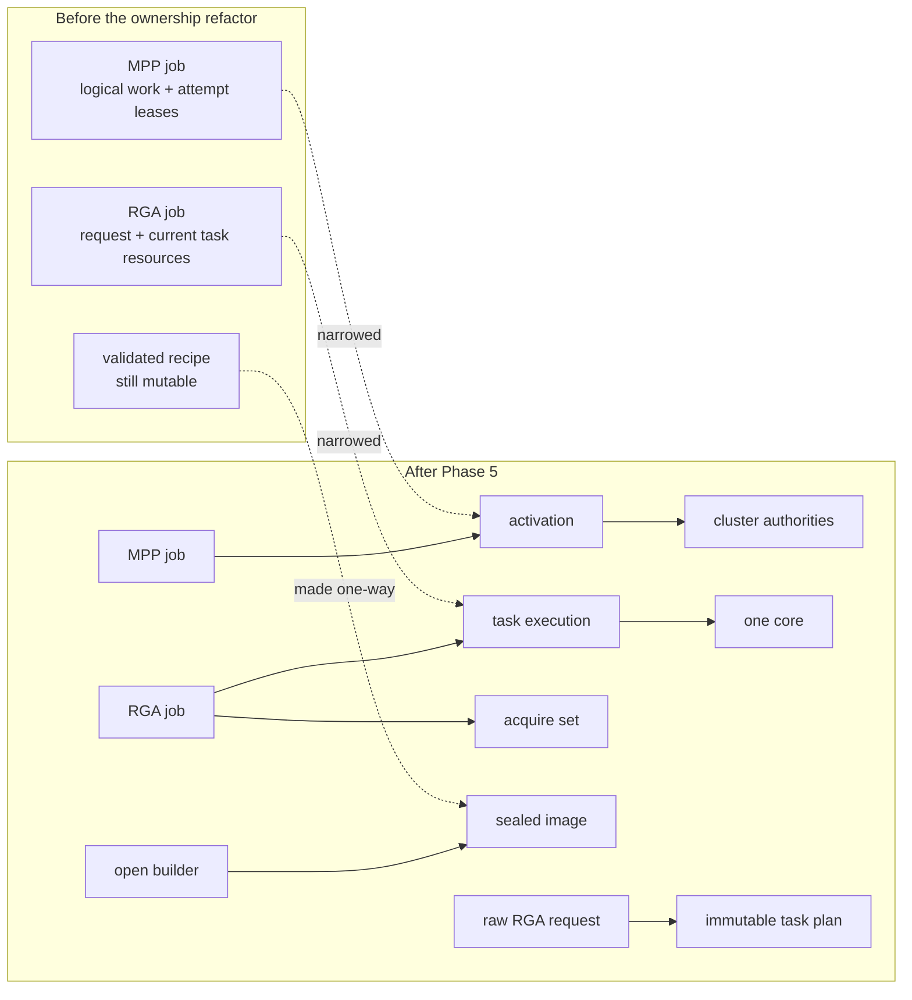

# Design and error-path lessons

[← RGA rewrite driver](03-rga-driver.md) · [Guide home](README.md) ·
[Next: observability and testing →](05-observability-and-testing.md)

## 5. Comparing the two designs

| Concern | MPP rewrite | RGA rewrite |
|---------|-------------|-------------|
| Userspace supplies | Register-oriented message stream | Semantic image operations |
| Kernel builds hardware recipe | Mostly no | Yes |
| Main queue | One service queue | One queue per core |
| Backend abstraction | `validate/submit/irq/thread` ops | Explicit RGA2/RGA3 validator/emitter dispatch |
| Buffer path | DMA-BUF fd to selected-core IOVA | DMA-BUF or USERPTR import plus per-task/core mapping |
| Async result | poll/readback; slice polling | `dma_fence`/`sync_file` and optional synchronous wait |
| Multi-operation model | Messages form one register job | Task array progresses serially inside one job |
| Multicore complication | Encoder DCHS; decoder soft/hard CCU | Capability/load routing across RGA2/RGA3 |
| Fatal reset failure | Quarantine plus permanent group isolation | Quarantine failed core and reroute/fail work |
| Close boundary | abort jobs, release imports, drop session ref | close flag, dispatch drain, cancel fences/jobs, release IDRs |

The common as-built strengths are more important than the differences:

- copy user state into kernel-owned snapshots;
- validate once into immutable plans or sealed images before publication;
- make asynchronous ownership explicit;
- give each physical attempt a narrower owner than the logical job;
- select a concrete DMA device before mapping;
- serialize each active hardware slot;
- use generation numbers for delayed recovery;
- route all terminal contenders through one retirement/completion owner;
- do not complete until DMA-visible resources are safe;
- stop routing before teardown;
- wait for references before freeing device-managed resources.

---

## 6. How to design a driver like this

### 6.1 As-built ownership after the refactor

The source-complete Phase 0–5 refactor changed ownership altitude without
changing the userspace ABI or replacing the working backends. The broad job is
still the logical transaction, but it is no longer the convenient owner of
every resource touched while that transaction runs.

| Boundary | As-built owner now | Why that owner fits | Remaining boundary |
|----------|--------------------|---------------------|--------------------|
| MPP shared decoder hardware | `rk_mpp_cluster`, `rk_mpp_reset_domain`, `rk_mpp_dma_group`, and a refcounted cluster power lease divide topology, reset epochs, translation recovery, isolation, and member-core power | Shared physical effects cannot be modeled safely as a field on one job or core. | Cluster admission, coordinator power, and broader recovery policy are not yet one composed authority. |
| One MPP run | `rk_mpp_activation` owns identity, generation/deadline, selected hardware, typed async references, terminal evidence/arbitration, attempt resources, retry handoff, drain, and reclaim | A retry is a new physical attempt even when userspace sees one logical job. | Source architecture is complete; current-tip runtime recovery, sanitizer, media, and hardware proof remain open. |
| One RGA task | `rk_rga_task_exec` owns one selected core, mappings/MMU table, command allocation, immutable plan, power, USERPTR copyback, IRQ/fault/timeout observations, and retirement | A multi-task job and same-task fallback can create several non-overlapping hardware lifetimes. | The direct/staged ownership states exist, but the RGA2 large-segment staging algorithm remains a separate feature gate. |
| RGA acquire callbacks | `rk_rga_acquire_set` owns callback/sentinel/work/cancel state while the job owns the aggregate dependency result | Callback lifetime ends before or independently of hardware execution lifetime. | Runtime callback/cancel/close race qualification remains open. |
| Hardware recipe | `rk_mpp_reg_builder` seals a const image and clones result storage; `rk_rga_task_plan` is immutable emitter input | Validation becomes a one-way type transition rather than a convention every backend must remember. | Byte-exact pixels/bitstreams and immediate-IRQ behavior still require hardware differential tests. |

The structural change is easier to see as a before/after graph:



This does not mean the drivers are production-qualified. It means their
source-level ownership model now encodes the intended runtime boundaries.
Phase 6 file/test rationalization and Phase 7 board qualification remain
separate work. The [refactor case study](07-ownership-refactor-case-study.md)
explains why the sequence mattered; the
[ownership-refactor plan](../rewrite-ownership-refactor-plan.md) preserves the
implementation checkpoints and acceptance gates.

Several kernel mechanisms appear together because they solve different
problems:

| Mechanism | Question it answers | What it does not answer |
|-----------|---------------------|-------------------------|
| Reference count | “May this object be freed yet?” | Whether its fields may be changed concurrently |
| Lock | “Who may inspect or mutate this state now?” | Whether a pointer remains alive after the lock is dropped |
| Generation number | “Does this delayed event belong to the current activation?” | Whether the object itself remains allocated |
| Work cancellation/drain | “Can this callback still start or be running?” | Whether some other callback owns the same job |
| Fence/waitqueue | “When may another participant continue?” | Whether memory cleanup happened before the signal |

A robust design often needs all five. For example, a timeout worker retains a
typed activation/task-execution reference plus its containing job, takes a lock
to compare the active slot, compares a generation to reject stale work, is
drained during removal, and completes through the same retirement engine that
eventually wakes the waiter. Replacing any of those steps with “the pointer is
probably still valid” leaves a different race open.

### 6.2 Start with an ownership table

Before writing functions, list every resource:

| Resource | Initial owner | Async owners | Final release condition |
|----------|---------------|--------------|-------------------------|
| file/session | open file | submitted jobs | file closed and job refs zero |
| imported buffer | session ID/list | configured request, job, mapping | all refs zero after DMA stops |
| job | ioctl submitter | session list, queue, acquire set, poll/fence owner | aggregate completion visible and every owner drops its ref |
| activation/task execution | job storage | active slot, IRQ, timeout, fault, claim/quarantine owner | terminal proof, resources drained/handed off, and typed refs gone |
| hardware object | platform probe | executions, mappings, command buffers, recovery | removed from routing and refs return to probe owner |
| IRQ | devres/probe | hard and threaded handlers | hardware quiesced and handlers synchronized |
| coherent command/descriptor | activation/task execution | active engine | DMA stopped or ownership handed off, then free |

If a resource has no named final-release condition, the design is incomplete.

### 6.3 Draw every asynchronous edge

Search for APIs that outlive the calling stack:

- `schedule_work()`
- `mod_delayed_work()`
- `dma_fence_add_callback()`
- `request_threaded_irq()`
- IOMMU fault callbacks
- waitqueues
- object publication to a global or per-core list

For each edge, answer:

1. What object does the callback dereference?
2. Which reference keeps it alive?
3. How is cancellation synchronized?
4. Can cancellation race with callback execution?
5. Who owns completion if both paths meet?

### 6.4 Separate state protection from operation serialization

A spinlock can protect `active_activation` but cannot safely cover reset, PM, or DMA
unmap. A mutex can serialize reset but cannot be acquired in hard IRQ context.

The common two-lock pattern is:

```text
spinlock:
    publish/claim pointer and small scalar state

mutex:
    perform the slow start/stop/reset/unmap transaction
```

The IRQ top half records state under the spinlock; the IRQ thread performs the
transaction under the mutex.

### 6.5 Make one path own completion

IRQ, timeout, close, fault, and remove may all try to end one job. They must
first atomically claim the same active slot or transition.

Bad:

```text
IRQ sees job pointer
timeout sees job pointer
both free it
```

Good:

```text
IRQ/timeout/removal contend on protected active execution + generation
winner moves its typed reference into a claim and owns retirement
loser observes NULL or generation mismatch
```

References keep the object alive while contenders inspect it; the claim decides
who performs terminal actions.

### 6.6 Treat recovery as another state machine

Do not write recovery as a collection of best-effort calls after an error.
Define its invariants:

```text
running
  -> IRQ disabled/synchronized
  -> exact activation/task execution claimed
  -> DMA stopped or reset proved
  -> mappings/descriptors may be released
  -> job completed
  -> hardware usable again

or

running
  -> stop/reset proof failed
  -> hardware quarantined
  -> DMA isolated/power proven off where required
  -> no future admission
```

The second branch is as important as the normal recovery branch.

### 6.7 Validate topology, not just individual resources

Probe should reject inconsistent systems early:

- undersized MMIO windows;
- missing IRQs or required clocks;
- wrong hardware IDs;
- duplicate/missing core aliases;
- invalid core masks;
- core pointing at an incompatible or disabled coordinator;
- hard-CCU cores not sharing the required DMA/IOMMU context;
- no IOMMU-group containment strategy for fatal recovery.

A device can have valid registers and still be unusable because its relationship
to sibling devices is wrong.

### 6.8 Preserve error meanings

Useful conventions in these drivers are:

- `-EINVAL`: malformed argument or inconsistent request.
- `-ERANGE`/`-EOVERFLOW`: address/size arithmetic cannot be represented.
- `-EOPNOTSUPP`: valid concept, but no implemented safe hardware path.
- `-ENODEV`: required hardware disappeared or no eligible core exists.
- `-EAGAIN`: nonblocking poll has no result yet.
- `-ECANCELED`/`-ESHUTDOWN`: a session generation or close transition won.
- `-EIO`: hardware/fault recovery failed.

Distinct errors make tests and field diagnosis much better than returning
`-EINVAL` for everything.

### 6.9 Make validation a one-way transition

“Validated” should describe a representation, not a past event that later code
can invalidate:

```text
untrusted/canonical input -> open builder -> immutable plan or sealed image
                                             -> publish/start
hardware observations     -> separate result storage
```

Mutators must reject a sealed object, backend interfaces should accept const
input, and runtime overlays must live with the activation rather than patch the
recipe. Keeping result storage separate prevents IRQ/readback from turning a
command snapshot back into a mutable scratch buffer.

### 6.10 Give independently replaceable work distinct storage

A generation can reject a stale callback, but it cannot make one allocation
represent two attempts at once. If retry, fallback, or multi-task progression
can replace the current hardware lifetime while delayed events still exist,
allocate a successor and retain the predecessor until its owners drain. This
is why MPP retries and RGA task/fallback progression now use distinct
activation or execution objects even though userspace still sees one job. The
allocation policy may still differ: MPP frees a drained retry predecessor after
its typed owners vanish, while RGA retains its bounded execution records until
whole-job release to avoid an eager-free race among lockless final puts.

---

## 7. Error-path patterns worth copying

### 7.1 Fully initialize before publication

Allocate and initialize private state, then add it to a list/IDR only after all
required fields and references are valid.

### 7.2 Unwind in reverse ownership order

For a DMA-BUF mapping:

```text
dma_buf_get
  -> attach
  -> map
  -> validate
```

Failure unwinds:

```text
unmap
  -> detach
  -> dma_buf_put
```

Guard every step so partial initialization is safe.

### 7.3 Remove from lookup before dropping references

For IDRs and lists:

1. remove the object while holding the lookup lock;
2. release the lock;
3. perform potentially sleeping teardown;
4. drop the ownership reference.

This prevents new users from finding an object once teardown begins without
holding a broad lock across complex release code.

### 7.4 Disable admission before draining

Hardware remove first marks `online = false` or `removing = true` and removes
the core from routing. Only then does it abort queues and active work. Otherwise
new work can arrive forever while remove tries to drain.

### 7.5 Do not confuse cancel with synchronization

`cancel_delayed_work()` prevents pending execution but may not wait for an
already-running callback. Teardown paths that free callback state need
`cancel_delayed_work_sync()` or an equivalent ownership handshake, used from a
context where waiting cannot deadlock.

### 7.6 Do not signal completion before memory is coherent

The safe order is:

```text
hardware stopped
  -> device-to-CPU synchronization
  -> DMA unmap/bounce copyback
  -> publish result
  -> signal fence/wake waiter
```

Userspace treats a fence or wakeup as a memory-visibility promise.

---

[← RGA rewrite driver](03-rga-driver.md) · [Guide home](README.md) ·
[Next: observability and testing →](05-observability-and-testing.md)
