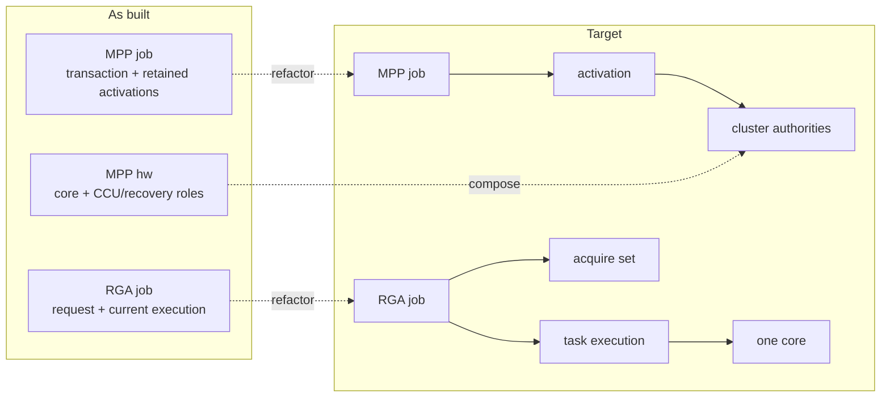

# Design and error-path lessons

[← RGA rewrite driver](03-rga-driver.md) · [Guide home](README.md) ·
[Next: observability and testing →](05-observability-and-testing.md)

## 5. Comparing the two designs

| Concern | MPP rewrite | RGA rewrite |
|---------|-------------|-------------|
| Userspace supplies | Register-oriented message stream | Semantic image operations |
| Kernel builds hardware recipe | Mostly no | Yes |
| Main queue | One service queue | One queue per core |
| Backend abstraction | `validate/submit/irq/thread` ops | Explicit RGA2/RGA3 validator/emitter dispatch |
| Buffer path | DMA-BUF fd to selected-core IOVA | DMA-BUF or USERPTR import plus per-task/core mapping |
| Async result | poll/readback; slice polling | `dma_fence`/`sync_file` and optional synchronous wait |
| Multi-operation model | Messages form one register job | Task array progresses serially inside one job |
| Multicore complication | Encoder DCHS; decoder soft/hard CCU | Capability/load routing across RGA2/RGA3 |
| Fatal reset failure | Quarantine plus permanent group isolation | Quarantine failed core and reroute/fail work |
| Close boundary | abort jobs, release imports, drop session ref | close flag, dispatch drain, cancel fences/jobs, release IDRs |

The common as-built strengths are more important than the differences:

- copy user state into kernel-owned snapshots;
- validate before publication;
- make asynchronous ownership explicit;
- select a concrete DMA device before mapping;
- serialize each active hardware slot;
- use generation numbers for delayed recovery;
- do not complete until DMA-visible resources are safe;
- stop routing before teardown;
- wait for references before freeing device-managed resources.

---

## 6. How to design a driver like this

### 6.1 As-built strengths and remaining ownership debt

The current implementation should not be described as either “the target
architecture is already complete” or “the rewrite got ownership wrong.” Its
first-order direction is sound: sessions retain accepted work, jobs retain
buffers and hardware, delayed events carry generations, and failed recovery
stops admission before memory is released. Those properties are materially
clearer than the BSP's distributed global managers.

The remaining problem is **ownership altitude**. Several resources are owned by
an object broader than the lifetime they actually serve:

| Boundary | As-built model | Target architecture | Why it matters |
|----------|------------------------|---------------------|----------------|
| MPP shared decoder hardware | `rk_mpp_cluster` composes member topology and validates one shared hard-CCU reset pulse; a refcounted lease owns the exact member-core power holds but still transfers through legacy jobs, while hardware, reset-domain state, and DMA-group objects divide admission, coordinator power, IOMMU refresh, and quarantine | migrate the remaining transitions behind cluster methods while reset domain and DMA group remain distinct authorities | A new terminal path can otherwise repair reset but omit refresh, coordinator-power release, or peer quarantine. |
| One MPP run | `rk_mpp_activation` owns identity, generation/deadline, selected hardware, slot/claim references, typed closure/quarantine proof, terminal reason arbitration, CCU/link/DCHS/power/timing resources, coherent retry handoff, drain, and reclaimability | keep one activation as the sole owner of one admitted hardware lifetime | Phase 3 is structurally complete; runtime race, recovery, sanitizer, and hardware proof remain open. |
| One RGA task | `rk_rga_job` owns the whole request and the current task's selected hardware, mappings, command buffer, generation, IRQ state, and copyback obligations | `rk_rga_task_exec` owns one task on one selected core; `rk_rga_job` owns only the aggregate request/fence result | Multi-task advancement and per-task teardown should not be reimplemented independently in IRQ and recovery tails. |
| RGA acquire callbacks | Callback arrays, pending counts, work ownership, and cancellation state live across the broad job | `rk_rga_acquire_set` contains the callback lifetime | Close/cancel should resolve one callback object rather than manipulate fields spread across a submitted request. |
| Hardware recipes | Validators and emitters can still inspect mutable register/task representations | A sealed MPP register image and immutable RGA task plan feed start/emission | Later patching should not invalidate an earlier provenance or capability decision. |

The target graph is therefore an incremental refactor of the current one:



The as-built model now has `rk_mpp_cluster` topology, hard-CCU reset-pulse
validation, a cluster-validated member-core power lease, and retained
`rk_mpp_activation` identity. Each hard-CCU retry gets a distinct successor,
and Phase 3G retains typed closure proof for its predecessor. Phase 3H makes
the active claim token own its exact detached job reference, retires recovered
terminal paths on typed core or group/core proof, and transfers restore refusal
to a service quarantine tombstone that retains resources/dispatch and closes
admission through reboot. Phase 3I adds immutable `NOT_PUBLISHED`,
`IRQ_ACCEPTED`, and `CCU_DONE_ACCEPTED` clean-terminal observations while
treating RKVDEC bus idle as advisory only and keeping recovered proof separate.
Phase 3J adds a base activation bias and typed `{activation, generation}`
external references paired with containing-job references for active, timeout,
claim, retry, and quarantine ownership. The Phase 3 completion checkpoint
moves attempt-bounded CCU/link/DCHS/power/timing resources into the activation,
hands the complete record to hard-CCU retry successors, arbitrates terminal
reasons with stable priority, and centralizes drain, exact selected-core and
dispatch release, `DONE` publication, and reclaim. Dispatch/current/list remain
borrowed identities;
`rk_rga_task_exec` and `rk_rga_acquire_set` do not exist. The cluster
also does not yet own admission, coordinator power, or the complete
reset/IOMMU recovery result. The
[ownership-refactor plan](../rewrite-ownership-refactor-plan.md) defines the
migration and its invariants; the
[retrospective](../../../findings/2026-08-01-rewrite-driver-retrospective.md)
records why object ownership should precede further feature breadth. Until that
target work is reflected in this guide, reviewers must audit the cross-path
conventions described in the as-built chapters rather than assuming the target
types enforce them.

Several kernel mechanisms appear together because they solve different
problems:

| Mechanism | Question it answers | What it does not answer |
|-----------|---------------------|-------------------------|
| Reference count | “May this object be freed yet?” | Whether its fields may be changed concurrently |
| Lock | “Who may inspect or mutate this state now?” | Whether a pointer remains alive after the lock is dropped |
| Generation number | “Does this delayed event belong to the current activation?” | Whether the object itself remains allocated |
| Work cancellation/drain | “Can this callback still start or be running?” | Whether some other callback owns the same job |
| Fence/waitqueue | “When may another participant continue?” | Whether memory cleanup happened before the signal |

A robust design often needs all five. For example, a timeout worker retains a
job reference, takes a lock to compare the active slot, compares a generation
to reject stale work, is drained during removal, and completes through the same
path that eventually wakes the waiter. Replacing any of those steps with “the
pointer is probably still valid” leaves a different race open.

### 6.1 Start with an ownership table

Before writing functions, list every resource:

| Resource | Initial owner | Async owners | Final release condition |
|----------|---------------|--------------|-------------------------|
| file/session | open file | submitted jobs | file closed and job refs zero |
| imported buffer | session ID/list | configured request, job, mapping | all refs zero after DMA stops |
| job | ioctl submitter | session list, queue, active slot, timeout, callbacks | every owner drops its ref |
| hardware object | platform probe | jobs, mappings, command buffers, recovery | removed from routing and refs return to probe owner |
| IRQ | devres/probe | hard and threaded handlers | hardware quiesced and handlers synchronized |
| coherent command/descriptor | job or hardware | active engine | DMA stopped, then free |

If a resource has no named final-release condition, the design is incomplete.

### 6.2 Draw every asynchronous edge

Search for APIs that outlive the calling stack:

- `schedule_work()`
- `mod_delayed_work()`
- `dma_fence_add_callback()`
- `request_threaded_irq()`
- IOMMU fault callbacks
- waitqueues
- object publication to a global or per-core list

For each edge, answer:

1. What object does the callback dereference?
2. Which reference keeps it alive?
3. How is cancellation synchronized?
4. Can cancellation race with callback execution?
5. Who owns completion if both paths meet?

### 6.3 Separate state protection from operation serialization

A spinlock can protect `active_activation` but cannot safely cover reset, PM, or DMA
unmap. A mutex can serialize reset but cannot be acquired in hard IRQ context.

The common two-lock pattern is:

```text
spinlock:
    publish/claim pointer and small scalar state

mutex:
    perform the slow start/stop/reset/unmap transaction
```

The IRQ top half records state under the spinlock; the IRQ thread performs the
transaction under the mutex.

### 6.4 Make one path own completion

IRQ, timeout, close, fault, and remove may all try to end one job. They must
first atomically claim the same active slot or transition.

Bad:

```text
IRQ sees job pointer
timeout sees job pointer
both free it
```

Good:

```text
IRQ/timeout/removal contend on protected active_activation + generation
winner removes it and owns completion
loser observes NULL or generation mismatch
```

References keep the object alive while contenders inspect it; the claim decides
who performs terminal actions.

### 6.5 Treat recovery as another state machine

Do not write recovery as a collection of best-effort calls after an error.
Define its invariants:

```text
running
  -> IRQ disabled/synchronized
  -> exact job claimed
  -> DMA stopped or reset proved
  -> mappings/descriptors may be released
  -> job completed
  -> hardware usable again

or

running
  -> stop/reset proof failed
  -> hardware quarantined
  -> DMA isolated/power proven off where required
  -> no future admission
```

The second branch is as important as the normal recovery branch.

### 6.6 Validate topology, not just individual resources

Probe should reject inconsistent systems early:

- undersized MMIO windows;
- missing IRQs or required clocks;
- wrong hardware IDs;
- duplicate/missing core aliases;
- invalid core masks;
- core pointing at an incompatible or disabled coordinator;
- hard-CCU cores not sharing the required DMA/IOMMU context;
- no IOMMU-group containment strategy for fatal recovery.

A device can have valid registers and still be unusable because its relationship
to sibling devices is wrong.

### 6.7 Preserve error meanings

Useful conventions in these drivers are:

- `-EINVAL`: malformed argument or inconsistent request.
- `-ERANGE`/`-EOVERFLOW`: address/size arithmetic cannot be represented.
- `-EOPNOTSUPP`: valid concept, but no implemented safe hardware path.
- `-ENODEV`: required hardware disappeared or no eligible core exists.
- `-EAGAIN`: nonblocking poll has no result yet.
- `-ECANCELED`/`-ESHUTDOWN`: a session generation or close transition won.
- `-EIO`: hardware/fault recovery failed.

Distinct errors make tests and field diagnosis much better than returning
`-EINVAL` for everything.

---

## 7. Error-path patterns worth copying

### 7.1 Fully initialize before publication

Allocate and initialize private state, then add it to a list/IDR only after all
required fields and references are valid.

### 7.2 Unwind in reverse ownership order

For a DMA-BUF mapping:

```text
dma_buf_get
  -> attach
  -> map
  -> validate
```

Failure unwinds:

```text
unmap
  -> detach
  -> dma_buf_put
```

Guard every step so partial initialization is safe.

### 7.3 Remove from lookup before dropping references

For IDRs and lists:

1. remove the object while holding the lookup lock;
2. release the lock;
3. perform potentially sleeping teardown;
4. drop the ownership reference.

This prevents new users from finding an object once teardown begins without
holding a broad lock across complex release code.

### 7.4 Disable admission before draining

Hardware remove first marks `online = false` or `removing = true` and removes
the core from routing. Only then does it abort queues and active work. Otherwise
new work can arrive forever while remove tries to drain.

### 7.5 Do not confuse cancel with synchronization

`cancel_delayed_work()` prevents pending execution but may not wait for an
already-running callback. Teardown paths that free callback state need
`cancel_delayed_work_sync()` or an equivalent ownership handshake, used from a
context where waiting cannot deadlock.

### 7.6 Do not signal completion before memory is coherent

The safe order is:

```text
hardware stopped
  -> device-to-CPU synchronization
  -> DMA unmap/bounce copyback
  -> publish result
  -> signal fence/wake waiter
```

Userspace treats a fence or wakeup as a memory-visibility promise.

---

[← RGA rewrite driver](03-rga-driver.md) · [Guide home](README.md) ·
[Next: observability and testing →](05-observability-and-testing.md)
