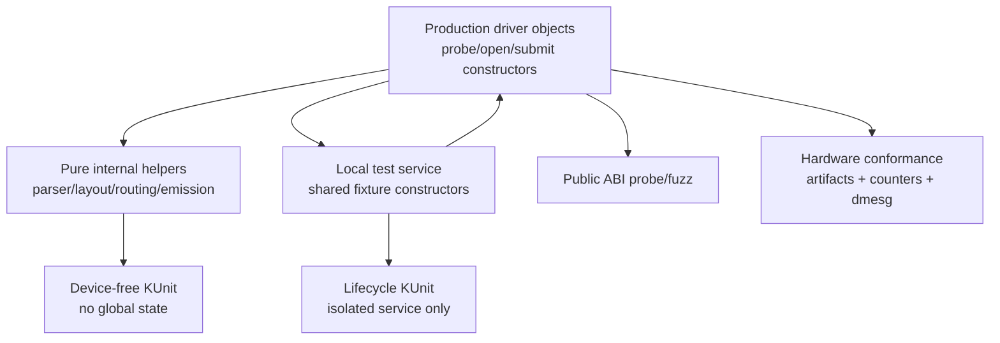

# Rewrite KUnit rationalization and fixture-hardening plan

> Status: implementation in progress; fixture-isolation and manifest
> checkpoints applied
> Scope: clean-room MPP/RGA rewrite drivers, their KUnit suites, and the YSP
> validation harness
> Source reviewed: `rk3588-rewrite-6.18@f6ebe28a3f66` and
> `rk3588-rewrite-mainline@394d80552960`
> First applied checkpoint: reset-import fixture lock initialization at
> `rk3588-rewrite-6.18@9af4a8816f259` and
> `rk3588-rewrite-mainline@fb5040f08d833`
> Pre-phase source tips: `rk3588-rewrite-6.18@669697f23d3d` and
> `rk3588-rewrite-mainline@a49eb7575f436`
> Fixture-isolation source tips: `rk3588-rewrite-6.18@51ea9d1ca537` and
> `rk3588-rewrite-mainline@03da898b03f1f`
> Date: 2026-07-27

> **Current boundary (2026-08-04):** this is the historical rationalization
> plan and checkpoint record, not the live manifest. Maintained tips
> `33c30ec6989e` / `9e503f6b16df` contain 92 MPP + 152 RGA cases. Their
> current evidence and compound boot contract live in
> [`rewrite-kunit.md`](rewrite-kunit.md); do not carry the 84/148 checkpoint
> counts into a current qualification claim.

## Result

Keep the rewrite's high-value logic, ownership, and state-transition coverage,
but stop treating 85 MPP plus 148 RGA separately registered boot cases as a
goal. The target is three test layers with different safety and evidence
contracts:

1. device-free KUnit for pure parsing, bounds, routing, layout, and command
   emission;
2. isolated KUnit for ownership, fence, timeout, abort, and recovery state
   transitions, using local service instances and failure-safe fixtures; and
3. public-ABI and on-hardware conformance for behavior already observable
   through `/dev/mpp_service`, `/dev/rga`, pixels, bitstreams, counters, and
   kernel logs.

The immediate priority is fixture containment, not case deletion. No KUnit case
may unregister a production driver, reuse a production singleton as scratch
state, leave cleanup until after a fatal assertion, or require a hand-built
partial object whose invariants differ from the production constructor.

This plan deliberately preserves the assertions behind difficult-to-reproduce
race and recovery coverage. It retires only checks with a stronger compile-time
or public-interface owner, consolidates repeated vectors without dropping
distinct semantics, and moves the remaining lifecycle tests behind a dedicated
qualification configuration until their fixtures are isolated.

## Why the current shape must change

The present suites have found real driver defects, but their own failures have
also invalidated boots:

- the first complete run mixed stale fixtures with six real driver-contract
  defects and produced Oopses, KASAN reports, refcount warnings, debug-object
  warnings, and IRQ/preemption imbalance;
- a later failed MPP fixture left KUnit-owned fake hardware linked from the
  production singleton, so the subsequent public ABI probe Oopsed and left the
  production hardware-list mutex permanently held;
- later all-green KTAP still hid an uninitialized fixture mutex and a nested
  2,048-byte allocation;
- Debug Objects' five-report cap hid additional stack-work violations until
  earlier fixtures were repaired; and
- the source review found another zero-initialized fixture spinlock in
  `rk_mpp_reset_session_hw_active_import_kunit()`; the applied checkpoint named
  above now initializes it.

These are not arguments for dropping timeout, abort, fence, import, or recovery
coverage. They show that the current fixtures do not contain failure. A valid
test regression must produce one attributable failed case, not secondary
kernel corruption, leaked descriptors, disabled lockdep, or a poisoned runtime.

The source layout also makes maintenance harder than necessary. The RGA KUnit
region is about 10,700 lines, or 44.6% of `rga_rewrite.c`; MPP adds roughly
4,600 embedded test lines. Keeping tests in the production translation units
gave early access to static helpers, but it now encourages tests to reproduce
large production object graphs manually.

## Decision rules

Every existing assertion is assigned by the following rules:

| Test property | Disposition |
|---------------|-------------|
| Pure deterministic helper with a meaningful invalid/boundary matrix | Keep in device-free KUnit |
| Register or descriptor emission whose value is not visible through a public ABI | Keep a golden vector in device-free KUnit |
| Ownership, race, timeout-generation, fault-generation, abort, or recovery transition | Keep, but require an isolated fixture |
| Compile-time ABI size or offset | Enforce with `static_assert()` and remove any duplicate runtime KUnit case |
| Behavior fully observable through an existing public ABI probe | Move to that probe after strengthening its assertions |
| Multiple consumer-named cases that reach the same validator/emitter recipe | Consolidate into parameterized vectors |
| Assertion of a private one-line wrapper already covered through its callers | Remove the direct case |
| Hardware correctness, pixels, bitstreams, IRQ wiring, DMA, IOMMU, or reset behavior | Own in hardware conformance, not KUnit |

A case is not retained merely because it is cheap, and it is not removed merely
because its fixture once failed. The deciding question is whether it uniquely
detects a material contract violation at the lowest safe test layer.

## Initial disposition of the current suites

### Retire or relocate five registered KUnit cases

| Current case | New owner | Required replacement before removal |
|--------------|-----------|-------------------------------------|
| `rk_mpp_abi_layout_kunit` | Existing compile-time assertions beside the ABI structures | The current `static_assert()` set already covers every runtime expectation plus ioctl direction; remove the duplicate case and update the expected MPP plan from 85 to 84 |
| `rk_mpp_support_cmds_kunit` | `kernel-drivers/tests/abi-probe.c` procfs catalog check | Require every supported command token and reject missing/duplicate catalog entries |
| `rk_rga_version_queries_kunit` | `kernel-drivers/tests/abi-probe.c` | Assert the returned strings and version tuples, not only ioctl return values |
| `rk_rga_legacy_noop_ioctls_kunit` | `kernel-drivers/tests/abi-probe.c` and ioctl fuzz smoke | Keep the exact legacy return-value contract and verify the device remains usable |
| `rk_rga_request_ioctl_ret_kunit` | Existing request config/submit/cancel integration cases | Retain caller-level checks for the public `-EFAULT` mapping |

Removal is ordered after the replacement lands and passes. No patch should
delete a case and add its replacement in a later commit.

### Take three low-risk steps first

Three changes can start the rationalization without changing a production
driver execution path.

#### Make the current lifecycle suites explicitly opt-in

Change both current Kconfig symbols from:

```text
default KUNIT_ALL_TESTS
```

to:

```text
default n
```

Keep the existing `if !KUNIT_ALL_TESTS` prompt condition for this first patch.
The result is deliberate:

- an ordinary `KUNIT_ALL_TESTS=y` configuration cannot silently enable suites
  that unregister/reprobe the rewrite drivers and reuse their service
  singletons;
- a developer configuration with `KUNIT_ALL_TESTS` disabled can still select
  either suite explicitly; and
- the YSP rewrite debug flavor and both rewrite package configurations already
  force the two symbols to `y`, so qualification coverage does not depend on
  the old default.

The patch changes configuration selection only. With the rewrite KUnit symbols
disabled, it cannot change the compiled production driver. Its exit gate is a
resolved-config comparison proving ordinary production configurations keep
both symbols `n`, while every intended qualification configuration keeps them
`y`.

#### Remove the already-duplicated MPP ABI runtime case

`mpp_rewrite.c` already has compile-time assertions for:

- `sizeof(struct rk_mpp_msg_v1)`;
- the `data_ptr` offset;
- `sizeof(struct mpp_bat_msg)`;
- the `ret` offset; and
- the MPP ioctl type, number, direction, and encoded size.

`rk_mpp_abi_layout_kunit()` repeats all of those except direction at runtime.
Delete that function and its `KUNIT_CASE()` registration without adding new
production code. Update the KUnit checker, package expectations, evidence
tables, and current-case documentation atomically from 85 MPP to 84 MPP.
Historical 85-case results retain their recorded counts.

This is safer than first converting another case because there is no
replacement implementation to get wrong: the stronger compile-time owner is
already present. The exit gate is a test-enabled and test-disabled build plus a
deliberate ABI-constant mutation that must fail compilation.

#### Add a checked source audit before changing complex fixtures

Add a device-free repository check that inventories or rejects new occurrences
of these patterns in the two KUnit regions:

- direct writes to `rk_mpp_srv` or `rk_rga`;
- installed/reserved FDs without an immediately registered KUnit action;
- raw nested allocations without an attributable release owner;
- ordinary work/timer initialization on stack owners;
- manual insertion into service/session/hardware/job lists without a deferred
  cleanup action; and
- a fatal assertion between resource acquisition and cleanup registration.

Start the check in report-only mode with an explicit baseline for known debt,
then make new debt fatal. This changes no kernel object and gives later fixture
work a mechanical regression guard.

These first steps intentionally defer source splitting, parameterization, shared
fixture constructors, and fence/FD ownership refactoring. Those remain useful,
but they change test control flow or ownership and therefore need the baseline,
cleanup audit, and isolated validation described below.

### Consolidate repeated setup, not distinct behavior

The following families should share parameter tables and builders. Their
individual semantic vectors remain visible in failure output.

| Family | Current cases or region | Consolidation target |
|--------|-------------------------|----------------------|
| MPP command classes | `rk_mpp_check_cmd_v1_kunit`, `rk_mpp_check_msg_flags_kunit`, `rk_mpp_get_cmd_butt_kunit` | One parameterized command-class matrix with named valid, boundary, alias, unsupported, and unknown-flag rows |
| MPP probe preflight | clock count, MMIO size, hardware ID, and core topology cases | One parameterized preflight suite; retain core-allocation identity as a separate stateful case |
| MPP register bounds | register offsets, DMA-offset bounds, register span, and RKVDEC performance span | Shared request/image builder plus independent named boundary vectors |
| RGA transform primitives | RGA2 transform decode, RGA3 rotate flags, and RGA2 destination corner | One backend-tagged transform matrix |
| RGA probe preflight | clock count, MMIO size, IRQ flags, and hardware version | One parameterized probe-contract suite |
| RGA request fixtures | create/config/reconfigure/cancel/release cases | Shared session/request/import/fence context; keep each state transition independently named |
| RGA acquire-fence races | status, callbacks, abort-during-arming, abort-queues-last, and pending-acquire teardown | One fixture implementation with separately registered interleaving scenarios |
| RGA import identity | direct, userptr, dma-buf provenance, cross-type, explicit-plane, IOVA, and zero-IOVA cases | Shared import/provenance vector table; preserve every alias/security boundary |
| RGA backend routing | fill, mixed task, invalid mask, best-core, and pending multitask cases | Shared hardware-list builder and named routing vectors |
| RGA rotate/flip emission | librga rotate, rotate+flip, centered rotate, flip, and display rotation cases | Parameterized transform/emission vectors, separated by genuinely different RGA2/RGA3 recipes |
| RGA alpha/blend emission | YUV alpha, SLT alpha, global alpha, RGB composite, partial display blend, blend modes, YUV10 overlay, and alpha rotate | Validation matrix plus the minimum golden emissions covering every distinct factor/format/register recipe |
| RGA crop/offset/interpolation | RGA2/RGA3 crop, destination offset, and interpolation cases | Backend-tagged vectors using shared image/task builders |
| Consumer profiles | FFmpeg, GStreamer, RKNN, librga, and display-shaped cases 102–148 | Preserve distinct format/layout/emission recipes; remove consumer-label duplication when two rows are byte-identical after normalization |

Parameterized cases must print the vector name, backend, formats, storage mode,
and expected result. A single opaque loop that reports only the parent case name
is not an acceptable consolidation.

### Retain the high-value contracts

The following coverage remains KUnit-owned unless a stronger deterministic
owner is introduced:

- command/flag validation and payload snapshot rules;
- integer overflow, DMA span, IOVA, plane, stride, offset, and geometry bounds;
- explicit-I/O virtual-address affinity and validation;
- import identity, provenance, overlap, reuse, and mapping lifetime;
- register offsets, RKVDEC link descriptors/tables, RCB/cache programming, and
  RGA2/RGA3 command emission;
- core selection, routing masks, task progression, and priority ordering;
- acquire/release-fence reference ownership and callback/abort interleavings;
- IRQ result decoding and active-job ownership;
- timeout and IOMMU-fault generation matching;
- CCU running-list, power-transfer, relink, collect, and dependent-abort rules;
- encoder slice FIFO, overflow, watchdog, DCHS allocation, and independent-core
  behavior;
- queued/active job abort, close/remove handoff, terminal isolation, and
  recovery-failed routing; and
- event-ring and counter-index behavior that is not directly observable through
  a stable public ABI.

Register-emission vectors remain useful even when a corresponding hardware
conformance case exists. KUnit pins the intended recipe; hardware conformance
proves that the recipe works on silicon. Neither is a substitute for the other.

## Target source and fixture architecture



### Source separation

Move test bodies out of `mpp_rewrite.c` and `rga_rewrite.c`. Do not include a
production `.c` file from a test.

The preferred shape is:

```text
mpp-rewrite/
  mpp_rewrite.c
  mpp_rewrite_internal.h
  mpp_rewrite_test.c
rga-rewrite/
  rga_rewrite.c
  rga_rewrite_internal.h
  rga_rewrite_test.c
```

Helpers needed by both production and tests become driver-internal functions
declared in the internal header and linked into the same composite object.
They are not exported kernel symbols and do not become a userspace ABI. This
creates an explicit reviewable seam instead of granting tests implicit access
to every static object in a 24,000-line translation unit.

Separate the Kconfig controls:

```text
ROCKCHIP_MPP_REWRITE_KUNIT_PURE_TEST
ROCKCHIP_MPP_REWRITE_KUNIT_LIFECYCLE_TEST
ROCKCHIP_RGA_REWRITE_KUNIT_PURE_TEST
ROCKCHIP_RGA_REWRITE_KUNIT_LIFECYCLE_TEST
```

Pure suites may follow `KUNIT_ALL_TESTS` once they are demonstrably local and
device-free. Lifecycle suites default to `n` and are enabled explicitly by the
rewrite qualification configuration.

### Shared fixture contexts

Introduce one context per driver:

```c
struct rk_mpp_test_ctx {
	struct rk_mpp_service service;
	/* owned sessions, hardware, jobs, imports, devices, and work items */
};

struct rk_rga_test_ctx {
	struct rk_rga_service service;
	/* owned sessions, hardware, jobs, imports, fences, files, and work items */
};
```

Builders must mirror production initialization:

- `service_init`;
- `session_create`;
- `hw_create` with a complete match identity, locks, lists, completions,
  refcounts, work/timers, core masks, reset capability, and device lifetime;
- `job_create` with all list nodes and ownership references;
- `import_create` with explicit backing identity and mapping ownership; and
- fence/FD creation with registered cleanup from the moment ownership exists.

Tests may override only the fields named by the scenario. A builder should make
the default object valid and terminally safe. Adding a new production invariant
must update its production constructor and the shared test builder in the same
commit.

### Failure-safe cleanup

Every acquired resource must either:

1. be KUnit-managed;
2. register a `kunit_add_action_or_reset()` cleanup immediately; or
3. transfer to a production release path, with the KUnit action removed or
   updated at the exact ownership transfer.

This applies to:

- installed and reserved file descriptors;
- `struct file` references;
- DMA fences and sync files;
- DMA-BUFs, attachments, mappings, and imports;
- `struct device` references and runtime-PM state;
- work and delayed-work objects;
- timers, completions, waitqueues, IDRs, and lists;
- nested allocations created by production helpers; and
- any node linked into a service, session, hardware, request, or job list.

No fatal assertion may sit between resource acquisition and cleanup
registration. Manual cleanup at the bottom of a case is allowed only for
verifying the cleanup operation itself; a deferred fallback must still make an
early return safe.

### No production-singleton fixtures

Tests must not write `rk_mpp_srv` or `rk_rga`. Functions that currently reach a
singleton directly should accept the owning service, hardware, or session
pointer. This is ordinary dependency injection, not a test-only hook.

The suite must not call either runtime unregister/register pair. Once the last
singleton dependency is removed:

- delete the KUnit suite init/exit unbind-and-reprobe callbacks;
- remove the `SYSTEM_SCHEDULING` rerun guard that exists only to protect live
  services from those callbacks; and
- run pure suites in normal KUnit environments without probing RK3588 devices.

Lifecycle cases that still require architecture-specific kernel facilities can
remain built-in qualification tests, but their object graph must be local.

## Implementation phases

Each phase is independently reviewable and must leave both maintained kernel
trees byte-identical in the rewrite driver/ABI files.

### Pre-phase — land the low-risk containment changes

Applied on 2026-07-28. The two Kconfig defaults landed first, followed by the
duplicate MPP ABI-case removal; the YSP count consumers and checked
fixture-debt baseline moved atomically with the new 84/148 source tips.

1. Change both existing rewrite KUnit Kconfig defaults to `n`.
2. Prove qualification configurations still resolve both symbols to `y`.
3. Remove `rk_mpp_abi_layout_kunit()` and its registration because the complete
   compile-time owner already exists.
4. Update the exact-count checker and current documentation to 84 MPP plus 148
   RGA without rewriting historical results.
5. Add the report-only source audit and baseline its known fixture debt.

Exit gate: normal production behavior is unchanged, intended qualification
configs still build both suites, the ABI mutation check fails at compile time,
and the isolated repository handoff gate passes.

### Phase 0 — freeze the baseline and inventory coverage

1. Record the exact two source pins and generate an inventory containing:
   case name, helper under test, contract category, fixture resources,
   production singleton access, asynchronous objects, and replacement owner.
2. Retain the last 85/148 evidence as the historical baseline and capture the
   first rationalized 84/148 KTAP plus full fatal-signature and lockdep scan.
3. Record which assertions correspond to previously fixed production defects.
4. Expand the pre-phase source-audit baseline into the per-case inventory,
   including raw allocation, FD installation, work/timer initialization,
   singleton access, and manual list insertion.

Exit gate: every registered case has an owner and intended disposition; the
baseline result is attributable to exact source and configuration.

### Phase 1 — close current fixture escape paths

Checkpoint applied on 2026-07-28: the reviewed fence/FD, file, device,
DMA-BUF, nested VP9 allocation, work, delayed-work, and list-owning fixture
paths now have KUnit-managed storage or immediate cleanup actions. The source
audit now scans every KUnit-symbol block and recognizes the local allocation
and fence-FD wrappers; its 325-signal baseline remains an inventory of older
raw fixture construction, not a claim that every later phase is complete.

1. Preserve the applied `rkvenc_dchs_lock` initialization in
   `rk_mpp_reset_session_hw_active_import_kunit()` as the first checkpoint.
2. Make the RGA fence-FD helper take `struct kunit *` and register cleanup.
3. Convert raw nested allocations and device/file/fence references to KUnit
   actions.
4. Register cleanup before linking any stack or heap object into global or
   fixture lists.
5. Replace remaining ordinary work initializers on stack owners, or move those
   owners to KUnit-managed heap storage.
6. Add fixture postconditions: no owned FD, file, work, timer, list node,
   refcount, queued job, import, or mapping remains after each case.

Exit gate: a deliberately injected fatal assertion in each resource-bearing
fixture family produces one failed case with no warning, leak, disabled
lockdep, or effect on the next case.

### Phase 2 — move checks to their stronger owners

1. Verify the pre-phase MPP compile-time ABI assertions remain
   source-identical and the duplicate runtime case remains absent across both
   kernel tracks.
2. Strengthen `abi-probe.c` catalog, version-string/tuple, and legacy-no-op
   assertions.
3. Verify the public probe against both rewrite and forward-port kernels.
4. Remove the remaining four superseded KUnit cases in the same commits as
   their replacements.

Exit gate: the replacement fails when its old KUnit expectation is
deliberately violated, and passes on both reference tracks.

### Phase 3 — introduce shared builders and split test sources

1. Add the internal headers and composite-object Kbuild layout.
2. Move pure helper cases first without changing assertions.
3. Add shared service/session/hardware/job/import/fence builders.
4. Move lifecycle families one at a time, deleting their local partial-object
   setup only after parity.
5. Run `git diff --check`, strict checkpatch, and all normal/memory/race build
   profiles after every family.

Exit gate: no embedded KUnit body remains in either production `.c` file, and
test-enabled versus test-disabled production objects differ only by the
expected linked test object/registration.

### Phase 4 — remove production singleton and runtime lifecycle coupling

Checkpoint applied on 2026-07-28: both suites use local service instances, the
test-reachable paths take explicit service owners, and the KUnit
unbind/reprobe/singleton-reinitialization callbacks are gone. Production probe
and teardown still use their normal global service instances.

1. Inventory every direct `rk_mpp_srv` and `rk_rga` reference reachable from a
   test.
2. Pass explicit owners through production helpers where needed.
3. Convert every test to its local service context.
4. Delete KUnit runtime unbind/reprobe and singleton reinitialization.
5. Prove post-boot debugfs reruns cannot touch live production objects, or keep
   lifecycle reruns disabled for reasons stated by the remaining code.

Exit gate: enabling either suite cannot unregister, reprobe, or mutate the
production service, even when suite initialization or an individual case
fails.

### Phase 5 — consolidate vectors

1. Parameterize command, probe, transform, routing, import identity, and
   emission families.
2. Normalize consumer-shaped tasks and compare resulting validator/emitter
   recipes.
3. Merge only byte-identical or semantically identical rows.
4. Keep vector names and expected backend/format/register results in KTAP.
5. Update source and documentation accounting after consolidation.

Exit gate: mutation checks show that each distinct validation branch and
register recipe still causes a named failure when altered.

### Phase 6 — replace brittle count-only qualification

Checkpoint applied on 2026-07-28: the checker now requires the exact ordered
84/148 case-name manifest, sequential unique KTAP rows, the outer boot-KUnit
log interval, and source/configuration/package identity. The evidence audit
requires those identities to agree across both suite rows and the dmesg scan.

The current 84/148 requirement (85/148 before the pre-phase) detects omitted
cases, but it also turns a historical count into an interface. Replace it only
after a stronger manifest exists.

1. Generate an expected manifest from the registered source arrays at the
   packaged source pin.
2. Store suite name, case/vector name, source identity, and expected enabled
   configuration in the evidence bundle.
3. Require observed KTAP to match the manifest exactly, with zero failures and
   skips.
4. Keep the full KUnit-interval sanitizer/warning/fault scan and live lockdep
   requirement.
5. Reject duplicate, missing, unexpected, or truncated case names.

Exit gate: removing or renaming one registered vector fails manifest
validation, while an intentional consolidation needs only the source manifest
and its reviewed coverage mapping—not scattered hard-coded totals.

### Phase 7 — qualification and rollout

Run, in order:

1. both kernel lines under normal, KASAN/fault-injection, and KCSAN/lockdep
   clean-archive builds;
2. pure suites in a device-free KUnit environment;
3. lifecycle suites in the rewrite debug kernel with exact manifest, clean
   fatal scan, lockdep still enabled, and kmemleak clean;
4. post-suite proof that MPP and every RGA core bind and debugfs state is
   readable;
5. public ABI replay;
6. MPP, librga, GStreamer, FFmpeg, comparator, counter, close/remove,
   fault-injection, race, and soak gates; and
7. a test-disabled production build to prove no KUnit-only dependency leaked
   into the shipped configuration.

Exit gate: the rationalized suites pass without warnings, the production
services were never test fixtures, and paired hardware conformance shows no
regression.

## Commit and review strategy

Keep the kernel series bisectable:

1. current one-line fixture initialization;
2. opt-in Kconfig defaults with resolved-config proof;
3. redundant MPP ABI runtime-case removal plus the 84/148 checker and
   documentation update;
4. report-only source audit with a checked known-debt baseline;
5. KUnit action/cleanup hardening by resource family;
6. public-owner replacements plus corresponding case retirement;
7. source split with no semantic changes;
8. shared builders by object type;
9. MPP singleton removal;
10. RGA singleton removal;
11. vector consolidation by independent family;
12. manifest-based checker and documentation updates; and
13. final source-identity and qualification evidence.

Do not combine driver behavior changes with fixture refactors unless the test
first demonstrates the production defect. When a refactor exposes a driver
bug, land the smallest failing test or reproducer, the production fix, and the
fixture cleanup as separately attributable commits.

Every kernel commit must be replayed to both maintained branches and checked
for byte-identical rewrite driver/ABI content. YSP harness and documentation
changes land in this repository and cite the exact kernel commits they
validate.

## Success criteria

This plan is complete when:

- the current lifecycle suites are explicitly selected rather than inherited
  from `KUNIT_ALL_TESTS`;
- no KUnit callback unregisters or reprobes either production driver;
- no test writes the production service singleton;
- every resource-bearing fixture is safe across fatal assertions;
- pure tests can run without RK3588 hardware or a probed rewrite device;
- lifecycle tests use shared complete constructors and local service state;
- compile-time and public-ABI checks, beginning with the already-duplicated MPP
  ABI layout case, no longer consume boot KUnit cases;
- repeated vectors share builders without losing named semantic coverage;
- qualification compares KTAP with a source-derived manifest rather than only
  historical totals;
- KUnit failure cannot disable lockdep, leak resources, poison a later case, or
  alter post-suite userspace behavior; and
- hardware conformance remains the owner of pixel, bitstream, IRQ, DMA/IOMMU,
  reset, performance, and stability claims.

Until those criteria are met, the current suites remain useful qualification
evidence only under the compound KTAP, fatal-log, lockdep, kmemleak, runtime
restoration, and hardware-conformance gates. A green case count alone is not a
release signal.
