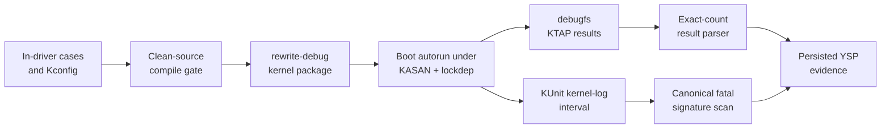

# How the rewrite drivers use KUnit

The rewrite drivers use KUnit as a built-in boot gate for logic and state
transitions that can be exercised without RK3588 hardware. The YSP result is
green only when all **85 MPP + 148 RGA cases** pass without skips **and** the
same kernel-log interval is free of sanitizer reports, warnings, lockdep
findings, refcount failures, and media/IOMMU faults.

This is a compound contract. Green KTAP alone is insufficient: a case can
return `ok` after provoking a KASAN report or kernel warning.



For the broader testing ladder and the boundary between unit and hardware
evidence, see the
[observability and testing architecture](rewrite-driver-architecture/05-observability-and-testing.md)
and the [rewrite validation plan](rewrite-validation-plan.md).

## Source organization

Each suite is compiled in the same translation unit as its driver:

| Suite | Source | Kconfig symbol | Registered cases |
|-------|--------|----------------|-----------------:|
| `rk_mpp_rewrite` | `drivers/video/rockchip/mpp-rewrite/mpp_rewrite.c` | `CONFIG_ROCKCHIP_MPP_REWRITE_KUNIT_TEST` | 85 |
| `rockchip-rga-rewrite` | `drivers/video/rockchip/rga-rewrite/rga_rewrite.c` | `CONFIG_ROCKCHIP_RGA_REWRITE_KUNIT_TEST` | 148 |

The test blocks are guarded with `IS_ENABLED()` and registered with
`kunit_test_suite()`. Keeping the cases beside the implementation lets them
exercise static parsers, validators, register emitters, state machines, and
lifetime helpers without exporting internals or adding test-only production
hooks. A production configuration without the test symbols compiles those
blocks out.

Built-in KUnit does not execute a suite from KUnit's own late initcall. Linux
finishes all initcalls in `do_basic_setup()`, then
`kernel_init_freeable()` calls `kunit_run_all_tests()`, and only afterward
waits for initramfs. Each rewrite driver therefore registers normally at
device-initcall time. Its suite initializer cleanly unregisters that production
runtime before using the singleton as fixture storage, and suite teardown
restores it before initramfs. A restore error fails the suite. This lifecycle
contract is required: simply delaying driver registration to a later initcall
still registers it before boot KUnit and lets the fixture initializer destroy
live state.

Both test symbols depend on their rewrite driver and `KUNIT`; their Kconfig
default follows `KUNIT_ALL_TESTS`. Do not rely on that default for a validation
build. A boot used as YSP evidence must have all of these resolved to `y`:

```text
CONFIG_KUNIT=y
CONFIG_KUNIT_DEBUGFS=y
CONFIG_KUNIT_DEFAULT_ENABLED=y
CONFIG_KUNIT_AUTORUN_ENABLED=y
CONFIG_ROCKCHIP_MPP_REWRITE=y
CONFIG_ROCKCHIP_MPP_REWRITE_KUNIT_TEST=y
CONFIG_ROCKCHIP_RGA_REWRITE=y
CONFIG_ROCKCHIP_RGA_REWRITE_KUNIT_TEST=y
```

The vendor MPP/RGA drivers and the rewrite drivers own the same device nodes,
so the rewrite debug flavor also disables `ROCKCHIP_MPP_SERVICE`,
`ROCKCHIP_MULTI_RGA`, and `VIDEO_ROCKCHIP_RGA`.

An ordinary object build can silently omit thousands of lines of KUnit code
when the tree's `.config` selects the vendor driver instead. A valid compile
claim therefore records the resolved symbols, not just a successful
`mpp_rewrite.o` or `rga_rewrite.o` target.

## What the suites cover

The cases are intentionally grouped around risky boundaries rather than
hardware throughput:

| Driver | Case region | Main subjects |
|--------|-------------|---------------|
| MPP | 1–21 | ABI layout, message parsing, topology, register and DMA bounds |
| MPP | 22–43 | RKVDEC2 CCU modes, link descriptors/tables, ownership, RCB/cache setup |
| MPP | 44–57 | IRQ ownership, scheduling, IOMMU faults, timeout generations, recovery |
| MPP | 58–65 | Encoder slices, bitstream overflow, DCHS, watchdogs, RCB validation |
| MPP | 66–85 | Sessions, batch operation, imports, polling, abort/close teardown, event ring |
| RGA | 1–20 | Feature validation and RGA2/RGA3 register emission |
| RGA | 21–44 | Request parsing, ioctls, job state, and file lifetime |
| RGA | 45–61 | Imports, fences, layouts, planes, offsets, and strides |
| RGA | 62–80 | Import identity, DMA ownership, and job lifetime |
| RGA | 81–102 | Abort/recovery, scheduling, IOMMU routes, faults, and timeouts |
| RGA | 104–148 | FFmpeg, GStreamer, RKNN, librga, and display-shaped format/emission profiles |

These are white-box cases. They call production functions with controlled fake
objects and assert outputs, state transitions, ownership, and error behavior.
The debug kernel then runs those same calls under KASAN, UBSAN checks, lockdep,
debug objects, refcount checking, and the other instrumentation selected by
[`ysp-debug-instrumentation.conf.sh`](../scripts/debug-kernel/ysp-debug-instrumentation.conf.sh).

## Fixture contract

A fake object must satisfy every invariant the production path would have
established before calling the function under test. In particular:

- initialize list heads, locks, waitqueues, completions, refcounts, and
  work/timer objects before any path can observe them;
- connect jobs, hardware objects, cores, sessions, and imports exactly as
  probe, open, or submission would;
- mark reset-less fake hardware `terminally_stopped` when a case is not meant
  to exercise a real recovery backend;
- pair `INIT_WORK_ONSTACK()` or `INIT_DELAYED_WORK_ONSTACK()` with the matching
  destroy helper before the test returns;
- prefer KUnit-managed allocation and cleanup actions for objects that can
  escape the immediate assertion path;
- initialize error outputs before testing validation failures; and
- update stale expected register values or allocator behavior when the
  documented ABI changes—do not weaken a production validator merely to keep
  an old fixture green.

Warnings are fixture failures too. Unbalanced preemption/IRQ state, an active
stack work item, a refcount warning, or a debug-object complaint invalidates the
run even if every assertion produced `ok`.

The 2026-07-26 first full boot exposed exactly this distinction. All 232 cases
ran, but incomplete fixtures and six real driver-contract defects produced
failed assertions, Oopses, KASAN reports, debug-object warnings, refcount
warnings, and IRQ/preemption imbalance. The
[root-cause record](../../findings/2026-07-26-rewrite-kunit-failure-root-causes.md)
documents each cause and repair.

The 2026-07-27 follow-up also showed why a source sweep must accompany the
warning scan: `debug_object_is_on_stack()` prints only five stack-annotation
mismatches per boot. The first five reports hid three later objects, including
both halves of a delayed work in the timeout-replacement fixture. After the
first fixtures moved off-stack, the next boot exposed that final pair. See the
[capped-fixture record](../../findings/2026-07-27-rewrite-kunit-final-stack-fixture.md).

## Build and boot path

The device-free gate builds committed source exported with `git archive`, so
generated files or stale objects in a developer worktree cannot conceal a
failure:

```bash
REWRITE_BUILD_PROFILES='normal memory race' JOBS=8 \
  bash kernel-drivers/tests/rewrite-build-gate.sh all
```

The profiles build both rewrite objects with KUnit enabled, the Rockchip IOMMU
provider, and the Rock 5B DTB. `memory` adds KASAN and fault-injection options;
`race` adds KCSAN and lockdep. These are **compile profiles**—success proves
that the selected code builds warning-free, not that KUnit ran.

Build the bootable KASAN/lockdep flavor with:

```bash
ARMBIAN_USE_CCACHE=yes \
  bash kernel-drivers/scripts/build-kernel.sh rewrite-debug
```

The flavor configuration in
[`config-rock5b-rewrite-debug-kernel.conf.sh`](../scripts/debug-kernel/config-rock5b-rewrite-debug-kernel.conf.sh)
forces both drivers and suites built-in. KUnit autorun executes them during
boot. The rewrite suite callbacks temporarily unbind and reprobe their own
drivers during this pre-initramfs window; userspace conformance begins only
after the restored runtime is present. Install and recover through the
[debug-kernel runbook](debug-kernel.md), then verify the booted release and
configuration through the
[kernel validation runbook](kernel-validation-runbook.md).

## Reading the boot result

With debugfs mounted, KUnit exposes the most recent result for each suite:

```text
/sys/kernel/debug/kunit/rk_mpp_rewrite/results
/sys/kernel/debug/kunit/rockchip-rga-rewrite/results
```

These are generated debugfs files. They commonly report a size of zero through
`stat` while returning complete KTAP when read. Test readability with `-r` or
read the file directly; do not use `-s` as a presence check.

The YSP parser encodes the exact pass contract:

```bash
sudo bash kernel-drivers/tests/rewrite-kunit-log-check.sh
```

For each suite it requires:

| Field | Required value |
|-------|----------------|
| Inner KTAP plan | exactly 85 MPP or 148 RGA |
| Observed case results | exactly the planned count |
| Failed cases | 0 |
| Skipped cases | 0 |
| Suite summary | `ok` |
| Boot identity | recorded from `uname -r` |

The checker deliberately does not interpret the kernel log. A complete verdict
also needs the KUnit interval scanned through `SUITE_DMESG_FATAL_RE` from
[`suite-common.sh`](../tests/suite-common.sh). Never copy that expression into
another script; it is shared so new sanitizer and Rockchip IOMMU fault
signatures cannot drift between suites.

## Capture a reproducible result

Run these commands from the YSP repository after booting the rewrite debug
kernel. Evidence belongs in the external conformance workspace, not in Git:

```bash
run_id=$(date -u +%Y%m%dT%H%M%SZ)
evidence="../rockchip-conformance/logs/rewrite/$run_id-kunit"
mkdir -p "$evidence"

uname -a > "$evidence/uname.txt"
sudo cat /proc/config.gz > "$evidence/config.gz"
sudo cat /sys/kernel/debug/kunit/rk_mpp_rewrite/results \
  > "$evidence/rk_mpp_rewrite.ktap"
sudo cat /sys/kernel/debug/kunit/rockchip-rga-rewrite/results \
  > "$evidence/rockchip-rga-rewrite.ktap"

sudo env KUNIT_REPORT="$PWD/$evidence/result.tsv" \
  bash kernel-drivers/tests/rewrite-kunit-log-check.sh
```

Capture the boot-time KUnit interval before manually rerunning either suite:

```bash
sudo journalctl -k -b --no-pager -o short-monotonic |
  awk '
    /# Subtest: rk_mpp_rewrite/ { capture = 1 }
    capture { print }
    capture && /(ok|not ok) 2 rockchip-rga-rewrite$/ { exit }
  ' > "$evidence/kunit-journal.txt"

source kernel-drivers/tests/suite-common.sh
grep -aiE "$SUITE_DMESG_FATAL_RE" "$evidence/kunit-journal.txt" \
  > "$evidence/kunit-fatal.txt" || true
test -s "$evidence/kunit-journal.txt"
test ! -s "$evidence/kunit-fatal.txt"
```

The final two commands are gates: an empty/missing interval fails, as does any
fatal match. Retain the raw interval, empty-or-populated fatal file, exact KTAP,
report, configuration, and boot identity together.

[`rewrite-conformance-run.sh`](../tests/rewrite-conformance-run.sh) enables the
KUnit checker by default for rewrite profiles and writes a
`<RUN_ID>-kunit.tsv` report before moving on to ABI, MPP, librga, GStreamer,
FFmpeg, comparator, counter, and per-suite dmesg gates.

## Post-boot reruns are intentionally unavailable

These suites use each production service singleton as fixture storage. They may
do that only during boot's pre-initramfs KUnit window, after their driver has
been cleanly unregistered and before it is restored. A post-boot debugfs run
could otherwise tear down open sessions, active DMA, and userspace-visible
devices.

The suite initializer therefore returns `-EBUSY` unless
`system_state == SYSTEM_SCHEDULING`. Built-in autorun suites normally have no
`run` control at all; if a filtered or otherwise debugfs-runnable registration
does expose one, writing it fails before touching the live service. Reboot the
same package to obtain another result. Do not treat post-boot rerun support as a
validation requirement.

## Evidence boundary

A green compound KUnit result establishes that the running kernel executed all
registered pure-logic cases, their assertions passed, and the instrumented
kernel emitted no recognized fatal signatures during that interval. It is
strong evidence for:

- ABI parsing and validation;
- format/layout and register-emission recipes;
- scheduler, timeout, fault, abort, and recovery state transitions;
- list, refcount, import, fence, and teardown ownership under the modeled
  interleavings; and
- consumer-shaped request profiles encoded by the RGA suite.

It does not establish:

- probe, clocks, power domains, real MMIO, IRQ, DMA, or IOMMU behavior;
- correct pixels, encoded bitstreams, or decode output;
- behavior of every userspace caller or every physical core;
- performance, long-duration stability, or thermal behavior; or
- safety under unmodeled races and hardware fault timing.

Those claims require the hardware, differential, fault-injection, race, and
soak gates indexed by the [validation guide](validation-index.md) and
[rewrite conformance procedure](../tests/rewrite-conformance.md).

As of 2026-07-27, lifecycle-repaired tips 6.18 `db8251eec71a` and mainline
`fac707773158` pass clean-archive `normal`, `memory`, and `race` profiles. The
6.18 repair is package-verified as `P3138-Cad24` with both suites and ordinary
device-initcall registration, but a clean booted 85 + 148 result remains
pending. Do not promote compile or package results into a runtime pass until
the compound evidence above is captured.
