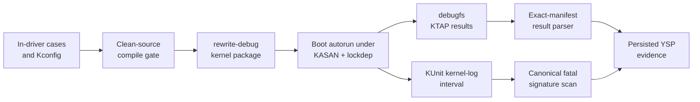

# How the rewrite drivers use KUnit

The rewrite drivers use KUnit as a built-in boot gate for logic and state
transitions that can be exercised without RK3588 hardware. The YSP result is
green only when the named **92 MPP + 152 RGA case manifest** matches without
duplicates, omissions, failures, or skips **and** the same kernel-log interval
is free of sanitizer reports, warnings, lockdep findings, refcount failures,
and media/IOMMU faults. The report also binds the run to the kernel release,
source commit, configuration hash, and installed package.

This is a compound contract. Green KTAP alone is insufficient: a case can
return `ok` after provoking a KASAN report or kernel warning.



For the broader testing ladder and the boundary between unit and hardware
evidence, see the
[observability and testing architecture](rewrite-driver-architecture/05-observability-and-testing.md)
and the [rewrite validation plan](rewrite-validation-plan.md). The proposed
[KUnit rationalization and fixture-hardening plan](rewrite-kunit-rationalization-plan.md)
defines how to retain the high-value contracts while removing production
singleton reuse, making resource cleanup failure-safe, relocating redundant
checks, and consolidating repeated vectors.

## Source organization

Each suite is compiled in the same translation unit as its driver:

| Suite | Source | Kconfig symbol | Registered cases |
|-------|--------|----------------|-----------------:|
| `rk_mpp_rewrite` | `drivers/video/rockchip/mpp-rewrite/mpp_rewrite.c` | `CONFIG_ROCKCHIP_MPP_REWRITE_KUNIT_TEST` | 92 |
| `rockchip-rga-rewrite` | `drivers/video/rockchip/rga-rewrite/rga_rewrite.c` | `CONFIG_ROCKCHIP_RGA_REWRITE_KUNIT_TEST` | 152 |

The test blocks are guarded with `IS_ENABLED()` and registered with
`kunit_test_suite()`. Keeping the cases beside the implementation lets them
exercise static parsers, validators, register emitters, state machines, and
lifetime helpers without exporting internals or adding test-only production
hooks. A production configuration without the test symbols compiles those
blocks out.

Built-in KUnit does not execute a suite from KUnit's own late initcall. Linux
finishes all initcalls in `do_basic_setup()`, then
`kernel_init_freeable()` calls `kunit_run_all_tests()`, and only afterward
waits for initramfs. Each rewrite driver therefore registers normally at
device-initcall time. The suites must coexist with those already-probed
production services: every stateful fixture now creates its own service
instance, and no suite callback unregisters, reprobes, or reinitializes the
runtime.

Both test symbols depend on their rewrite driver and `KUNIT`; they default to
`n` even when `KUNIT_ALL_TESTS=y` because they remain large, embedded lifecycle
qualification suites rather than ordinary unit-test defaults. A qualification
build must select both explicitly. A boot used as YSP evidence must have all of
these resolved to `y`:

```text
CONFIG_KUNIT=y
CONFIG_KUNIT_DEBUGFS=y
CONFIG_KUNIT_DEFAULT_ENABLED=y
CONFIG_KUNIT_AUTORUN_ENABLED=y
CONFIG_ROCKCHIP_MPP_REWRITE=y
CONFIG_ROCKCHIP_MPP_REWRITE_KUNIT_TEST=y
CONFIG_ROCKCHIP_RGA_REWRITE=y
CONFIG_ROCKCHIP_RGA_REWRITE_KUNIT_TEST=y
```

The vendor MPP/RGA drivers and the rewrite drivers own the same device nodes,
so the rewrite debug flavor also disables `ROCKCHIP_MPP_SERVICE`,
`ROCKCHIP_MULTI_RGA`, and `VIDEO_ROCKCHIP_RGA`.

An ordinary object build can silently omit thousands of lines of KUnit code
when the tree's `.config` selects the vendor driver instead. A valid compile
claim therefore records the resolved symbols, not just a successful
`mpp_rewrite.o` or `rga_rewrite.o` target.

## What the suites cover

The cases are intentionally grouped around risky boundaries rather than
hardware throughput:

| Driver | Case region | Main subjects |
|--------|-------------|---------------|
| MPP | 1–26 | Message parsing, topology, AV1 layout/metadata/AFBC observation and admission, register and DMA bounds |
| MPP | 27–48 | RKVDEC2 CCU modes, link descriptors/tables, ownership, RCB/cache setup |
| MPP | 49–62 | IRQ ownership, scheduling, IOMMU faults, timeout generations, recovery |
| MPP | 63–70 | Encoder slices, bitstream overflow, DCHS, watchdogs, RCB validation |
| MPP | 71–92 | Sessions, batch operation, imports, polling, abort/close teardown, event ring, and request-configuration cleanup |
| RGA | 1–20 | Feature validation and RGA2/RGA3 register emission |
| RGA | 21–44 | Request parsing, ioctls, job state, and file lifetime |
| RGA | 45–61 | Imports, fences, layouts, planes, offsets, and strides |
| RGA | 62–80 | Import identity, DMA ownership, and job lifetime |
| RGA | 81–101 | Abort/recovery, scheduling, IOMMU routes, faults, and timeouts |
| RGA | 102–148 | FFmpeg, GStreamer, RKNN, librga, and display-shaped format/emission profiles |
| RGA | 149–152 | RGA3 overlap-copy rotate emission, the RGA2 validator-chain exclusions, the RGA2 internal-MMU sgt/layout/emit cases, and the rejection event ring |

These are white-box cases. They call production functions with controlled fake
objects and assert outputs, state transitions, ownership, and error behavior.
The debug kernel then runs those same calls under KASAN, UBSAN checks, lockdep,
debug objects, refcount checking, and the other instrumentation selected by
[`ysp-debug-instrumentation.conf.sh`](../scripts/debug-kernel/ysp-debug-instrumentation.conf.sh).

## Fixture contract

A fake object must satisfy every invariant the production path would have
established before calling the function under test. In particular:

- initialize list heads, locks, waitqueues, completions, refcounts, and
  work/timer objects before any path can observe them;
- connect jobs, hardware objects, cores, sessions, and imports exactly as
  probe, open, or submission would;
- mark reset-less fake hardware `terminally_stopped` when a case is not meant
  to exercise a real recovery backend;
- pair `INIT_WORK_ONSTACK()` or `INIT_DELAYED_WORK_ONSTACK()` with the matching
  destroy helper before the test returns;
- prefer KUnit-managed allocation and cleanup actions for objects that can
  escape the immediate assertion path;
- initialize error outputs before testing validation failures; and
- update stale expected register values or allocator behavior when the
  documented ABI changes—do not weaken a production validator merely to keep
  an old fixture green.

The focused build gate runs
[`rewrite-kunit-source-audit.py`](../tests/rewrite-kunit-source-audit.py)
against every block guarded by either rewrite KUnit symbol before compiling.
Its checked
[`rewrite-kunit-source-audit-baseline.tsv`](../tests/rewrite-kunit-source-audit-baseline.tsv)
records the current lexical fixture-debt signals. Removing a signal passes;
adding singleton access, FD/raw allocation, a stack async owner, a manual list
link, or a fatal assertion after acquisition but before cleanup registration
fails. Project wrappers such as `kzalloc_obj()` and
`rk_rga_fence_create_fd()` are included. This is a regression guard and
inventory aid, not proof that baselined fixtures are safe.

Warnings are fixture failures too. Unbalanced preemption/IRQ state, an active
stack work item, a refcount warning, or a debug-object complaint invalidates the
run even if every assertion produced `ok`.

The 2026-07-26 first full boot exposed exactly this distinction. All 232 cases
ran, but incomplete fixtures and six real driver-contract defects produced
failed assertions, Oopses, KASAN reports, debug-object warnings, refcount
warnings, and IRQ/preemption imbalance. The
[root-cause record](../../findings/2026-07-26-rewrite-kunit-failure-root-causes.md)
documents each cause and repair.

The 2026-07-27 follow-up also showed why a source sweep must accompany the
warning scan: `debug_object_is_on_stack()` prints only five stack-annotation
mismatches per boot. The first five reports hid three later objects, including
both halves of a delayed work in the timeout-replacement fixture. After the
first fixtures moved off-stack, the next boot exposed that final pair. See the
[capped-fixture record](../../findings/2026-07-27-rewrite-kunit-final-stack-fixture.md).

## Build and boot path

The device-free gate builds committed source exported with `git archive`, so
generated files or stale objects in a developer worktree cannot conceal a
failure:

```bash
REWRITE_BUILD_PROFILES='normal test-disabled memory race' JOBS=8 \
  bash kernel-drivers/tests/rewrite-build-gate.sh all

REWRITE_BUILD_PROFILES=test-disabled VERIFY_ABI_STATIC_ASSERT=1 JOBS=8 \
  bash kernel-drivers/tests/rewrite-build-gate.sh all
```

The profiles build both rewrite objects, the Rockchip IOMMU provider, and the
Rock 5B DTB. Before compiling, the `all` gate compares both maintained trees'
rewrite sources, Kconfig, ABI ledgers, and MPP UAPI byte-for-byte and audits
their KUnit signals in one invocation. `test-disabled` proves no KUnit-only
dependency leaked into the production object; `memory` adds KASAN and
fault-injection options; `race` adds KCSAN and lockdep. The optional mutation
check proves the ABI constants remain compile-time-owned. These are **compile
profiles**—success proves that the selected code builds warning-free, not that
KUnit ran.

Build the bootable KASAN/lockdep flavor with:

```bash
ARMBIAN_USE_CCACHE=yes \
  bash kernel-drivers/scripts/build-kernel.sh rewrite-debug
```

The flavor configuration in
[`config-rock5b-rewrite-debug-kernel.conf.sh`](../scripts/debug-kernel/config-rock5b-rewrite-debug-kernel.conf.sh)
forces both drivers and suites built-in. KUnit autorun executes them during
boot. The suites use local service instances and do not unregister, reprobe, or
reinitialize the production MPP/RGA services. Install and recover through the
[debug-kernel runbook](debug-kernel.md), then verify the booted release and
configuration through the
[kernel validation runbook](kernel-validation-runbook.md).

## Reading the boot result

With debugfs mounted, KUnit exposes the most recent result for each suite:

```text
/sys/kernel/debug/kunit/rk_mpp_rewrite/results
/sys/kernel/debug/kunit/rockchip-rga-rewrite/results
```

These are generated debugfs files. They commonly report a size of zero through
`stat` while returning complete KTAP when read. Test readability with `-r` or
read the file directly; do not use `-s` as a presence check.

The YSP parser encodes the exact pass contract:

```bash
sudo bash kernel-drivers/tests/rewrite-kunit-log-check.sh
```

For each suite it requires:

| Field | Required value |
|-------|----------------|
| Inner KTAP plan | exactly 92 MPP or 152 RGA |
| Observed case results | exactly the planned count |
| Failed cases | 0 |
| Skipped cases | 0 |
| Suite summary | `ok` |
| Ordered names | exactly the case list `rewrite-kunit-manifest.tsv` names, in that order; a mismatch is reported as added/missing case names |
| Source identity | 12–40 digit commit, also embedded as `-g<commit>` in `uname -r` or ` g<commit>` in `uname -v` |
| Configuration | SHA-256 of the booted kernel config |
| Package | installed image package name and version |

The checker extracts the complete boot KUnit interval beginning at the outer
KTAP header and plan, before either suite initializer can log, through the
final RGA suite result. It scans that interval through
`SUITE_DMESG_FATAL_RE` from
[`suite-common.sh`](../tests/suite-common.sh), and requires
`/proc/sys/kernel/debug_locks` to remain `1`. Missing/incomplete log access, a
fatal match, or disabled lockdep fails the compound gate even when every KTAP
assertion reports `ok`. The expression remains shared so new sanitizer and
Rockchip IOMMU fault signatures cannot drift between suites.

## Capture a reproducible result

Run these commands from the YSP repository after booting the rewrite debug
kernel. Evidence belongs in the external conformance workspace, not in Git:

```bash
run_id=$(date -u +%Y%m%dT%H%M%SZ)
evidence="../rock-5b/build/rockchip-conformance/logs/rewrite/$run_id-kunit"
mkdir -p "$evidence"

uname -a > "$evidence/uname.txt"
sudo cp "/boot/config-$(uname -r)" "$evidence/config"
sudo cat /sys/kernel/debug/kunit/rk_mpp_rewrite/results \
  > "$evidence/rk_mpp_rewrite.ktap"
sudo cat /sys/kernel/debug/kunit/rockchip-rga-rewrite/results \
  > "$evidence/rockchip-rga-rewrite.ktap"

package_name=$(dpkg-query -S "/boot/vmlinuz-$(uname -r)" |
  awk -F ': ' 'NR == 1 { print $1 }')
package_id=$(dpkg-query -W -f='${Package}=${Version}' "$package_name")
sudo env \
  KUNIT_SOURCE_COMMIT=37ae7459656b \
  KUNIT_EXPECTED_SOURCE_COMMIT=37ae7459656b \
  KUNIT_CONFIG_FILE="$PWD/$evidence/config" \
  KUNIT_PACKAGE_ID="$package_id" \
  KUNIT_REPORT="$PWD/$evidence/result.tsv" \
  bash kernel-drivers/tests/rewrite-kunit-log-check.sh
```

The checker derives `result-journal.txt`, `result-fatal.txt`, and
`result-dmesg-scan.tsv` beside `result.tsv`. Retain those files with the exact
KTAP, configuration, and boot identity. `KUNIT_DMESG_SOURCE` can point at a
previously captured complete kernel journal for offline parsing; normal
qualification reads the live boot ring. `KUNIT_REQUIRE_LOCKDEP=0` exists only
for diagnostic kernels built without lockdep and is not a production
qualification setting.

[`rewrite-conformance-run.sh`](../tests/rewrite-conformance-run.sh) enables the
KUnit checker by default for rewrite profiles and writes a
`<RUN_ID>-kunit.tsv` report plus the correlated journal/fatal/scan artifacts
before moving on to ABI, MPP, librga, GStreamer, FFmpeg, comparator, counter,
and per-suite dmesg gates.

## Post-boot reruns are not qualification evidence

The isolated suites no longer use production service singletons as fixture
storage, and they have no runtime unbind/reprobe callbacks. Built-in autorun
suites normally expose results rather than a `run` control; availability also
depends on the KUnit configuration. Qualification still uses a fresh boot so
the manifest, complete outer-KTAP log interval, lockdep state, configuration,
package, and source identity all describe one attributable run. Do not replace
that compound boot record with a post-boot rerun.

## Evidence boundary

A green compound KUnit result establishes that the running kernel executed all
registered pure-logic cases, their assertions passed, and the instrumented
kernel emitted no recognized fatal signatures during that interval. It is
strong evidence for:

- ABI parsing and validation;
- format/layout and register-emission recipes;
- scheduler, timeout, fault, abort, and recovery state transitions;
- list, refcount, import, fence, and teardown ownership under the modeled
  interleavings; and
- consumer-shaped request profiles encoded by the RGA suite.

It does not establish:

- probe, clocks, power domains, real MMIO, IRQ, DMA, or IOMMU behavior;
- correct pixels, encoded bitstreams, or decode output;
- behavior of every userspace caller or every physical core;
- performance, long-duration stability, or thermal behavior; or
- safety under unmodeled races and hardware fault timing.

Those claims require the hardware, differential, fault-injection, race, and
soak gates indexed by the [validation guide](validation-index.md) and
[rewrite conformance procedure](../tests/rewrite-conformance.md).

The lifecycle-repaired `P3138-Cad24` boot did complete all 85 MPP + 148 RGA
cases and restore both runtimes, but it did not pass the compound gate: MPP
case 9 disabled lockdep by locking an uninitialized fixture mutex, and case 28
left a nested 2,048-byte production allocation for kmemleak. Parent repairs
6.18 `6b55e022ce49` and mainline `9aa6ef7e97b2` address those defects.
Tips `f6ebe28a3f66` / `394d80552960` additionally initialized the abort
fixture's DCHS spinlock and made debug-state capture fail fast. Booted
6.18.40 KASAN/UBSAN/lockdep/kmemleak package `P91d6-Cad24` contained that
repair and completed exact 85+148 KTAP, but case 83 exposed the same omission
in `rk_mpp_reset_session_hw_active_import_kunit()` and disabled lockdep before
RGA. That fixture-isolation checkpoint, 6.18 `51ea9d1ca537` / mainline
`03da898b03f1f`, additionally gave every fixture a local service, removed
runtime unregister/reprobe callbacks, made fence/FD/work/device cleanup
assertion-safe, and replaced polling with completion-driven synchronization
plus a real two-thread fence/abort race. Its named ordered 90/152 manifest and
source/config/package-bound evidence gate owned result attribution. See the
[successor attribution and audit](../../findings/2026-07-27-rewrite-reset-import-fixture-lockdep.md).

The maintained tips are now 6.18 `37ae7459656b` on `v6.18.42` and mainline
`02bf372dac70` on `v7.2-rc6`, with an exact 92/152 manifest. Predecessor 6.18
`19634f4eebba` passed that exact manifest on KASAN boot `#2` on 2026-08-05:
244 results, zero failures/skips, a clean outer interval, and live lockdep. That
runtime-verifies the patch-equivalent request/rotation repair after the
2026-08-04 rebases. The current tips add RGA librga DMA/fence compatibility and
extend an existing legacy BLIT case without changing the manifest. Both pass
the warning-fatal clean-archive `normal` build and the 305-signal source audit,
but neither current tip has booted KUnit evidence. Do not carry the predecessor
KTAP across that source boundary; replay the entire compound evidence above.
