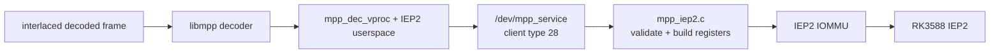
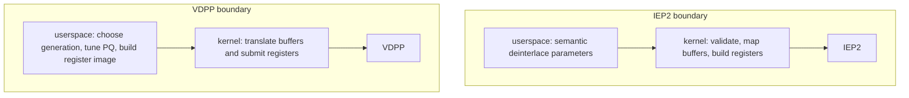

# RK3588 deinterlacing: IEP2, not VDPP

## Short answer

The Radxa ROCK 5B can use RK3588's **IEP2** hardware for deinterlacing. In
Rockchip's Linux BSP, the device tree instantiates `iep@fdbb0000`; the
`mpp_iep2.c` subdriver binds it, registers MPP client type 28, and serves jobs
through the shared `/dev/mpp_service` ABI. libmpp's decoder vproc layer is the
userspace consumer.

RK3588 does **not** have a documented or BSP-addressable VDPP instance. This is
stronger than “the ROCK 5B board DTS forgot to enable it”: the RK3588 TRM,
SoC-level DTSI, clock/reset namespace, and BSP kernel compatible table all lack
VDPP. By contrast, RK3528 and RK3576 instantiate IEP and VDPP side by side.
The two names are not aliases.

The YSP Linux 6.18 forward-port source now contains the IEP2 subdriver and its
RK3588 DT/IOMMU nodes. The port builds, but the currently booted kernel predates
it. Hardware deinterlacing therefore remains unavailable on the running system
until a kernel built from the new source is booted and the functional gate is
run.

## 1. Hardware evidence

### 1.1 RK3588 Technical Reference Manual

The locally archived **RK3588 TRM Part 2, Revision 1.0, 2022-03-09** contains an
IEP2 chapter and register map. Its advertised surface includes:

- YUV 4:2:0 and 4:2:2 planar/semi-planar input;
- YUV 4:2:0 and 4:2:2 semi-planar/tile output and 4:2:2-to-4:2:0 conversion;
- dynamic images up to 1920×1080;
- I5O2, I5O1 top/bottom, I2O2, and I1O1 top/bottom deinterlacing modes;
- motion estimation/detection/compensation, EEDI, motion-vector history,
  pulldown recognition/detection, OSD/field-order/field-frequency checks, and
  combining checks.

Neither Part 1 nor Part 2 contains `VDPP` or “video display post” text. The
archived text identities are:

| Artifact | SHA-256 |
|---|---|
| `rk3588_trm_part1.txt` | `fe16cd1e43596bf33cd94c7e50828b11102467b59fa7ccda109c789a7b0bb9af` |
| `rk3588_trm_part2.txt` | `f92ba6cedaa774411f299606c2470f45d758eb185487c405463aed91ddac4261` |

The source-tree reconstruction record is maintained in
[source-trees.md §6](../../../docs/source-trees.md#6-where-the-register-recipes-live).

### 1.2 RK3588 BSP device tree

The pinned Rockchip `develop-6.1` BSP defines:

```dts
iep: iep@fdbb0000 {
        compatible = "rockchip,iep-v2";
        reg = <0x0 0xfdbb0000 0x0 0x500>;
        interrupts = <GIC_SPI 117 IRQ_TYPE_LEVEL_HIGH 0>;
        clocks = <&cru ACLK_IEP2P0>, <&cru HCLK_IEP2P0>,
                 <&cru CLK_IEP2P0_CORE>;
        rockchip,taskqueue-node = <6>;
        iommus = <&iep_mmu>;
        power-domains = <&power RK3588_PD_VDPU>;
};
```

The paired IOMMU is at `fdbb0800`. The extracted ROCK 5B BSP DT has both IEP2
and its IOMMU enabled. No RK3588 DTS/DTSI contains a VDPP node.

The RK3588 clock binding likewise defines only `ACLK_IEP2P0`, `HCLK_IEP2P0`,
`CLK_IEP2P0_CORE`, and their resets. RK3528 and RK3576 bindings have explicit
VDPP clock/reset IDs, which RK3588 lacks.

### 1.3 Cross-SoC control

The same BSP makes the distinction observable rather than semantic:

| SoC | IEP node | VDPP node | VDPP compatible |
|---|---|---|---|
| RK3588 | yes, `rockchip,iep-v2` | no | none |
| RK3528 | yes | yes | `rockchip,vdpp-v1` |
| RK3576 | yes | yes | `rockchip,vdpp-rk3576` |

`mpp_vdpp.c` has hardware data and compatibles for RK3528 and RK3576, but none
for RK3588. A generic multi-SoC BSP defconfig enables both
`CONFIG_ROCKCHIP_MPP_IEP2=y` and `CONFIG_ROCKCHIP_MPP_VDPP=y`; that says which
drivers the distribution kernel can build, not which devices an RK3588 owns.

**Conclusion:** public/BSP evidence supports “RK3588 has IEP2 and no separately
addressable VDPP.” It does not support treating the two blocks as synonyms.

## 2. What drives IEP2 in the BSP

The end-to-end path is:



### Kernel side

`drivers/video/rockchip/mpp/mpp_iep2.c` is an MPP subdriver, not a separate
`/dev/iep2` character device; the legacy IEP path instead uses `/dev/iep`. The
IEP2 subdriver:

1. binds the `rockchip,iep-v2` device;
2. registers `MPP_DEVICE_IEP2` with the common MPP service;
3. accepts semantic `iep2_params` from userspace;
4. validates formats, dimensions, buffer descriptors, and offsets;
5. resolves DMA-buffer file descriptors through the MPP/IOMMU machinery;
6. translates the parameters into IEP2 MMIO register values;
7. starts the job and handles completion, timeout/reset, power, and IOMMU
   recovery.

The client number is **28** in both the BSP kernel's `mpp_common.h` and
libmpp's `mpp_dev_defs.h`. VDPP is the separate client **29**.

### Userspace side

libmpp builds its standard vproc support by default: `ENABLE_VPROC=ON` includes
legacy IEP and IEP2. VDPP is controlled by a separate
`ENABLE_VPROC_VDPP` option whose default is off.

For interlaced decoder output, `mpp_dec_put_frame()` asks the vproc layer for a
context. `mpp_vproc_dev.c:get_iep_ctx()` tries legacy `/dev/iep`, then selects
the IEP2 allocator when `/dev/mpp_service` exists. `iep2_init()` sends
`MPP_CMD_INIT_CLIENT_TYPE` for client 28. The installed
`librockchip_mpp.so.1` exports `get_iep_ctx` and the IEP2 context allocator;
it contains no corresponding VDPP allocator symbols.

That last selection test is too broad for a partial forward port: the generic
MPP node can exist while IEP2 is absent. Capability selection should check the
MPP supported-device inventory before choosing IEP2.

## 3. Forward-port and running-kernel state

The maintained `rk3588-video-6.18` tree originally retained the common MPP
enum/name/registration scaffolding for IEP2 but omitted the implementation.
The port now adds:

- the adapted `mpp_iep2.c` and `rockchip_iep2_regs.h` implementation;
- a `CONFIG_ROCKCHIP_MPP_IEP2` build option and MPP aggregate wiring;
- a `rockchip,iep-v2` binding;
- RK3588 IEP2 and Rockchip-IOMMU nodes at `fdbb0000`/`fdbb0800`; and
- ROCK 5B enablement for both nodes.

The 6.18 adaptation supplies the current `iommu_map()` allocation argument and
void platform remove callback. It also hardens the BSP donor boundary: exact
semantic input/output request sizes and zero offsets are required, parameter
dimensions/strides/formats and array counts are bounded, 32-bit IOVA/plane
offsets are checked, hardware OSD result counts are clamped, IRQ/IOMMU paths
guard a missing current task, and probe/error/remove paths release the ROI,
auxiliary page, and workqueue consistently. The RK3588 I1O1T one-page
read-ahead workaround is retained with a zeroed auxiliary page.

The following source gates pass:

- `mpp_iep2.o` compilation against Linux 6.18;
- inclusion of `mpp_iep2.o` in `drivers/video/rockchip/mpp/built-in.a`; and
- compilation of `rk3588-rock-5b.dtb` with both nodes enabled.

`checkpatch.pl --strict` reports no error or warning for the driver/register
files and binding (one function-continuation style check was corrected). The
binding schema could not be run because this board does not currently have the
`dtschema` tools installed; that is an unavailable tool gate, not a schema
pass.

On the running `6.18.41-ysp-rockchip64` system,
`/proc/mpp_service/supports-device` lists AV1DEC, RKVDEC, and RKVENC only. It
lists neither IEP2 client 28 nor VDPP client 29.

During the installed ysp8 VA-API validation, an interlaced H.264 frame caused
libmpp to select its IEP2 backend. The kernel rejected client initialization:

```text
rk_vcodec: mpp_collect_msgs:1897: session 0 process cmd 100 ret -22
rk_vcodec: mpp_dev_ioctl_common:2027: collect msgs failed -22
```

The log prints the command in hexadecimal: `100` is `0x100`,
`MPP_CMD_INIT_CLIENT_TYPE`. The client value is not printed there, but matching
source and installed binary inspection identify it as IEP2 client 28, not VDPP
client 29. libmpp then disabled deinterlacing and continued; the clip decoded
bit-exact. Bit-exact decode does not demonstrate deinterlaced output.

The inspected mainline/maxline trees do not provide an RK3588 IEP2 driver.
Their generic `m2m-deinterlace` module uses DMAengine and a V4L2 `/dev/video*`
interface; it does not register MPP client 28 and cannot satisfy this libmpp
request.

## 4. Why IEP2 looks much smaller than VDPP

First separate kernel from userspace. Raw physical-line counts at the pinned
BSP/libmpp revisions are:

| Layer | IEP2 | VDPP | What was counted |
|---|---:|---:|---|
| BSP kernel | 1,350 | 828 | IEP2 `.c` + register header versus VDPP `.c` |
| libmpp implementation directory | 1,638 | 10,484 | top-level non-test `.c`/`.h` in each implementation directory |

These are deliberately comparable implementation-directory counts, not a full
dependency closure. The IEP2 decoder bridge also uses the shared
`mpp_dec_vproc.c` (1,228 lines) and `mpp_vproc_dev.c` (58), plus common API
headers (289 lines); those are orchestration/ABI shared with other vproc
backends. VDPP likewise has API/HWPQ headers outside the directory count.

The **kernel IEP2 code is not smaller**: `mpp_iep2.c` is 1,166 lines and
`rockchip_iep2_regs.h` is 184, versus 828 lines for `mpp_vdpp.c`. These are raw
line counts, useful for scale but not equivalent to logical/source lines.

The userspace IEP2 implementation really is much smaller, for four reasons:

1. **Narrower job.** IEP2 is principally a fixed-function deinterlacer with
   field/cadence/motion helpers. VDPP is a broader video-quality pipeline with
   scaling/ZME, deringing, DMSR, edge/sharpness processing, histograms/DCI,
   image pyramids, and black-bar detection.
2. **More generations.** The VDPP directory carries three hardware generations
   and several SoC families. IEP2 presents one focused implementation here.
3. **Large generated-looking state.** VDPP owns extensive register bitfield
   headers, coefficients, and tuning/configuration structures. Those dominate
   physical line count without implying ten times as much control flow.
4. **Different ABI boundary.** IEP2 userspace sends semantic parameters and the
   kernel's `iep2_config()` constructs the register image. VDPP userspace builds
   generation-specific register images, while `mpp_vdpp.c` primarily translates
   buffer references, checks/submits the register task, and handles the device.



So the apparent size difference is architectural and scope-related, not
evidence that IEP2 is a thin alias for VDPP or less “real” hardware.

## 5. Forward-port result and remaining validation

### Implemented vendor-ABI port

The existing 6.18 MPP service already had the device enum and conditional
registration hook. The implemented port adds/adapts:

- `mpp_iep2.c` (1,166 raw lines) and `rockchip_iep2_regs.h` (184);
- Kconfig/Makefile selection;
- the RK3588 IEP2 and IEP2-IOMMU DT nodes, clocks, resets, power domain, IRQ,
  taskqueue association, and enablement in the ROCK 5B path;
- current-kernel adaptations and hardening for vendor IOMMU/fault handling,
  DMA APIs, request validation, resource lifetime, reset, and timeout
  recovery.

A separate optional libmpp capability-selection fix would ensure that a generic
`/dev/mpp_service` does not imply that client 28 exists.

Basic libmpp IEP2 userspace support is already built and installed, so this is
not a new userspace implementation project.

### Engineering estimate

These are planning estimates inferred from the inspected delta, not measured
delivery times:

| Outcome | Estimate |
|---|---|
| Compile, bind, and expose client 28 | 1–3 engineering days |
| First successful MPP deinterlace including DT/IOMMU bring-up | 2–5 days total |
| Hardened vendor-ABI port with recovery and representative validation | about 1–2 weeks |
| Upstream-quality V4L2 mem2mem/control design instead of the vendor ABI | several weeks |

The 1,350 imported lines are not the main risk. IOMMU mappings and fault
recovery, semantic-to-register validation, buffer lifetime, reset/timeout
behavior, and field-order/cadence correctness are the hard parts.

### Validation harness and completion gate

[`kernel-drivers/tests/iep2-smoke.sh`](../../tests/iep2-smoke.sh) owns the
repeatable gate. Its device-free mode checks the source integration and can
compile the driver, linked MPP archive, and ROCK 5B DTB:

```sh
IEP2_VALIDATE_ONLY=1 IEP2_VALIDATE_BUILD=1 \
  kernel-drivers/tests/iep2-smoke.sh
```

After booting that kernel, run the functional gate as root for the complete
dmesg check:

```sh
sudo IEP2_REQUIRE_DMESG=1 IEP2_LOOPS=10 \
  kernel-drivers/tests/iep2-smoke.sh
```

The runtime mode requires client 28 plus bound IEP2/IOMMU platform devices,
generates deterministic top- and bottom-field-first interlaced YUV420 input,
runs libmpp's official `iep2_test` in I5O2 mode, requires exact-size nonzero
NV12 output, records checksums, and rejects new IEP2/IOMMU/timeout/kernel-fatal
log signatures. `IEP2_TEST`, `MPP_BUILD`, `MPP_LIBDIR`, `IEP2_INPUT`, and
`IEP2_BFF_INPUT` allow staged binaries and external fixtures.

A credible result should prove all of the following on the ROCK 5B:

- client 28 appears in `/proc/mpp_service/supports-device` and the intended DT
  node/driver bind is recorded;
- the official IEP2 test and a real decoder vproc path produce inspected
  deinterlaced output, not merely a successful ioctl;
- top- and bottom-field-first content plus I5O2, I2O2, and I1O1 modes behave
  correctly;
- supported 4:2:0/4:2:2 planar/semi-planar formats and the documented 1080p
  boundary are exercised;
- repeated open/close, buffer lifetime, invalid fd/ioctl, timeout/reset, and
  IOMMU fault/recovery paths are safe; and
- a soak and application integration run remain free of kernel faults and
  field-order/cadence regressions.

Until that gate is run on a booted port, the accurate state is: **RK3588 IEP2
hardware and BSP support are established; the YSP 6.18 source port builds but
has not produced runtime output; the currently booted kernel does not expose
it; VDPP is not an RK3588 block.**

## 6. Reproducing the source inspection

The principal source pins are:

| Tree | Pin |
|---|---|
| Rockchip BSP kernel | `rockchip-linux/kernel` `develop-6.1@b4ef083dc0c3608e744deabb43dc6b781aadbe6e` |
| Maintained 6.18 forward port | `rk3588-video-6.18@6f5bdf5c0a52c0ed3895842a73dafd585ef3324b` |
| libmpp | `ysp/main@ad32534571564aae2ee5cca26547c3738e3366ed` |

From the repository root, the local sibling trees used for the audit are
`../rock-5b/kernel/rockchip-kernel`,
`../rock-5b/kernel/linux-6.18-rkvenc-av1-fwport`, and
`../rock-5b/rockchip-userspace/mpp-rockchip`.

Useful checks include:

```sh
rg -n 'iep@|iep_mmu|vdpp' \
  ../rock-5b/kernel/rockchip-kernel/arch/arm64/boot/dts/rockchip/rk3588*.dts*
rg -n 'IEP2|VDPP' \
  ../rock-5b/kernel/rockchip-kernel/include/dt-bindings/clock/rk3588-cru.h
rg -n 'rockchip,iep-v2|rockchip,vdpp' \
  ../rock-5b/kernel/rockchip-kernel/drivers/video/rockchip/mpp
rg -n 'ENABLE_VPROC|ENABLE_VPROC_VDPP|IEP_CLIENT_TYPE|VDPP_CLIENT_TYPE' \
  ../rock-5b/rockchip-userspace/mpp-rockchip/mpp
```
