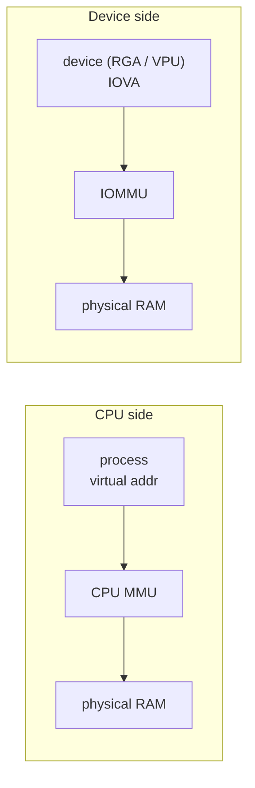
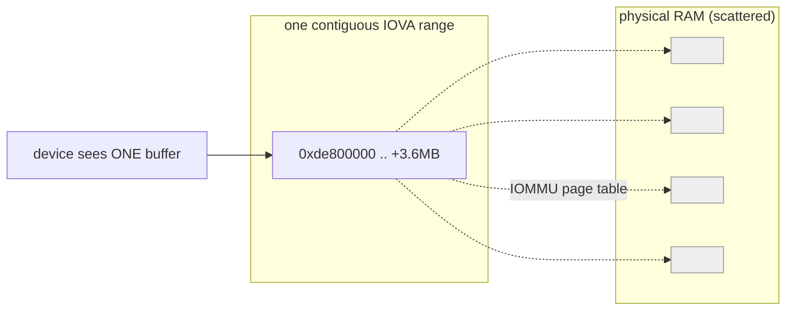
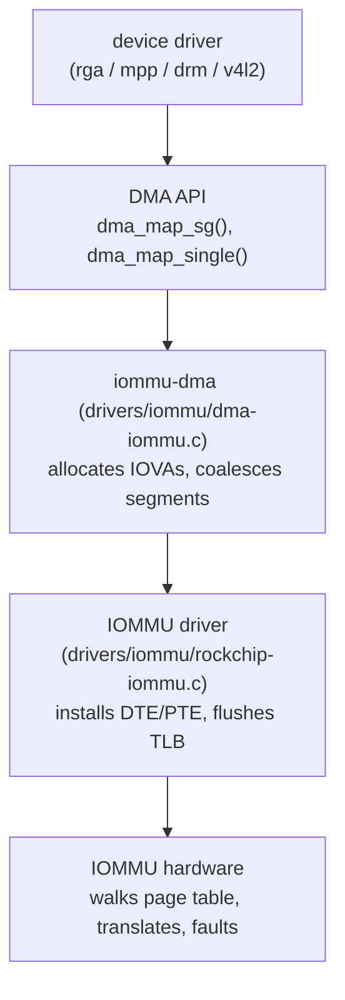

# 01 — IOMMU primer: what it is, why it exists, how it fits in

> Scope: vendor-neutral concepts. Read this first, then
> [`02-rk3588-iommu-hardware.md`](02-rk3588-iommu-hardware.md) for the RK3588
> hardware and [`03-bsp-iommu-code.md`](03-bsp-iommu-code.md) for what the
> Rockchip driver code actually does. The cross-version traps are consolidated
> in [`04-dma-mapping-porting-contracts.md`](04-dma-mapping-porting-contracts.md).
> Audience: someone comfortable with C and Linux but new to DMA/IOMMU.

## The one-sentence version

An **IOMMU** (I/O Memory Management Unit) is *an MMU for devices*: it sits between
a hardware block (video decoder, RGA, GPU, NPU…) and RAM, translating the
addresses that device emits into real physical addresses — exactly like the CPU's
MMU translates a process's virtual addresses.

The device's address is called an **IOVA** (I/O Virtual Address). The IOMMU walks
a **page table** (installed by the kernel) to turn each IOVA into a physical
address, one 4 KiB page at a time.

## Why bother? The three problems an IOMMU solves

Without an IOMMU, a device DMAs straight to **physical** addresses. That creates
three headaches:

### 1. Scattered memory looks contiguous

A buffer that userspace or the kernel allocates (`malloc`, `vmalloc`, most
dma-buf heaps) is *virtually* contiguous but **physically scattered** — its pages
are sprinkled all over RAM by the page allocator. A 3.6 MB buffer is ~900 × 4 KiB
pages that may sit in hundreds of disjoint physical runs.

Simple hardware wants **one base address + a length**. Without an IOMMU you have
only two ways to give it that:

- allocate **physically contiguous** memory (CMA / a reserved pool) — scarce and
  fragmentation-prone, or
- teach the hardware to walk a **scatter-gather list** itself — more complex
  silicon.

An IOMMU removes the dilemma: it maps those hundreds of scattered physical runs
to **one contiguous IOVA range**. The device sees a single flat buffer; the IOMMU
quietly redirects each page to wherever it physically lives.

### 2. Reach beyond a device's address width

A block whose registers are only 32 bits wide can natively address ≤ 4 GiB. On a
board with 8–16 GiB of RAM, a buffer may physically live above 4 GiB. The IOMMU
lets the kernel hand the device a **low IOVA** (inside its 32-bit reach) that maps
to **high physical memory**. Translation buys reach the device's registers don't
have. (This is also exactly why the RK3588 RGA path is so sensitive to *where* in
the 32-bit IOVA window a mapping lands — see doc 03.)

### 3. Isolation and protection

A device can only touch memory the kernel has explicitly mapped into **its**
IOMMU domain. A buggy or hostile DMA can't scribble over arbitrary RAM; an
out-of-range access **faults** instead of corrupting memory silently. The fault
is a debuggable event (an IRQ with the offending IOVA) rather than a mystery
crash later.

## The vocabulary you must have

| Term | Meaning |
|------|---------|
| **IOVA** | I/O Virtual Address — the device-visible address the IOMMU translates. |
| **Page table** | The in-RAM structure (installed by the kernel) the IOMMU walks to translate an IOVA → physical address. |
| **TLB / IOTLB** | The IOMMU's on-chip cache of recent translations. Must be *invalidated* ("zapped") when the page table changes. |
| **Domain** | One address space = one set of page tables. Devices *attached* to the same domain share an IOVA space. |
| **Group** | The smallest set of devices that the hardware cannot isolate from each other, so they **must** share a domain. On RK3588 media blocks this is usually one device per group. |
| **Default (DMA) domain** | The translating domain the kernel auto-creates so the ordinary DMA API "just works" for a device behind an IOMMU. |
| **Identity / passthrough domain** | A domain where IOVA == physical (no translation). Used for bypass. |
| **Fault** | The IOMMU raises an IRQ when a device accesses an unmapped/forbidden IOVA. |

## Where the IOMMU sits in the Linux stack

Drivers almost never talk to the IOMMU directly. They call the **DMA API**, and
for a device that is behind an IOMMU the DMA API is *implemented by* the generic
IOMMU-DMA layer, which drives the specific IOMMU driver:

- The **driver** says "make this buffer reachable by my device."
- The **DMA API** (`dma_map_sg` and friends) is the portable interface.
- **iommu-dma** allocates an IOVA range and asks the provider to map the pages;
  it can **merge** a scatter-gather list into a single IOVA segment.
- The **provider** (`rockchip-iommu.c`) writes the actual page-table entries and
  invalidates the TLB.
- The **hardware** does the per-access translation and raises faults.

## The one DMA-API detail that matters most here: `dma_map_sg` and coalescing

A scatter-gather table (`struct sg_table`) has two counts:

- `orig_nents` — how many physically-contiguous runs the buffer's pages form
  *before* mapping (e.g. 341 for a fragmented 3.6 MB buffer).
- `nents` — how many DMA segments come *back* from `dma_map_sg()`.

With a coalescing IOMMU path, `dma_map_sg()` can fold all `orig_nents` runs into
**one** IOVA-contiguous segment (`nents == 1`), bounded by the device's
`dma_get_max_seg_size()`. Hardware that wants "one base + length" then just uses
`sg_dma_address(sgt->sgl)` and `sg_dma_len(sgt->sgl)`.

If the device is **not** on the coalescing path (direct/identity mapping), you get
`nents == orig_nents` — one DMA segment per physical run — and simple hardware
can't consume it. This distinction is the entire story behind the RK3588 RGA3
scattered-buffer limitation; see doc 03 and
[`../../rga/docs/userptr-iommu.md`](../../rga/docs/userptr-iommu.md).

## Mental model to carry into the next docs

1. Device emits IOVAs; the IOMMU translates them per 4 KiB page via a page table.
2. The kernel installs that page table through a *provider* driver, reached via
   the DMA API + iommu-dma.
3. "Make this scattered buffer look like one contiguous buffer to the device" is
   the IOMMU's core value — and whether it actually happens depends on the domain
   type and the coalescing path.
4. Anything the device touches outside its mapped IOVAs **faults** — a feature,
   not just a failure.

Next: [`02-rk3588-iommu-hardware.md`](02-rk3588-iommu-hardware.md) — how RK3588
implements all of this in silicon (page-table format, registers, per-block
topology).
