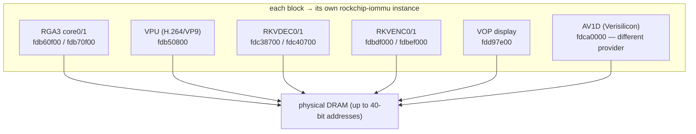
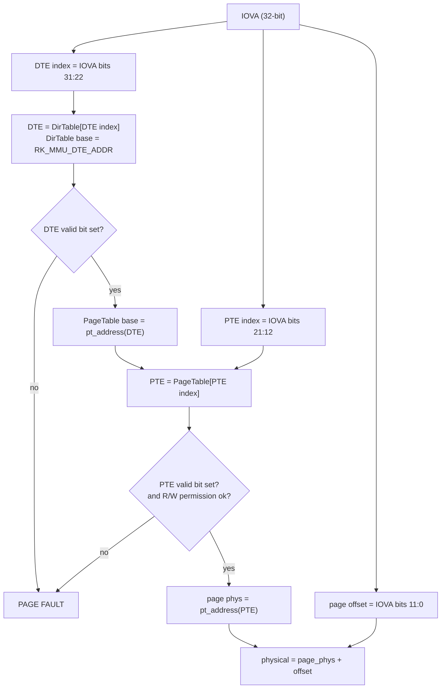
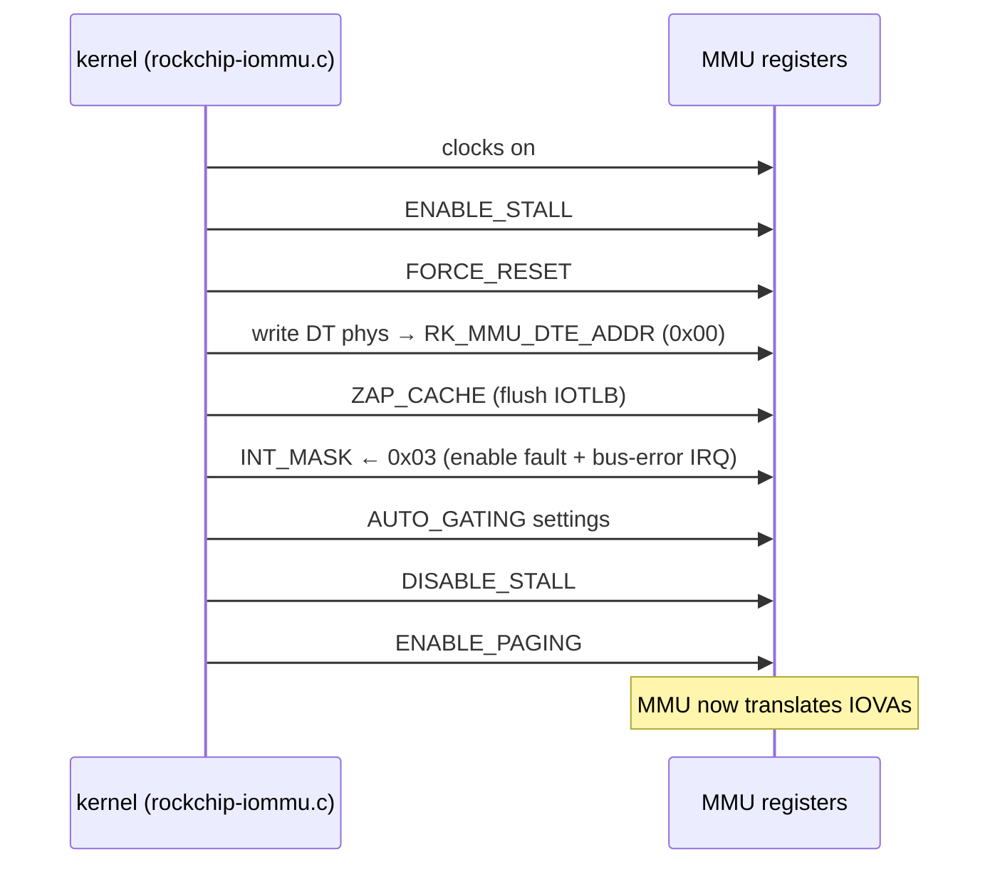

# 02 — RK3588 IOMMU hardware structure

> Scope: the Rockchip IOMMU as implemented on RK3588 (Rock 5B), provider
> `drivers/iommu/rockchip-iommu.c` (and the separate AV1D provider). Concepts are
> in [`01-iommu-primer.md`](01-iommu-primer.md); driver/BSP flow is in
> [`03-bsp-iommu-code.md`](03-bsp-iommu-code.md).
> Line numbers below are into the forward-port tree
> `../kernel/linux-6.18-rkvenc-av1-fwport` and drift with edits — treat as anchors.

## Big picture: one IOMMU per hardware block

RK3588 does **not** have a single system IOMMU. Almost every media/accelerator
block has its **own** IOMMU instance, with its own registers, its own page table,
and its own domain. That is why "an IOMMU fault" is always attributable to a
specific block, and why blocks can be reset/debugged independently.



Representative RK3588 instances (from `rk3588-base.dtsi`); each media block
below references its IOMMU via an `iommus = <&…_mmu>` phandle:

| Block | IOMMU node(s) | Reg base(s) | Notes |
|-------|---------------|-------------|-------|
| RGA3 core0 / core1 | `rga3_0_mmu` / `rga3_1_mmu` | `0xfdb60f00` / `0xfdb70f00` | two cores, two MMUs; driver shares one *domain* across them (doc 03) |
| VPU (H.264/VP9) | `vpu121_mmu` | `0xfdb50800` | |
| RKVDEC0 / RKVDEC1 | `vdec0_mmu` / `vdec1_mmu` | `0xfdc38700` / `0xfdc40700` | 2 register banks each |
| RKVENC0 / RKVENC1 | `rkvenc0_mmu` / `rkvenc1_mmu` | `0xfdbdf000` / `0xfdbef000` | 2 banks each; CCU-clustered (doc 03) |
| VEPU (HEVC/AV1 enc) | `vepu121_{0..3}_mmu` | `0xfdba0800`… | four encoder MMUs |
| Display (VOP) | `vop_mmu` | `0xfdd97e00` | 2 banks (two VOP layers) |
| **AV1 decoder** | `av1d_mmu` | `0xfdca0000` | **different silicon** — Verisilicon IOMMU, separate provider (below) |
| NPU (RKNN) | `rknn_mmu_{0,1,2}` | `0xfdab9000`… | per-NPU-core |

Standard blocks use `compatible = "rockchip,rk3588-iommu", "rockchip,rk3568-iommu"`,
which selects the **v2** page-table ops (40-bit physical addresses). The AV1
decoder is the exception — see the last section.

## The page table: two levels, 4 KiB pages

Each standard instance walks a **2-level** page table. Both levels are exactly one
4 KiB page holding 1024 × 4-byte entries:

- **DT** (Directory Table): 1024 **DTE**s. Each DTE points to a Page Table.
- **PT** (Page Table): 1024 **PTE**s. Each PTE points to a 4 KiB data page.

A **32-bit IOVA** is sliced into three fields (`rockchip-iommu.c`, the
`rk_iova_dte_index` / `rk_iova_pte_index` / `rk_iova_page_offset` helpers):

```
IOVA[31:0]
 ┌──────────── 31:22 ────────────┬──────── 21:12 ────────┬──── 11:0 ────┐
 │  DTE index (0..1023)          │  PTE index (0..1023)  │ page offset  │
 └───────────────────────────────┴───────────────────────┴──────────────┘
     >>22 & 0x3ff                     >>12 & 0x3ff             & 0xfff
```

### Walk algorithm



Each level decodes 10 IOVA bits (2¹⁰ = 1024 entries), so a full walk resolves
20 bits of page number + 12 bits of offset = the 32-bit IOVA.

### Entry bit layouts

**v1** (RK3288-era; shown for contrast) — 32-bit physical addresses:

| Entry | Bits | Meaning |
|-------|------|---------|
| DTE | 31:12 | PT physical address (4 KiB aligned) |
| DTE | 0 | valid (`RK_DTE_PT_VALID`) |
| PTE | 31:12 | page physical address |
| PTE | 8:3 | cache attributes (read/write allocate, write buffer, override) |
| PTE | 2 | writable (`RK_PTE_PAGE_WRITABLE`) |
| PTE | 1 | readable (`RK_PTE_PAGE_READABLE`) |
| PTE | 0 | valid (`RK_PTE_PAGE_VALID`) |

**v2** (RK3568 / **RK3588**) — carries **40-bit** physical addresses by packing
the high address bits into the low nibbles of the entry:

| Entry | Bits | Meaning |
|-------|------|---------|
| DTE/PTE | 31:12 | physical address bits 31:12 |
| DTE/PTE | 11:8 | physical address bits 35:32 |
| DTE/PTE | 7:4 | physical address bits 39:36 |
| PTE | 2 | writable |
| PTE | 1 | readable |
| DTE/PTE | 0 | valid |

Construction/extraction live in `rk_mk_dte_v2` / `rk_mk_pte_v2` /
`rk_dte_pt_address_v2`.

### The critical asymmetry: 32-bit IOVA in, 40-bit physical out

The **IOVA space is 32 bits** (the aperture is `[0x00000000, 0xFFFFFFFF]`, forced;
see `rk_iommu_domain_alloc_paging`). The **physical output is up to 40 bits** on
v2. So the IOMMU lets a block with a 32-bit device address reach RAM above 4 GiB —
but every IOVA the allocator hands out must still fit in 32 bits, and hardware
that does base-plus-offset arithmetic in 32-bit registers can **wrap** if a
mapping lands at the very top of the aperture. That is precisely the RK3588 RGA
wrap bug the forward-port guards against (doc 03 + the finding).

## Register map (per MMU base, 32-bit registers)

| Register | Offset | Purpose |
|----------|--------|---------|
| `RK_MMU_DTE_ADDR` | `0x00` | physical address of the Directory Table |
| `RK_MMU_STATUS` | `0x04` | status flags (see below) |
| `RK_MMU_COMMAND` | `0x08` | write a command opcode (see below) |
| `RK_MMU_PAGE_FAULT_ADDR` | `0x0C` | IOVA of the most recent fault |
| `RK_MMU_ZAP_ONE_LINE` | `0x10` | invalidate one IOTLB line (write the IOVA) |
| `RK_MMU_INT_RAWSTAT` | `0x14` | raw IRQ status (pre-mask) |
| `RK_MMU_INT_CLEAR` | `0x18` | acknowledge / re-arm IRQ |
| `RK_MMU_INT_MASK` | `0x1C` | IRQ enable mask |
| `RK_MMU_INT_STATUS` | `0x20` | IRQ status (post-mask) |
| `RK_MMU_AUTO_GATING` | `0x24` | clock auto-gating control |

**STATUS bits** (`0x04`): bit0 paging enabled · bit1 page-fault active · bit2
stall active · bit3 idle · bit4 replay-buffer empty · **bit5 last fault was a
write** (else read).

**COMMAND opcodes** (`0x08`):

| Opcode | Value | Effect |
|--------|-------|--------|
| `ENABLE_PAGING` | 0 | start translating IOVAs |
| `DISABLE_PAGING` | 1 | bypass (device sees physical) |
| `ENABLE_STALL` | 2 | pause so the page table can be edited atomically |
| `DISABLE_STALL` | 3 | resume after a stall |
| `ZAP_CACHE` | 4 | invalidate the whole IOTLB |
| `PAGE_FAULT_DONE` | 5 | clear the current fault and resume |
| `FORCE_RESET` | 6 | reset all MMU registers |

**IRQ bits** (`RK_MMU_INT_*`): bit0 `PAGE_FAULT` (`0x01`), bit1 `BUS_ERROR`
(`0x02`), mask `0x03`.

## Enable / attach sequence

When a domain is attached to a device (`rk_iommu_enable`), for each MMU base:



## Fault mechanism

On an access to an unmapped or permission-violating IOVA, the MMU raises its IRQ.
`rk_iommu_irq()`:

1. reads `INT_STATUS` (`0x20`); if `PAGE_FAULT`,
2. reads the offending IOVA from `PAGE_FAULT_ADDR` (`0x0C`) and the R/W direction
   from `STATUS` bit5, and logs the decoded DTE/PTE indices,
3. flags `BUS_ERROR` too if bit1 is set,
4. invokes the registered fault handler (`rockchip_iommu_set_fault_handler`), then
   `report_iommu_fault()` if unhandled,
5. issues `ZAP_CACHE` then `PAGE_FAULT_DONE` (opcodes 4, 5) and writes
   `INT_CLEAR` to acknowledge.

This is the `INT[0x2]`-style signature you see in RGA logs: the device walked off
the end of what the driver *thought* was one contiguous mapping, and the MMU
faulted at an IOVA a few KiB past the programmed base (see the finding).

## Domain / software model (provider side)

`rk_iommu_ops` registers:

- `.identity_domain` — a passthrough (IOVA == phys) domain for bypass,
- `.domain_alloc_paging` — allocates a translating domain (a DT page, DMA-mapped),
- `.probe_device` / `.release_device` / `.device_group`
  (`generic_single_device_group` → one device per group on these blocks),
- `.of_xlate` — resolves the `iommus = <&…>` DT phandle,
- default domain ops: `.attach_dev`, `.map_pages`, `.unmap_pages`,
  `.flush_iotlb_all`, `.iova_to_phys`.

`rk_iommu_probe_device()` also does the one line that matters most for media
clients:

```c
/* let the DMA layer merge the full 32-bit aperture into one segment */
dma_set_max_seg_size(dev, DMA_BIT_MASK(32));
```

That is the "restore large DMA segment support" contract — necessary for
`dma_map_sg()` to *be allowed* to return a single contiguous IOVA. (Necessary,
but on this platform not sufficient for scattered userptr buffers — doc 03 and the
finding explain why.)

## The AV1 decoder is a different animal

The AV1D block (`0xfdca0000`) is **not** a Rockchip MMU — it's a Verisilicon
IOMMU, handled by a **separate provider** (`rockchip-iommu-av1d.c`,
`compatible = "rockchip,rk3588-av1-iommu", "verisilicon,iommu-1.2"`). Differences
worth knowing:

- a single large register bank (`0x600`) with its own map: `…_AHB_TBL_ARRAY_BASE_L/H`
  (page-table base), `…_EN_BASE`, `…_FLUSH_BASE`, `…_PAGE_FAULT_ADDR`,
  `…_CONFIG0/1` (with an `OUT_OF_BOUND` bit);
- an **enable/flush** model rather than the stall/paging COMMAND opcodes;
- 64-bit page-table entries (PTA) with 40-bit addressing and write-only
  permission tracking.

Practical upshot for the forward-port: keep mainline `rockchip-iommu.c` as the
base provider and keep the **AV1 VSI IOMMU separate** — do not try to unify them.
This is the guidance recorded in
[`../../../kernel-versions/bsp/06-memory-dmabuf-cma-iommu.md`](../../../kernel-versions/bsp/06-memory-dmabuf-cma-iommu.md).

Next: [`03-bsp-iommu-code.md`](03-bsp-iommu-code.md) — how the RGA and MPP drivers
actually drive all of this to get a buffer in front of hardware.
