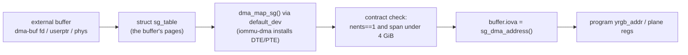
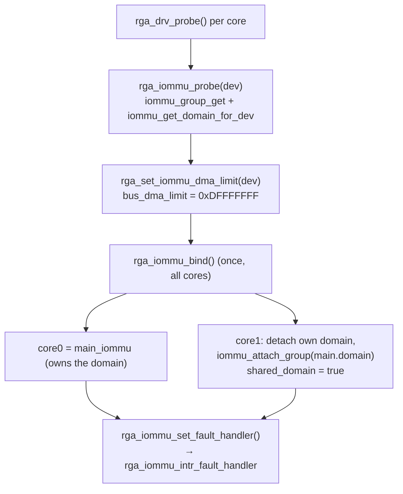
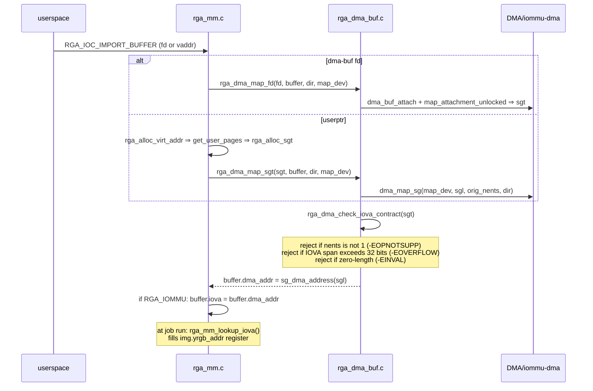
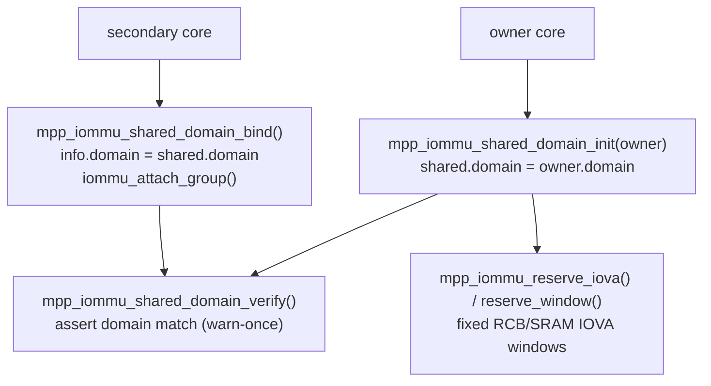

# 03 — What the BSP driver code does with the IOMMU

> Scope: how the Rockchip **RGA** and **MPP** (rkvdec2 / rkvenc2) drivers drive
> the RK3588 IOMMU to put a buffer in front of hardware. Concepts:
> [`01-iommu-primer.md`](01-iommu-primer.md); hardware:
> [`02-rk3588-iommu-hardware.md`](02-rk3588-iommu-hardware.md).
> Code: `../kernel/linux-6.18-rkvenc-av1-fwport/drivers/video/rockchip/{rga3,mpp}/`
> and the provider `drivers/iommu/rockchip-iommu.c`. Function names are stable
> anchors; line numbers drift.

## The driver's job in one picture

The hardware wants **one base IOVA + a length** per image plane. The driver's
whole IOMMU responsibility is to turn a userspace buffer (a dma-buf fd, a raw
pointer, or a physical address) into that single `(iova, size)` pair, and to hand
the pages to an IOMMU domain the block is attached to.



Everything below is variations on this spine.

## Two memory models: internal MMU (RGA2) vs external IOMMU (RGA3)

Rockchip blocks come in three flavours, selected per scheduler by
`scheduler->data->mmu` (set from the hardware version string in
`rga_drv_probe()`):

| `->mmu` | Blocks | How scattered pages are handled |
|---------|--------|---------------------------------|
| `RGA_IOMMU` | RGA3 cores | **External** rockchip-iommu translates. Needs **one contiguous IOVA** (`dma_map_sg` must return `nents==1`). |
| `RGA_MMU` | RGA2 core | **Internal** page-table MMU. The driver builds a page table from the sg_table (`rga_mm_set_mmu_base` / `rga_mm_sgt_to_page_table` in `rga_mm.c`) that the RGA2 hardware walks itself — so scattered pages are fine, but the buffer must be **under 4 GiB**. |
| `RGA_NONE_MMU` | legacy | No MMU: requires physically-contiguous memory. |

This is the single most important structural fact for RK3588: **RGA3 cannot walk
a scatter list itself** — it relies on the external IOMMU to have already folded
the pages into one contiguous IOVA. RGA2 *can*. That difference is why a scattered
userptr buffer may work on RGA2 and be rejected on RGA3 (see the limitation
section and the finding).

RGA userptr-IOMMU fallback bring-up exposed one easy log-reading trap: RGA3 command dumps can print
`mmu: win0 = 00 win1 = 00 wr = 00`. Those are the internal RGA3 command MMU
fields and are expected to be zero when RGA3 uses the external RK_IOMMU. They are
not evidence that the job bypassed the IOMMU or used physical addresses. The
debugfs hardware line (`mmu: RK_IOMMU`) identifies the external model, and the
`handle[...] iova` / `dma_addr` lines show the device-visible IOVA values that
the command path programs.

## RGA: IOMMU setup and the shared domain

Each RGA3 core has its own IOMMU instance (doc 02), but the driver makes them
**share one domain** so an IOVA means the same thing on every core:



- `rga_iommu_probe()` (`rga_iommu.c`) grabs the device's group + default domain.
- `rga_iommu_bind()` (`rga_iommu.c`) elects the first RGA3 core as `main_iommu`
  and re-attaches the others to its domain via `iommu_attach_group()`.
- The fault handler `rga_iommu_intr_fault_handler()` marks the job
  `RGA_JOB_STATE_INTR_ERR`, soft-resets the core, and classifies bus-error vs
  read/write fault.

`map_dev` for all DMA mapping is `scheduler->iommu_info->default_dev` (the IOMMU
device), *not* the RGA platform device — a consequence of the upstream
`iommu/rockchip: Use IOMMU device for dma mapping operations` change.

## RGA: buffer import flow (the important path)

Three entry paths converge on the same contract. For **dma-buf fd** and
**userptr** (the two common cases):



The contract lives in `rga_dma_check_iova_contract()` (`rga_dma_buf.c`):

```c
if (sgt->nents != 1)                 return -EOPNOTSUPP;   // must be ONE segment
dma_addr = sg_dma_address(sgt->sgl);
dma_end  = dma_addr + sg_dma_len(sgt->sgl) - 1;
if (dma_addr > U32_MAX || dma_end > U32_MAX) return -EOVERFLOW;  // must fit 32 bits
```

Then `buffer->iova = buffer->dma_addr` (`rga_mm.c`), and at job time
`rga_mm_lookup_iova()` returns `iova + offset` into the hardware's `yrgb_addr` /
plane registers. The hardware reads `size` bytes linearly from that one base — so
if the mapping were multi-segment, RGA3 would run off segment 0 into unmapped
IOVA and the MMU would fault (doc 02 fault section).

## MPP: per-core IOMMU and the CCU shared domain

MPP (the rkvdec2/rkvenc2 service) uses the same primitives, plus a **cluster**
concept. A decoder/encoder cluster (the "CCU", Central Control Unit) has several
cores that must see the **same** IOVAs, so they share one domain — analogous to
RGA's shared domain but refcounted and with fixed-address windows.



Key MPP pieces (`mpp_iommu.c`):

- `mpp_iommu_probe()` — per-core group/domain, IRQ, shared-DMA detection.
- `mpp_iommu_shared_domain_{init,bind,verify,unbind}()` — the CCU domain sharing.
- `mpp_dma_import_fd()` — dma-buf import with an fd cache (refcounted reuse),
  ending in the **same** `mpp_dma_check_iova_contract()` (nents==1, 32-bit span).
- `mpp_iommu_reserve_iova()` / `…_reserve_window()` — reserve **fixed** IOVA
  windows (RCB / SRAM scratch) inside the shared domain so cluster cores agree on
  those addresses and don't collide. See
  [`mpp-ccu-iommu-plan.md`](mpp-ccu-iommu-plan.md) for the full CCU plan.
- Fault handler `mpp_iommu_handle()` — masks the IRQ, dumps task/device state.

## Forward-port hardening (RK3588 6.18)

Three changes make the implicit vendor contract explicit and safe on the modern
generic DMA/IOMMU stack. All three are load-bearing together:

| Fix | Where | What it does |
|-----|-------|--------------|
| **Large DMA segment** | `rockchip-iommu.c` `rk_iommu_probe_device` — `dma_set_max_seg_size(dev, DMA_BIT_MASK(32))` (commit `13afe70c8271`) | *Allows* `dma_map_sg` to return one segment spanning the whole 32-bit aperture. Necessary precondition. |
| **32-bit wrap guard** | RGA `rga_set_iommu_dma_limit` → `bus_dma_limit = RGA_IOMMU_DMA_LIMIT` (`0xDFFFFFFF`, commit `6b9dba7abcd0`) | Keeps the IOVA allocator ≥ 512 MiB below `0xFFFFFFFF` so base+plane-offset arithmetic in 32-bit RGA registers can't wrap into low, unmapped IOVA. |
| **Fail-closed contract** | `rga_dma_check_iova_contract` / `mpp_dma_check_iova_contract` (commit `590c9ef297ce`) | Rejects any mapping that isn't exactly one nonzero, non-wrapping 32-bit segment — turning a would-be MMU fault into a clean `-EOPNOTSUPP`/`-EOVERFLOW` at import time. |

Full root-cause, fault addresses, and the runtime validation are in
[`../../../findings/2026-07-04-rga3-im2d-error-irq.md`](../../../findings/2026-07-04-rga3-im2d-error-irq.md).

RGA userptr-IOMMU fallback is the follow-up for driver-owned scattered userptr sg-tables that fail
that contract after the normal DMA API map. It allocates one guard-banded IOVA
span from the translated RGA DMA domain cookie, maps a page-aligned copy of the
physical sg-table with `iommu_map_sg()`, and keeps cache maintenance on the
original physical sg-table. The driver gets the DMA domain allocator through the
exported `iommu_dma_get_iova_domain()` helper in `drivers/iommu/dma-iommu.c`
instead of casting the opaque cookie through a local shadow struct. Dma-buf
imports remain fail-closed.

## Scattered userptr on RGA3 and RGA userptr-IOMMU fallback

The contract requires `nents == 1`, and on this platform `dma_map_sg()` for the
RGA3 `map_dev` returns `nents == orig_nents` (no coalescing) — so a physically
**scattered** userptr buffer (e.g. `orig_nents == 341` for a fragmented 3.6 MB
malloc) is rejected, while a buffer that happens to land physically contiguous
passes. This was **by design** before RGA userptr-IOMMU fallback: fail-closed beats faulting, but it
made raw-malloc `virt_addr` imports flaky by allocation luck. Notably:

- raising `max_seg_size` does **not** help — it is already `DMA_BIT_MASK(32)` and
  `nents == orig_nents` proves no merge is even attempted (the device isn't on the
  coalescing iommu-dma path). Proven in the finding.
- real pipelines feed RGA **dma-buf** (CMA-backed → `orig_nents == 1`), which
  always passes; only raw-malloc `virt_addr` imports hit this.
- RGA userptr-IOMMU fallback is the driver-owned `iommu_map_sg()` fix for RGA3 userptr, not a config
  tweak. The forward-port RGA-userptr-IOMMU-only kernel passed repeated RK3588 behavioral
  smoke runs for `rga_copy_demo`, `rga_resize_rect_demo`, and
  `rga_transform_rotate_demo`; direct forward-port fallback attribution still
  needs a temporary positive breadcrumb/counter in the RGA userptr-IOMMU fallback helper. The
  rewrite now exposes `rk_rga_rewrite/route_b` counters for the equivalent
  booted validation, but that run is still pending.
- without RGA userptr-IOMMU fallback, route scattered userptr to the RGA2 core (`RGA_MMU`), whose
  internal page-table MMU handles scatter.

## Source map

| File | Responsibility |
|------|----------------|
| `drivers/iommu/rockchip-iommu.c` | The provider: page tables, registers, TLB, faults, `probe_device` (`max_seg_size`). |
| `drivers/iommu/rockchip-iommu-av1d.c` | Separate Verisilicon IOMMU for the AV1 decoder (doc 02). |
| `rga3/rga_iommu.c` | RGA IOMMU probe/attach/bind, shared domain, fault handler. |
| `rga3/rga_mm.c` | RGA memory manager: userptr/dma-buf/phys import, sgt build, RGA2 internal page table, `buffer->iova`. |
| `rga3/rga_dma_buf.c` | `dma_map_sg` / dma-buf attach + the fail-closed IOVA contract. |
| `rga3/rga_drv.c` | Probe, `mmu` model selection, `bus_dma_limit` wrap guard. |
| `mpp/mpp_iommu.c` | MPP per-core IOMMU, CCU shared domain, fixed windows, contract, faults. |

## Related docs

- [`mpp-ccu-iommu-plan.md`](mpp-ccu-iommu-plan.md) — the net-new CCU MMU/IOMMU
  shared-domain plan.
- [`rewrite-hard-ccu-finding.md`](rewrite-hard-ccu-finding.md) — the RKVDEC2
  SOFT/HARD CCU finding.
- [`../../../findings/2026-07-04-rga3-im2d-error-irq.md`](../../../findings/2026-07-04-rga3-im2d-error-irq.md)
  — the RGA3 MMU-fault root-cause + the scattered-buffer limitation.
- [`../../patches/rga-userptr-iommu/architecture.md`](../../patches/rga-userptr-iommu/architecture.md)
  — RGA userptr-IOMMU fallback architecture, IOMMU-domain allocator model, and runtime evidence
  boundary.
