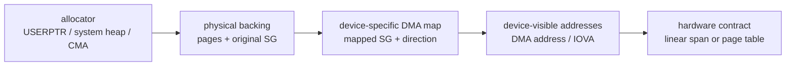

# 04 — DMA mapping contracts across kernel versions

> Scope: the DMA, dma-buf, SWIOTLB, and IOMMU assumptions that changed between
> the Rockchip 5.10/6.1 BSP, the RK3588 6.18 forward port, and the clean-room
> rewrite. Read the vendor-neutral concepts in
> [`01-iommu-primer.md`](01-iommu-primer.md), the RK3588 hardware in
> [`02-rk3588-iommu-hardware.md`](02-rk3588-iommu-hardware.md), and the RGA/MPP
> flow in [`03-bsp-iommu-code.md`](03-bsp-iommu-code.md) first.
>
> Source anchors: forward port `rk3588-video-6.18@7d53bc7a3adc`, rewrite 6.18
> `rk3588-rewrite-6.18@571e261b26f79`, and rewrite mainline
> `rk3588-rewrite-mainline@5db5ddf046825`. The latest rewrite RGA2 changes are
> compile-verified but not yet boot-verified; that boundary is preserved below.

## The rule that prevents most porting mistakes

An allocation, a DMA mapping, and a device-programmable address are three
different objects. Success at one layer proves nothing about the next.

In particular, a dma-buf fd does not promise physical contiguity, a large free
SWIOTLB pool does not promise that one large SG entry can be bounced, and an
IOMMU domain does not promise that `dma_map_sg()` will report one contiguous DMA
segment on every kernel version.



Each arrow can change the geometry, address range, ownership, and cache state of
the buffer. A forward port must revalidate every arrow against the target
kernel's DMA implementation rather than inherit the BSP's final address and
assume the intermediate contract stayed the same.

## Keep the address layers separate

| Layer | Example | Owner | What it proves |
|---|---|---|---|
| CPU virtual address | `0xffff...` kernel VA or a userspace pointer | CPU MMU / process | The CPU can address the bytes. It says nothing about DMA reachability or physical contiguity. |
| Physical backing | pages and `orig_nents` in an SG table | page allocator or dma-buf exporter | Where the bytes live in RAM. Higher-order pages may create a 1 MiB physical SG entry; scattered pages may create hundreds of entries. |
| DMA-mapped SG | `sg_dma_address()`, `sg_dma_len()`, mapped `nents` | DMA API for one device and direction | What that device may DMA to for the lifetime of this mapping. It may be direct, IOMMU-translated, or SWIOTLB-bounced. |
| External-IOMMU IOVA | one 32-bit address range on RK3588 media IOMMUs | generic IOMMU-DMA allocator + provider | The IOMMU can translate that IOVA range to physical pages. It does not by itself prove the returned DMA SG is one span. |
| RGA2 internal-MMU table | one 32-bit DMA page address per 4 KiB RGA page | RGA driver | RGA2 can walk discontinuous device-visible pages, but each entry and boundary must satisfy its page-table format. |

Never substitute `virt_to_phys()`, `sg_phys()`, or the first original SG address
for a DMA address after mapping. The DMA API is allowed to return a different
address because of an IOMMU, a bus offset, or a bounce buffer.

## RGA3 and RGA2 need different mapped shapes

The two RK3588 RGA generations expose different consumers of the DMA result:

| Core | Translation model | What the command stream consumes | Safe mapped shape |
|---|---|---|---|
| RGA3 | External Rockchip IOMMU | One base address per image plane | One byte-contiguous, non-wrapping IOVA span covering the plane. Physical pages may be scattered behind it. |
| RGA2 | Internal RGA MMU | A driver-built table of 32-bit page addresses | Multiple DMA segments are acceptable if every discontinuity occurs on a 4 KiB boundary and every emitted page is addressable by RGA2. |

That distinction changes the correct fallback:

- RGA3 can use a normal coalesced DMA mapping or, for driver-owned USERPTR
  pages, a driver-owned contiguous IOVA mapping.
- RGA2 can consume a page-granular DMA SG through its internal table. Pages
  above 4 GiB first need device-reachable DMA addresses, commonly SWIOTLB
  bounce addresses below 4 GiB.
- A DMA-BUF that cannot be mapped on RGA2 but whose operation is valid on RGA3
  should be rerouted to RGA3. Changing the global exporter for this one
  importer is the wrong layer.

## `orig_nents`, mapped `nents`, and adjacency

An SG table has two geometries:

- `orig_nents` describes the backing physical runs before DMA mapping.
- mapped `nents`, `sg_dma_address()`, and `sg_dma_len()` describe what the
  selected device may use after mapping.

`orig_nents > 1` is harmless when an external IOMMU maps those pages into one
contiguous IOVA. Conversely, `nents > 1` is not automatically unsafe for an
RGA2 internal page table, and it is not automatically safe for RGA3 even when
the driver can sum all lengths. The mapped entries must be walked and their
actual adjacency, bounds, and coverage validated against the hardware model.

The BSP RGA3 path stores the first DMA address and sums the lengths. That works
on the studied 5.10/6.1 stack because its intended path usually allocates one
IOVA span for the whole list. It is not a portable DMA-API contract. Newer
IOMMU-DMA code can select an SG SWIOTLB path which maps entries independently;
measured forward-port USERPTR mappings included gaps and descending IOVAs. The
forward port and rewrite therefore validate the mapped result and fail closed
or use an ownership-correct fallback.

## The DMA parameters are independent controls

These settings are often mentioned together but solve different problems:

| Control | Question it answers | What it does not guarantee |
|---|---|---|
| streaming DMA mask | What DMA addresses can this device issue? | Physical placement, contiguity, or that a map will avoid SWIOTLB. |
| coherent DMA mask | Where may coherent allocations such as command/page-table memory live? | Streaming-buffer reach or cache correctness for mapped user pages. |
| `bus_dma_limit` / IOMMU aperture | How high may the DMA or IOVA allocator place mappings? | A contiguous mapping or freedom from 32-bit base-plus-offset wrap unless the guard includes the hardware's arithmetic. |
| maximum segment size | How large a reported DMA segment may be? | The maximum size of one SWIOTLB bounce allocation or that separate SG entries will be merged. |
| minimum alignment mask | Which low address bits must a DMA mapping preserve? | Physical allocation alignment. It constrains the bounce address chosen for an existing buffer. |
| `dma_max_mapping_size()` | What is the largest single mapping the active DMA backend advertises? | Total pool capacity or success for an exporter-owned SG entry larger than that value. |

Two examples show why these cannot be collapsed into one "DMA limit":

1. `dma_set_max_seg_size(dev, DMA_BIT_MASK(32))` lets a Rockchip IOMMU mapping
   be reported as one large segment, but it cannot make a 1 MiB SWIOTLB bounce
   allocation fit a 256 KiB per-map ceiling.
2. `dma_set_min_align_mask(dev, PAGE_SIZE - 1)` preserves a USERPTR page offset
   in an RGA2 bounce mapping, but it does not force the system heap to allocate
   page-order-zero chunks.

## SWIOTLB has a pool limit and a separate per-map limit

SWIOTLB is a below-address-limit staging area. On a 32-bit RGA2 mapping of a
page above 4 GiB, the DMA API may allocate low bounce storage, copy source data
into it, let RGA2 DMA against the bounce address, and copy written data back on
unmap or sync according to the mapping direction.

There are two independent capacities:

- the total pool limits how many concurrent bounce bytes can be live; and
- `IO_TLB_SEGSIZE * IO_TLB_SIZE` limits one allocation. In the measured 6.18
  configuration that is 128 × 2 KiB = 256 KiB before alignment reservation.

This explains the apparently contradictory log:

```text
swiotlb buffer is full (sz: 1048576 bytes), total 32768 slots, used 4
```

The pool is almost empty, but the requested 1 MiB mapping can never fit in one
256 KiB SWIOTLB segment. Increasing the total pool would not make that SG entry
mappable.

### Why the system heap may legitimately export 1 MiB

The system heap optimizes a system-wide allocator, not one 32-bit device. It may
obtain an order-8, physically contiguous 1 MiB chunk and preserve that chunk in
the attachment SG table. That allocation is valid for CPUs and for devices such
as RGA3 that can map it through an external IOMMU. The incompatibility appears
only when the exporter maps the attachment for the 32-bit, non-IOMMU RGA2
device and the chunk lies outside its reach.

The in-tree system-heap exporter duplicates its SG geometry for the attachment
and calls the DMA API. The RGA importer does not own that exporter mapping and
cannot safely split or remap its backing pages behind the exporter's back. The
rewrite therefore treats exact RGA2 attachment `-EIO` as a per-task hardware
incompatibility and revalidates the operation on RGA3. RGA2-only work retains
the original error.

### Why USERPTR is fixable inside the driver

The driver owns pinned USERPTR pages and the SG table it constructs. It can
therefore split that SG at the active device's advertised
`dma_max_mapping_size()`. The rewrite uses
`sg_alloc_table_from_pages_segment()` for this purpose.

An unaligned first USERPTR segment is shorter than the nominal maximum by its
page offset. Without an RGA2 minimum-alignment mask, SWIOTLB may return a
page-aligned bounce DMA address and lose the original offset. The first mapped
run then ends in the middle of an RGA2 page; a following non-contiguous run
cannot be represented by changing page-table entries only at 4 KiB boundaries.

Setting `dma_set_min_align_mask(dev, PAGE_SIZE - 1)` on RGA2 tells SWIOTLB to
preserve the low page-offset bits. The same setting reduces this kernel's
reported maximum mapping size from 256 KiB to 252 KiB, which the SG splitter
then consumes. The mapping becomes a sequence that RGA2's page-table builder
can represent. Rockchip's newer multi-RGA driver uses the same page-granular
minimum-alignment rule.

## Ownership decides which fallback is legal

| Buffer type | Mapping owner | Legal recovery after an unsuitable normal map |
|---|---|---|
| Driver-owned USERPTR | RGA driver owns pinned pages, SG construction, cache maintenance, and unpin | Split to the device maximum, retry DMA mapping, or build a driver-owned contiguous IOVA with explicit map/unmap and cache ownership. |
| DMA-BUF | Exporter owns backing and supplies a device-specific attachment mapping | Validate the attachment, unmap/detach on failure, choose another compatible core, use a compatible heap by explicit policy, or return an error. Do not privately remap `sg_page()` behind the exporter. |
| RGA2 internal-MMU page table | RGA driver | Allocate/map the metadata with the RGA2 device, program its DMA address, sync it in the correct direction, and unmap through the same API. |

Mapping direction is part of that ownership contract. A source-only buffer can
use `DMA_TO_DEVICE`. A destination may be read for blending or overlap handling
and must preserve device writes, so the maintained RGA paths use a
bidirectional mapping where required. The forward-port RGA2 bounce work proved
this with a content-exact differential matrix: mapping a destination only as
`DMA_TO_DEVICE` discarded the device output because SWIOTLB had no copy-back
obligation.

The same rule applies to cache maintenance. Address correctness with stale
cache lines still produces corrupt or zero pixels. Map, sync, unmap, and release
must use the same device, direction, lifetime, and SG ownership model.

## What changed from BSP to forward port and rewrite

| Stack | Mapping assumption | Hardened behavior |
|---|---|---|
| Rockchip 5.10/6.1 BSP | RGA3 relies on a pinned combination of whole-list IOMMU-DMA allocation and a 4 GiB maximum segment; the driver consumes first address plus total length without validating adjacency. BSP RGA2 builds an internal page table from below-4-GiB pages. | Works for the intended stack, but the contract is implicit and tied to those DMA/IOMMU implementations. |
| RK3588 6.18 forward port | Generic IOMMU-DMA and SWIOTLB behavior differs; RGA3 USERPTR mappings were measured with real IOVA gaps and wrap. High RGA2 pages require device-specific bounce mappings. | Restores large-segment support, guards the top of the 32-bit IOVA aperture, validates mapped geometry, gives driver-owned USERPTR a contiguous-IOVA fallback, maps RGA2 data/page tables through the DMA API, preserves page offsets, and fails unsupported DMA-BUF mappings cleanly. |
| Clean-room rewrite | Per-core mapping makes the selected RGA2/RGA3 device explicit and validates the result instead of inheriting the BSP shortcut. | RGA3 has driver-owned USERPTR Route B; RGA2 has an internal page-table path over selected-device DMA entries; USERPTR SG construction consumes `dma_max_mapping_size()` and preserves bounce offsets; exact RGA2 DMA-BUF map failure can reroute compatible work to RGA3. The newest RGA2 behavior is compile-verified and awaits an exact-tip board boot. |

The lesson is broader than RGA: an unchanged client driver may become wrong
when generic DMA/IOMMU code changes which mapping path is selected, how SG
entries are finalized, which low bits a bounce preserves, or how IOVA space is
allocated. A source-only forward port is not enough; the mapped geometry is an
observable runtime ABI between the kernel and the device.

## How other drivers avoid this class of problem

Linux drivers normally choose one or more explicit strategies:

1. **Constrain allocation.** Use coherent DMA allocation, CMA, a DMA32 heap, or
   another pool whose placement and geometry meet the device's limits. This is
   common for fixed-function hardware without scatter support.
2. **Use an external IOMMU.** Let the DMA API present scattered physical pages
   as a contiguous IOVA, then validate the mapped result the hardware consumes.
3. **Consume scatter in hardware.** Give the device a descriptor list or, like
   RGA2, build its internal page table from device-visible DMA page addresses.
4. **Stage or bounce.** Copy through reachable memory, preserving direction and
   copy-back semantics. This is a correctness fallback, often not a performant
   video path.
5. **Route or reject.** Select a compatible engine after a clean pre-start map
   failure, or return an explicit error when the requested engine cannot consume
   that exporter mapping.

Changing a global dma-buf heap to accommodate one importer is usually avoided
because it alters allocation behavior for every other device. The allocator may
reasonably optimize for CPU efficiency, TLB pressure, and broad IOMMU-capable
consumers. The importing driver is where the selected device's DMA constraints
become known.

## Failure signatures by layer

| Signature | Failure layer | First evidence to collect |
|---|---|---|
| heap allocation fails | allocator / memory pressure | heap name, requested size, CMA and page-allocation state |
| `dma_buf_map_attachment*()` or `dma_map_sgtable()` returns `-EIO`, possibly with `swiotlb buffer is full` | device-specific DMA mapping before hardware start | selected device/core, DMA mask, SG lengths, physical reach, `dma_max_mapping_size()`, SWIOTLB per-map and pool use |
| driver returns `-EOPNOTSUPP` for multiple or wrapping DMA segments | fail-closed hardware-contract validation | `orig_nents`, mapped `nents`, every address/length, adjacency, required byte coverage |
| IOMMU page fault after start | programmed address or mapping lifetime | faulting IOVA/direction, programmed bases, domain/core, map/unmap lifetime, recovery counters |
| operation completes with stale zeros or partial corruption | direction, copy-back, cache, or plane-layout contract | mapping direction, sync calls, aliasing, CPU-access brackets, content-exact source/destination matrix |
| DMA-debug warns about syncing an unmapped address | DMA ownership error | allocation API, mapping API, owning device, stored DMA handle, teardown symmetry |

Do not classify a pre-start SWIOTLB map failure as an IOMMU fault. No hardware
access occurred and the external IOMMU fault machinery cannot explain it.

## Forward-port and rewrite review checklist

For every buffer path and every selectable core:

1. Identify the exact mapping device, its streaming/coherent masks, DMA
   coherence, `bus_dma_limit`, IOMMU domain type, aperture, maximum segment, and
   minimum alignment settings.
2. Identify who owns the backing and SG table: driver, dma-buf exporter, VB2,
   DRM, or another subsystem.
3. Record `orig_nents`, mapped `nents`, each DMA address/length, total required
   coverage, adjacency, and highest programmed address. Do not infer geometry
   from heap name.
4. State what hardware consumes: one base-plus-length, a descriptor list, an
   external IOVA, or an internal page table.
5. Validate the actual mapped shape before programming registers. Include
   overflow and base-plus-plane-offset arithmetic, not only the first address.
6. Keep map/sync/unmap device, direction, attributes, and lifetime symmetric.
7. Make fallbacks ownership-specific. USERPTR remapping and DMA-BUF attachment
   remapping are not interchangeable.
8. Exercise fragmented, physically contiguous, high-memory, unaligned-head,
   source-only, destination-only, bidirectional, and forced-core cases.
9. Distinguish pre-start mapping failures, validation rejects, started hardware
   faults, and successful-but-corrupt copy-back with separate counters/events.
10. Re-run the matrix after a kernel-version change even when the client source
    is byte-identical.

## Current RGA verification boundary

The 2026-08-05 rewrite fixes at `571e261b26f79` / `5db5ddf046825` pass strict
checkpatch, source-identity audit, and the warning-fatal clean-archive build.
They are not yet runtime-proven. The next exact-tip 6.18 boot must show:

- the plain-system-heap demo succeeds after matched RGA2 DMA-BUF map-failure and
  RGA3 reroute counters;
- RGA2 USERPTR map and internal-MMU preparation failure counters remain zero;
- exact KUnit/MPP contracts still pass; and
- no new IOMMU fault, timeout, DMA-debug, or content mismatch appears.

One initial rate-limited SWIOTLB warning may remain when the exporter performs
the failed RGA2 probe; the generic DMA-BUF attachment API has no importer-side
attribute for suppressing that warning. Functional success is the subsequent
validated RGA3 execution, not the absence of the diagnostic from the rejected
probe.

## Related evidence and source maps

- [`../../../findings/2026-08-05-rewrite-rga2-dmabuf-userptr-bounce-followup.md`](../../../findings/2026-08-05-rewrite-rga2-dmabuf-userptr-bounce-followup.md)
  — the current system-heap and USERPTR root causes, implementation, counters,
  and exact boot gate.
- [`../../../findings/2026-07-31-rga-userptr-dmabuf-multisegment-contracts.md`](../../../findings/2026-07-31-rga-userptr-dmabuf-multisegment-contracts.md)
  — source comparison of the BSP, forward port, and earlier rewrite SG
  contracts.
- [`../../../findings/2026-07-21-rga2-dma-api-ownership-and-over-4g-scope.md`](../../../findings/2026-07-21-rga2-dma-api-ownership-and-over-4g-scope.md)
  — RGA2 page-table DMA ownership, bounce direction, and content-exact
  forward-port validation.
- [`../../rga/docs/userptr-iommu.md`](../../rga/docs/userptr-iommu.md) — the
  measured RGA3 scattered-USERPTR investigation and driver-owned IOVA design.
- [`../../../kernel-versions/bsp/06-memory-dmabuf-cma-iommu.md`](../../../kernel-versions/bsp/06-memory-dmabuf-cma-iommu.md)
  — the broader BSP memory-sharing area and provider-porting policy.
