# kernel-drivers/rknpu/ — RK3588 NPU and RKNN stack

The complete Rockchip neural-processing path: offline model conversion with
RKNN-Toolkit2, board-connected debugging through `rknn_server`, native C/Python
deployment through `librknnrt`, and the BSP `drivers/rknpu` kernel driver that
owns NPU memory, scheduling, power, and hardware submission.

This project deliberately crosses the kernel/userspace boundary. The public
RKNPU ioctl is too low-level to understand without the closed RKNN runtime that
constructs it, and the runtime's memory/core/fence behavior is too easy to
misread without the kernel implementation.

Large language models use a sibling userspace stack, **RKLLM**, over the same
kernel driver — a different toolkit, model format (`.rkllm`), and runtime
(`librkllmrt.so`), documented in
[`docs/rkllm-large-language-models.md`](docs/rkllm-large-language-models.md).

## Project brief

| Field | Contents |
|---|---|
| Purpose | Explain how a source model becomes an RKNN artifact and then an RK3588 NPU job, including conversion, runtime APIs, memory, multi-core execution, ioctls, IOMMU, fences, power, and recovery. |
| Developer focus | Preserve the kernel/runtime/model compatibility tuple, understand which layer owns each transformation, and distinguish documented behavior from what remains hidden in proprietary userspace. |
| Owns | The end-to-end [`how-rknpu-works.md`](docs/how-rknpu-works.md) guide, the [`rkllm-large-language-models.md`](docs/rkllm-large-language-models.md) LLM-stack survey, this front door, and [`keywords.md`](keywords.md). |
| Depends on | A BSP kernel with `CONFIG_ROCKCHIP_RKNPU`, enabled RK3588 NPU/IOMMU DT nodes, matching RKNN Runtime/Toolkit2, and suitable render-node or `/dev/rknpu` access. |
| Code lives in | Kernel: sibling `rockchip-kernel/drivers/rknpu/`. Userspace distribution: official [`airockchip/rknn-toolkit2`](https://github.com/airockchip/rknn-toolkit2) repository (`rknn-toolkit2/`, `rknn-toolkit-lite2/`, `rknpu2/runtime/`). |
| Inspected tuple | `rockchip-kernel@b4ef083dc0c3`, RKNPU driver 0.9.8 (`20240828`), and `airockchip/rknn-toolkit2@59a913d172e7`, containing RKNN Runtime 2.3.2. |
| Current state | Architecture/source-inspected only. The repo does not yet contain an on-board RKNN inference result for the Resolute image, so support coverage C16 remains `UNASSESSED`; no dedicated dashboard track exists until runtime evidence establishes a sustained workstream. See [`../../status.md`](../../status.md) and [`../../docs/support-coverage.md`](../../docs/support-coverage.md) row C16. A forward-port of the kernel driver onto the ysp 6.18 kernel is scoped (not started) in [`../../findings/2026-07-24-rknpu-forward-port-scoping.md`](../../findings/2026-07-24-rknpu-forward-port-scoping.md). |

## Stack at a glance

```mermaid
flowchart LR
  source["PyTorch / ONNX / TensorFlow / TFLite / Caffe / Darknet"]
  toolkit["RKNN-Toolkit2<br/>configure · optimize · quantize · compile"]
  model["target-specific .rknn<br/>graph · weights · register configuration"]
  app["Application<br/>C API or RKNNLite Python"]
  runtime["librknnrt.so<br/>model/context/memory/task runtime"]
  node["DRM render node<br/>or /dev/rknpu"]
  driver["drivers/rknpu<br/>GEM/dma-buf · queue · PM · IRQ"]
  iommu["Rockchip IOMMU<br/>DDR + optional SRAM/NBUF"]
  cores["RK3588 NPU<br/>core 0 · core 1 · core 2"]

  source --> toolkit --> model --> app --> runtime --> node --> driver --> iommu --> cores
```

The kernel does not load ONNX, quantize tensors, or understand a neural graph.
It receives task descriptors and device addresses prepared by the runtime,
queues those tasks on one or more NPU cores, starts the hardware, and reports
completion.

## Read next

| Question | Document |
|---|---|
| How does everything work, end to end? | [`docs/how-rknpu-works.md`](docs/how-rknpu-works.md) |
| How do LLMs run on the NPU (RKLLM)? | [`docs/rkllm-large-language-models.md`](docs/rkllm-large-language-models.md) |
| What does each RKNN/RKNPU term mean? | [`keywords.md`](keywords.md) |
| What does the broader BSP add for GPU/NPU? | [`../../kernel-versions/bsp/07-gpu-npu-accelerators.md`](../../kernel-versions/bsp/07-gpu-npu-accelerators.md) |
| How does RKNPU quality compare with mature drivers? | [`../../findings/2026-07-16-rockchip-bsp-driver-quality.md`](../../findings/2026-07-16-rockchip-bsp-driver-quality.md#rknpu-deep-dive-capable-fixed-stack-unsafe-multi-client-abi) |
| What would forward-porting the kernel driver take? | [`../../findings/2026-07-24-rknpu-forward-port-scoping.md`](../../findings/2026-07-24-rknpu-forward-port-scoping.md) |
| Is NPU inference validated on this distro image? | [`../../docs/support-coverage.md`](../../docs/support-coverage.md) row C16 |

Project vocabulary: [`keywords.md`](keywords.md). Cross-cutting vocabulary:
[`../../glossary.md`](../../glossary.md).
