# How the RK3588 RKNPU and RKNN stack works

This is the end-to-end map from a framework model on a development machine to
completed inference on the three-core RK3588 NPU. It covers the parts that are
often documented separately: RKNN conversion, the proprietary userspace
runtime and debug server, tensor and device memory, the RKNPU ioctl ABI,
scheduling, IOMMU domains, SRAM, interrupts, power, and recovery.

The central distinction is:

> RKNN-Toolkit2 compiles a graph into target-specific NPU work, `librknnrt`
> turns that work and the application's tensors into device buffers and kernel
> submissions, and `drivers/rknpu` schedules those already-compiled tasks. The
> kernel does not compile or interpret the neural network.

## Evidence and limits

This description is pinned to the following source tuple:

| Layer | Inspected version | Evidence available |
|---|---|---|
| Kernel | [`rockchip-linux/kernel@b4ef083dc0c3`](https://github.com/rockchip-linux/kernel/tree/b4ef083dc0c3608e744deabb43dc6b781aadbe6e/drivers/rknpu), `develop-6.1` | Full source for `drivers/rknpu`, RK3588 DT, and Kconfig; driver reports 0.9.8, date `20240828`. |
| SDK | [`airockchip/rknn-toolkit2@59a913d172e7`](https://github.com/airockchip/rknn-toolkit2/tree/59a913d172e7f5ff03c9076e2ec7b1b1288ffd08) | Public API headers, examples, manuals, build files, and proprietary binaries. |
| Native runtime | 2.3.2, embedded build id `429f97ae6b@2025-04-09T09:09:27` | Exported symbols, public C header, examples, ELF metadata/dependencies, and diagnostic strings; implementation is stripped and closed. |
| Debug server | 2.3.2, embedded build id `1842325 build@2025-03-30T09:54:34` | Stripped binary, startup/Android service files, strings, and the public server-proxy description. |

The primary vendor descriptions are the pinned [RKNN SDK user guide](https://github.com/airockchip/rknn-toolkit2/blob/59a913d172e7f5ff03c9076e2ec7b1b1288ffd08/doc/02_Rockchip_RKNPU_User_Guide_RKNN_SDK_V2.3.2_EN.pdf), [Toolkit2 API reference](https://github.com/airockchip/rknn-toolkit2/blob/59a913d172e7f5ff03c9076e2ec7b1b1288ffd08/doc/03_Rockchip_RKNPU_API_Reference_RKNN_Toolkit2_V2.3.2_EN.pdf), [RKNN Runtime API reference](https://github.com/airockchip/rknn-toolkit2/blob/59a913d172e7f5ff03c9076e2ec7b1b1288ffd08/doc/04_Rockchip_RKNPU_API_Reference_RKNNRT_V2.3.2_EN.pdf), and [public C header](https://github.com/airockchip/rknn-toolkit2/blob/59a913d172e7f5ff03c9076e2ec7b1b1288ffd08/rknpu2/runtime/Linux/librknn_api/include/rknn_api.h).

No proprietary component was decompiled. Statements about its internals are
limited to public APIs, vendor documentation, example behavior, dynamic ELF
metadata, exported symbols, printable diagnostics, and the exact kernel ABI it
must drive. Inferences are labeled as such. This repo has not yet run the tuple
on the ROCK 5B; hardware support remains `UNASSESSED`, not failed or validated.

## 1. The complete stack

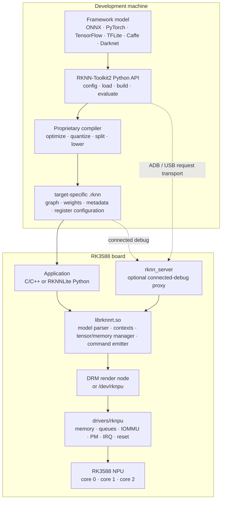

| Component | Runs where | Owns |
|---|---|---|
| RKNN-Toolkit2 | x86-64 Linux host, or supported ARM64 environment | Framework import, preprocessing configuration, graph optimization, quantization, target selection, compilation, accuracy/performance analysis, `.rknn` export. |
| `.rknn` model | File or memory buffer | A compiled, target-specific model package. It includes graph/weight data and hardware-oriented register configuration, not just an interchange graph. |
| RKNNLite | Target board, Python | Thin deployment API for loading an existing `.rknn`, choosing cores, setting inputs, running, and retrieving outputs. |
| RKNN Runtime (`librknnrt.so`) | Target board, native process | Model/context lifecycle, tensor metadata, CPU-side conversions, device-memory allocation/import, low-level task/command preparation, kernel ABI, and results. |
| `rknn_server` | Target board, optional daemon | Proxies Toolkit2 operations from a connected development host into the board runtime. It is not needed by normal native applications. |
| RKNPU kernel driver | BSP kernel | Device discovery, device memory objects, IOMMU mappings, per-core queues, atomic multicore launch, power/frequency, interrupts, fences, timeouts, and reset. |
| RK3588 NPU | SoC | Executes the register-command programs against NPU-visible tensor, weight, and scratch addresses. |

## 2. Building an RKNN model

### 2.1 Conversion flow

The normal Toolkit2 flow is deterministic at the API level even though the
compiler implementation is closed:

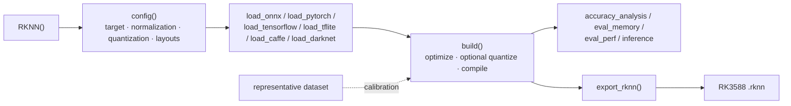

`config()` fixes assumptions that affect both compilation and runtime IO:

- target platform, such as `rk3588`;
- per-channel mean/std and RGB/BGR ordering;
- quantization algorithm (`normal`, MMSE, or KL) and per-layer/per-channel
  strategy;
- optimization level and quantized dtype;
- dynamic input shapes;
- a model custom string; and
- single-core compilation where required.

With quantization enabled, `build()` uses a representative dataset to calibrate
the conversion from floating-point framework tensors to the selected integer
representation. Unsupported or awkward framework operations may be rewritten,
split, rejected, or assigned to a fallback path according to compiler/runtime
support. The pinned [operator list](https://github.com/airockchip/rknn-toolkit2/blob/59a913d172e7f5ff03c9076e2ec7b1b1288ffd08/doc/05_RKNN_Compiler_Support_Operator_List_V2.3.2.pdf) is the compatibility reference;
framework acceptance alone does not prove efficient NPU execution.

Toolkit2 on an x86 host supports the broadest import/evaluation workflow. The
vendor guide describes ARM64 Toolkit2 as supporting ONNX and PyTorch imports;
RKNNLite is deployment-only and does not replace the compiler.

### 2.2 What the `.rknn` artifact contains

The official FAQ describes an RKNN as containing weights, graph structure, and
substantial NPU register-configuration data. Operator splitting and hardware
lowering explain why an RKNN can be larger than the source model.

```mermaid
flowchart TB
  rknn[".rknn package"]
  graph["lowered graph<br/>operator order · tensor relationships"]
  weights["transformed weights<br/>quantized and hardware-packed"]
  attrs["tensor metadata<br/>shape · type · format · scale · zero point · stride"]
  commands["hardware program material<br/>register configurations / task metadata"]
  compat["compatibility metadata<br/>target family · format/runtime expectations"]

  rknn --> graph
  rknn --> weights
  rknn --> attrs
  rknn --> commands
  rknn --> compat
```

This has three operational consequences:

1. An RKNN is not a portable ONNX-like representation. Build it for the target
   family and preserve the compiler version used to produce it.
2. Much of the hardware scheduling decision is made before the kernel sees a
   job. The runtime consumes compiled material; the driver sees task ranges and
   register-command addresses.
3. Compatibility is a tuple of model format/compiler, runtime, kernel driver,
   and NPU generation. `rknn_query(RKNN_QUERY_SDK_VERSION)` reports both API and
   driver versions and should be captured with inference evidence.

## 3. Ways to deploy and debug

### 3.1 Native board application

This is the production-shaped path. No server is involved.

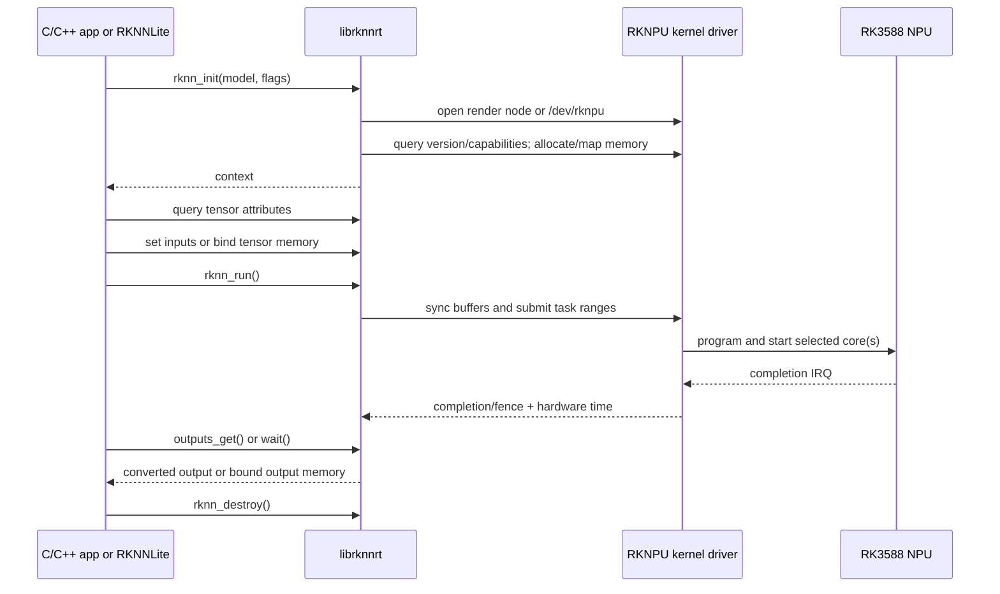

The C application links `librknnrt.so` and includes `rknn_api.h`. RKNNLite's
Python methods ultimately drive the same native runtime. A native process can
load a model by file path or memory buffer, query IO attributes, choose a core
mask, run, and retrieve results.

### 3.2 Toolkit2 connected debugging

`rknn_server` exists for host-controlled evaluation on a real target:

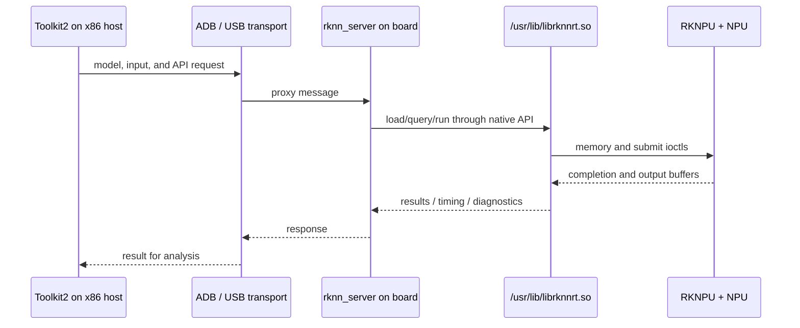

The server is supplied as a stripped executable plus Linux restart scripts and
an Android init/SELinux service definition. Its diagnostics identify USB
FunctionFS/socket transports and dynamic loading of `/usr/lib/librknnrt.so`.
The vendor's [server proxy note](https://github.com/airockchip/rknn-toolkit2/blob/59a913d172e7f5ff03c9076e2ec7b1b1288ffd08/doc/rknn_server_proxy.md) documents the host-to-board proxy purpose.

It is therefore useful for Toolkit2 `inference`, performance evaluation, and
accuracy analysis against the actual NPU. It is not a scheduler daemon and is
not on the data path of an ordinary C or RKNNLite application. ARM64 Toolkit2
running locally on the board also does not need this proxy.

## 4. What is open and what is closed

| Item | Distribution form | What can be established |
|---|---|---|
| Examples | C/C++ and Python source; many files carry permissive headers | Intended API ordering, input preparation, zero-copy binding, memory sharing, and benchmark conventions. |
| API definitions | Public C headers | Function ABI, context flags, tensor/memory layouts, query results, core masks, matmul/custom-op APIs. |
| Manuals | PDF/Markdown | Supported workflows, target/platform matrix, memory and multicore behavior, limitations. |
| Toolkit2/Lite2 | Python wheels | Public Python surface and package metadata; compiler and wrapper implementation are not source in the repo. |
| RKNN Runtime | Stripped `.so` and an ARM uClibc `.a` variant | Exported ABI, dependencies, build/version strings, device discovery and diagnostic vocabulary; algorithmic implementation remains closed. |
| `rknn_server` | Stripped executable | Service integration and proxy role; transport implementation remains closed. |
| Kernel driver | GPL source | Exact ioctl, allocation, mapping, queue, register, IRQ, PM, timeout, reset, and debug behavior. |

The top-level RKNN SDK license is a proprietary Rockchip-product license and
expressly restricts reverse engineering and source derivation. Some example
files carry separate permissive headers; that does not make the compiler or
runtime open source.

Static inspection of the ARM64 runtime establishes a few useful boundary facts:

- it is a roughly 7.7 MiB stripped ELF in this SDK;
- it exports the documented context, query, run/wait, tensor-memory, matmul,
  and custom-operation APIs;
- it links only ordinary C/C++ system libraries and does not dynamically depend
  on `libdrm`, so its DRM interaction is either bundled or implemented directly;
- diagnostics refer to `/dev/rknpu`, `/dev/dri/%s`, `renderD`, DRM ioctl helpers,
  GEM handles, object/device addresses, IOMMU domains, task buffers, and
  register-command buffers; and
- internal target/emitter names and command diagnostics are consistent with a
  runtime that parses compiled RKNN work and builds the low-level RKNPU buffers.

The last point is an inference from binary metadata plus the matching kernel
ABI, not a claim about unavailable source structure. Unknowns include the exact
RKNN container format, graph rewrite algorithms, register-command encoding,
fallback policy implementation, allocator heuristics, and version negotiation
rules beyond public behavior.

## 5. Runtime API and context lifecycle

The public runtime divides into five groups:

| Group | Important calls | Role |
|---|---|---|
| Context | `rknn_init`, `rknn_dup_context`, `rknn_destroy` | Parse/load the model, create execution state, share model resources for another context, tear down. |
| Introspection | `rknn_query` | IO counts/attrs, native attrs, dynamic ranges, performance, memory, custom string, SDK/driver versions. |
| Execute | `rknn_inputs_set`, `rknn_run`, `rknn_wait`, `rknn_outputs_get`, `rknn_outputs_release` | General copied-IO execution and completion. |
| Device memory | `rknn_create_mem*`, `rknn_destroy_mem`, `rknn_mem_sync` | Allocate or import NPU-visible memory and maintain cache coherency. |
| Bindings | `rknn_set_io_mem`, `rknn_set_weight_mem`, `rknn_set_internal_mem` | Attach persistent input/output, weight, or intermediate storage to a context. |

`rknn_init` flags expose behavior not obvious from the basic API. They include
priority, asynchronous execution, detailed performance collection, externally
allocated weight/internal memory, weight sharing, input/output fences, optional
GPU fallback, SRAM use, input/output cache-flush suppression, and zero-copy
model-buffer loading. The 2.3.2 header says the runtime normally raises the
process priority to nice `-19`; `RKNN_FLAG_DISABLE_PROC_HIGH_PRIORITY` opts out.

The header's `rknn_run_extend` contains `frame_id`, `non_block`, `timeout_ms`,
and `fence_fd`. This is stronger version-specific evidence than older prose
that calls these fields reserved. Treat the header shipped with the runtime as
the ABI definition for code built against that runtime.

For a model compiled with a dynamic-shape set, `rknn_set_input_shapes()` chooses
the current shapes before execution. The dynamic-range and `CURRENT_*` query
commands distinguish the model's allowed set from the attributes of the active
shape. This is not arbitrary runtime graph reshaping: valid alternatives were
declared at conversion time and compiled into the RKNN.

### 5.1 Auxiliary execution interfaces

Two public interfaces sit beside normal graph execution:

- **Matmul:** `rknn_matmul_create()` or its dynamic-shape form creates a context
  directly from M/K/N, input/output types, layouts, quantization, and an IOMMU
  domain rather than loading an `.rknn`. The caller binds A, B, and C tensor
  memory, can select a core mask and quantization parameters, calls
  `rknn_matmul_run()`, and destroys the context. The API supports several
  FP16, INT8, and INT4 input/output combinations; RK3588 alignment rules vary
  by type, and the header's returned IO attributes are authoritative. A helper
  repacks the B matrix from normal to hardware-native layout.
- **Custom operations:** after `rknn_init()`, an application can register an
  operation type with CPU callbacks or an OpenCL GPU kernel. The runtime passes
  tensor attributes/memory and operation attributes to init, prepare, compute,
  and destroy hooks. This is a userspace fallback/extension mechanism—the
  advertised targets are CPU and GPU, not a way to teach the RKNPU kernel a new
  NPU command.

These paths reinforce the layer boundary: graph fallback and special-purpose
kernel generation live in the proprietary runtime/userspace, while the RKNPU
driver still receives memory and low-level hardware work.

## 6. General IO versus zero-copy IO

### 6.1 General API

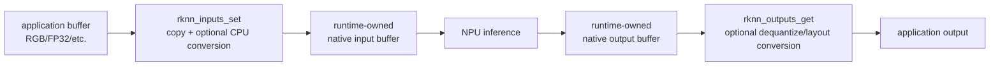

The application describes each input's type, format, size, and `pass_through`
state. The runtime can copy, normalize, quantize, and transpose into the model's
native input. On output it can allocate a buffer or use an application buffer,
and `want_float` requests conversion to floating point. These conveniences cost
CPU time, copies, and memory bandwidth.

### 6.2 Zero-copy API

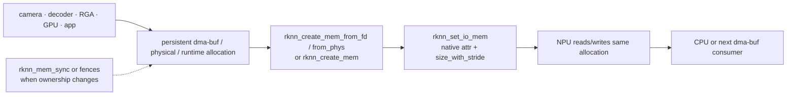

A `rknn_tensor_mem` carries a CPU virtual address, physical address, fd, offset,
size, flags, and runtime-private pointer. Memory can be:

- allocated by the runtime with `rknn_create_mem()` or `rknn_create_mem2()`;
- imported from a dma-buf fd with `rknn_create_mem_from_fd()`; or
- wrapped from a physical/virtual address pair where that platform path is
  appropriate.

The application queries native input/output attributes, allocates at least
`size_with_stride`, and binds each allocation with `rknn_set_io_mem()`. A
producer such as a camera, decoder, or RGA can then share the same dma-buf. This
removes the general API's frame-by-frame application/runtime copy; it does not
make data-format, cache-ownership, or producer/consumer synchronization
requirements disappear.

| Property | General API | Zero-copy API |
|---|---|---|
| IO ownership | Runtime owns native IO buffers | Application/runtime binds persistent memory |
| Input call | `rknn_inputs_set` | Write/import buffer, then `rknn_set_io_mem` once |
| Output call | `rknn_outputs_get` and release | Read/export the bound output after completion |
| Conversion | Runtime can convert type/layout and quantization | Producer should match native attrs, or request the documented non-pass-through conversion path |
| Copies | Normally at least an input copy; output conversion may copy | Avoids per-frame runtime IO copies |
| External pipelines | Extra handoff | Natural dma-buf path for camera/codec/RGA/GPU |

The vendor guide says the general and zero-copy APIs must not be mixed for a
given IO path. Follow the specific SDK's examples and query results instead of
assuming a packed shape. On RK3588 input width or total size has documented
16-byte alignment constraints, and `w_stride`, `h_stride`, and
`size_with_stride` are the authoritative allocation description.

### 6.3 Native layout and quantization

`rknn_tensor_attr` reports dimensions, element count, logical size, format,
type, quantization mode, fractional length or affine zero-point/scale, width and
height strides, and padded size. Native queries expose the layout actually
preferred by the compiled model, including blocked `NC1HWC2` in addition to
NCHW/NHWC.

`pass_through = true` means the buffer already matches the model input and is
passed without input conversion. With it false, the runtime interprets the
declared source `type`, `fmt`, and strides and converts. The general rule is to
query, allocate from `size_with_stride`, and either produce that native layout
directly or account for conversion cost explicitly.

Cache coherency is a separate dimension. The runtime normally flushes input
and output memory at the expected ownership transitions. The disable-flush
flags exist for pipelines where another accelerator owns synchronization; such
callers must use `rknn_mem_sync` and/or fences correctly before CPU or device
access.

## 7. Model and execution memory

The runtime guide divides model memory into weights, internal tensors,
register configuration, inputs, and outputs:

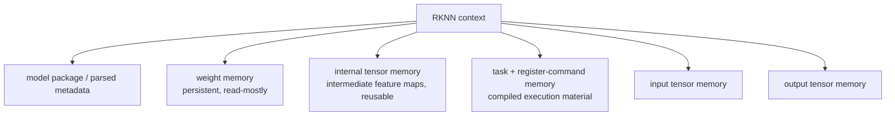

By default these resources are established during `rknn_init`. More controlled
deployments can change ownership:

- `RKNN_FLAG_MEM_ALLOC_OUTSIDE` plus `RKNN_QUERY_MEM_SIZE` and
  `rknn_set_weight_mem()` externalizes weights;
- `RKNN_FLAG_INTERNAL_ALLOC_OUTSIDE` plus `rknn_set_internal_mem()` externalizes
  intermediate storage;
- models executed serially can reuse one sufficiently large internal buffer;
- `rknn_dup_context()` creates another execution context while sharing model
  resources, useful for threaded execution; and
- `RKNN_FLAG_ENABLE_SRAM` lets the runtime request optional on-chip SRAM for as
  much eligible internal memory as possible.

The current guide says each context owns its SRAM allocation and that
`RKNN_FLAG_SHARE_SRAM` is not implemented. Older explicit weight-sharing
recipes have also been superseded in some dynamic-shape cases. This is an area
where matching the documentation to the shipped runtime version matters.

`RKNN_QUERY_MEM_SIZE` reports weight size, internal size, total DMA allocation,
total reserved SRAM, and free reserved SRAM. Capture it when tuning multiple
contexts; model file size is not a proxy for live device-memory use.

## 8. How the runtime reaches the kernel

### 8.1 Device front ends

The driver exposes the same six logical operations through a DRM render driver
and, with the alternate memory configuration, a misc character device:

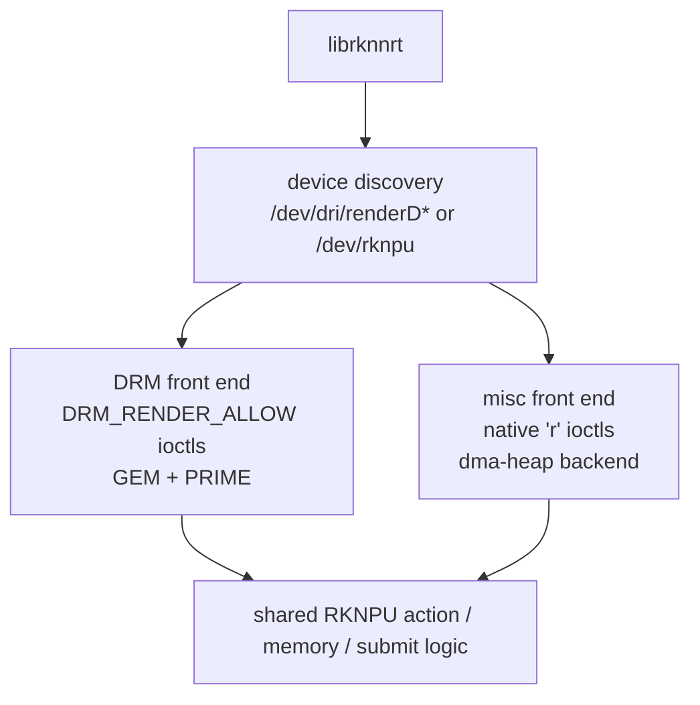

Kconfig selects `ROCKCHIP_RKNPU_DRM_GEM` by default, using DRM GEM/PRIME for
allocation, mmap, and dma-buf sharing. `ROCKCHIP_RKNPU_DMA_HEAP` is an
alternative backend. Optional switches enable explicit fences, SRAM, debugfs,
and procfs support.

The driver-local ABI header defines:

| Operation | Purpose |
|---|---|
| `ACTION` | Get/set driver, hardware, frequency, voltage, bandwidth, power, SRAM, process priority, reset, and IOMMU-domain values. |
| `MEM_CREATE` | Allocate an object and return handle, object/device address metadata, SRAM portion, and domain. |
| `MEM_MAP` | Obtain a fake mmap offset for a GEM handle. |
| `MEM_DESTROY` | Drop the selected object. |
| `MEM_SYNC` | Synchronize a range to or from the device. |
| `SUBMIT` | Queue a task-buffer range with timeout, mode, priority, domain, core mask, per-subcore ranges, and optional fence. |

This low-level ABI is not a supported substitute for RKNN Runtime. It exposes
hardware-oriented objects and register-command addresses, and the public SDK
does not document the command encoding needed to construct a valid model job.

### 8.2 Runtime-to-kernel concept map

| Runtime concept | Kernel representation |
|---|---|
| Tensor/weight/internal allocation | RKNPU GEM or dma-heap memory object; mmap and optional dma-buf import/export |
| Cache sync | `RKNPU_MEM_SYNC_TO_DEVICE` / `FROM_DEVICE` over an object range |
| Compiled layer/task work | Array of packed `struct rknpu_task` in a task object |
| Register program | Device address in each task's `regcmd_addr`, with count/offset fields |
| Context address space | Caller-selected RKNPU IOMMU domain id |
| Core selection | `core_mask` plus `subcore_task[]` start/count ranges |
| Blocking/nonblocking run | submit mode, wait queue, and optional dma-fence path |
| Runtime timeout | submit timeout and driver timeout work |
| Performance duration | returned `hw_elapse_time`, plus runtime layer/model reporting |

This map is partly an inference: the runtime source is unavailable, but its
public memory/core/fence API, diagnostics, and the sole RKNPU ABI line up with
these kernel structures.

## 9. Kernel source architecture and RK3588 wiring

### 9.1 Driver files

The pinned `drivers/rknpu` tree is about 8.6 thousand lines of C/header code.
Its main responsibilities are split as follows:

| Area | Source role |
|---|---|
| platform/driver | Probe/remove, SoC match data, clocks/regulators/power domains, runtime PM, DRM or misc registration, action dispatch. |
| job | Submit validation/setup, per-core FIFO queues, multicore barrier, register programming, IRQ completion, timeout work. |
| GEM | Default DRM memory objects, DMA mapping, mmap, PRIME import/export, cache synchronization. |
| memory | Alternate dma-heap-backed memory path. |
| IOMMU | Domain allocation, attachment/refcount, object mapping/unmapping, SRAM+DDR combined IOVA. |
| devfreq | OPP-backed frequency/voltage scaling and utilization. |
| reset | Soft-reset sequences and reset-controller integration. |
| fence | Input waits and output `sync_file` fences when configured. |
| debugger | debugfs/proc controls and load/power/frequency/SRAM reporting. |

### 9.2 RK3588 device tree

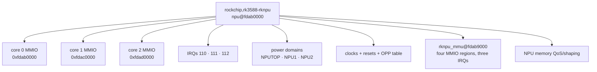

The RK3588 base DT supplies three 64 KiB NPU register windows, three named
interrupts, clock/reset controls, three power-domain relationships, an OPP
table, and the `rknpu_mmu` phandle. The IOMMU node has control plus per-core
register windows at `0xfdab9000`, `0xfdaba000`, `0xfdaca000`, and
`0xfdada000`, using the three NPU interrupt lines for MMU faults as well.
Board-level DT must enable both NPU and IOMMU nodes.

## 10. Submission and hardware execution

### 10.1 What a submit contains

The userspace task object is an array of packed descriptors. Each descriptor
contains an operator index, enable/interrupt masks, completion status,
register-configuration count/offset, and the device address of a register
command. The submit selects a contiguous portion of that object and adds:

- blocking/nonblocking, program-controller, ping-pong, and fence flags;
- timeout and task counters;
- task-object and task-base device addresses;
- IOMMU domain id;
- core mask; and
- up to five per-subcore task start/count pairs (three are relevant on RK3588).

In normal operation the runtime/model compiler has already decided the command
content and how work is divided. The driver coordinates and launches it.

### 10.2 End-to-end `rknn_run`

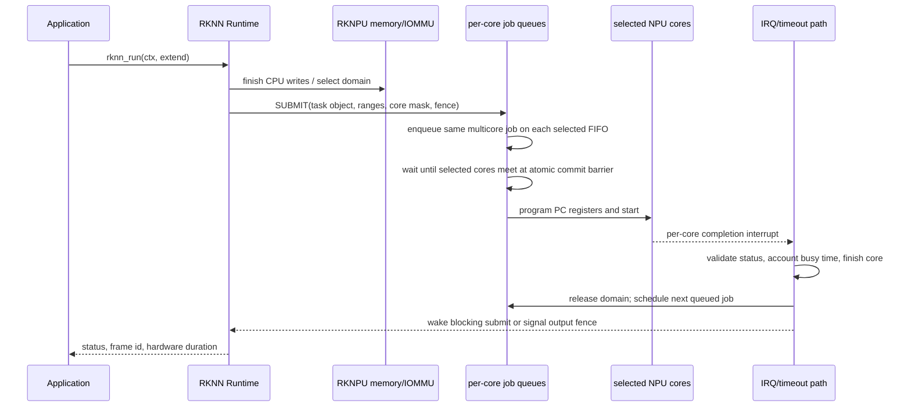

With `core_mask = 0`, the driver chooses the core with the smallest queued task
count. For a multicore job, the same job is placed on each selected per-core
FIFO. An atomic barrier waits until those queues can start their portions
together. This is queue coordination, not graph scheduling.

The active RK3588 path is program-controller (PC) mode. For a task chunk the
driver writes the first register-command address to `PC_DATA_ADDR`, its amount
to `PC_DATA_AMOUNT`, programs interrupt/enable/task controls and
`PC_DMA_BASE_ADDR`, then toggles `PC_OP_EN`. Large task ranges are split at the
SoC-specific maximum. Non-PC submission is not a practical alternate path in
this driver revision.

On interrupt, the driver checks grouped status against the expected mask,
writes status back into the last task descriptor, accounts hardware busy time,
releases its IOMMU-domain reference, completes/wakes the job, and starts the
next queued job. The returned `hw_elapse_time` represents the driver's measured
hardware interval, not necessarily end-to-end application latency.

## 11. Three-core behavior

The public runtime exposes `AUTO`, individual core 0/1/2, core 0+1, core
0+1+2, and `ALL`. A useful mental model is:

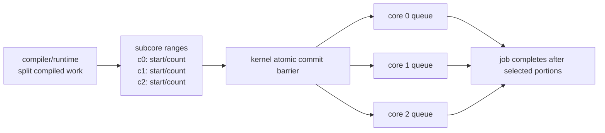

Toolkit performance output can show per-layer `WorkLoad(0/1/2)`, and the user
guide lists common convolution, depthwise, elementwise, concatenation, and
activation operations among those that can be segmented. That partitioning is
not implemented in `rknpu_job.c`: userspace supplies `subcore_task[]`.

Multicore is not automatically faster. The vendor guide warns that small
networks can regress because CPU intervention and core-switch/coordination
overheads dominate. Benchmark the complete pipeline and record the selected
mask. Separate contexts pinned to separate cores and one graph split across
several cores are different concurrency strategies.

## 12. IOMMU domains, DDR, SRAM, and NBUF

### 12.1 Address spaces

The driver can manage up to 16 numbered IOMMU domains. Memory objects and jobs
carry a domain id; the device is switched into the selected domain under a
global mutex/refcount protocol.

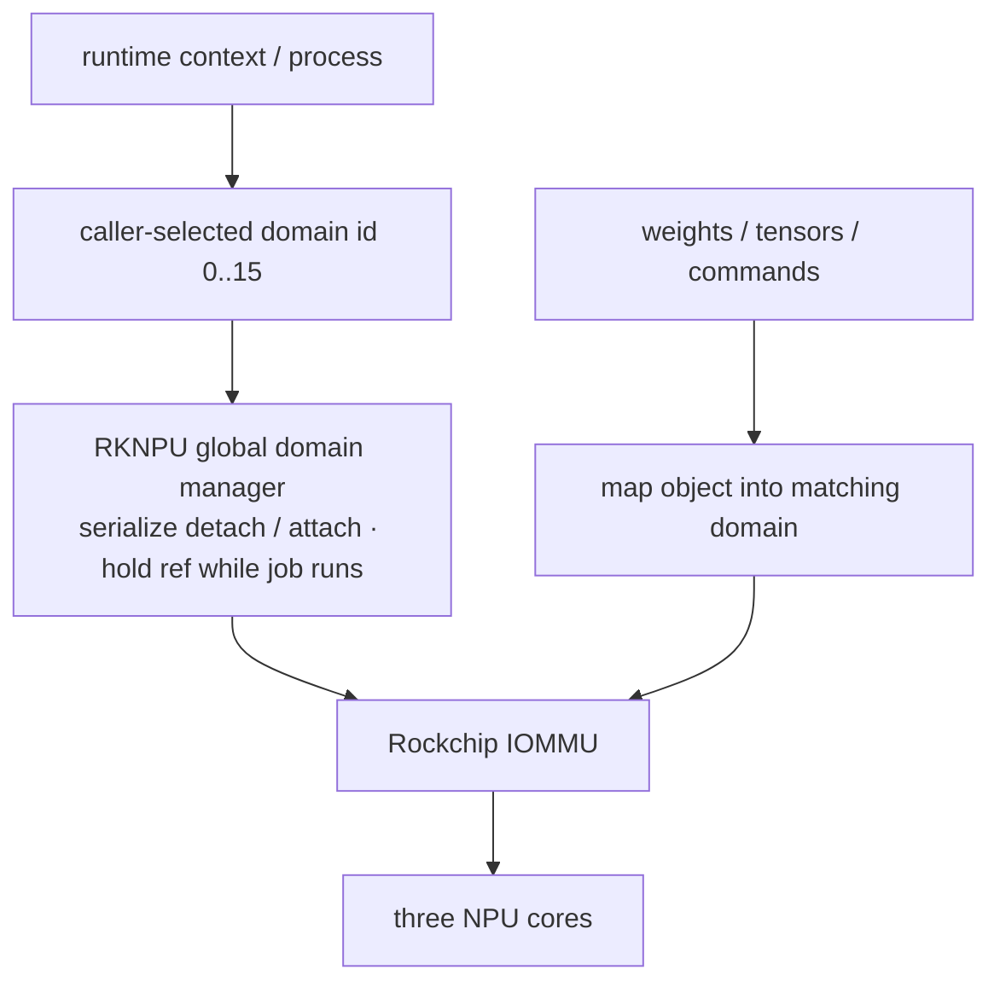

This is not a normal per-DRM-file GPU virtual-memory abstraction. The whole
device is detached/attached as domains change, and ids are visible to
userspace. A job holds a domain reference while hardware uses its mappings.
Matmul APIs also expose an `iommu_domain_id`; the header describes each such
domain as a 4 GiB address space.

### 12.2 SRAM and combined mappings

With `CONFIG_ROCKCHIP_RKNPU_SRAM`, a memory request can try to place a leading
portion in reserved on-chip SRAM and the rest in DDR while presenting one
contiguous NPU IOVA:

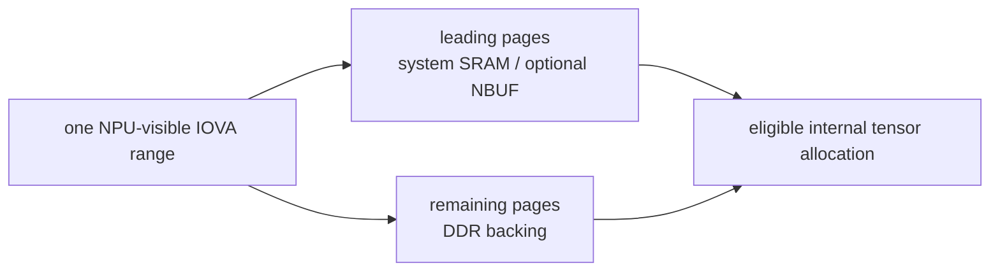

The RK3588 guide describes 1 MiB system SRAM, of which up to 956 KiB is usable
by SoC IP blocks. That is a shared hardware pool, not a guaranteed RKNPU amount:
DT reservations must be non-overlapping and actual availability is reported by
the runtime/driver. `RKNN_FLAG_ENABLE_SRAM` asks the runtime to use as much as
possible for internal tensors; `rknn_create_mem2(...TRY_ALLOC_SRAM)` exposes a
more direct allocation request.

NBUF is another optional fast-memory flag in the kernel ABI. Its availability
is SoC/configuration specific and it is not the same as the public high-level
SRAM flag. In both cases allocation can fall back partly or wholly to DDR.

## 13. Fences, blocking, and cache ownership

There are three distinct completion/coherency mechanisms:

| Mechanism | Answers |
|---|---|
| Blocking submit / `rknn_wait` | Has NPU execution completed? |
| Input/output dma-fence | May the NPU begin after another device, and may another device begin after the NPU? |
| Memory cache sync | Are CPU caches and device-visible memory coherent for the next owner? |

They are related but not interchangeable. The kernel can wait on an input
`sync_file` fence before launch and return an output fence for nonblocking
pipelines. `rknn_run_extend.fence_fd` and the initialization flags select how
the runtime exchanges those fences. A fence orders DMA users; a cache sync
publishes or invalidates CPU-visible data. A camera → RGA → NPU → GPU pipeline
may require both correct dma-buf fences and correct cache ownership.

The quality appendix records implementation defects in the inspected fence
path. Until fixed and validated, treat advanced asynchronous/fence use as a
review target rather than assuming the public flags imply robust behavior.

## 14. Power, frequency, and utilization

Every ioctl wrapper acquires runtime power and schedules delayed release. The
default power-off delay is three seconds, intended to avoid power cycling
between closely spaced inferences. The driver coordinates:

- regulators and clocks;
- three NPU-related power domains;
- runtime PM;
- reset controls;
- OPP/devfreq frequency and voltage selection;
- thermal constraints; and
- hardware busy-time accounting used for load reporting.

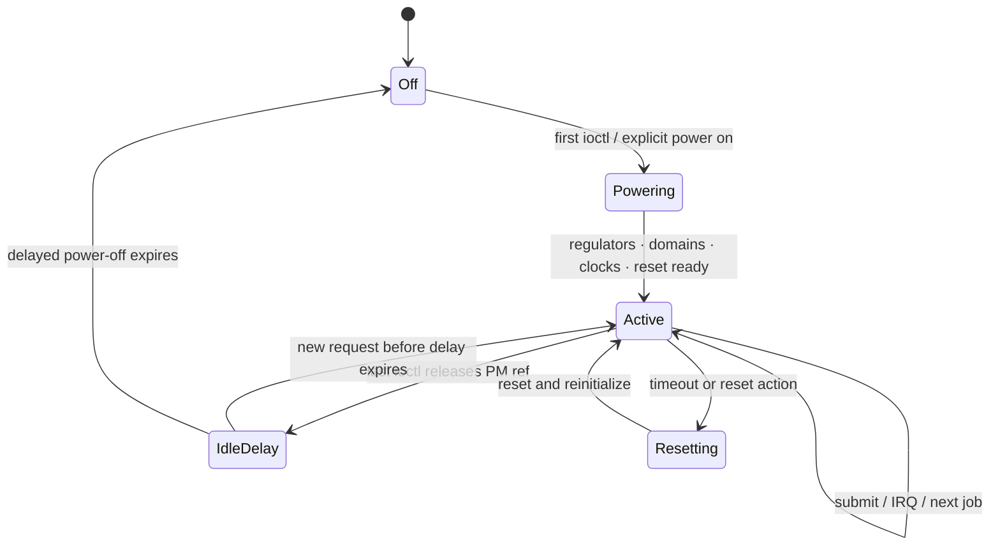

The action ABI can get/set frequency, voltage, memory bandwidth parameters,
power, reset, and process nice. In a normal deployment those controls should be
mediated by the runtime and system policy. They are not proof that arbitrary
applications should tune hardware globally.

## 15. Failure and recovery paths

| Event | Driver behavior | Visible consequence |
|---|---|---|
| NPU completion IRQ | Validate/clear status, account duration, complete core/job, signal/wake, run next job | `rknn_run`/wait/output becomes ready. |
| MMU fault | IOMMU interrupt/error logging | Usually indicates a bad/stale/unmapped NPU address; job may time out or fail. |
| Submit timeout | Timeout worker logs job/core state and performs a global soft reset | Other in-flight work can be affected because reset is device-wide. |
| Explicit reset action | Soft-reset sequence | Global device state changes; queues/contexts must recover consistently. |
| Invalid status/mask | Error diagnostics and failed/unfinished job path | Runtime error or timeout. |
| Device removal with live jobs | Driver warns about unfinished work | Removal is not a graceful per-context cancellation protocol. |

The reset scope is important: timeout recovery is not isolated to the offending
context or core. One malformed or hung job can disrupt unrelated clients. This
is a fixed-stack driver design assumption and a major reason the low-level
render-node ABI deserves hardening.

## 16. Observability

### 16.1 Runtime/toolkit

Useful public surfaces include:

- `RKNN_QUERY_SDK_VERSION` for runtime API and kernel driver versions;
- `RKNN_QUERY_MEM_SIZE` and `RKNN_QUERY_DEVICE_MEM_INFO` for live memory;
- `RKNN_QUERY_PERF_RUN` for whole-run device time;
- `RKNN_QUERY_PERF_DETAIL` after enabling performance collection for per-layer
  output, including per-core workload where available;
- Toolkit2 `eval_perf`, `eval_memory`, `accuracy_analysis`, and connected
  `inference`; and
- runtime log output, which can identify device discovery, version mismatch,
  allocation, task, and command failures.

### 16.2 Kernel

With debugfs enabled, the driver exposes version, load, power, frequency,
voltage, power-delay, reset, and SRAM information/controls under its RKNPU
debug directory. Optional procfs support provides a subset. Exact filenames
depend on configuration and driver revision; inspect the mounted debugfs tree
rather than scripting unverified paths.

Kernel logs are the primary source for probe, clock/power, IOMMU fault, submit,
interrupt-status, timeout, and reset failures. A useful evidence capture should
include:

```text
model/compiler version and target
librknnrt version and build
kernel release and RKNPU driver version
device nodes and permissions
DT-compatible/probe messages
core mask and context flags
input/output native attrs and strides
memory query before/after context creation
latency, correctness result, and relevant kernel/runtime logs
```

## 17. Compatibility and deployment checklist

Preserve this tuple as one tested unit:

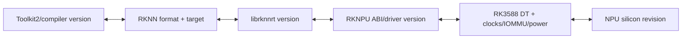

Before calling an image supported:

1. Confirm NPU and RKNPU IOMMU DT nodes probe without errors.
2. Confirm the expected render node or `/dev/rknpu` exists and is accessible to
   the intended service account.
3. Capture runtime and driver versions with `RKNN_QUERY_SDK_VERSION`.
4. Run an official simple model and compare output to a CPU/reference result,
   not merely a successful return code.
5. Test both repeated inference and context create/destroy loops.
6. Measure general and zero-copy IO separately; verify native strides.
7. Exercise AUTO and intended fixed/multicore masks, recording correctness and
   end-to-end latency.
8. If dma-buf sharing is required, validate producer/consumer fences and cache
   sync with the actual camera/codec/RGA/GPU path.
9. Capture memory/SRAM use and run concurrent-context stress.
10. Force a controlled timeout only on a disposable test system, then verify
    that later inference recovers and logs explain the reset.

This work has not yet been performed for the Resolute ROCK 5B image. The guide
documents architecture and converts source inspection into a validation plan;
it does not silently upgrade support coverage.

## 18. Quality and security appendix

The mechanics above explain what the implementation is trying to do. The
separate [BSP driver-quality finding](../../../findings/2026-07-16-rockchip-bsp-driver-quality.md#rknpu-deep-dive-capable-fixed-stack-unsafe-multi-client-abi)
reviews whether the inspected ABI implements that boundary safely compared with
mainline accelerator drivers.

The short version is that the driver is functionally substantial—three-core
queues, GEM/PRIME, IOMMU domains, SRAM, fences, runtime PM, devfreq, debugfs,
timeouts, and reset are all real—but its userspace boundary assumes a trusted,
matched proprietary runtime. Raw kernel object addresses, weak ownership/range
validation, global controls on render-allowed ioctls, global domain switching,
and several fence/timeout issues make it unsuitable to treat as a hardened
multi-tenant render ABI without fixes.

That assessment is deliberately an appendix. It should inform deployment and
hardening, but it is not the organizing principle for understanding the stack.

## 19. Source map

| Question | Pinned source |
|---|---|
| Public native API and structures | [`rknn_api.h`](https://github.com/airockchip/rknn-toolkit2/blob/59a913d172e7f5ff03c9076e2ec7b1b1288ffd08/rknpu2/runtime/Linux/librknn_api/include/rknn_api.h) |
| Matmul API/domain behavior | [`rknn_matmul_api.h`](https://github.com/airockchip/rknn-toolkit2/blob/59a913d172e7f5ff03c9076e2ec7b1b1288ffd08/rknpu2/runtime/Linux/librknn_api/include/rknn_matmul_api.h) |
| Runtime/server binaries and integration | [`rknpu2/runtime`](https://github.com/airockchip/rknn-toolkit2/tree/59a913d172e7f5ff03c9076e2ec7b1b1288ffd08/rknpu2/runtime) |
| Conversion, memory, zero-copy, multicore, SRAM | [RKNN SDK 2.3.2 user guide](https://github.com/airockchip/rknn-toolkit2/blob/59a913d172e7f5ff03c9076e2ec7b1b1288ffd08/doc/02_Rockchip_RKNPU_User_Guide_RKNN_SDK_V2.3.2_EN.pdf) |
| Example call patterns | [`examples`](https://github.com/airockchip/rknn-toolkit2/tree/59a913d172e7f5ff03c9076e2ec7b1b1288ffd08/rknpu2/examples) |
| Kernel ABI | [`rknpu_ioctl.h`](https://github.com/rockchip-linux/kernel/blob/b4ef083dc0c3608e744deabb43dc6b781aadbe6e/drivers/rknpu/include/rknpu_ioctl.h) |
| Queue, launch, IRQ, timeout | [`rknpu_job.c`](https://github.com/rockchip-linux/kernel/blob/b4ef083dc0c3608e744deabb43dc6b781aadbe6e/drivers/rknpu/rknpu_job.c) |
| DRM GEM/PRIME memory | [`rknpu_gem.c`](https://github.com/rockchip-linux/kernel/blob/b4ef083dc0c3608e744deabb43dc6b781aadbe6e/drivers/rknpu/rknpu_gem.c) |
| IOMMU domains and mappings | [`rknpu_iommu.c`](https://github.com/rockchip-linux/kernel/blob/b4ef083dc0c3608e744deabb43dc6b781aadbe6e/drivers/rknpu/rknpu_iommu.c) |
| Probe, actions, PM, SoC data | [`rknpu_drv.c`](https://github.com/rockchip-linux/kernel/blob/b4ef083dc0c3608e744deabb43dc6b781aadbe6e/drivers/rknpu/rknpu_drv.c) |
| RK3588 MMIO/IRQ/power/IOMMU wiring | [`rk3588s.dtsi`](https://github.com/rockchip-linux/kernel/blob/b4ef083dc0c3608e744deabb43dc6b781aadbe6e/arch/arm64/boot/dts/rockchip/rk3588s.dtsi) |

Project vocabulary is in [`../keywords.md`](../keywords.md); the project front
door is [`../README.md`](../README.md).
