# RKNPU 0.9.8 kernel-driver architecture

The Rockchip BSP RKNPU driver is a **userspace-fed command-submission driver**.
It does not parse an RKNN model, schedule neural-network operators, or compile a
graph. A matched proprietary runtime supplies device addresses, task ranges,
register-command addresses, core partitions, and synchronization policy. The
kernel turns those inputs into memory mappings, per-core FIFO reservations,
program-controller register writes, interrupt completion, and device-wide
power/recovery operations.

That choice keeps the kernel implementation compact—8,598 lines across 10 C
files and 11 headers—but moves both intelligence and much of the trust boundary
into `librknnrt`. The kernel architecture is best understood as four interacting
state machines:

1. a global power reference with delayed shutdown;
2. one FIFO/current-job slot per NPU core;
3. one job joining those core queues and completing after all selected cores;
4. one globally attached IOMMU domain held by a reference count while mapping
   operations or jobs actively use it.

This page maps those state machines and every source file in the pinned
Rockchip driver. For the compiler, model artifact, public RKNN APIs, and
userspace runtime around it, start with
[How the RK3588 RKNPU and RKNN stack works](how-rknpu-works.md).

## Fast re-entry

The live board-support verdict remains
[support coverage C16](../../../docs/support-coverage.md): `UNASSESSED` until a
known-output RKNN or RKLLM workload runs on the named distro image. This page is
a source-inspected mechanism, not an on-board validation result.

| Question | Read | Load-bearing fact |
|---|---|---|
| What kind of driver is this? | [Architecture in one view](#architecture-in-one-view) | Userspace emits hardware work; the kernel manages resources and launches it. |
| How is the RK3588 hardware represented? | [§2](#2-rk3588-hardware-contract-and-probe) | One platform device owns three core windows, three shared IRQs, one IOMMU, six resets, eight clocks, and three power domains. |
| What crosses the ABI? | [§3](#3-device-front-ends-and-private-abi) | Six private operations carry raw memory metadata and an already-compiled task program. |
| Which structures hold the state? | [§4](#4-object-model-locks-and-invariants) | Device, subcore, job, memory object, fence context, and IOMMU domain state have different lifetimes. |
| How do allocation and dma-buf sharing work? | [§5](#5-memory-architecture) | DRM GEM/PRIME is the default backend; a mutually exclusive misc/dma-heap backend exists for other product configurations. |
| Why are there numbered IOMMU domains? | [§6](#6-iommu-address-space-design) | The driver switches the whole device among up to 16 global domains; they are serialization units, not per-file isolation objects. |
| What actually starts the NPU? | [§7](#7-task-format-and-hardware-launch) | The first task supplies a register-command address/count; the driver programs PC registers and pulses `PC_OP_EN`. |
| How does multicore scheduling work? | [§8](#8-per-core-scheduler-and-multicore-barrier) | A multicore job reserves the head of every selected FIFO and launches only when all selected cores have joined. |
| What completes or times out a job? | [§9](#9-irq-fence-wait-and-timeout-lifecycle) | IRQs chain chunks and finish jobs; blocking timeout is wait-driven, while async cleanup needs a later async submit. |
| How do power and frequency work? | [§10](#10-power-runtime-pm-and-devfreq) | Power is ioctl-scoped with a 3-second delayed hold; the custom governor follows an explicit target, not measured load. |
| What is global during recovery? | [§11](#11-reset-observability-and-removal) | All reset lines and the current IOMMU attachment are reset together; recovery is not context-isolated. |
| Which design choices matter for maintenance? | [§12](#12-design-choices-strengths-and-costs) and [§13](#13-forward-port-boundaries) | The fixed vendor tuple is feature-rich, but private kernel internals and global state make the ABI brittle and hard to isolate. |

### One job, vertically

```text
librknnrt-built task object and register-command buffers
  -> MEM_CREATE / PRIME import in one selected IOMMU domain
  -> SUBMIT with task range, device addresses, timeout, domain, and core mask
  -> rknpu_job copied or borrowed from the ioctl argument
  -> same job linked into each selected subcore FIFO
  -> selected cores reserve their current-job slots
  -> last selected core reaching the barrier programs all selected cores
  -> one or more PC chunks execute independently on each core
  -> each core IRQ validates grouped status and advances or retires its chunk
  -> final selected-core completion releases the domain and wakes/signals
  -> blocking ioctl copies counters/timing back, or async cleanup frees the job
```

The task buffer, register-command buffer, tensor/weight buffers, CPU virtual
mapping, dma-buf/GEM handle, NPU IOVA, and kernel memory-object address are
different objects. A correct runtime keeps all of them consistent; the driver
does not reconstruct that relationship.

### Do not conflate

| Similar-looking things | Actual distinction |
|---|---|
| RKNN context vs RKNPU job | The closed runtime owns a model/context; the kernel owns only one submitted command job. |
| task descriptor vs register command | A 40-byte `rknpu_task` points at a separate NPU-visible register-command program. |
| GEM handle vs `obj_addr` vs `dma_addr` | The handle is file-local DRM identity, `obj_addr` is a leaked kernel pointer in this ABI, and `dma_addr` is an NPU-visible address. |
| core selection vs graph partitioning | The kernel reserves/starts cores; userspace supplies the per-core task ranges produced from the compiled graph. |
| queue time vs reported hardware time | The timestamps begin when a core reserves a job, so barrier wait can be included; they are software timestamps, not hardware counters. |
| debugfs load vs devfreq utilization | Debugfs samples software busy intervals; devfreq's status callback reports no utilization and does not consume that load. |
| IOMMU domain id vs process address space | The id selects one global device attachment. It is not owned by a DRM file or Linux process. |
| blocking timeout vs async timeout | Blocking submission waits and aborts directly; an async stale-job sweep runs only when another async job is submitted. |
| DRM render node vs hardened DRM client model | The driver borrows GEM/PRIME and render-node plumbing, but submit/sync bypass file-local GEM lookup. |

## Evidence and boundary

This analysis is pinned to:

| Item | Inspected identity |
|---|---|
| Kernel tree | `rockchip-linux/kernel`, `develop-6.1` commit `b4ef083dc0c3608e744deabb43dc6b781aadbe6e` |
| Driver identity | RKNPU 0.9.8, date `20240828` |
| Primary source | `drivers/rknpu/` at that commit |
| RK3588 wiring | `arch/arm64/boot/dts/rockchip/rk3588s.dtsi` at that commit |
| Method | Static control/data-flow inspection; no compile, boot, ioctl trace, or NPU execution was performed for this document |

Function names are stable anchors within the pinned source. Source links are
collected in [§14](#14-source-map-by-question). No proprietary component was
decompiled, so statements about `librknnrt` are limited to the public ABI it
must drive and the evidence already bounded in the end-to-end guide.

The line count is:

| Material | Count |
|---|---:|
| 10 `.c` files | 7,457 |
| 11 `include/*.h` files | 1,141 |
| C and headers | 8,598 |
| `Kconfig` + `Makefile` | 77 |
| Complete `drivers/rknpu` text considered here | 8,675 |

## Architecture in one view

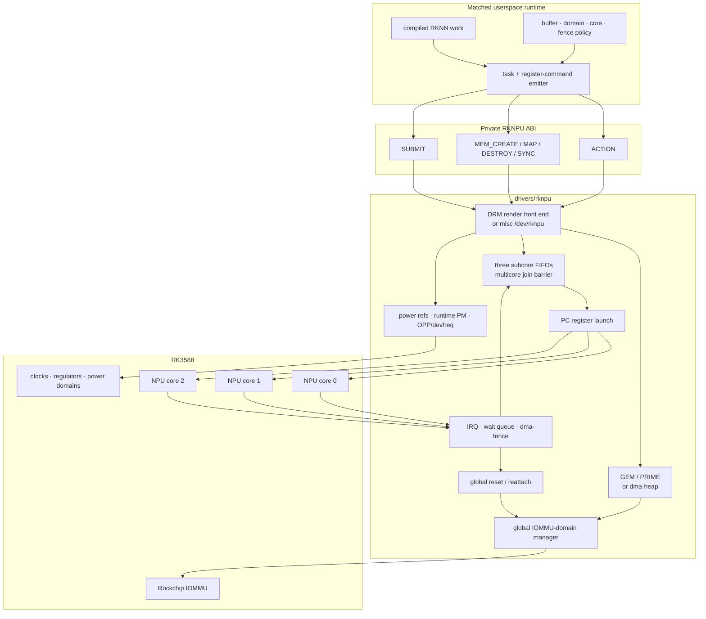

The architectural center is `rknpu_job.c`, but it cannot operate independently:
a job dereferences a memory object created by the chosen backend, holds the
selected IOMMU domain, assumes power is on, writes SoC-specific registers, and
finishes from per-core IRQs.

## 1. Source and build decomposition

### 1.1 File ownership

| File | Primary role | Important entry points |
|---|---|---|
| `rknpu_drv.c` | SoC match data, probe/remove, front-end registration, action dispatch, power/runtime PM, load timer | `rknpu_probe()`, `rknpu_action()`, `rknpu_power_get()`, `rknpu_power_put_delay()` |
| `rknpu_job.c` | Job lifecycle, per-core scheduler, register programming, IRQs, waits, timeout/abort, bandwidth counters | `rknpu_submit()`, `rknpu_job_schedule()`, `rknpu_job_commit()`, `rknpu_irq_handler()` |
| `rknpu_gem.c` | Default GEM allocation, PRIME sharing, mmap, cache sync, SRAM/NBUF+DDR mappings | `rknpu_gem_object_create()`, `rknpu_gem_create_ioctl()`, `rknpu_gem_sync_ioctl()` |
| `rknpu_mem.c` | Alternate dma-heap allocation/import and per-open object list | `rknpu_mem_create_ioctl()`, `rknpu_mem_destroy_ioctl()`, `rknpu_mem_sync_ioctl()` |
| `rknpu_iommu.c` | Exact/custom SG-to-IOVA mapping and whole-device domain switching | `rknpu_iommu_dma_map_sg()`, `rknpu_iommu_domain_get_and_switch()` |
| `rknpu_fence.c` | One device fence timeline and output `sync_file` creation | `rknpu_fence_context_alloc()`, `rknpu_fence_alloc()`, `rknpu_fence_get_fd()` |
| `rknpu_reset.c` | Acquire all reset controls and perform device-wide reset | `rknpu_reset_get()`, `rknpu_soft_reset()` |
| `rknpu_devfreq.c` | OPP selection, voltage/read-margin ordering, monitor/thermal integration, explicit target governor | `rknpu_devfreq_init()`, `npu_devfreq_target()` |
| `rknpu_debugger.c` | debugfs/procfs state and controls | `rknpu_debugger_init()` and the `*_show()`/`*_set()` callbacks |
| `rknpu_mm.c` | First-fit bitmap allocator for optional SRAM chunks | `rknpu_mm_alloc()`, `rknpu_mm_free()` |

The headers mirror those responsibilities. `rknpu_ioctl.h` is especially
important: it is the private userspace contract, but it lives in the driver
directory rather than `include/uapi`.

### 1.2 Compile-time product choices

`CONFIG_ROCKCHIP_RKNPU` builds one `rknpu` object. The Makefile always includes
driver, reset, job, debugger, and IOMMU code, then conditionally adds devfreq,
SRAM allocation, fences, and exactly one memory backend.

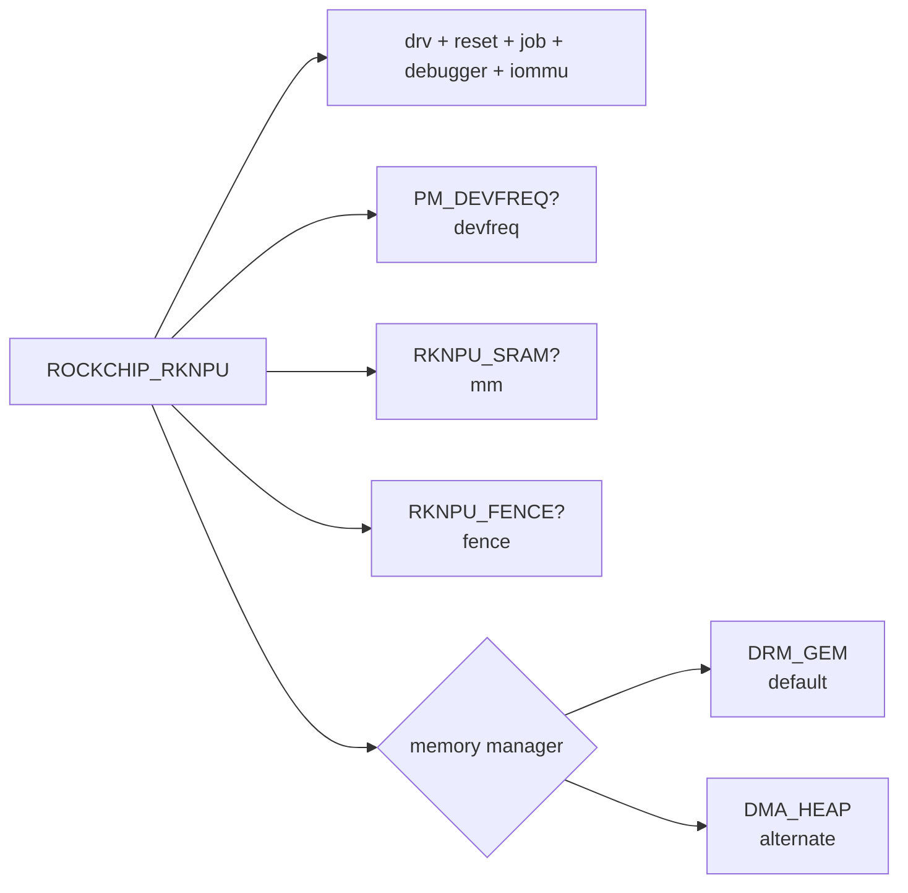

| Symbol | Effect |
|---|---|
| `ROCKCHIP_RKNPU_DRM_GEM` | Registers a render-only DRM driver, uses GEM/PRIME, and is the Kconfig default. |
| `ROCKCHIP_RKNPU_DMA_HEAP` | Registers misc device `/dev/rknpu` and uses Rockchip's CMA dma-heap. |
| `ROCKCHIP_RKNPU_FENCE` | Enables input `sync_file` waits and output dma-fences. It is not selected by default in this Kconfig. |
| `ROCKCHIP_RKNPU_SRAM` | Enables the bitmap allocator and SRAM-prefix mappings; it depends on `NO_GKI`. |
| `ROCKCHIP_RKNPU_DEBUG_FS` | Builds `/sys/kernel/debug/rknpu/*`; default `y` when debugfs is available. |
| `ROCKCHIP_RKNPU_PROC_FS` | Builds the analogous `/proc/rknpu/*`; opt-in. |
| `PM_DEVFREQ` | Includes the BSP-dependent OPP/system-monitor/thermal implementation. |
| `NO_GKI` + `IOMMU_API` + non-ARM | Activates numbered domain creation/switching. Otherwise those domain helpers compile as successful no-ops. |

`NO_GKI` is more than an Android packaging detail here. It controls the
numbered-domain implementation, NBUF discovery, and SRAM/NBUF synchronization
paths. A build can therefore expose the same ABI structures while compiling
important domain/cache behavior out.

## 2. RK3588 hardware contract and probe

### 2.1 SoC configuration record

`rknpu_of_match[]` selects a `struct rknpu_config` rather than branching on the
SoC throughout the driver. For RK3588 that record fixes:

| Property | RK3588 value | Consequence |
|---|---:|---|
| DMA mask | 40 bits | Normal domain 0 may address beyond 4 GiB. |
| Core/IRQ count | 3 | Three subcore queues and three IRQ handlers are initialized. |
| Valid core mask | `0x7` | Cores 0, 1, and 2 are exposed. |
| PC task-count field | 12 bits | A hardware launch chunk contains at most 4,095 tasks. |
| PC data amount scale | 2 | Register-configuration amount is converted in two-entry units. |
| PC DMA control serialization | disabled | Each RK3588 core has its own window; PC data-address writes do not take the shared IRQ lock. |
| NBUF | none in config | The RK3588 path cannot use the driver-defined NBUF fast-memory route. |
| Bandwidth/RW counters | none in config | The corresponding generic actions do not provide RK3588 counters. |

An nvmem `cores` value can convert the match to an RK3583-like two-core
configuration. The accepted degraded shape is cores 0+1 with core 2 invalid;
other invalid-core combinations fail probe.

### 2.2 Device-tree resources

The pinned RK3588 base DT describes one disabled `npu@fdab0000` platform node:

| Resource | DT description |
|---|---|
| Core MMIO | `0xfdab0000`, `0xfdac0000`, `0xfdad0000`, each 64 KiB |
| Interrupts | GIC SPI 110, 111, 112 named `npu0_irq`, `npu1_irq`, `npu2_irq` |
| Clocks | SCMI NPU clock, three ACLKs, three HCLKs, and one PCLK |
| Initial assigned rate | 200 MHz |
| Resets | ACLK and HCLK reset for each of three cores: six controls total |
| Power domains | `NPUTOP`, `NPU1`, and `NPU2`, named `npu0..2` |
| Frequency policy | `npu_opp_table`, with normal 300 MHz–1 GHz points and bin/voltage selection |
| IOMMU | `rknpu_mmu`, with one control and three per-core register windows |

The IOMMU and NPU share interrupt numbers. The RKNPU handlers request the IRQs
with `IRQF_SHARED`; the Rockchip IOMMU also observes those lines for translation
faults. BSP RK3588 board fragments normally enable both nodes and provide the
`rknpu` and memory supplies, although the driver treats both regulators as
optional. The base RK3588 node has no `rockchip,sram` phandle, so the optional
RKNPU SRAM allocator is not active from the base wiring alone.

### 2.3 Probe as a staged construction

`rknpu_probe()` constructs a single global `struct rknpu_device` in this order:

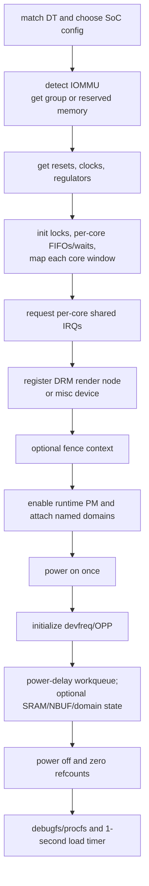

Important construction properties:

- the core arrays are sized by `config->num_irqs`, so the SoC record controls
  both hardware discovery and scheduler topology;
- domain 0 is the DMA domain already attached by the IOMMU core;
- the DRM node is registered before later PM/devfreq/cache initialization
  finishes;
- `rknpu_reset_get()`, `rknpu_devfreq_init()`,
  `rknpu_iommu_init_domain()`, and debugger initialization have return values
  that probe either ignores or deliberately tolerates;
- probe powers the hardware once to initialize dependent services, then powers
  it back down and starts normal operation with a zero reference count.

The result is one device-wide resource manager. The DRM front end does not
allocate per-open RKNPU state, and only the alternate misc backend creates a
small `rknpu_session` to track its dma-buf objects.

## 3. Device front ends and private ABI

### 3.1 Two wrappers around the same core

| Dimension | DRM GEM backend | dma-heap backend |
|---|---|---|
| Node | Render-only `/dev/dri/renderD*` selected by discovery | misc `/dev/rknpu` |
| Memory identity | GEM handle; generic PRIME fd/handle conversion | dma-buf fd stored in `handle` |
| Allocation | shmem pages or DMA API; optional combined cache mapping | Rockchip `rk-dma-heap-cma` |
| Sharing | DRM PRIME import/export | dma-buf get/attach/map |
| Per-open state | ordinary `drm_file`, but private submit/sync do not use it for ownership | `rknpu_session` list tracks memory objects |
| Ioctls | DRM command-base private ioctls, all `DRM_RENDER_ALLOW` | native ioctl magic `'r'`, dispatched by command number |

DRM is used for memory/display-independent render-node plumbing; there is no
KMS pipeline and no GPU involvement. The driver advertises `DRIVER_GEM |
DRIVER_RENDER` on 6.1 and supplies GEM object functions, mmap, and PRIME hooks.

Every private DRM ioctl is wrapped by `RKNPU_IOCTL()`, which calls
`rknpu_power_get()`, invokes the handler, then calls delayed power put. The
wrapper does not stop dispatch if power-on fails. The misc dispatcher follows
the same power-bracketing pattern.

### 3.2 Six operations

| Operation | Input/output role |
|---|---|
| `ACTION` | Multiplexed version, hardware, reset, process-nice, SRAM, IOMMU, clock/voltage, and legacy bandwidth/counter requests. |
| `MEM_CREATE` | Resolve an existing DRM handle or allocate/import memory; return size, handle, kernel object address, NPU address, and optional SRAM size. |
| `MEM_MAP` | Convert a GEM handle into a fake offset accepted by `mmap()`. |
| `MEM_DESTROY` | Drop a GEM handle or alternate-backend object. |
| `MEM_SYNC` | Publish a cacheable range to the device or invalidate it for CPU access. |
| `SUBMIT` | Describe an already-prepared task range, device addresses, domain, cores, timeout, and fences. |

The action enum is broader than the RK3588 implementation:

| Action family on RK3588 | Actual behavior in 0.9.8 |
|---|---|
| driver/hardware version, clock, voltage, IOMMU-enabled | Implemented as reads. |
| reset and process nice | Implemented as global reset and direct `set_user_nice()` respectively. |
| SRAM total/free and current domain id | Implemented; sizes are zero without an SRAM allocator. |
| set domain id | Runs the global domain get/switch/put protocol. |
| set clock or voltage | Enumerated but the switch cases leave `-EINVAL`. |
| explicit power on/off | Enumerated but have no switch case. |
| bandwidth priority/expect/window | Generic code exists, but RK3588 has no mapped bandwidth register block and returns `-EINVAL`. |
| read/write byte counters | RK3588 has no amount descriptors; helpers warn and return without a meaningful hardware value. |

### 3.3 Wire structures

The ABI uses fixed-width types and explicit padding. The misc front end wires
the same handler to `compat_ioctl` and has no structure-translation layer, so
the layout is intended to be shared with compatible callers.

| Structure | Size in the inspected 64-bit layout | Role |
|---|---:|---|
| `rknpu_action` | 8 bytes | action selector plus one 32-bit value |
| `rknpu_mem_create` | 48 bytes | handle, flags, size, object/NPU addresses, cache request, domain, core |
| `rknpu_mem_map` | 16 bytes | handle to mmap offset |
| `rknpu_mem_destroy` | 16 bytes | handle plus object address |
| `rknpu_mem_sync` | 32 bytes | flags, object address, offset, size |
| packed `rknpu_task` | 40 bytes | task metadata and register-command address |
| `rknpu_submit` | 104 bytes | job policy, ranges, addresses, result timing, core/fence, five subcore ranges |

Several fields are ABI vocabulary rather than active kernel policy:

- submit `priority` is never read by the scheduler;
- task `flags`, `op_idx`, `enable_mask`, `int_clear`, and `regcfg_offset` are
  not consumed in this driver revision;
- reserved values and unknown flag bits are not comprehensively rejected;
- `RKNPU_JOB_SLAVE` is encoded as zero, but the implementation rejects a job
  unless `RKNPU_JOB_PC` is set;
- the five `subcore_task[]` slots have a non-obvious ABI convention described
  in [§8.3](#83-userspace-owned-partitioning).

These are signs of an ABI shared across driver generations and SoCs, not proof
that every declared feature has an RK3588 execution path.

## 4. Object model, locks, and invariants

### 4.1 Core structures

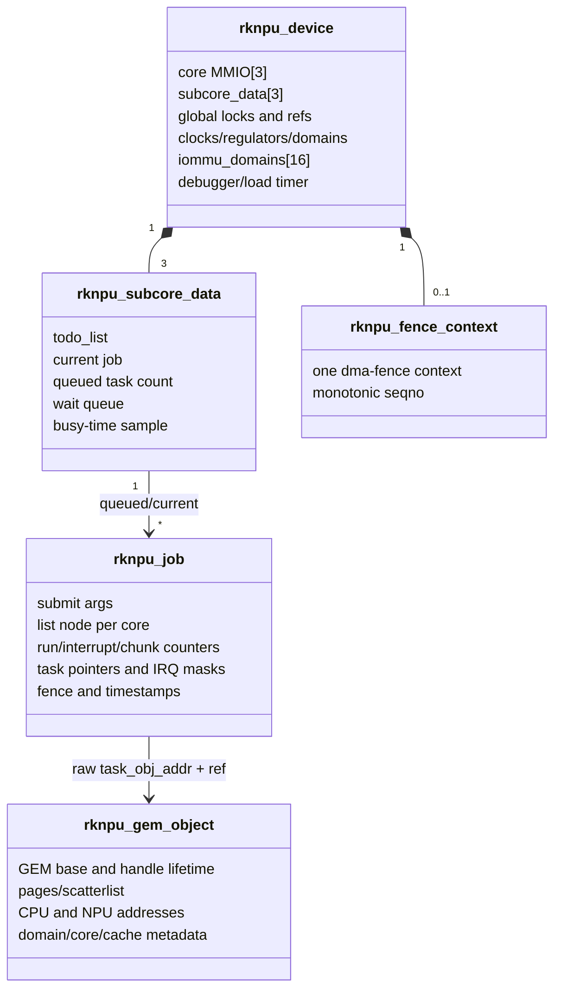

`rknpu_job` contains three separate list nodes because the same job can be
linked into several core queues at once. `run_count` is the launch barrier;
`interrupt_count` is the completion barrier; `submit_count[core]` tracks
4,095-task PC chunks independently.

For a blocking submit, `job->args` points directly to the ioctl's
`rknpu_submit`. For a nonblocking submit, allocation copies the structure
because the ioctl storage disappears on return, and a work item eventually
owns cleanup.

### 4.2 Synchronization map

| Primitive | Protects or coordinates | Notable scope |
|---|---|---|
| `irq_lock` spinlock | per-core current job, FIFO mutation, queued task count, IRQ-entry markers, software busy timestamps | Shared by all cores and callable from IRQ context. |
| `lock` spinlock | alternate-session lists and legacy bandwidth/counter register accesses | It is not the scheduler lock. |
| `power_lock` mutex + `power_refcount` | first-on/last-off sequence and delayed release | Device-global. |
| `domain_lock` mutex + `iommu_domain_refcount` | detach/attach exclusion and current domain | Device-global; other domain callers busy-wait outside it. |
| `reset_lock` mutex | one soft reset at a time | `mutex_trylock()` makes concurrent reset requests silently return success. |
| fence spinlock | one dma-fence timeline and sequence number | One context for the whole device. |
| SRAM allocator mutex | bitmap and free-chunk count | One optional SRAM pool. |
| `run_count` atomic | all selected cores have reserved the job | Initial multicore launch only. |
| `interrupt_count` atomic | all selected cores have retired the job | Final job completion. |
| `submit_count[]` atomic | next PC chunk for a core | Per core within one job. |
| per-core wait queue | blocking waiter observes `JOB_DONE` or reset | Multicore waits use core 0's queue. |

The intended scheduler invariant is:

```text
one subcore current-job pointer
  + one FIFO of jobs waiting for that core
  + task_num equal to running and queued task load
```

A multicore job may be current on an early core while it is still queued on a
busy later core. That is deliberate reservation for the join barrier, not
execution yet.

## 5. Memory architecture

### 5.1 Handle and address taxonomy

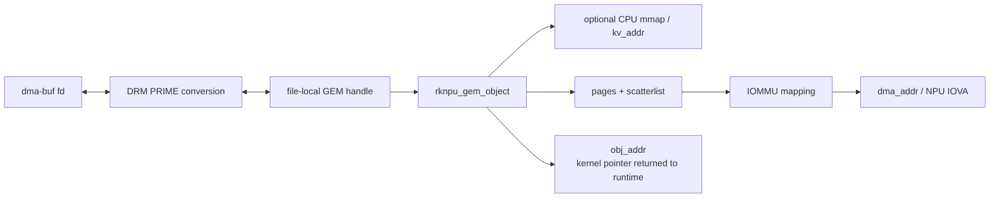

The standard identities are the dma-buf fd and GEM handle. The private ABI adds
two addresses:

- `dma_addr` is the NPU-visible base, physical without an IOMMU or an IOVA with
  one;
- `obj_addr` is the numeric kernel address of the memory object. Submit and
  sync pass it back instead of looking up the caller's GEM handle.

`MEM_CREATE` is also a resolve operation. If its input `handle` names a GEM
object (including a generic PRIME-imported handle), it returns that object's
metadata. If lookup fails—normally for handle zero—it allocates a new object
and handle.

### 5.2 Default GEM allocation decision tree

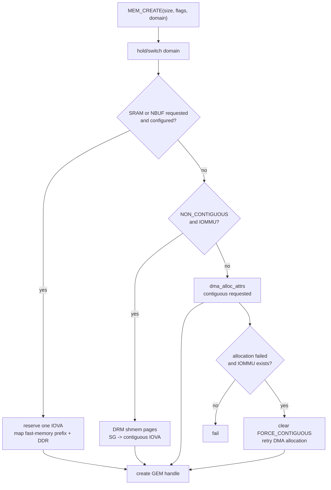

Flag zero means physically contiguous and non-cacheable. Other flags request:

- noncontiguous physical backing;
- cacheable or write-combine CPU mappings;
- an in-kernel mapping, required for the task descriptor object;
- zeroing, DMA32 placement, or explicit IOMMU behavior;
- optional SRAM/NBUF;
- limited IOVA alignment.

For noncontiguous shmem pages, the normal path makes an SG table, maps it for
bidirectional DMA, records the first DMA address, and optionally `vmap()`s the
pages. `RKNPU_MEM_IOMMU_LIMIT_IOVA_ALIGNMENT` diverts mapping into the driver's
own exact-range IOVA allocator to reduce alignment/space expansion; otherwise
the ordinary DMA mapping path is used.

The allocation object owns its backing until the last GEM reference disappears.
A handle delete can therefore race safely with a job only if the job acquired a
valid object reference first. The current ABI's raw-pointer lookup is the weak
link, not GEM's reference-counting concept.

### 5.3 PRIME import/export and mmap

The DRM driver supplies:

- generic fd-to-handle and handle-to-fd PRIME conversion;
- an import hook that attaches the dma-buf to the RKNPU device;
- SG-to-page conversion and the imported base DMA address;
- SG export for locally allocated pages;
- `vmap`, `vunmap`, and dma-buf mmap helpers.

For a local object, `MEM_MAP` creates/returns a DRM fake mmap offset. The mmap
path resets that fake offset, applies cacheable/write-combine/noncached page
protection, and then maps either:

- shmem pages one by one;
- DMA-API memory through `dma_mmap_attrs()`; or
- optional fast-memory physical pages followed by DDR pages.

Imported objects delegate user mmap to the dma-buf exporter.

### 5.4 Cache synchronization

`MEM_SYNC` is accepted only for a GEM object marked cacheable. Contiguous
objects use `dma_sync_single_range_for_{device,cpu}`. Noncontiguous objects walk
their physical SG entries; a synthetic `rknpu_dev` platform device supplies DMA
cache operations without applying the NPU's current IOMMU translation.

Optional SRAM/NBUF bytes are synchronized first with architecture cache
maintenance, then the remaining DDR SG range. The source does not first prove
that `offset + size` is within the object's logical size, so callers must be
trusted and correct in this revision.

Cache sync and completion are independent:

```text
CPU wrote input
  -> sync TO_DEVICE
  -> dependency fence permits launch
  -> NPU job completes / output fence signals
  -> sync FROM_DEVICE
  -> CPU reads output
```

Skipping one step cannot be repaired by another. A signaled fence does not
clean a CPU cache, and a clean cache does not wait for a producer.

### 5.5 SRAM and NBUF

With the optional SRAM path, `rknpu_mm.c` divides the DT-provided range into
page-sized chunks and uses first-fit contiguous bitmap allocation. The GEM path
reserves a contiguous IOVA, maps the fast physical range at its front, then
maps DDR pages after it. The logical mmap likewise presents the fast prefix
before DDR.

The implementation retains a full `size` DDR object while adding the cache
prefix to the internal IOVA mapping. Exact allocation accounting is therefore
an implementation detail; `size`, `sram_size`, mapped IOVA length, and
user-visible logical length should not be treated as interchangeable.

RK3588's `rknpu_config` declares no NBUF, and the pinned base NPU node declares
no SRAM phandle. These paths are real cross-SoC code but are not automatically
present on a ROCK 5B simply because the ABI flags exist.

### 5.6 Alternate dma-heap backend

The mutually exclusive misc backend uses a Rockchip CMA heap. `MEM_CREATE`
either imports the fd supplied in `handle` or allocates a new dma-buf, attaches
it to the NPU device, maps it bidirectionally, and optionally vmaps it for the
task object. A per-open linked list owns the small `rknpu_mem_object` wrappers
and frees them on close.

This path shares the job scheduler by putting the raw `rknpu_mem_object` address
in `task_obj_addr`. It does not share GEM, PRIME handles, SRAM/NBUF combination,
or the DRM file-lifetime model. The quality finding documents a
configuration-specific ioctl-size defect in this backend; GEM is both the
default and the relevant initial forward-port target.

## 6. IOMMU address-space design

### 6.1 Object mapping

The NPU consumes contiguous device addresses even when pages are physically
scattered. The driver either delegates to `dma_map_sg()` or performs the
following:

1. align each SG element to the IOMMU granule while saving original offsets in
   the unused DMA fields;
2. calculate one total IOVA range with segment-boundary padding;
3. allocate that range from the DMA domain's `iova_domain`;
4. call `iommu_map_sg()` once;
5. restore the caller-visible SG shape while assigning contiguous DMA
   addresses;
6. on unmap, derive the total IOVA extent, unmap it, and free the range.

This code is adapted from the kernel's DMA-IOMMU machinery so the RKNPU-specific
alignment flag can choose exact rather than size-aligned allocation. It directly
casts `domain->iova_cookie` to the driver's mirror of the private cookie layout.

### 6.2 Sixteen selectable domains

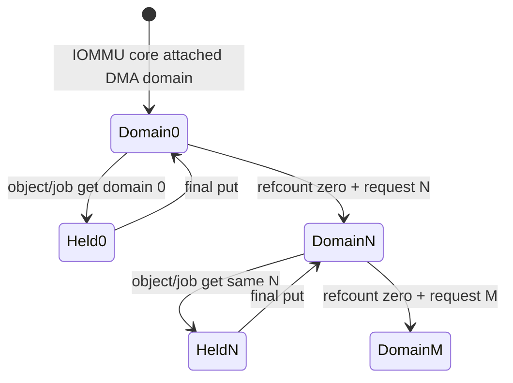

Domain 0 is the original DMA domain. IDs 1–15 are allocated lazily. A new
domain receives a DMA cookie, is attached to the device, has DMA ops set up for
a 4 GiB aperture, and becomes both `rknpu_dev->iommu_domain_id` and the IOMMU
group's default domain.

`rknpu_iommu_domain_get_and_switch()` implements the protocol:

- if the requested id is already current, increment the global reference;
- if no reference is held, detach the current domain and attach/create the
  requested one, then increment;
- if another domain is held, unlock, sleep 10–100 microseconds, and retry for
  up to six seconds.

Memory allocation, memory destruction/sync, explicit domain action, and job
scheduling all use that gate. A job holds its reference from scheduling until
the last selected core completes or the abort path releases it.

### 6.3 What the domains provide—and do not

The scheme lets a matched runtime reuse 32-bit device addresses across several
4 GiB model/context windows. It also prevents the device from being detached
from a domain while a correctly accounted job uses it.

It does **not** provide normal per-client virtual memory:

- ids are caller-selected global integers;
- a domain is not owned by a `drm_file`;
- memory objects and submissions are not checked for matching domain ids;
- all three cores share the one currently attached domain;
- a different-domain submission waits before it can even enter the core FIFO;
- the code writes private IOMMU group/domain internals.

Thus the domain reference count is a hardware attachment invariant, not an
authorization or process-isolation boundary. When the compile-time
`NO_GKI/IOMMU_API/non-ARM` condition is false, all numbered-domain helpers
return success without doing anything, making the ABI's domain id inert.

## 7. Task format and hardware launch

### 7.1 The task object

A task object is CPU/kernel-mapped memory containing packed 40-byte
`rknpu_task` entries. The active PC path consumes only:

| Field | Kernel use |
|---|---|
| `regcmd_addr` | First selected task supplies the NPU-visible register-command address. |
| `regcfg_amount` | First task supplies the command amount converted through the SoC scale. |
| `int_mask` | First task supplies interrupt clear; last task supplies expected completion mask. |
| `int_status` | Blocking completion writes the observed grouped status into a last-task entry. |

The register command itself is opaque to the driver. Its encoding, referenced
tensor/weight addresses, operator semantics, and correctness were determined
before the ioctl.

### 7.2 Submit-to-register translation

For each selected core, `rknpu_job_subcore_commit_pc()`:

1. selects the core-specific task start/count;
2. applies the per-core chunk index, limiting the launch to 4,095 tasks;
3. derives first and last task pointers from `task_obj->kv_addr`;
4. writes the first task's `regcmd_addr` to `PC_DATA_ADDR`;
5. converts `regcfg_amount` and writes `PC_DATA_AMOUNT`;
6. writes last-task interrupt mask and first-task interrupt clear;
7. writes PC control: launch mode, optional ping-pong bit, and task count;
8. writes caller-supplied `task_base_addr` to `PC_DMA_BASE_ADDR`;
9. stores expected mask/task pointers in the job;
10. pulses `PC_OP_EN` from one to zero.

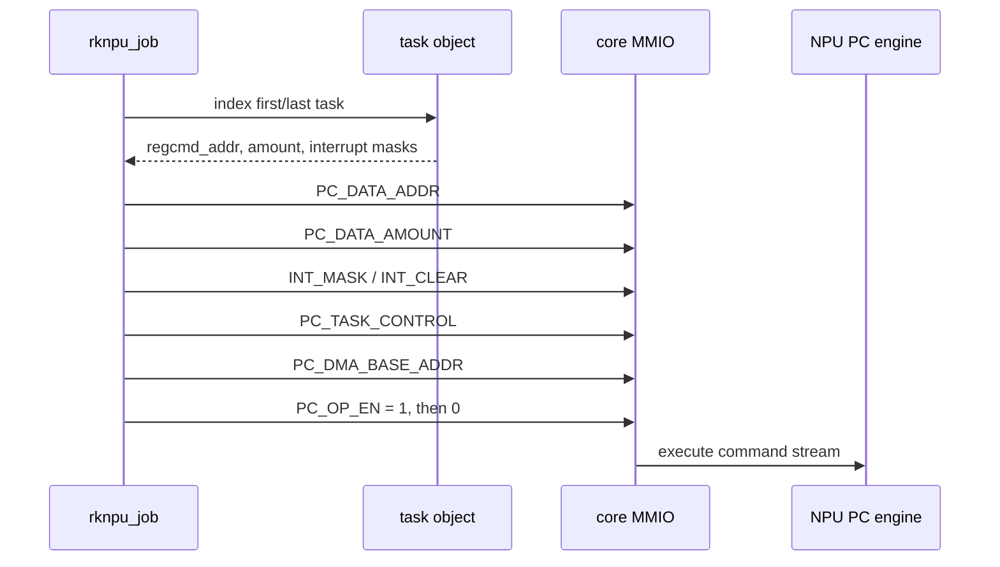

There is no register-by-register allowlist or relocation in the kernel. The
addresses and command program are accepted as emitted.

### 7.3 Chunking

RK3588's 12-bit task-number field caps one PC launch at 4,095 entries. After a
valid completion IRQ, `submit_count[core]` advances. If that core still has
tasks, its next chunk is programmed immediately. Only the first multicore
launch uses the all-core join barrier; subsequent chunks advance independently
per core.

The final chunk count is based on the userspace-supplied task count for that
core. Invalid or overflowing task ranges are not bounded against the task
object before pointer arithmetic.

## 8. Per-core scheduler and multicore barrier

### 8.1 AUTO selection

`core_mask == 0` means AUTO. `rknpu_schedule_core_index()` chooses the core with
the smallest `subcore_data.task_num`, where `task_num` includes running and
queued tasks. Ties prefer the lower core number.

This is weighted least-queued-work selection using task count as the weight.
It is not measured execution time, graph cost, priority, fairness by file, or
thermal topology. The submit `priority` field has no effect.

### 8.2 FIFO and join algorithm

`rknpu_job_schedule()` first acquires the requested IOMMU domain, then appends
the job's per-core list node to each selected FIFO and increments each selected
core's task load. It calls `rknpu_job_next()` for those cores.

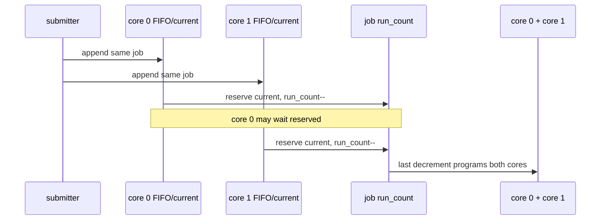

When a core has no current job, `rknpu_job_next()` removes its FIFO head,
stores it as current, records timestamps, and decrements the job's
`run_count`. The last selected core to decrement to zero calls
`rknpu_job_commit()`, which programs every selected core.

This provides atomic **admission** across selected queues: no selected core can
run a later job while waiting for the multicore partner. The cost is
head-of-line blocking. An idle core can sit reserved while a busy selected core
finishes older work.

### 8.3 Userspace-owned partitioning

The kernel does not split the model. The task ranges use an ABI convention:

- one- or two-core jobs read `subcore_task[core_index]`;
- a three-core job reads slots 2, 3, and 4 for cores 0, 1, and 2;
- a single-core SoC falls back to the top-level `task_start/task_number`;
- AUTO rewrites the mask to one selected core before queueing.

The five slots therefore encode two overlapping partition layouts rather than
“one slot per possible core.” This is part of the runtime/driver compatibility
contract.

### 8.4 Accepted and executable masks

Submit validates only `core_mask <= config->core_mask`. On RK3588:

| Mask | Meaning | Launch switch |
|---:|---|---|
| `0x0` | AUTO | Rewritten to one of `0x1`, `0x2`, `0x4` |
| `0x1`, `0x2`, `0x4` | individual core | Implemented |
| `0x3` | cores 0+1 | Implemented |
| `0x7` | cores 0+1+2 | Implemented |
| `0x5`, `0x6` | nonadjacent pairs | Pass numeric validation but have no `rknpu_job_commit()` case |

The public runtime exposes the implemented combinations, so a matched stack
normally avoids the holes. They remain important at the kernel trust boundary.

## 9. IRQ, fence, wait, and timeout lifecycle

### 9.1 Interrupt completion

Each shared core handler:

1. reads the current job under `irq_lock`;
2. if there is none, clears all RKNPU interrupt bits and tries the next job;
3. marks that this job entered the IRQ path;
4. reads `INT_STATUS`;
5. normalizes six two-bit status groups—any bit in a pair makes that pair set;
6. compares the normalized value with the expected last-task mask;
7. clears the interrupt;
8. either launches another PC chunk or retires this core.

An unexpected status is logged and cleared, but the current job remains
installed; later completion or timeout/recovery must resolve it.

When a core retires, the driver clears its current pointer, subtracts its task
load, records a software elapsed interval, and decrements
`interrupt_count`. The last selected core:

- releases the job's IOMMU-domain reference;
- marks `RKNPU_JOB_DONE`;
- signals the output fence if present;
- schedules cleanup for an async job;
- wakes the blocking wait queue.

Finally, each retiring core starts its next FIFO job independently.

### 9.2 Blocking path

A blocking submit keeps the ioctl—and therefore its normal power reference—
open while `rknpu_job_wait()` sleeps. Multicore jobs wait on core 0's queue.
The wait uses the submit timeout in milliseconds.

The loop attempts to distinguish queue delay from execution delay:

- if the job has not reserved all cores (`hw_commit_time == 0`), continue;
- if it has reserved them but less than one timeout interval has elapsed,
  continue;
- stop after at most three waits.

On success it returns `task_number` as the counter and the job's software
elapsed interval. On timeout it reads the PC task counter, logs state, then
`rknpu_job_abort()` may reset the whole device before freeing the job.

`hw_commit_time` is named more strongly than it behaves: each selected core
assigns the one shared field when reserving the job, and the last reservation
immediately triggers initial launch. The final interval therefore starts at
that last software reservation and includes kernel/IRQ overhead; it is neither
a per-core timestamp nor an NPU hardware counter.

### 9.3 Nonblocking path

A nonblocking submit copies its arguments, marks the job async, runs
`rknpu_job_timeout_clean()` over the requested cores, schedules the new job,
and returns. Completion is normally observed through an output fence or a
higher-level runtime wait.

There is no delayed work or timer attached to the job's timeout. The cleanup
function is a synchronous **stale-job sweep invoked by a later nonblocking
submit**. It compares a microsecond timestamp delta directly with the
millisecond timeout field, resets if it considers the current job stale, and
schedules cleanup for that core's current/queued jobs.

Consequences:

- the final hung async job is not timed out by this file until another async
  submission arrives;
- an AUTO submission calls the sweep with mask zero before AUTO is rewritten,
  so that call inspects no core;
- blocking and async paths interpret the timeout through different mechanisms
  and units;
- recovery is device-global and queue cleanup is fragile across multicore
  membership.

These are implementation facts, not intended API semantics.

### 9.4 Fence path

One `dma_fence_context` and sequence number serve the entire RKNPU device.

- `FENCE_IN` converts `fence_fd` to a `dma_fence`. Fences from the driver's own
  context are not waited; foreign contexts are waited synchronously before
  queue admission.
- `FENCE_OUT` allocates a dma-fence, wraps it in a `sync_file`, installs a
  close-on-exec fd, and returns the fd in the submit.
- final selected-core completion signals the output fence before async cleanup.

The implementation does not use DRM syncobjs or scheduler dependencies. The
quality finding records timeout-unit, zero-return, fd-unwind, and allocation
unwind defects in these paths. Treat fence-enabled deployment as version- and
patch-specific, not as guaranteed merely by the flag definitions.

### 9.5 Job state machine

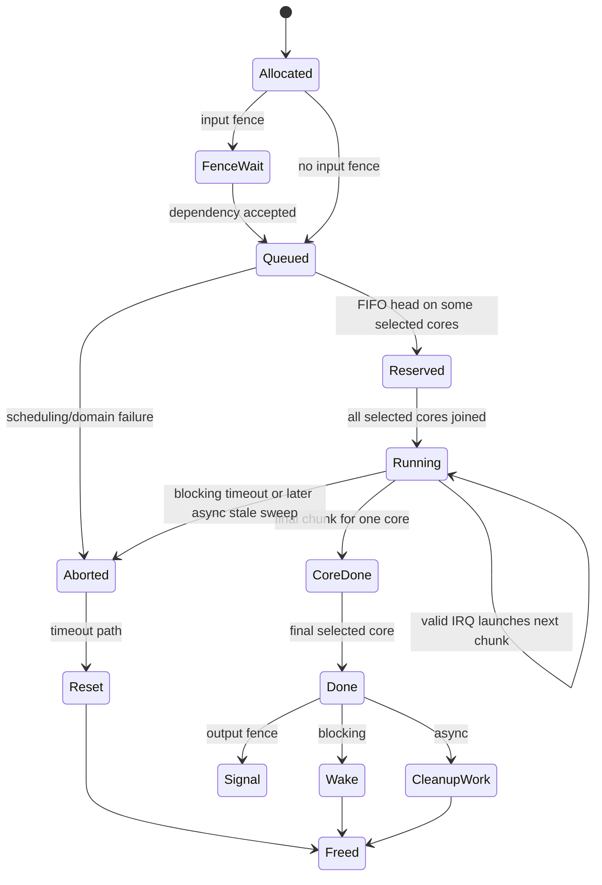

## 10. Power, runtime PM, and devfreq

### 10.1 Ioctl-scoped power references

The normal power policy is:

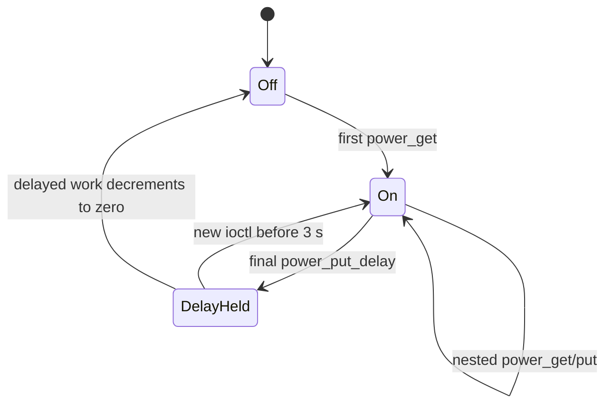

The default delay is 3,000 ms. A delayed put leaves the final reference in place
and queues deferrable work; a new ioctl increments above it and later drops back
to the held reference. This reduces regulator/clock/domain churn across bursty
inference.

The reference belongs to the ioctl, not explicitly to the job. Blocking submit
holds it while waiting. Nonblocking submit returns and schedules the delayed
put even while hardware may still be active, so long-running async execution
relies on the 3-second hold and runtime traffic rather than a per-job PM
reference.

### 10.2 Physical power sequence

Power on:

1. enable optional `rknpu` and `mem` regulators;
2. prepare/enable all clocks;
3. lock the BSP OPP/DVFS coordination;
4. runtime-resume named `npu0`, `npu1`, and `npu2` attached power-domain
   devices;
5. runtime-resume the main NPU device, which also resumes the IOMMU path;
6. run any SoC-specific state initializer;
7. unlock DVFS coordination.

Power off reverses the runtime-PM relationship, but first waits up to 20 ms for
`rockchip_iommu_is_enabled()` to become false. The source comment calls this a
workaround for asynchronous IOMMU suspend: power-domain/clock removal before a
late IOMMU register access could crash. It then releases per-core power domains,
clocks, and regulators.

System suspend acquires an extra RKNPU power reference before
`pm_runtime_force_suspend()` and releases it with the normal delay around
resume. Runtime PM callbacks themselves preserve OPP/read-margin state.

### 10.3 OPP/devfreq is policy plumbing, not a load governor

The driver names its governor `rknpu_ondemand`, but its implementation is:

```text
if ondemand_freq is nonzero:
    target = ondemand_freq
else:
    target = previous_freq
```

`npu_devfreq_get_dev_status()` returns zero without filling busy/total time.
The governor does not read per-core queue state or debugfs load. Frequency
changes are instead driven by an explicit `ondemand_freq`, BSP system-monitor
temperature/voltage adjustment, thermal cooling constraints, or other devfreq
updates.

The RK3588 OPP integration adds substantial silicon policy:

- nvmem leakage, OPP info, specification, and customer-demand bins select
  supported hardware/voltages;
- read-margin values are programmed in three GRF locations;
- clock, NPU voltage, and memory voltage transitions are ordered through
  Rockchip OPP helpers;
- the base table provides normal 300 MHz through 1 GHz points;
- DT declares 1 GHz as its initialization preference, low-temperature voltage
  floors, and an 800 MHz maximum above 85 °C.

This is why `rknpu_devfreq.c` is large even though its governor logic is tiny:
most of the file is safe voltage/clock/silicon-bin integration, with branches
for several kernel API generations.

### 10.4 Load reporting is separate

A 1-second hrtimer samples each subcore. While `subcore_data->job` is non-NULL,
elapsed wall time since `job->hw_recoder_time` is added to that core's busy
bucket. Debugfs divides the last bucket by one second and caps it at 100%.

This measures software ownership of the core's current-job slot. It can include
multicore barrier wait and does not use hardware activity counters. It is useful
for an operational hint, not exact NPU utilization or devfreq input.

## 11. Reset, observability, and removal

### 11.1 Device-wide soft reset

`rknpu_soft_reset()` uses a trylocked global reset mutex:

1. set `soft_reseting`;
2. sleep 100 ms;
3. wake every core wait queue;
4. assert all reset controls, wait 10 microseconds;
5. deassert all reset controls, wait 10 microseconds;
6. detach and reattach the current IOMMU domain;
7. clear reset state and rerun any SoC initializer.

On RK3588 the reset array contains both ACLK and HCLK resets for all three
cores. Reset is therefore not scoped to the offending core, context, file, or
domain. The reset function also does not itself drain all scheduler lists;
blocking abort or async cleanup is expected to reconcile job objects around it.

### 11.2 Observability surface

When enabled, debugfs and procfs create an `rknpu` directory with:

| File | Read | Write |
|---|---|---|
| `version` | driver semantic version | none |
| `load` | per-core last 1-second software busy percentage | none |
| `power` | whether power refcount is positive | `on`/`off` manipulate command-line refs |
| `freq` | clock rate | explicit devfreq target |
| `volt` | regulator voltage | none |
| `delayms` | delayed power-off milliseconds | set delay |
| `reset` | whether soft reset is enabled | `1` resets; `on`/`off` enable/bypass |
| `mm` | optional SRAM bitmap and accounting | none |

The power display reports the software reference, not a direct regulator,
clock, or power-domain measurement. The load display has the reservation-time
boundary described above.

Kernel logs cover probe identity, IOMMU mode, SRAM/NBUF discovery, allocation,
domain switching, invalid IRQ status, blocking wait state, timeout/reset, and
power errors. The driver has module parameters to bypass IRQ handling or soft
reset for diagnostics; either fundamentally changes completion/recovery and is
not a normal runtime setting.

### 11.3 Removal

Remove cancels the power workqueue and load timer, removes debug entries, warns
if any core still has a current or queued job, destroys optional memory/domain
state, unregisters the front end, tears down devfreq and power domains, and
disables runtime PM.

There is no per-file scheduler entity to kill and no framework-driven
job-cancellation drain. Live work is treated as a warning/invariant violation,
not a normal close/remove lifecycle. The DRM close path drops GEM handles, but
does not find and cancel jobs submitted by that file because jobs do not retain
file ownership.

## 12. Design choices, strengths, and costs

### 12.1 Deliberate architecture

| Choice | Product benefit | Engineering cost |
|---|---|---|
| Compile/emit in userspace | Kernel stays independent of graph formats and compiler evolution. | Closed runtime and kernel ABI must match; command provenance is opaque. |
| Tiny task-to-PC launch layer | Low kernel overhead and direct hardware control. | Kernel cannot meaningfully validate register-command semantics. |
| One driver with SoC configuration records | RK356x through later SoCs share scheduling/memory/PM code. | Numerous conditional API/feature branches obscure which path is live on RK3588. |
| Custom per-core FIFO and atomic join | Small implementation that directly models three independent cores. | No per-file fairness, priority, standard scheduler teardown, or isolated recovery. |
| AUTO by queued task count | Cheap load spreading without graph knowledge. | Task count is a poor cost estimate; multicore reservations cause head-of-line blocking. |
| Whole-device numbered domains | Runtime can reuse compact IOVAs across large model/context sets. | Switching is global, busy-waited, tied to private IOMMU internals, and not client isolation. |
| DRM GEM/PRIME front end | Reuses mature allocation, mmap, dma-buf, and render-node infrastructure. | Raw `obj_addr` submit/sync bypasses the ownership property GEM handles should provide. |
| Optional dma-heap backend | Fits memory-constrained/vendor products without DRM. | Duplicated lifetime/ioctl code and a separate configuration-specific attack surface. |
| Ioctl power bracketing plus delay | Simple and effective for bursty synchronous inference. | Async job lifetime is not the PM lifetime; global refs are vulnerable to error-path imbalance. |
| Device-wide reset | Can recover a fixed appliance stack from a wedged NPU. | One bad job disrupts every core/context and leaves custom queues to reconcile. |

### 12.2 What the implementation does well

- RK3588's three cores are modeled explicitly rather than hidden behind a
  single serialized queue.
- Large command ranges are chunked without round-tripping through userspace.
- GEM/PRIME, dma-buf import/export, mmap, cache sync, IOMMU, optional fast
  memory, fences, runtime PM, OPPs, thermals, and reset are integrated in one
  driver.
- The SoC record localizes DMA width, task-field width, core count, register
  behavior, optional cache topology, and counters.
- The delayed power hold matches the common short, repeated inference workload.
- The runtime can query driver/hardware identity and the driver reports a
  stable semantic version.

Those strengths explain why a qualified vendor tuple can be capable and fast.

### 12.3 Trust and multi-client boundary

The default render-node appearance should not be mistaken for a standard
untrusted DRM execution ABI. Source inspection finds:

- kernel object addresses and NPU addresses returned to userspace;
- submit/sync dereferencing those addresses without file-local handle lookup;
- no task/subcore bounds or register-command provenance validation;
- global domain, reset, nice, and legacy action access from render-allowed
  ioctls;
- masks/flags accepted more broadly than the execution switch;
- custom fence/timeout/error unwinds;
- no per-file scheduler or close-time job cancellation.

The canonical evidence and comparison with mature accelerator drivers is the
[RKNPU quality finding](../../../findings/2026-07-16-rockchip-bsp-driver-quality.md#rknpu-deep-dive-capable-fixed-stack-unsafe-multi-client-abi).
This document explains the mechanisms that produce that assessment; it does not
duplicate the full defect ledger or provide a trigger.

Operationally, access to the RKNPU render node or `/dev/rknpu` is a trusted-code
boundary. A fixed single-purpose image can make that an explicit policy. A
multi-user desktop/container deployment must not infer safety merely from the
word “render.”

## 13. Forward-port boundaries

The architecture divides a forward port into one ABI-preservation decision,
three hard integration areas, and several mechanical areas.

### 13.1 ABI decision

Mainline-era RK3588 kernels may describe the same NPU cores with the Rocket
driver and a different userspace ABI. Rocket/Mesa-Teflon and
RKNPU/`librknnrt` are not interchangeable. Carrying RKNPU means choosing the
vendor ABI, replacing the competing DT ownership, and preserving version
reporting expected by the proprietary runtime.

### 13.2 Hard integration areas

| Area | Why it is hard |
|---|---|
| IOMMU | The driver mirrors `iommu_dma_cookie`, accesses `domain->iova_cookie`, defines a private copy of `iommu_group`, mutates `default_domain`, and uses detach/attach APIs that changed. |
| devfreq/OPP | It depends on BSP `rockchip_opp_select`, system-monitor, IPA/thermal, nvmem/read-margin, and regulator-ordering infrastructure absent from a plain mainline tree. |
| DT ownership | RKNPU needs one three-window platform node plus its IOMMU and vendor power/clock contract; it cannot bind the per-core Rocket layout at the same time. |

### 13.3 Mechanical/optional areas

- `rknpu_gem.c` carries DRM, VM fault/PFN, PRIME-vmap, and DMA-map compatibility
  branches spanning old kernels through 6.1.
- The default GEM backend is the smallest runtime-compatible target; the
  BSP-only dma-heap backend can be omitted initially.
- RK3588 has no configured NBUF, and SRAM depends on optional Kconfig/DT state,
  so both fast-memory paths can be deferred if runtime validation confirms DDR
  fallback.
- Devfreq has complete no-op header stubs when `PM_DEVFREQ` is absent, but probe
  still needs a safe fixed clock/voltage state.
- Fence support is optional and already needs correctness repair; basic
  synchronous inference should be proved separately from fence-enabled
  pipelines.

The scoped work package and current estimate live in the dated
[forward-port finding](../../../findings/2026-07-24-rknpu-forward-port-scoping.md).
Any implemented port must still pass compile, probe, known-output inference,
repeated lifecycle, core-mask, concurrent-context, dma-buf/cache, timeout
recovery, and access-policy gates. Source equivalence is not board evidence.

## 14. Source map by question

All links below are pinned to the inspected commit.

| Question | Source anchor |
|---|---|
| Build options and object composition | [`Kconfig`](https://github.com/rockchip-linux/kernel/blob/b4ef083dc0c3608e744deabb43dc6b781aadbe6e/drivers/rknpu/Kconfig), [`Makefile`](https://github.com/rockchip-linux/kernel/blob/b4ef083dc0c3608e744deabb43dc6b781aadbe6e/drivers/rknpu/Makefile) |
| Private structs, flags, actions, and ioctls | [`rknpu_ioctl.h`](https://github.com/rockchip-linux/kernel/blob/b4ef083dc0c3608e744deabb43dc6b781aadbe6e/drivers/rknpu/include/rknpu_ioctl.h) |
| Device/SoC structures and global state | [`rknpu_drv.h`](https://github.com/rockchip-linux/kernel/blob/b4ef083dc0c3608e744deabb43dc6b781aadbe6e/drivers/rknpu/include/rknpu_drv.h) |
| SoC records, action dispatch, front ends, PM, probe/remove | [`rknpu_drv.c`](https://github.com/rockchip-linux/kernel/blob/b4ef083dc0c3608e744deabb43dc6b781aadbe6e/drivers/rknpu/rknpu_drv.c) |
| Scheduler, PC launch, IRQ, fences, waits, timeout | [`rknpu_job.c`](https://github.com/rockchip-linux/kernel/blob/b4ef083dc0c3608e744deabb43dc6b781aadbe6e/drivers/rknpu/rknpu_job.c) |
| GEM/PRIME allocation, mmap, cache sync, SRAM/NBUF mapping | [`rknpu_gem.c`](https://github.com/rockchip-linux/kernel/blob/b4ef083dc0c3608e744deabb43dc6b781aadbe6e/drivers/rknpu/rknpu_gem.c) |
| Alternate dma-heap/misc memory path | [`rknpu_mem.c`](https://github.com/rockchip-linux/kernel/blob/b4ef083dc0c3608e744deabb43dc6b781aadbe6e/drivers/rknpu/rknpu_mem.c) |
| IOVA mapping and numbered domain switching | [`rknpu_iommu.c`](https://github.com/rockchip-linux/kernel/blob/b4ef083dc0c3608e744deabb43dc6b781aadbe6e/drivers/rknpu/rknpu_iommu.c) |
| dma-fence timeline and sync-file fd | [`rknpu_fence.c`](https://github.com/rockchip-linux/kernel/blob/b4ef083dc0c3608e744deabb43dc6b781aadbe6e/drivers/rknpu/rknpu_fence.c) |
| Reset-controller sequence | [`rknpu_reset.c`](https://github.com/rockchip-linux/kernel/blob/b4ef083dc0c3608e744deabb43dc6b781aadbe6e/drivers/rknpu/rknpu_reset.c) |
| OPP, bins, voltages, monitor, thermal, governor | [`rknpu_devfreq.c`](https://github.com/rockchip-linux/kernel/blob/b4ef083dc0c3608e744deabb43dc6b781aadbe6e/drivers/rknpu/rknpu_devfreq.c) |
| debugfs/procfs controls | [`rknpu_debugger.c`](https://github.com/rockchip-linux/kernel/blob/b4ef083dc0c3608e744deabb43dc6b781aadbe6e/drivers/rknpu/rknpu_debugger.c) |
| Optional SRAM bitmap allocator | [`rknpu_mm.c`](https://github.com/rockchip-linux/kernel/blob/b4ef083dc0c3608e744deabb43dc6b781aadbe6e/drivers/rknpu/rknpu_mm.c) |
| RK3588 core, clock, reset, OPP, domain, and IOMMU wiring | [`rk3588s.dtsi`](https://github.com/rockchip-linux/kernel/blob/b4ef083dc0c3608e744deabb43dc6b781aadbe6e/arch/arm64/boot/dts/rockchip/rk3588s.dtsi) |

Project vocabulary is in [`../keywords.md`](../keywords.md). The project front
door is [`../README.md`](../README.md), and the end-to-end userspace/kernel map
is [`how-rknpu-works.md`](how-rknpu-works.md).
