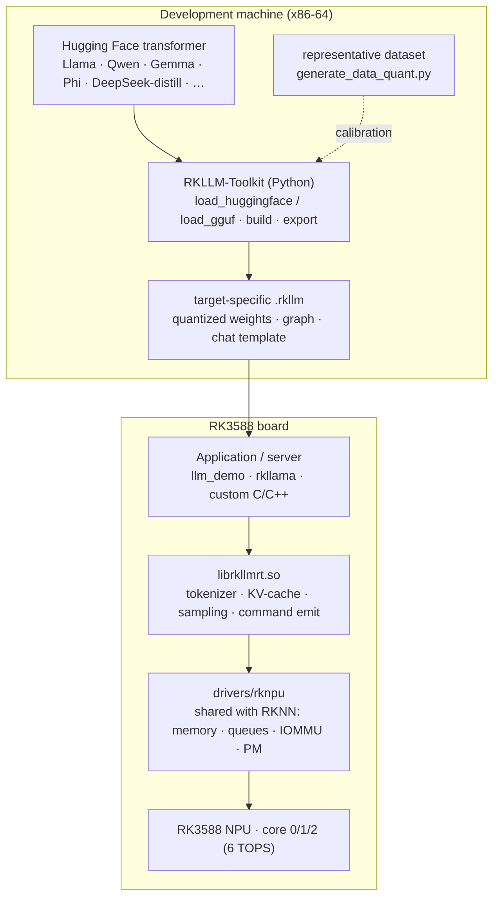
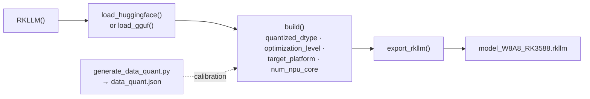

# Running LLMs on the RK3588 NPU: the RKLLM stack

The [`how-rknpu-works.md`](how-rknpu-works.md) guide follows a framework model
(ONNX/PyTorch/TFLite) through RKNN-Toolkit2 into a compiled `.rknn` graph run by
`librknnrt`. That path is vision/CNN-shaped. Large language models use a
**separate Rockchip stack, RKLLM** (`airockchip/rknn-llm`), that reuses the same
`drivers/rknpu` kernel driver but ships its own conversion toolkit, model format,
and native runtime.

The central distinction mirrors the RKNN one:

> RKLLM-Toolkit converts and quantizes a Hugging Face transformer into a
> target-specific `.rkllm` file, `librkllmrt.so` turns per-token work and the
> KV-cache into NPU submissions, and `drivers/rknpu` schedules those submissions
> on the same three-core RK3588 NPU. The kernel does not know it is running a
> language model any more than it knows it is running a CNN — it schedules
> register-command programs against NPU-visible memory.

## Evidence and limits

This document is a **web-and-documentation synthesis**, not a source-level
account like [`how-rknpu-works.md`](how-rknpu-works.md). It is compiled from the
public `airockchip/rknn-llm` repository (README, `CHANGELOG.md`, examples),
Rockchip board-vendor deployment guides (Radxa, ArmSoM, Firefly, Banana Pi), and
community projects (`ezrknpu`, `rkllama`) as read on **2026-07-17**. The RKLLM
toolkit and runtime are **proprietary prebuilt binaries**, exactly like the RKNN
runtime; no component was decompiled, and version-specific numbers below are as
reported by those sources, not measured here.

Trust tag: **UNVERIFIED / SOURCE-INSPECTED (docs only)**. As with RKNN, **this
repo has not run RKLLM on the ROCK 5B** — support coverage row
[C16](../../../docs/support-coverage.md) stays `UNASSESSED` for on-board LLM
inference, not failed or validated.

One tie-in is already established, though: the RKNPU kernel driver this repo
inspected is **0.9.8, date `20240828`** (see
[`how-rknpu-works.md` §Evidence](how-rknpu-works.md#evidence-and-limits)), and
RKLLM's community requirement is **NPU driver ≥ 0.9.6, 0.9.8 recommended**. The
driver already forward-ported here therefore satisfies RKLLM's kernel-side
prerequisite; what is unproven is the userspace runtime on this image.

## 1. Where RKLLM sits relative to RKNN



The shaded line is the kernel driver: `librknnrt.so` (RKNN) and `librkllmrt.so`
(RKLLM) are **sibling userspace runtimes over one `drivers/rknpu`**. They do not
share a model format (`.rknn` vs `.rkllm`) or a runtime `.so`, but they share the
device node, the IOMMU/GEM memory model, PC-mode submission, and multi-core
launch documented in [`how-rknpu-works.md`](how-rknpu-works.md). The INT4/INT8
`rknn_matmul_*` primitive described there (§5.1) is the hardware substrate a
transformer's dense layers lean on.

## 2. The two components

| Component | Runs where | Owns |
|---|---|---|
| **RKLLM-Toolkit** | x86-64 Linux host, Python (conda, 3.8–3.12) | Loading a Hugging Face (or GGUF) model, calibration, quantization to `w8a8`/`w4a16`, fixing `max_context` and target platform, and exporting a `.rkllm` file. Distributed as a `rkllm_toolkit-*.whl`. |
| **RKLLM Runtime** | Target board, native process | `librkllmrt.so` + `rkllm.h`: tokenization, KV-cache management, per-token NPU submission, sampling, streaming callbacks, LoRA, and prompt-cache load/store. A 32-bit `librkllmrt` variant exists for RV1103/RV1106-class parts. |

Both are proprietary prebuilts. The repository also vendors a copy of the RKNPU
kernel driver under `rknpu-driver/` for convenience, but the authoritative driver
is the in-tree `drivers/rknpu` this repo tracks.

## 3. Supported chips, models, and quantization

**Chips:** RK3588 / RK3588S, RK3576, RK3562, and RV1126B. On RK3588 the NPU is
rated at **6 TOPS** across three cores; RKLLM can bind one or more cores
(`num_npu_core`) at conversion time.

**Quantization:** `w8a8` (8-bit weight / 8-bit activation) and `w4a16` (4-bit
weight / 16-bit activation) are the two headline modes. Later toolkit versions
add group-wise quantization and imported `GPTQ-Int8` / `GRQ-Int4` schemes. The
practical trade-off shows up in RAM: an 8B model is roughly **8.3 GB at w8a8**
versus **4.5 GB at w4a16** (community figure for Qwen3-8B).

**Model families** (growing per release; see §8): Llama / TinyLlama / Llama3,
Qwen / Qwen2 / Qwen2.5 / Qwen3 / Qwen3.5, Phi-2 / Phi-3, Gemma / Gemma2 / Gemma3 /
Gemma3n / Gemma4, ChatGLM3-6B, InternLM2, MiniCPM3 / MiniCPM4, TeleChat2, RWKV7,
SmolLM3, and DeepSeek-R1-Distill variants. **Multimodal** vision-language models
are supported by pairing a `.rkllm` language model with a `.rknn` vision encoder:
Qwen2-VL / Qwen2.5-VL / Qwen3-VL, MiniCPM-V-2.6, InternVL2 / InternVL3 /
InternVL3.5, Janus-Pro-1B, SmolVLM, and DeepSeekOCR.

## 4. Conversion workflow (host)



The canonical example throughout the vendor docs is
**DeepSeek-R1-Distill-Qwen-1.5B** (and **Qwen2.5-1.5B-Instruct**):

```bash
# host, in a conda env (python 3.8–3.12), toolkit wheel installed
cd examples/DeepSeek-R1-Distill-Qwen-1.5B_Demo/export
python generate_data_quant.py -m /path/to/DeepSeek-R1-Distill-Qwen-1.5B
python export_rkllm.py     # sets target_platform, quantized_dtype, max_context
```

`max_context` defaults to 4096, must be **≤ 16384 and a multiple of 32**, and is
**baked into the artifact** — the runtime cannot exceed it later. For a 2-core
RK3576 target the demo sets `target_platform = "RK3576"` and `num_npu_core = 2`.

## 5. Board deployment (target)

The runtime side is cross-compiled on the host and pushed to the board:

```bash
# host: cross-compile the demo against librkllmrt.so
#   toolchain: gcc-arm-10.2-2020.11-x86_64-aarch64-none-linux-gnu (Android: NDK r18b)
cd examples/.../deploy
./build-linux.sh                       # or ./build-android.sh
adb push install/demo_Linux_aarch64 /data
adb push model_W8A8_RK3588.rkllm /data/demo_Linux_aarch64

# board:
export LD_LIBRARY_PATH=./lib
ulimit -Sn 50000                       # runtime opens many fds
./fix_freq_rk3588.sh                   # pin NPU/CPU/DDR clocks (stops throttling skew)
taskset f0 ./llm_demo model.rkllm 2048 4096   # args: max_new_tokens  max_context_len
```

`max_new_tokens ≤ max_context_len ≤` the `max_context` chosen at conversion. The
`taskset f0` pins the demo to the RK3588 big cores; `fix_freq_rk3588.sh` fixes
clocks so measurements are not confounded by DVFS. Practical requirements from
the field guides: **≥ 8 GB RAM** (roughly 70% consumed by a mid-size model),
active cooling to avoid thermal throttling, and an M.2 SSD for model storage.

## 6. Runtime API surface

The native flow, from `rkllm.h`, is small and callback-driven:

- `rkllm_createDefaultParam()` → fills an `RKLLMParam` (model path, `max_context_len`,
  `max_new_tokens`, top-k/top-p/temperature, repeat penalty, core mask, extend
  params).
- `rkllm_init()` loads the `.rkllm` and registers a **token callback** that fires
  as generation streams.
- `rkllm_run()` (and async/batch variants) submits an input. RKLLM accepts four
  input types — **prompt text, embeddings, token ids, or multimodal** (text +
  image embeddings from the `.rknn` vision encoder).
- `rkllm_destroy()` tears down the context.

Runtime features layered on top over successive releases: **LoRA adapter
loading**, **prompt-cache** store/preload (reuse a system-prompt prefix across
turns), **multi-turn chat templates** (auto-parsed from the model at conversion),
**function/tool calling**, **multi-batch and multi-instance** inference, and an
**OpenAI-compatible server** wrapper.

## 7. Performance reality

The load-bearing fact for anyone planning to use this: **token generation on the
RK3588 NPU is bound by DDR memory bandwidth, not NPU compute.** Decode throughput
is therefore comparable to CPU/GPU on the same board; the NPU's real wins are
(a) **much faster prefill** (prompt ingestion) and (b) **power efficiency plus
freeing the GPU/CPU** for other work.

Vendor/community-reported RK3588 figures (not measured in this repo):

| Model | Quant | Reported tokens/s | Source |
|---|---|---|---|
| TinyLlama 1.1B | w8a8 | ~15.0 | Radxa via CNX Software |
| Qwen2.5-1.5B-Instruct | w8a8 | ~15.4 | Radxa docs |
| ChatGLM3 6B | w8a8 | ~3.7 | Radxa via CNX Software |

Larger models (7–8B) drop into the low single digits per second on 6 TOPS and are
mainly interesting for offline/edge use, not interactive latency. Treat these as
order-of-magnitude anchors until re-measured on this board.

## 8. Version history (from `CHANGELOG.md`)

RKLLM first shipped around **May 2024**. The feature progression is the clearest
signal of maturity:

| Version | Notable additions |
|---|---|
| v1.0.0 | Initial RK3588/RK3576 support; Llama/Qwen/Qwen2/Phi-2; `w8a8` + `w4a16`. |
| v1.0.1 | Gemma, ChatGLM3, MiniCPM, InternLM2, Phi-3; server invocation, inference interrupt, logprob. |
| v1.1.0 | Group-wise quantization; **LoRA**; **GGUF import**; **prompt cache**; four input types (prompt/embedding/token/multimodal); Llama3, Gemma2, MiniCPM3. |
| v1.2.0 | Custom-model conversion; multi-turn chat templates; **16K context**; GPTQ-Int8 / GRQ-Int4; **RK3562**; InternVL2 / Janus / Qwen2.5-VL; Python 3.9/3.11/3.12. |
| v1.2.1 | RWKV7, Qwen3, MiniCPM4; **RV1126B**; **function calling**; cross-attention; multi-batch; OpenAI-compatible server. |
| v1.2.2 | Gemma3n, InternVL3; multi-instance inference; LongRoPE. |
| v1.2.3 | InternVL3.5, DeepSeekOCR, Qwen3-VL; automatic embedding-cache reuse; external chat-template files. |
| v1.3.0 | Qwen3.5, Gemma4, SmolLM3; 32-bit optimization; multiple EOS token ids (`ignore_eos_token`); tokenizer/embedding callbacks; better RK3576 long-context decode. |

(v1.3.0 is the latest as of 2026-07-17; exact per-release dates are not published
in the changelog.)

## 9. Ecosystem wrappers

The raw `llm_demo` is a reference harness. Two community projects make RKLLM
usable as a service:

- **`rkllama`** (`NotPunchnox/rkllama`) — a Flask REST server exposing both
  **Ollama** (`/api/chat`, `/api/generate`, `/api/pull`, …) and **OpenAI**
  (`/v1/chat/completions`, `/v1/embeddings`, …) endpoints, so Open WebUI /
  LangChain / Continue.dev talk to it unmodified. Adds multi-model loading,
  load-on-demand + auto-unload, persistent prompt cache, streaming, tool calling,
  multimodal, and experimental GGUF via a llama.cpp fork. Pulls `.rkllm` models
  straight from Hugging Face; ships a Docker image. RK3588/S + RK3576.
- **`ezrknpu`** (`Pelochus`) — a one-command installer bundling `ezrknn-llm` and
  `ezrknn-toolkit2`. Requires NPU driver ≥ 0.9.6 (0.9.8 recommended, which
  Armbian ships), Python 3.12, Debian 11 / Ubuntu 22.04+, RK3588/S only. Its
  `ezrkllm-collection` of pre-converted models on Hugging Face is largely
  outdated; the docs point at community converters (imkebe, c01zaut, macrae)
  instead.

A representative production pattern (Sngular's Qwen3-on-Orange-Pi-5 guide) runs
`rkllama` under **MicroK8s** for self-healing/restart, with two gotchas worth
recording: the pod needs `privileged: true` and a `/dev` mount to reach the NPU,
and Hugging Face models must be pulled with `huggingface-cli download` (a plain
`git clone` fetches 135-byte LFS pointer files and fails at load with
`MetadataIncompleteBuffer`).

## 10. What would move C16's LLM half off `UNASSESSED`

To make an on-board RKLLM claim to the standard this repo holds RKNN to:

1. Pin the RKLLM toolkit + runtime version and the `.rkllm` model (family, params,
   `w8a8`/`w4a16`, `max_context`).
2. Record the NPU driver identity on the running image (`cat
   /sys/kernel/debug/rknpu/version`) and confirm it is ≥ 0.9.6.
3. Run a known-prompt generation on a small model (DeepSeek-R1-Distill-Qwen-1.5B
   is the documented easy case), capturing tokens/s, time-to-first-token, and
   peak RSS.
4. Note core-mask behavior and any fault/timeout/reset in `dmesg`, so it ties back
   to the driver behavior in [`how-rknpu-works.md`](how-rknpu-works.md).

## 11. Source map

| Question | Source |
|---|---|
| Toolkit, runtime, models, changelog | [`airockchip/rknn-llm`](https://github.com/airockchip/rknn-llm) |
| Release context, initial models, GPU-vs-NPU framing | [CNX Software, 2024-07-15](https://www.cnx-software.com/2024/07/15/rockchip-rkllm-toolkit-npu-accelerated-large-language-models-rk3588-rk3588s-rk3576/) |
| End-to-end convert + deploy steps | [ArmSoM RKLLM docs](https://docs.armsom.org/advanced-manual/rknn-llm), [Radxa ROCK 5B RKLLM usage](https://docs.radxa.com/en/rock5/rock5b/app-development/ai/rkllm-usage) |
| Ollama/OpenAI-compatible server | [`NotPunchnox/rkllama`](https://github.com/NotPunchnox/rkllama) |
| One-command installer + driver requirement | [`Pelochus/ezrknpu`](https://github.com/Pelochus/ezrknpu) |
| Production K8s deployment + gotchas | [Sngular Qwen3 on Orange Pi 5](https://www.sngular.com/insights/471/the-definitive-guide-to-deploying-qwen3-on-the-npu-of-the-orange-pi-5-pro-max-plus-ultra-using-rkllama-and-microk8s) |
| Shared kernel driver, memory, submission | [`how-rknpu-works.md`](how-rknpu-works.md) |

Project vocabulary is in [`../keywords.md`](../keywords.md); the project front
door is [`../README.md`](../README.md).
