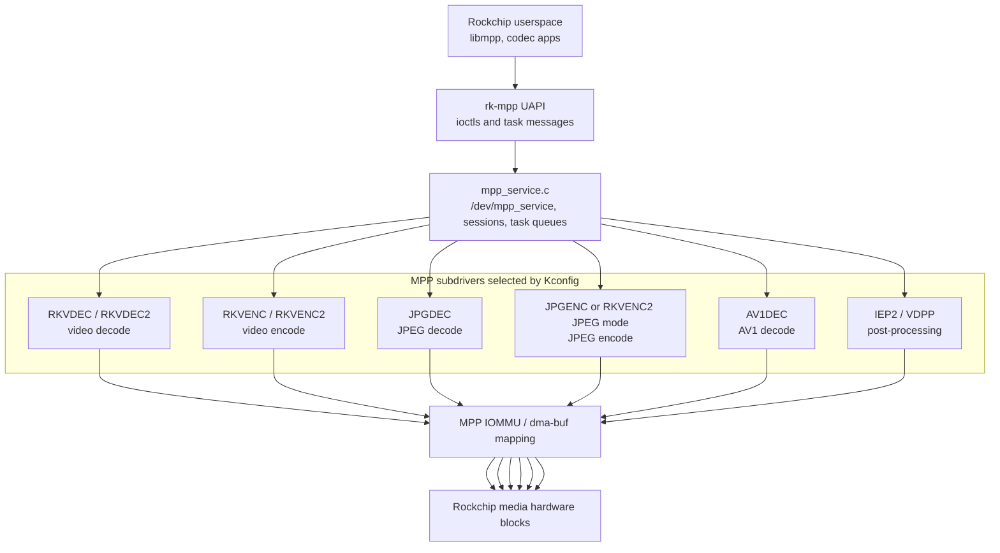
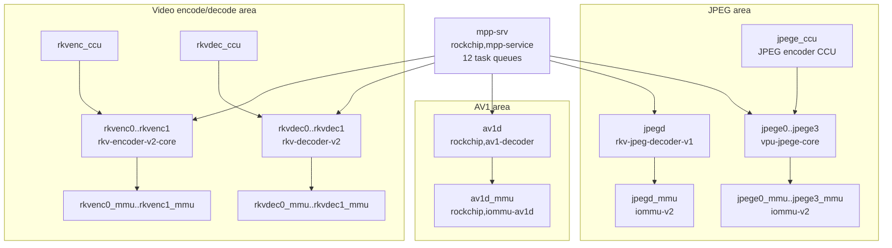
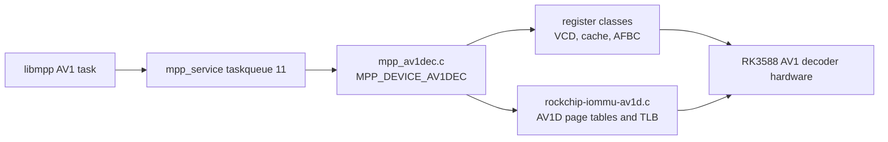
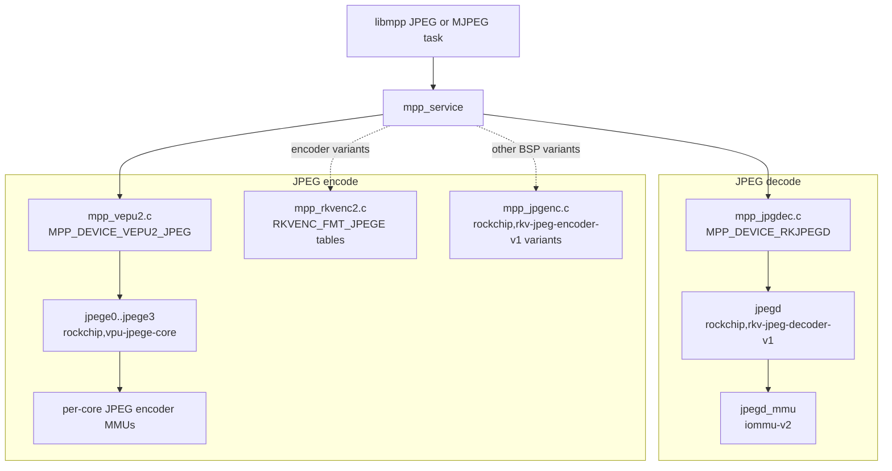
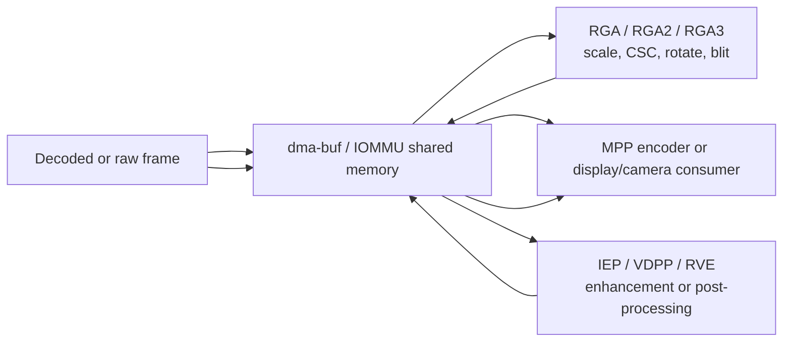

# Area 3: Media codecs and 2D video processing

## Normal-user view

This area is the BSP's hardware video and image-processing stack. It lets
Rockchip userspace use dedicated hardware for video decode, video encode, JPEG,
AV1 decode on SoCs that have it, post-processing, scaling, color conversion, and
blits.

A user sees this as:

- lower CPU load during video playback or encode,
- hardware-assisted camera/recording products,
- fast transcode and thumbnail paths,
- RGA-accelerated resize, crop, rotate, and color conversion,
- vendor libraries such as libmpp and librga opening BSP device nodes.

## Kernel-developer view

The BSP adds a vendor MPP framework under `drivers/video/rockchip/mpp/`. This is
not the upstream V4L2 codec API. Userspace submits register/message tasks to the
MPP service; subdrivers map buffers, translate file descriptors to IOVAs, select
a hardware block, write registers, wait for IRQ completion, and return status.

The core files are:

- `drivers/video/rockchip/mpp/mpp_service.c`
- `drivers/video/rockchip/mpp/mpp_common.c`
- `drivers/video/rockchip/mpp/mpp_iommu.c`
- `include/uapi/linux/rk-mpp.h`

The optional subdrivers are selected by `drivers/video/rockchip/mpp/Kconfig` and
linked by `drivers/video/rockchip/mpp/Makefile`:

| Kconfig symbol | Source file(s) | Device family |
|----------------|----------------|---------------|
| `ROCKCHIP_MPP_RKVDEC` | `mpp_rkvdec.c` | older RKV decoder path |
| `ROCKCHIP_MPP_RKVDEC2` | `mpp_rkvdec2.c`, `mpp_rkvdec2_link.c` | RKV decoder v2 / RK3588 RKVDEC cores |
| `ROCKCHIP_MPP_RKVENC` | `mpp_rkvenc.c` | older RKV encoder path |
| `ROCKCHIP_MPP_RKVENC2` | `mpp_rkvenc2.c` | RKV encoder v2 / RK3588 RKVENC cores; also carries JPEG register tables for encoder variants |
| `ROCKCHIP_MPP_VDPU1` / `VDPU2` | `mpp_vdpu1.c`, `mpp_vdpu2.c` | older VPU decoder blocks |
| `ROCKCHIP_MPP_VEPU1` / `VEPU2` | `mpp_vepu1.c`, `mpp_vepu2.c` | older VPU encoder blocks |
| `ROCKCHIP_MPP_JPGDEC` | `mpp_jpgdec.c` | RKV JPEG decoder v1 |
| `ROCKCHIP_MPP_JPGENC` | `mpp_jpgenc.c` | standalone RKV JPEG encoder v1 variants using `rockchip,rkv-jpeg-encoder-v1` |
| `ROCKCHIP_MPP_AV1DEC` | `mpp_av1dec.c` | AV1 decoder backend |
| `ROCKCHIP_MPP_IEP2` | `mpp_iep2.c` | image enhancement/post-processing |
| `ROCKCHIP_MPP_VDPP` | `mpp_vdpp.c` | video decode post-processing |

These Kconfig entries describe a multi-SoC BSP, not two RK3588 devices. RK3588
instantiates IEP2 as `rockchip,iep-v2` and has no VDPP node or clock/reset IDs.
RK3528 and RK3576 instantiate separate VDPP devices. The full source audit is
[RK3588 deinterlacing: IEP2, not VDPP](../../kernel-drivers/iep2/docs/rk3588-iep2-vdpp.md).

`mpp_service.c` conditionally registers these subdrivers with `MPP_REGISTER_DRIVER()`.
`mpp_common.h` classifies hardware by `enum MPP_DEVICE_TYPE`, including
`MPP_DEVICE_AV1DEC`, `MPP_DEVICE_RKVDEC`, `MPP_DEVICE_RKJPEGD`,
`MPP_DEVICE_RKVENC`, `MPP_DEVICE_VEPU2_JPEG`, `MPP_DEVICE_RKJPEGE`,
`MPP_DEVICE_IEP2`, and
`MPP_DEVICE_VDPP`.

## BSP MPP service topology

## RK3588 codec and JPEG device-tree topology

RK3588 shows how the BSP wires the media hardware into MPP. The base DTSI
contains one `mpp-srv` node and many media consumers, each with clocks, resets,
IRQs, IOMMU phandles, power domains, and `rockchip,srv = <&mpp_srv>`.

Important RK3588 nodes:

| DT node | Compatible | MPP relationship |
|---------|------------|------------------|
| `mpp_srv` | `rockchip,mpp-service` | service node with 12 task queues |
| `jpegd` | `rockchip,rkv-jpeg-decoder-v1` | `mpp_jpgdec.c`, `MPP_DEVICE_RKJPEGD`, taskqueue node 1 |
| `jpege0`..`jpege3` | `rockchip,vpu-jpege-core` | `mpp_vepu2.c`, `MPP_DEVICE_VEPU2_JPEG`, shared `jpege_ccu`, taskqueue node 2 |
| `rkvenc0`, `rkvenc1` | `rockchip,rkv-encoder-v2-core` | RKVENC2 video encoder cores, `MPP_DEVICE_RKVENC`, taskqueue node 7 |
| `rkvdec0`, `rkvdec1` | `rockchip,rkv-decoder-v2` | RKVDEC2 video decoder cores, `MPP_DEVICE_RKVDEC`, taskqueue node 9 |
| `av1d` | `rockchip,av1-decoder` | `mpp_av1dec.c`, `MPP_DEVICE_AV1DEC`, taskqueue node 11 |

## AV1 decode in the BSP

The BSP contains a real MPP AV1 decoder backend:

- `CONFIG_ROCKCHIP_MPP_AV1DEC`
- `drivers/video/rockchip/mpp/mpp_av1dec.c`
- `drivers/iommu/rockchip-iommu-av1d.c`
- RK3588 DT nodes `av1d` and `av1d_mmu`

The AV1 decoder is separate from RKVDEC2. Its RK3588 node has three MMIO register
banks:

| Register bank | DT `reg-name` | Driver class |
|---------------|---------------|--------------|
| main decode core | `vcd` | `AV1DEC_CLASS_VCD` |
| cache block | `cache` | `AV1DEC_CLASS_CACHE` |
| AFBC block | `afbc` | `AV1DEC_CLASS_AFBC` |

It also has three named interrupts in DT (`irq_av1d`, `irq_cache`, `irq_afbc`),
though the main driver operation centers on the VCD completion path. The AV1D
IOMMU is not a normal `rockchip,iommu-v2` node; it uses `rockchip,iommu-av1d`
and is compiled into the Rockchip IOMMU driver when `CONFIG_ROCKCHIP_MPP_AV1DEC`
is enabled.

The BSP's AV1 path is therefore a vendor MPP path, not the upstream stateless
V4L2 Request API path. The two models are architecturally different even if they
target the same AV1 hardware.

## JPEG decode and encode in the BSP

JPEG has two visible shapes in the BSP:

1. **Standalone JPEG decoder:** RK3588 `jpegd` matches
   `rockchip,rkv-jpeg-decoder-v1` and uses `mpp_jpgdec.c` with
   `MPP_DEVICE_RKJPEGD`.
2. **RK3588 JPEG encoder cores:** RK3588 defines `jpege0` through `jpege3` as
   `rockchip,vpu-jpege-core`. Those nodes match `mpp_vepu2.c`, use
   `MPP_DEVICE_VEPU2_JPEG`, have per-core MMUs, and share `jpege_ccu`.
3. **Standalone RKV JPEG encoder variants:** `mpp_jpgenc.c` exists for the
   `rockchip,rkv-jpeg-encoder-v1` compatible and uses `MPP_DEVICE_RKJPEGE`.

The RKVENC2 source also contains JPEG encode register translation tables
(`RKVENC_FMT_JPEGE` and `RKVENC_FMT_JPEGE_OSD`) for encoder variants, but those
are not the RK3588 `vpu-jpege-core` DT match path.

## RGA and other 2D/video helpers

RGA is not part of MPP. It is a 2D raster engine family used for blit, scale,
format conversion, rotation, and composition. The BSP carries several generations:

- `drivers/video/rockchip/rga/`
- `drivers/video/rockchip/rga2/`
- `drivers/video/rockchip/rga3/`
- `drivers/media/platform/rockchip/rga/` for an upstream-style media driver
  variant also present in the tree

Across its supported SoCs, the BSP also adds IEP, RVE, VDPP, DVBM, vehicle, and
vtunnel components under `drivers/video/rockchip/`, plus
camera/video-processing blocks under `drivers/media/platform/rockchip/`.

## Developer checks

- Check both `drivers/video/rockchip/mpp/Kconfig` and the SoC DTSI. A subdriver
  built into the kernel still needs a matching enabled DT node.
- Check the `compatible` strings carefully. RK3588 JPEG encoder nodes use
  `rockchip,vpu-jpege-core` and match `mpp_vepu2.c`; `mpp_jpgenc.c` matches
  `rockchip,rkv-jpeg-encoder-v1` for standalone RKV JPEG encoder variants.
- AV1 decode needs both `mpp_av1dec.c` and the special `rockchip-iommu-av1d`
  path.
- Multi-core blocks use CCU nodes and taskqueue nodes. Treat those properties as
  part of the architecture, not decoration.
- The userspace ABI is `/dev/mpp_service`; the kernel does not parse full video
  bitstreams like a V4L2 stateless driver. Rockchip userspace prepares register
  messages and buffer descriptions.
