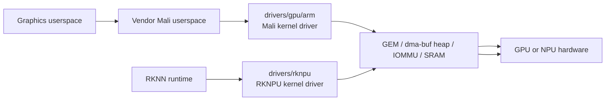
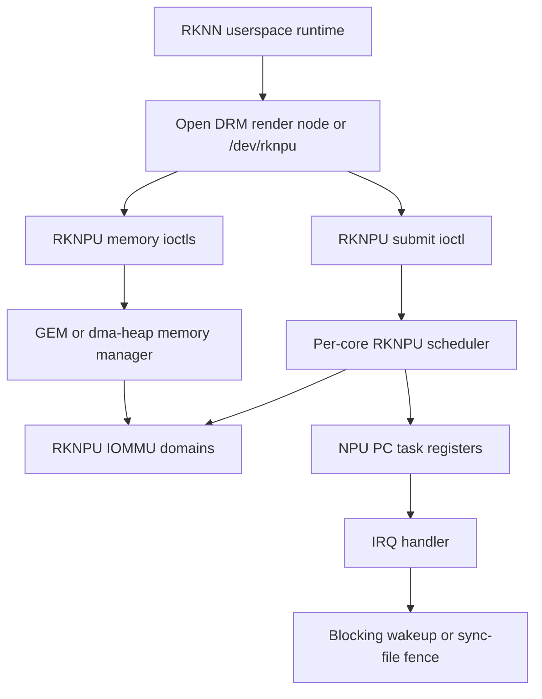
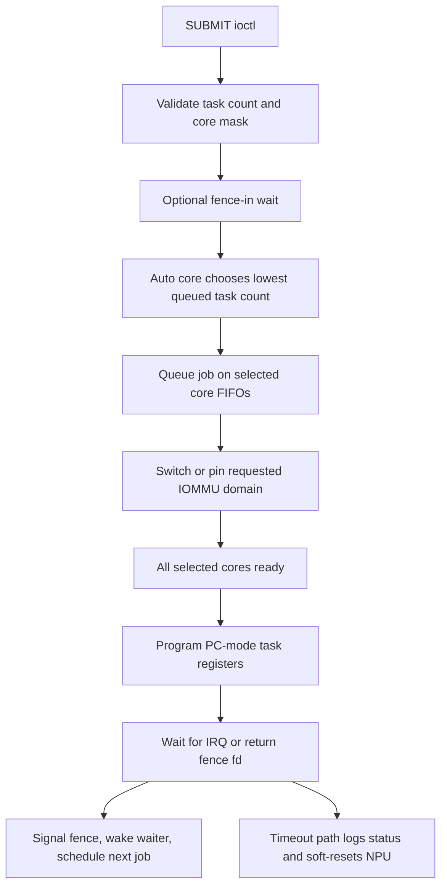
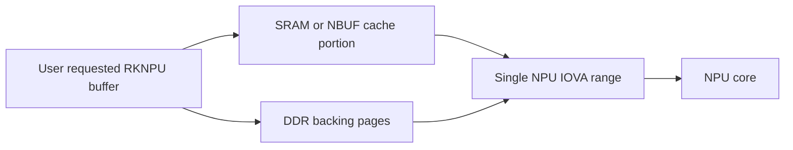

# Area 7: GPU and NPU accelerators

## Normal-user view

This area provides vendor accelerator stacks for graphics and AI inference. It
is separate from the video codec stack, but it shares memory-management and
IOMMU concerns with media and display.

A user sees it as:

- GPU acceleration for graphics or compute when using the matching Mali stack,
- NPU acceleration when using Rockchip's RKNN runtime,
- vendor debug counters and device nodes appearing for accelerator workloads.

## Kernel-developer view

The BSP adds large vendor Mali driver drops under `drivers/gpu/arm/` and the
Rockchip NPU driver under `drivers/rknpu/`. In the inspected BSP source, the
RKNPU driver identifies itself as `rknpu`, date `20240828`, version `0.9.8`.

The Mali vendor drivers are not the same as the upstream Mesa/Panfrost model.
They expect matching vendor userspace and carry their own memory, scheduling,
firmware, and debug assumptions.

RKNPU exposes a vendor accelerator ABI with debugfs/procfs, optional sync-file
fences, optional SRAM support, and two memory-manager choices: DRM GEM or
Rockchip dma-heap behavior. The default Kconfig choice is the DRM GEM path.

## What the BSP adds beyond stock Linux

| Area | BSP additions |
|------|---------------|
| Mali GPU | Vendor driver trees for multiple ARM Mali generations. |
| RKNPU | Rockchip neural-processing driver with vendor ABI, per-core scheduling, IOMMU-domain switching, power management, and debug paths. |
| Memory integration | dma-buf, GEM, heap, SRAM, and IOMMU integration for accelerator buffers. |
| Debug hooks | procfs/debugfs counters and product diagnostics. |

## RKNPU in this BSP

This section summarizes the BSP kernel surface. The first-class
[`kernel-drivers/rknpu` guide](../../kernel-drivers/rknpu/docs/how-rknpu-works.md)
continues through model conversion, RKNN Toolkit2/Lite2, the proprietary native
runtime and debug server, tensor-memory paths, kernel submission, multicore
execution, IOMMU/SRAM, power, and recovery.

RKNPU is the kernel-facing execution, memory, and power driver for Rockchip NPU
blocks. It is not the neural-network graph compiler and it does not understand
RKNN models as high-level graphs. Rockchip userspace prepares low-level NPU task
buffers and asks the kernel to make memory visible to the NPU, submit work, wait
for completion, and recover from errors.

For a normal user, this means NPU acceleration only appears when all of these
pieces match:

- the RKNPU kernel driver and enabled device-tree node,
- the IOMMU, clocks, resets, regulators, and power domains for the NPU block,
- the matching Rockchip RKNN userspace runtime,
- device-node permissions for the DRM render node or `/dev/rknpu`.

For a kernel developer, the useful mental model is:

### Build and source layout

`CONFIG_ROCKCHIP_RKNPU` is defined under `drivers/rknpu/Kconfig`. The module is
assembled from:

| File | Role |
|------|------|
| `rknpu_drv.c` | platform driver, probe/remove, DRM or misc registration, power/runtime PM, SoC configuration table |
| `rknpu_job.c` | submit path, per-core queues, PC-mode register programming, IRQ completion, timeout recovery |
| `rknpu_gem.c` | default DRM GEM memory backend, mmap offsets, dma-buf import/export, cache sync |
| `rknpu_mem.c` | alternate dma-heap misc-device memory backend |
| `rknpu_iommu.c` | IOVA allocation, scatter-gather mapping, multiple IOMMU domain switching |
| `rknpu_devfreq.c` | Rockchip OPP/devfreq/system-monitor/thermal-cooling integration |
| `rknpu_reset.c` | reset control discovery and soft reset |
| `rknpu_fence.c` | optional sync-file fence export |
| `rknpu_debugger.c` | debugfs/procfs files for version, load, power, frequency, delay, reset, and SRAM state |

Important build-time switches:

| Symbol | Meaning |
|--------|---------|
| `ROCKCHIP_RKNPU_DRM_GEM` | default memory-manager path; registers a DRM render-capable device and GEM ioctls |
| `ROCKCHIP_RKNPU_DMA_HEAP` | alternate misc-device path using Rockchip CMA dma-heap allocation |
| `ROCKCHIP_RKNPU_FENCE` | enables sync-file fence input/output for async dependency handling |
| `ROCKCHIP_RKNPU_SRAM` | enables the private SRAM allocator used by cache/SRAM-backed NPU buffers |
| `ROCKCHIP_RKNPU_DEBUG_FS` and `ROCKCHIP_RKNPU_PROC_FS` | enable product/debug status files |

### SoC coverage

The driver is one source tree with a per-compatible configuration table. The
table selects DMA mask width, register quirks, task-counter width, IRQ/core
count, NBUF availability, and optional SoC initialization hooks.

| Compatible | Core/IRQ shape | Notable BSP behavior |
|------------|----------------|----------------------|
| `rockchip,rknpu` and `rockchip,rk3568-rknpu` | single NPU IRQ | 32-bit DMA mask, 12-bit PC task count, older bandwidth counters |
| `rockchip,rk3588-rknpu` | up to three NPU IRQs | 40-bit DMA mask, three-core mask `0x7`, three register windows in RK3588 DTS |
| RK3583 variant of `rockchip,rk3588-rknpu` | two NPU IRQs | detected by nvmem invalid-core mask; core 2 is disabled |
| `rockchip,rv1106-rknpu` | single NPU IRQ | 32-bit DMA mask, 16-bit PC task count |
| `rockchip,rk3562-rknpu` | single NPU IRQ | 40-bit DMA mask, 16-bit PC task count, 256 KiB NBUF window |
| `rockchip,rk3576-rknpu` | two NPU IRQs | 40-bit DMA mask, 1 MiB NBUF window, split cache scatterlist setup, SoC state init hook |
| `rockchip,rv1126b-rknpu` | single NPU IRQ | 40-bit DMA mask, 512 KiB NBUF window |

### Userspace ABI shape

The driver exposes the same logical operations through two front doors:

- DRM ioctls when the GEM backend is enabled: `DRM_IOCTL_RKNPU_ACTION`,
  `DRM_IOCTL_RKNPU_SUBMIT`, `DRM_IOCTL_RKNPU_MEM_CREATE`,
  `DRM_IOCTL_RKNPU_MEM_MAP`, `DRM_IOCTL_RKNPU_MEM_DESTROY`, and
  `DRM_IOCTL_RKNPU_MEM_SYNC`.
- Misc-device ioctls when the dma-heap backend is enabled:
  `IOCTL_RKNPU_ACTION`, `IOCTL_RKNPU_SUBMIT`, `IOCTL_RKNPU_MEM_CREATE`,
  `IOCTL_RKNPU_MEM_MAP`, `IOCTL_RKNPU_MEM_DESTROY`, and
  `IOCTL_RKNPU_MEM_SYNC`.

The important point is that `SUBMIT` is a register-task ABI. Userspace passes a
`struct rknpu_submit` with a task object address, task range, timeout,
priority, IOMMU domain id, task base address, core mask, optional fence fd, and
per-subcore task ranges. The task buffer contains `struct rknpu_task` entries
with interrupt masks, enable masks, register-command addresses, and register
configuration counts. The kernel schedules these tasks and programs hardware,
but the userspace runtime is responsible for producing valid NPU command data.

### Job execution path

The scheduler maintains per-core FIFO queues in `struct rknpu_subcore_data`.
When userspace requests `core_mask = 0`, the driver picks the core with the
lowest queued task count. When userspace requests multiple cores, the same job
is placed on multiple per-core queues, and the hardware commit starts after all
selected cores have accepted the job.

The commit path is PC-mode oriented. It writes the first task's register-command
address to `PC_DATA_ADDR`, programs `PC_DATA_AMOUNT`, sets `INT_MASK`, clears
pending interrupts, programs `PC_TASK_CONTROL`, writes `PC_DMA_BASE_ADDR`, and
toggles `PC_OP_EN`. The source still has a slave-mode marker, but non-PC submit
is rejected, so this BSP path effectively expects PC-mode RKNPU tasks.

Completion is IRQ-driven. The IRQ handler reads the status register, compares a
grouped form of the status against the expected interrupt mask, clears the
interrupt, updates per-core busy timers, drops the IOMMU-domain reference, and
signals the fence or blocking waiter. Large submissions may be chunked when the
task count exceeds the SoC's maximum PC task count.

### Memory, IOMMU, and cache windows

The RKNPU memory model is more specialized than a plain dma-buf import:

- buffers can be contiguous or non-contiguous,
- cacheability can be non-cacheable, cacheable, or write-combine,
- userspace can request kernel mapping, zeroing, DMA32, IOMMU mapping, SRAM, or
  NBUF use,
- without an enabled `iommus` phandle the driver falls back toward reserved or
  contiguous memory behavior,
- with IOMMU enabled, contiguous allocation can fall back to non-contiguous page
  allocation and a single NPU-visible IOVA.

The SRAM/NBUF path is especially BSP-specific. For supported SoCs, the driver
can allocate a fast on-chip cache portion and DDR pages, then map both into one
IOVA range so the NPU sees a single device address span:

The IOMMU code also supports up to 16 RKNPU-managed domains. A submit or memory
operation asks for a domain id; the driver serializes domain switching with a
mutex and refcount so it does not detach a domain while active work is using it.

### Power, frequency, and diagnostics

Every ioctl wrapper powers the NPU block before handling the request and drops a
delayed power reference afterward. The default delayed power-off is 3000 ms,
which avoids regulator, clock, and power-domain churn during repeated inference
submissions. Probe wires regulators named `rknpu` and optional `mem`, bulk
clocks, reset controls, runtime PM, and named power domains such as `npu0`,
`npu1`, and `npu2`.

Devfreq integration uses Rockchip OPP and system-monitor helpers. The driver
registers a custom `rknpu_ondemand` governor, tracks current frequency and
voltage, and can register a thermal cooling device when the DT supplies a
dynamic power coefficient or IPA model data.

Debug surfaces are product-oriented rather than upstream ABI. Depending on
Kconfig they expose version, load, power, frequency, voltage, delayed power-off,
reset, and SRAM allocator state through debugfs or procfs.

## Developer notes

Do not mix kernel/userspace assumptions across stacks. Panfrost, vendor Mali,
RKNPU, MPP, and DRM can all touch dma-buf objects, but their ABIs and scheduling
models are different.

When porting, decide first whether the goal is vendor userspace compatibility or
an upstream-style stack. That decision determines whether preserving the vendor
ABI is the requirement or whether a subsystem rewrite is acceptable.

For RKNPU specifically, preserve these as a single tuple when the goal is RKNN
compatibility:

- the `drivers/rknpu/` ioctl structs and command semantics,
- matching RKNN userspace that generates PC-mode task buffers,
- the device-tree compatible, register windows, IRQ names, clocks, resets,
  regulators, power domains, OPP table, and `iommus` node,
- the selected memory backend and heap or DRM render-node permissions,
- optional fence, SRAM, NBUF, debugfs, and procfs configuration.
