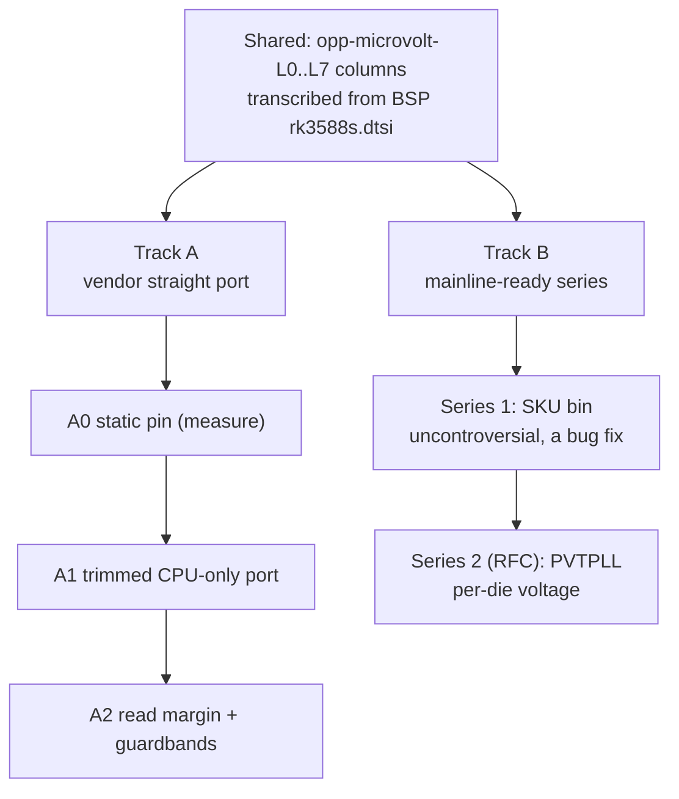

# RK3588 per-die voltage binning — port plan

What it would take to give our mainline-based kernels the CPU voltage selection
the Rockchip BSP performs per individual die. Today every ysp kernel runs the
vendor's **worst-die** column at all times; this board is entitled to 37.5–87.5 mV
less. The gap itself is established in
[`findings/2026-07-25-rk3588-cpu-voltage-binning-bsp-vs-mainline.md`](../../findings/2026-07-25-rk3588-cpu-voltage-binning-bsp-vs-mainline.md)
and this die's measured entitlement in
[`findings/2026-07-27-rk3588-pvtm-volt-sel-measured.md`](../../findings/2026-07-27-rk3588-pvtm-volt-sel-measured.md);
the external "has upstream grown this yet" fact is watchlist
[`W22`](../../status.md#watch-w22).

> **Nothing here has been started.** This document is DESIGN only. No patch,
> branch, or build exists for either track as of 2026-07-27.

> Source pins used throughout: BSP `../kernel/rockchip-kernel` @ `b4ef083dc0c3`
> (6.1.141) · forward port `../kernel/linux-6.18-rkvenc-av1-fwport` @
> `12a7da02bea83` (6.18) · maxline `../kernel/linux` @ `fac7077731585`
> (`v7.2-rc5-252`).

## Two tracks, one shared artifact

These are separate deliverables with different definitions of done, and
conflating them is the main way this work goes wrong.

| | **Track A — vendor straight port** | **Track B — mainline-ready series** |
|---|---|---|
| Goal | BSP-equivalent behavior on our 6.18/7.2 kernels | something a maintainer would merge |
| Audience | this repo's kernels and the PPA | linux-rockchip / linux-pm |
| Auto-detects an arbitrary die | yes | series 2 only |
| Success | undervolt observed and stable on-board | Reviewed-by, then merged |
| Upstreamable | **never** — reaches into OPP/clk private headers | that's the point |
| Rough size | ~7,600 lines carried, most of it trimmed | ~600 lines net across two series |

They share exactly one artifact: the **per-die voltage columns in the device
tree**. Everything else is independent, so the tracks can run in either order or
in parallel. Build the DT columns once, correctly, and both tracks consume them.



## 0. What is already upstream — do not rebuild any of this

| Piece | Where | State |
|---|---|---|
| `opp-microvolt-<name>` column selection | `drivers/opp/of.c` | present, generic |
| `opp-supported-hw` masking | `drivers/opp/of.c` | present, generic |
| `dev_pm_opp_set_config()` (`prop_name`, `supported_hw`) | `drivers/opp/core.c` | exported |
| `dev_pm_opp_adjust_voltage()` | `drivers/opp/core.c:2929` | exported |
| RK3588 OTP nvmem provider | `drivers/nvmem/rockchip-otp.c` | present |
| RK3588 leakage / `cpu_code` / `otp_cpu_version` cells | `rk3588-base.dtsi` `efuse@fecc0000` | declared, **zero consumers** |
| `cpu-supply` on all eight cores | `rk3588-rock-5b-5bp-5t.dtsi:148-178` | wired; rails observed independent |

The BSP's own selection call is *already* pure mainline API —
`rockchip_opp_set_config()` (`rockchip_opp_select.c:1531`) ends at:

```c
snprintf(name, MAX_PROP_NAME_LEN, "L%d", info->volt_sel);
config.prop_name = name;
config.supported_hw = { BIT(bin), BIT(volt_sel) };
info->opp_token = dev_pm_opp_set_config(dev, &config);
```

So the entire question reduces to **how `volt_sel` is obtained**, plus the
guardbands that make a lower voltage safe.

## 1. Shared prerequisite — the DT voltage columns

Transcribe `opp-microvolt-L0..L6` (cluster0) and `L0..L7` (cluster1/2) from BSP
`rk3588s.dtsi` `cluster{0,1,2}_opp_table` into mainline `rk3588-opp.dtsi`.

Inert without a consumer: the OPP core only reads `opp-microvolt-<name>` when
something sets `prop_name`. Landing this alone cannot regress a booting kernel,
which makes it the safe first commit on both tracks.

Four transcription traps, all of which have already bitten a naive parse:

1. **The BSP node names carry the bin.** Bin 0 is `opp-408000000`; the derated
   M/J set is `opp-b-408000000`. A regex keyed on `opp-<digits>` silently reads
   only the bin-0 set — correct for this board, wrong if you also want trap 4.
2. **Take only the first `opp-microvolt` tuple.** The BSP carries two supplies
   per entry for `mem-supply`; the ROCK 5B CPU nodes have no `mem-supply`.
3. **`rk3588-opp.dtsi` is byte-identical between the 6.18 forward port and 7.2-rc5
   maxline** (verified 2026-07-27), so one patch applies unchanged to both trees.
   Keep it that way.
4. **The M/J bins are derated, not faster.** They cap lower (little 1704 vs 1800,
   big 2016 vs 2400) and want +25…+75 mV. Mainline shipping only the bin-0 set
   means an RK3588J runs above its frequency cap and below its voltage floor at
   once. Adding those tables is a *safety* fix, and it is the strongest argument
   Track B has upstream.

## 2. Track A — vendor straight port

### A.1 What actually has to come across

The BSP stack is not three files. `rockchip-cpufreq.c` pulls in the system
monitor; `rockchip_opp_select.c` pulls in SIP, the vendor cpuinfo, and two
private in-tree headers.

| File | Lines | Disposition for an RK3588 CPU-only port |
|---|---|---|
| `drivers/soc/rockchip/rockchip_opp_select.c` | 2,614 | **core** — CPU path only; devfreq/irdrop/mbist/otp-opp/pvtpll-calibrate halves are droppable |
| `drivers/cpufreq/rockchip-cpufreq.c` | 1,002 | **core** — trim to cluster init + `set_read_margin` + `opp_set_rate` |
| `drivers/soc/rockchip/rockchip_system_monitor.c` | 2,031 | **stub or drop** — only 6 symbols are actually referenced |
| `drivers/soc/rockchip/rockchip_pvtm.c` | 932 | **drop** — RK3588 CPU uses the `rockchip,pvtm-pvtpll` GRF path, not this driver |
| `drivers/soc/rockchip/rockchip-cpuinfo.c` | 430 | **stub** — `<linux/rockchip/cpu.h>` soc-id helpers |
| `include/soc/rockchip/rockchip_opp_select.h` | 313 | carry, trimmed |
| `include/soc/rockchip/rockchip_system_monitor.h` | 241 | carry only if the monitor is stubbed rather than dropped |
| `drivers/cpufreq/rockchip-cpufreq.h` | 26 | carry |

Dropping `rockchip_pvtm.c` is the single largest scope saving and is easy to get
wrong. `rockchip_get_pvtm_pvtpll()` (`rockchip_opp_select.c:1044`) reads the
PVTPLL count straight out of a syscon regmap; the older
`rockchip_get_pvtm_value()` from `<linux/soc/rockchip/pvtm.h>` is only reached
via `rockchip_get_pvtm_specific_value()` (`:354`), which RK3588 CPU clusters
never take because they set `rockchip,pvtm-pvtpll`. The reference still has to
link, so stub it.

### A.2 The four walls

These are where a "straight" port stops being straight. Budget for them up front.

1. **`#include "../../opp/opp.h"`** — `rockchip_opp_set_regulator_helper()`
   (`:1512`) pokes `opp_table->config_regulators` directly because
   `dev_pm_opp_set_config()` only wires the helper for *multiple* regulators.
   `struct opp_table` is a private layout that has drifted. Either re-derive
   against 6.18's `drivers/opp/opp.h` or find out whether the single-regulator
   case still needs the hack at all.
2. **`#include "../../clk/rockchip/clk.h"`** — `rk3588_change_length()`
   (`rockchip-cpufreq.c:311`) encodes `OPP_LENGTH_LOW` into the rate passed to
   `clk_set_rate()`. Mainline's rockchip clk driver has no such magic-flag ABI.
   **Good news for this board: not reachable.** It only fires when
   `volt_sel <= rockchip,pvtm-low-len-sel`, which is 3 on the big clusters and
   unset on the little; this die is 5/7/7. Drop it and assert `volt_sel > 3`.
3. **`#include <linux/rockchip/rockchip_sip.h>`** — `info->pvtpll_smc = true` and
   the SIP SMC calls. Mainline has no rockchip SIP header. Determine whether the
   RK3588 CPU path takes any SMC branch; if it does, that is an ATF ABI
   dependency, not a kernel one.
4. **`<soc/rockchip/rockchip_system_monitor.h>`** — six referenced symbols
   (`rockchip_system_monitor_{register,unregister}`,
   `rockchip_monitor_{cpu_low_temp_adjust,cpu_high_temp_adjust,check_rate_volt,suspend_low_temp_adjust}`).
   Stubbing them costs the low/high-temperature guardbands, which is exactly the
   safety property an undervolt most needs — see §4.1. Decide consciously.

### A.3 Phases

- **A0 — static pin, no driver.** Override `opp-microvolt` in a board overlay
  with this die's L5/L7 values. Boot, measure, build the stability envelope
  (§5). This is a measurement instrument, not a deliverable; it establishes
  whether the remaining phases are worth their cost. Half a day.
- **A1 — trimmed CPU-only port.** `rockchip_opp_select.c` CPU path +
  `rockchip-cpufreq.c` + stubs, plus the `litcore_grf`/`bigcore0_grf`/
  `bigcore1_grf`/`dsu_grf` syscon nodes (absent from every mainline rk3588 DT)
  and the `rockchip,pvtm-*` properties on the cluster OPP tables. Ends with
  `pvtm-volt-sel=` in dmesg on a 6.18 boot matching the BSP's 5/7/7.
- **A2 — read margin + guardbands.** Port `rk3588_cpu_set_read_margin()`, the
  `volt-mem-read-margin` table, `intermediate-threshold-freq`, and a low-temp
  voltage floor (§4.1, §4.2).
- **A3 — package and gate.** Fold into the forward-port series as
  `rk3588-fwport-0076..`, build a PPA kernel, run the full conformance set.

**Definition of done for Track A:** a booted 6.18 kernel prints the same
`bin=`/`leakage=`/`pvtm=`/`pvtm-volt-sel=` values as the BSP for all three
clusters, applies the matching L-column voltages (verified at the regulator),
and passes §5 including a cold boot.

### A.4 The honest alternative

If A1 looks like more than it is worth, **A0 plus a DT `rockchip,volt-sel`
property consumed by the Track B series-2 driver** gets this board the same
voltages with an order of magnitude less code. Track A only earns its cost if
the goal is BSP parity on arbitrary silicon.

## 3. Track B — mainline-ready patch set

### B.1 Land the boring half first

The SKU-bin half and the per-die-voltage half are independently useful and have
wildly different review risk. Sending them together makes the easy one hostage
to the hard one.

### B.2 Series 1 — SKU-correct OPP sets (a bug fix, not an optimization)

Frame it as a fix: mainline currently runs RK3588J/M parts past their rated
frequency and under their rated voltage. Precedent is `imx-cpufreq-dt.c`, which
does exactly this shape — `nvmem_cell_read_u32()` → `supported_hw[] = {BIT(a), BIT(b)}`
→ register `cpufreq-dt` itself.

1. `arm64: dts: rockchip: rk3588: add specification-serial-number and customer-demand OTP cells`
   — `specification_serial_number@6` `bits <0 5>`, `customer_demand@22` `bits <4 4>`.
2. `cpufreq: rockchip: add SKU-bin OPP selection` — new
   `drivers/cpufreq/rockchip-cpufreq.c`, ~150 lines: read the two cells, map
   `0xd`→1 (M), `0xa`→2 (J), `customer_demand == 0x3`→4, else 0; call
   `dev_pm_opp_set_supported_hw(cpu_dev, {BIT(bin), 0xffff}, 2)`; register
   `cpufreq-dt`.
3. `cpufreq: dt-platdev: add rockchip,rk3588 to the blocklist` — rk3588 currently
   reaches `cpufreq-dt` through the generic `cpu0_node_has_opp_v2_prop()`
   fallthrough in a `core_initcall`, so the new driver must own registration or
   it will lose the race. Same pattern as `fsl,imx8mq`.
4. `arm64: dts: rockchip: rk3588: add derated RK3588M/J OPP tables` — the
   `opp-b-*` node set with `opp-supported-hw` masks.

Landable on its own merits. Costs this board nothing (it is bin 0) and buys
correctness for every J/M part.

### B.3 Series 2 (RFC) — per-die voltage from PVTPLL

The earlier read that "upstream has no precedent for live process measurement"
is wrong, and it changes the recommendation. There are two in-tree drivers doing
structurally the same thing:

- **`drivers/soc/mediatek/mtk-svs.c`** (2,960 lines, Collabora-maintained) —
  reads efuse via `nvmem_cell_read()`, reads a thermal zone
  (`thermal_zone_get_temp()`), runs a hardware voltage-scaling engine, and calls
  `dev_pm_opp_adjust_voltage()`. This is PVTM's shape almost exactly.
- **`drivers/soc/samsung/exynos-asv.c`** (169 lines) — the minimal version of the
  same idea.

So the upstreamable framing is a **`drivers/soc/rockchip/` process-monitor
driver** that produces a voltage selection, not a cpufreq special case.

1. `arm64: dts: rockchip: rk3588: add per-die opp-microvolt-L* columns` (§1).
2. `dt-bindings: soc: rockchip: add rk3588 PVTPLL process monitor` — including
   the per-cluster GRF phandles and the `rockchip,pvtm-voltage-sel` table shape.
   Expect this to be the longest argument of the whole series; a bare numeric
   lookup table in DT is exactly the kind of thing DT maintainers reject. Have a
   fallback ready in which the table lives in the driver, keyed by compatible.
3. `arm64: dts: rockchip: rk3588: add core and DSU GRF syscon nodes` — `fd590000`
   / `fd592000` / `fd594000` / `fd598000`, none of which exist upstream today.
4. `soc: rockchip: add RK3588 PVTPLL process monitor` — measure at
   `rockchip,pvtm-offset` (`0x64` on `litcore_grf`, `0x18` on both `bigcore*_grf`)
   at `rockchip,pvtm-freq` (1416/1608 MHz) and 750 mV, compensate against
   `soc-thermal` (`pvtm += (T − 25) × 244/1000` little, `270/1000` big), bucket
   the result.
5. `cpufreq: rockchip: select the voltage column from the process monitor` —
   `prop_name = "L<n>"`.
6. `cpufreq: rockchip: track SRAM read margin with voltage` (§4.2).

### B.4 Expect pushback on

- **Reprogramming a live CPU's clock and rail at boot to take a measurement.**
  `mtk-svs` gets away with a dedicated engine; PVTM forces the cluster to a
  fixed OPP first. Offer a fuse-only fallback path and make the measurement
  skippable.
- **The DT lookup tables** (§B.3 item 2).
- **Magic GRF register writes** in the read-margin function with no documented
  bitfield names. Name the fields even if the TRM does not.
- **A voltage floor tied to temperature** has no generic OPP mechanism; it would
  be a thermal notifier calling `dev_pm_opp_adjust_voltage()`. Land it separately
  or the whole series stalls on it.

## 4. Risk register (both tracks)

### 4.1 Cold boot — the one that will actually bite

`rockchip,low-temp = <15000>` / `rockchip,low-temp-min-volt = <800000>`: below
15 °C the BSP raises the floor to 0.8 V. Most of this die's L5/L7 column sits
below that. Mainline has no equivalent, and the failure mode is a boot that dies
before anything can log why. **An undervolt validated at room temperature is not
validated.** Any A0 measurement build must be recoverable without the board
booting — keep SPI/serial recovery to hand.

### 4.2 SRAM read margin

`volt-mem-read-margin` maps voltage → margin (≥855000→1, ≥765000→2, ≥675000→3,
≥495000→4) and `rk3588_cpu_set_read_margin()` (`rockchip-cpufreq.c:378`) writes
it to the core GRF (`0x20`, `0x28`, `0x2c`, `0x30`) and DSU GRF (`0x20`, `0x28`,
`0x2c`, `0x30`, `0x38`, `0x18`) on every transition, dropping to
`intermediate-threshold-freq = 1008000` first. Mainline never writes it.

The nuance that matters: undervolting does **not** widen the voltage range
mainline already spans (675 mV–1.0 V), so no new margin bucket is entered. But it
pairs low voltages with **higher frequencies than mainline ever pairs them** —
big cores at 762.5 mV @ 1800 MHz instead of @ 1608 MHz. That is a new operating
point for the SRAM even though the bucket is not new. Treat this as unresolved
until either the margin function is ported or a soak proves it moot.

### 4.3 The DSU rides cluster0's rail

`rockchip,opp-shared-dsu` on `cluster0_opp_table`: undervolting the little
cluster undervolts the DSU — the fabric all eight cores talk through. Failures
will not look like little-core failures. Weight little-cluster margin accordingly.

### 4.4 Silent corruption, not clean failure

An undervolted core does not panic politely. Any validation that only checks
"did it stay up" will pass a broken configuration — see §5.

### 4.5 Fleet safety

Both tracks change an SoC-wide DT. A static A0 pin is one die's numbers applied
to every board that boots the image. It must never reach the PPA. Only the
measurement-driven paths (A1+, B series 2) are shippable.

## 5. Validation plan (both tracks)

Ordered by what it would catch, not convenience.

1. **Verify at the rail, not in dmesg.** Read `/sys/class/regulator/*/microvolts`
   paired with `scaling_cur_freq` per policy and diff against the intended
   column. The BSP baseline for this die is recorded in the companion finding.
2. **Compute-verified load, not stress-for-heat.** `stress-ng --cpu N --verify`,
   plus repeated kernel builds with output hashes compared against a known-good
   run. An undervolt failure that produces a wrong byte and no log entry is the
   expected failure mode.
3. **Per-cluster isolation.** Pin to policy0, then policy4, then policy6 with the
   others offline. A shared-rail failure otherwise gets attributed to the wrong
   cluster.
4. **Frequency sweep, not just max.** The undervolt is largest in the 1416–2208
   MHz band; **2400 MHz gets 0 mV** because L7's top entry equals the baseline.
   A validation that only runs `performance` at 2400 tests nothing.
5. **Cold boot.** At minimum a genuine cold-start from ambient after hours
   powered off (§4.1). Recovery path ready before the first attempt.
6. **Column bisect for margin.** Walk L0 → L1 → … → the measured column, and if
   any step fails, ship one column below the first failure rather than the
   measured one. Only meaningful with §2 as the pass criterion.
7. **Existing repo conformance.** The kernel validation runbook and codec suites
   as a regression net — necessary, not sufficient, since none of it is
   voltage-sensitive by design.

## 6. Decision points

| # | Question | Blocks | Default if unanswered |
|---|---|---|---|
| D1 | Is BSP parity on arbitrary silicon actually wanted, or just this board? | Track A scope (A1 vs A.4) | A.4 — DT-supplied `volt-sel` |
| D2 | Stub the system monitor, or port the thermal guardbands? | A1/A2 boundary | stub, and treat §4.1 as open |
| D3 | Port the read-margin writes, or prove them moot by soak? | A2, B.3 item 6 | port them — cheaper than the argument |
| D4 | Does the RK3588 CPU path take any SIP/SMC branch? | A.2 wall 3 | must be answered before A1 starts |
| D5 | Send Track B series 1 before series 2 exists? | upstream sequencing | yes |

## 7. Explicitly out of scope

- **GPU / NPU / DMC / VOP / venc voltage binning.** Those tables use
  `rockchip,leakage-voltage-sel`, a different mechanism, and were identified but
  never compared value-by-value.
- **OTP writes.** Read-only, always.
- **Overclocking.** Every voltage here is a vendor-qualified value for a
  vendor-defined process bucket. Going below the measured column, or above the
  frequency the bin allows, is a different activity with none of this evidence
  behind it.
- **The `cpul_opp_info` / `cpub01_opp_info` factory-OPP path.** Blank on this
  die, so it cannot be developed or tested here.
