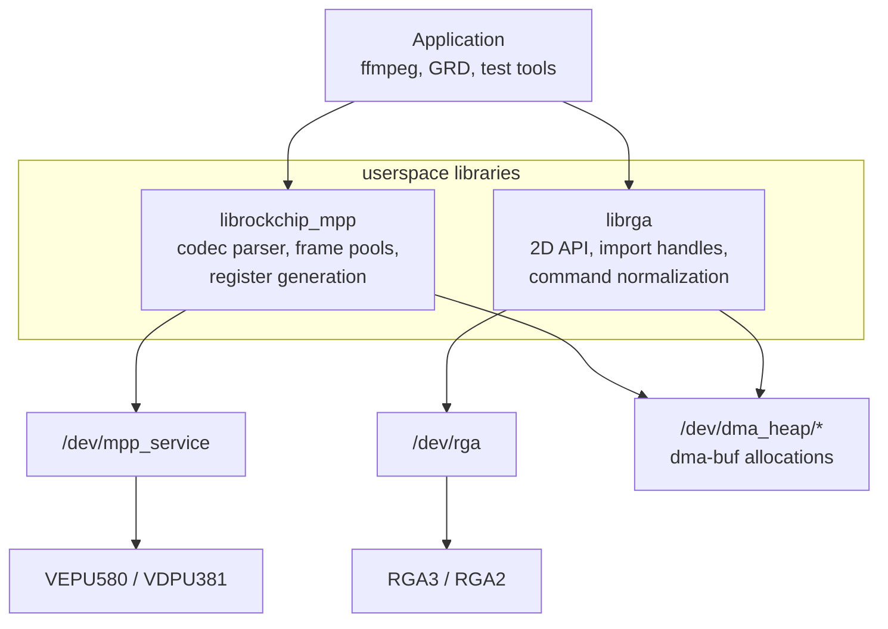

# userspace-libraries/ - libmpp and librga

This package explains the userspace libraries that sit between applications and
the kernel devices: Rockchip's `librockchip_mpp` for codec work and `librga`
for 2D blits, scale, color conversion, and composition.

## Package brief

| Field | Contents |
|-------|----------|
| User outcome | Build or install the libraries needed by FFmpeg, GRD, and the smoke tests, with the right headers, shared libraries, pkg-config files, and device-node permissions. |
| Developer focus | Understand which work happens in userspace vs kernel, how dma-buf handles and register recipes reach `/dev/mpp_service` and `/dev/rga`, and why different FFmpeg lineages use the libraries differently. |
| Owns | The package-level entry point here, the deep explanation in [`docs/how-the-userspace-libs-work.md`](docs/how-the-userspace-libs-work.md), ABI detail in [`../kernel-drivers/docs/dev-uapis.md`](../kernel-drivers/docs/dev-uapis.md), and build staging through [`../ffmpeg/README.md`](../ffmpeg/README.md). |
| Depends on | Working kernel nodes from [`../kernel-drivers/`](../kernel-drivers/README.md), `video` group access to `/dev/mpp_service`, `/dev/rga`, and `/dev/dma_heap/*`, plus `libdrm` for DRM PRIME users. |
| Current state | The source-built MPP plus staged librga path is hardware-validated through the tests; the packaged PPA route built locally but has not been uploaded. See [`../status.md`](../status.md). |

## How the library package fits

The important division of responsibility is:

| Layer | Does |
|-------|------|
| Application | Chooses codec/filter settings and owns the media pipeline. |
| `librockchip_mpp` | Parses bitstreams, manages codec state, allocates/imports buffers, builds register tables, and issues MPP ioctls. |
| `librga` | Normalizes RGA requests, imports fd or virtual-address buffers, chooses a core profile, and issues RGA ioctls. |
| Kernel drivers | Validate and run already-materialized jobs on the hardware. |

## User path

Use one of these routes:

| Route | When to use it | Start here |
|-------|----------------|------------|
| Source-built staging prefix | You are building `ffmpeg-rockchip` or running the in-repo smoke tests exactly as validated. | [`../ffmpeg/README.md`](../ffmpeg/README.md) |
| Packaged userspace stack | You want distro-style packages for MPP, librga, FFmpeg, and GRD. | [`../packaging/ppa/`](../packaging/ppa/README.md) and [`../packaging/README.md`](../packaging/README.md) |
| Existing system packages | You already have compatible `librockchip_mpp`/`librga` packages and only need to verify API availability. | [`../ffmpeg/README.md`](../ffmpeg/README.md) dependency checks |

The source-built route stages:

| Artifact | Why it matters |
|----------|----------------|
| `librockchip_mpp.so.1` | FFmpeg and MPP test tools link this for `h264_rkmpp`, `hevc_rkmpp`, and the `mpi_*_test` programs. |
| `librga.so` | `ffmpeg-rockchip` uses this for `scale_rkrga`, `vpp_rkrga`, and related filters. |
| `rockchip_mpp.pc` / `librga.pc` | FFmpeg `configure` uses these to find headers and libraries. |
| `include/rockchip/*.h` / `include/rga/*.h` | Public API headers expected by the FFmpeg builds in this repo. |

## Developer path

Read these when debugging library/kernel interactions:

| Question | Canonical doc |
|----------|---------------|
| What does libmpp hide from an app? | [`docs/how-the-userspace-libs-work.md`](docs/how-the-userspace-libs-work.md) Part A |
| What does librga hide from an app? | [`docs/how-the-userspace-libs-work.md`](docs/how-the-userspace-libs-work.md) Part B |
| What ioctls cross into the kernel? | [`../kernel-drivers/docs/dev-uapis.md`](../kernel-drivers/docs/dev-uapis.md) |
| Why does GRD use upstream FFmpeg instead of `ffmpeg-rockchip`? | [`../ffmpeg/docs/implementation-comparison.md`](../ffmpeg/docs/implementation-comparison.md) |
| Which ABI facts were learned during the rewrite track? | [`../kernel-drivers/docs/rewrite-drivers.md`](../kernel-drivers/docs/rewrite-drivers.md) |

## Common traps

| Trap | Explanation |
|------|-------------|
| Device access is three nodes, not one | Non-root MPP encode needs `/dev/mpp_service` and `/dev/dma_heap/*`; RGA also needs `/dev/rga`. Install [`../kernel-drivers/scripts/99-rockchip-codec.rules`](../kernel-drivers/scripts/99-rockchip-codec.rules) or the [`../packaging/codec-udev/`](../packaging/codec-udev/README.md) deb. |
| `librga` has source even when the official drop ships a prebuilt `.so` | The buildable source lineage is documented in [`../docs/gotchas.md`](../docs/gotchas.md) and the staging recipe in [`../ffmpeg/README.md`](../ffmpeg/README.md). |
| `h264_rkmpp` does not always mean the same implementation | `ffmpeg-rockchip` and upstream FFmpeg 8.1.2 both expose rkmpp names, but the control surface differs. See [`../ffmpeg/docs/implementation-comparison.md`](../ffmpeg/docs/implementation-comparison.md). |
| The libraries generate hardware-specific recipes | The kernel does not parse H.264/HEVC streams into registers; libmpp does. This is why ABI compatibility matters as much as driver probing. |
