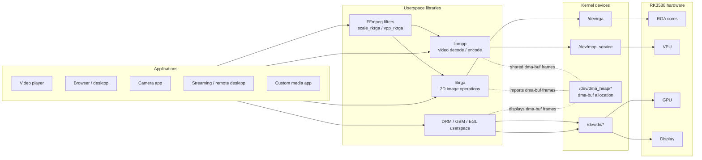
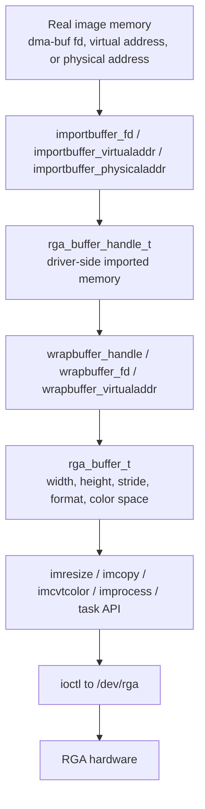
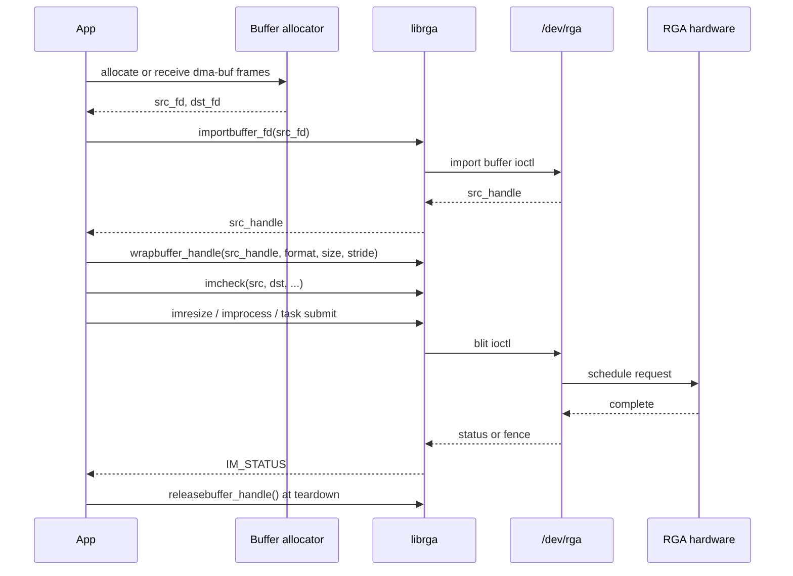
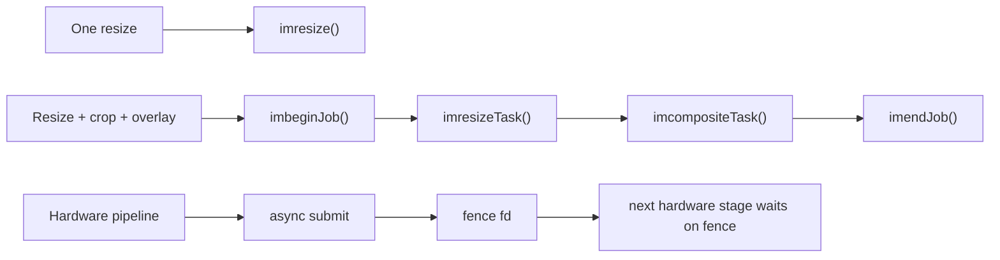
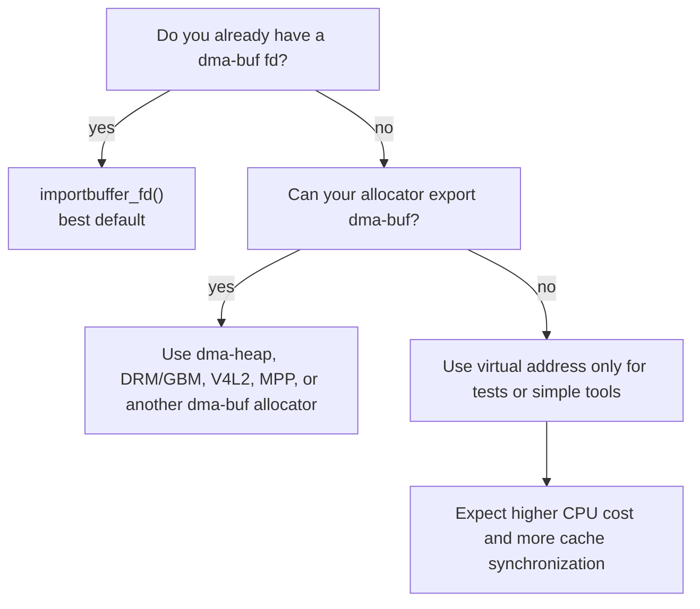
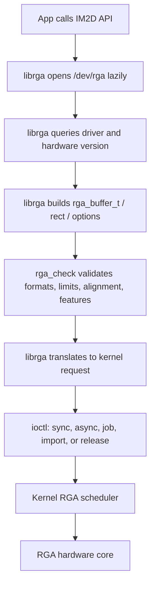
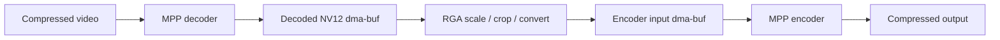
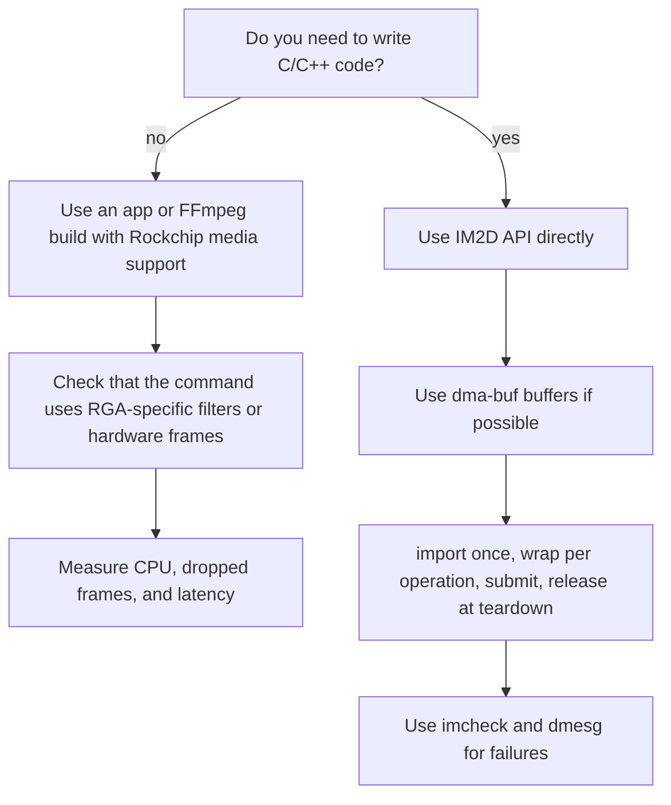
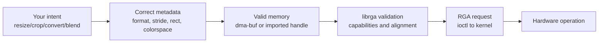

# librga guide for ROCK 5B users and media developers

This guide explains `librga`, the Rockchip userspace library for the Raster
Graphic Accelerator (RGA). It is written for two audiences:

- Regular users who want to understand why "RGA acceleration" matters in video,
  desktop, camera, and streaming setups.
- Media developers who need to pass buffers through RGA without wasting CPU time
  or accidentally forcing extra copies.

The short version: RGA is a 2D hardware engine. `librga` is the userspace API
that turns a request such as "resize this NV12 frame into this RGB buffer" into
an ioctl submitted to `/dev/rga`.

## What RGA does

RGA is not a video decoder, video encoder, GPU, or display controller. It is a
special-purpose 2D block for moving and transforming image buffers.

Common RGA jobs:

- Resize a frame.
- Crop a rectangle out of a frame.
- Convert between pixel formats, for example NV12 to RGBA.
- Rotate or mirror an image.
- Fill a rectangle.
- Blend or composite one image over another.
- Draw simple rectangles or OSD-style overlays.
- Move image data between layouts that the hardware understands.

Common non-RGA jobs:

- H.264, H.265, VP9, or AV1 decode. That is VPU/Mpp.
- H.264 or H.265 encode. That is VPU/Mpp.
- 3D rendering and shaders. That is GPU.
- Final scanout to HDMI or a panel. That is DRM/KMS and display hardware.

## Where it fits

On ROCK 5B, RGA usually sits between capture, decode, render, encode, and display
steps. It is most useful when one component produces a buffer in the wrong size,
format, orientation, or stride for the next component.



In plain terms: `librga` is often the "make this frame acceptable to the next
stage" library.

## What regular users need to know

Most users do not call `librga` directly. They benefit from it through software
that has Rockchip-specific integration.

Typical examples:

- A video player or FFmpeg command uses RGA for scaling instead of doing it on
  CPU.
- A camera pipeline uses RGA to crop or rotate frames before preview or encode.
- A remote desktop pipeline uses RGA to convert desktop images into a format the
  encoder accepts.
- A compositor, UI tool, or media app uses RGA to avoid expensive software
  conversion.

If RGA is working well, the visible result is not "better pixels". The visible
result is lower CPU use, fewer dropped frames, lower latency, and less memory
bandwidth pressure.

If RGA is missing, blocked by permissions, or given unsupported buffers, the app
usually falls back to CPU conversion or fails with a vague error.

User-level checks:

```bash
ls -l /dev/rga
groups
dmesg | grep -i rga
```

For packaged apps, also check whether the build actually enabled Rockchip RGA
support. A generic upstream build may include FFmpeg but not the Rockchip RGA
filters or patches used by a vendor/BSP build.

## What media developers need to know first

`librga` has two public API styles:

- Modern API: `im2d.h`, `im2d.hpp`, `im2d_type.h`, `im2d_buffer.h`,
  `im2d_single.h`, and `im2d_task.h`.
- Legacy API: `RockchipRga.h`, `RgaApi.h`, and older `RgaBlit`-style wrappers.

New code should prefer the IM2D API.

The core objects are:

| Concept | What it means | Why it matters |
| --- | --- | --- |
| dma-buf fd | A file descriptor for a shared kernel buffer | Best common currency between MPP, V4L2, DRM, GPU, and RGA |
| `rga_buffer_handle_t` | A buffer imported into the RGA driver | Lets RGA reuse the mapping instead of importing every operation |
| `rga_buffer_t` | A description of one image surface | Carries width, height, stride, format, color space, and imported handle |
| `im_rect` | A rectangle inside a buffer | Used for crop, destination placement, overlays, and partial operations |
| `im_opt_t` | Extra operation options | Carries blend, color key, OSD, NN, ROP, mosaic, border, and other controls |
| fence fd | A sync object | Lets async hardware work compose with other hardware stages |

The distinction between importing and wrapping is important:

- Importing is a kernel operation. It registers memory with the RGA driver and
  returns a handle.
- Wrapping is a userspace description. It says how to interpret that memory for
  one operation.



Production code should normally import buffers once, reuse the imported handles,
and release them when the pool or stream is torn down.

## Minimal direct-use pattern

The exact allocation mechanism depends on the rest of your pipeline. In a media
pipeline, the source and destination are usually dma-buf backed buffers from MPP,
V4L2, DRM/GBM, dma-heap, or another allocator.

Typical flow:



Small C++ IM2D sketch:

```cpp
#include "im2d.h"
#include "im2d_buffer.h"
#include "im2d_single.h"

int resize_nv12_to_rgba(int src_fd, int dst_fd,
                        int src_w, int src_h, int src_stride,
                        int dst_w, int dst_h, int dst_stride) {
    size_t src_size = src_stride * src_h * 3 / 2;
    size_t dst_size = dst_stride * dst_h * 4;

    rga_buffer_handle_t src_hnd = importbuffer_fd(src_fd, src_size);
    rga_buffer_handle_t dst_hnd = importbuffer_fd(dst_fd, dst_size);
    if (!src_hnd || !dst_hnd) {
        if (src_hnd)
            releasebuffer_handle(src_hnd);
        if (dst_hnd)
            releasebuffer_handle(dst_hnd);
        return -1;
    }

    rga_buffer_t src = wrapbuffer_handle(src_hnd, src_w, src_h,
                                         RK_FORMAT_YCbCr_420_SP,
                                         src_stride, src_h);
    rga_buffer_t dst = wrapbuffer_handle(dst_hnd, dst_w, dst_h,
                                         RK_FORMAT_RGBA_8888,
                                         dst_stride, dst_h);

    im_rect src_rect = {0, 0, src_w, src_h};
    im_rect dst_rect = {0, 0, dst_w, dst_h};

    IM_STATUS check = imcheck(src, dst, src_rect, dst_rect);
    if (check != IM_STATUS_SUCCESS) {
        releasebuffer_handle(src_hnd);
        releasebuffer_handle(dst_hnd);
        return -2;
    }

    IM_STATUS status = imresize(src, dst);

    releasebuffer_handle(src_hnd);
    releasebuffer_handle(dst_hnd);
    return status == IM_STATUS_SUCCESS ? 0 : -3;
}
```

For a real stream, do not import and release around every frame. Import a buffer
pool once and keep the handles next to the buffer objects.

## Single calls, jobs, and async operation

IM2D gives you several levels of control.

| API style | Use it when | Examples |
| --- | --- | --- |
| Single operation | You need one operation now | `imcopy`, `imresize`, `imcrop`, `imcvtcolor`, `imrotate`, `imfill` |
| Generic operation | You need a combination of source, destination, pattern, rectangles, and options | `improcess` |
| Job/task API | You want to batch several RGA operations | `imbeginJob`, `imresizeTask`, `imrectangleTask`, `imendJob` |
| Async/fence path | You need pipeline overlap with decode, GPU, display, or encode | async flags plus release/acquire fences |

Single operations are easiest to read. Job/task APIs reduce repeated submit
overhead and make multi-step processing more coherent. Async operation matters
when RGA is part of a larger hardware pipeline and CPU waiting would destroy
latency.



## The memory model

RGA performance depends heavily on how memory reaches the hardware.

Preferred order for most media pipelines:

1. dma-buf fd from a real shared allocator.
2. Physical address only in controlled low-level environments that actually have
   valid physical addresses and permission to use them.
3. Virtual address for simple tests, samples, and fallback paths.

Why dma-buf is preferred:

- It can be shared by MPP, V4L2, DRM, GPU, and RGA without copying the pixels.
- The kernel can attach the buffer to the RGA device and set up mappings.
- It fits Linux media pipelines better than raw pointers.

Why virtual address is often slower:

- The driver has to translate userspace pages into something hardware can use.
- Cache synchronization can be expensive.
- Repeating the mapping work every frame can dominate small operations.



### Buffer pools

The fastest RGA program is usually not the one with the cleverest operation. It
is the one that avoids setup work on every frame.

Good stream pattern:

1. Allocate a fixed pool of source/destination buffers.
2. Import each buffer into RGA once.
3. Store the RGA handle with your buffer metadata.
4. For each frame, wrap the existing handle with the current format, size, and
   stride.
5. Submit work.
6. Release all imported handles when the pool is destroyed.

Bad stream pattern:

1. Allocate or receive a buffer.
2. Import it.
3. Submit one operation.
4. Release it.
5. Repeat for every frame.

The bad pattern can still work, but it can turn a hardware acceleration path
into an ioctl and mapping benchmark.

## Width, height, stride, and format

Most RGA mistakes are metadata mistakes. The hardware sees memory, dimensions,
strides, rectangles, and formats. If any of those are wrong, the result can be
failure, corruption, wrong colors, or a frame that looks shifted.

Important terms:

| Term | Meaning |
| --- | --- |
| Width | Visible pixels in a row |
| Height | Visible rows |
| Stride | Allocated row pitch, often wider than visible width |
| Format | How pixels are stored, for example RGBA8888 or NV12 |
| Rect | The sub-region to read or write |
| Color space | How YUV values map to RGB values |

Example: a 1920-pixel-wide NV12 frame may have a 2048-pixel stride because the
allocator aligned rows for hardware. RGA must be told the stride, not only the
visible width.

### YUV alignment

YUV formats are stricter than RGB formats. For 4:2:0 formats such as NV12:

- Width and height are usually even.
- Crop x/y offsets usually need to be even.
- Strides need to satisfy the format and hardware alignment rules.
- Chroma planes represent groups of pixels, so odd crop positions are often not
  legal.

When `imcheck()` rejects a YUV operation, inspect the visible rectangle and the
stride first.

### Color conversion

RGA can convert between many RGB and YUV formats, but "YUV to RGB" is not a
single universal operation. You also need the right color space/range:

- BT.601 is common for SD video.
- BT.709 is common for HD video.
- Full range and limited range are different.

Wrong color-space metadata often looks like washed-out, crushed, or tinted
video. The buffer may be valid while the colors are still wrong.

## How librga submits work

`librga` is a userspace library, but it is not doing the pixel processing in
userspace. It validates and translates requests into kernel driver structures.



This matters because failures can come from several layers:

- The userspace library rejects invalid parameters.
- The kernel driver rejects a policy, memory, or scheduling problem.
- The hardware cannot support the requested format, scale ratio, alignment, or
  feature combination.

If the API only returns a generic failure, check `dmesg`. The kernel driver often
prints the reason there.

## Capability checks

Different Rockchip SoCs and driver versions expose different RGA capabilities.
`librga` probes the driver at runtime instead of assuming one fixed engine.

Capabilities include:

- Maximum input and output resolution.
- Supported source and destination formats.
- Rotation, scaling, blending, color key, OSD, mosaic, and other feature support.
- Alignment requirements.
- Scaling limits.
- Core count and scheduler behavior.

Use `imcheck()` before submitting an operation you are not certain about. It is
cheaper to reject a bad request in userspace than to build a pipeline around
undefined behavior.

## Choosing the right API call

Start simple:

| Goal | First API to try |
| --- | --- |
| Copy one image | `imcopy` |
| Resize | `imresize` |
| Crop | `imcrop` or source rect with `improcess` |
| Format convert | `imcvtcolor` |
| Rotate | `imrotate` |
| Mirror | `imflip` |
| Fill a rectangle | `imfill` |
| Draw a rectangle | `imrectangle` |
| Blend/composite | `imblend`, `imcomposite`, or `improcess` |
| Batch multiple operations | Task API |

Use `improcess` when you need explicit source, destination, pattern, rectangles,
and options. Use task APIs when you have more than one operation to submit as one
job.

## How librga relates to FFmpeg

Rockchip FFmpeg builds often expose RGA through filters such as `scale_rkrga` or
`vpp_rkrga`. The exact filter names and behavior depend on the FFmpeg branch and
patch set.

For users, that means:

- The presence of `ffmpeg` alone does not guarantee RGA support.
- A command that uses generic `scale` may still be CPU scaling.
- Hardware decode plus CPU scale plus hardware encode can still bottleneck on
  CPU.

For developers, that means:

- Try to keep frames in dma-buf backed hardware frames.
- Avoid downloading frames to normal CPU memory unless you really need CPU
  access.
- Be explicit about pixel formats. Silent format negotiation can insert hidden
  conversions.

Typical video path:



The goal is not just to use hardware blocks. The goal is to keep the frame in a
shared buffer path so the blocks can pass ownership with minimal copying.

## Common failure modes

| Symptom | Likely causes | First checks |
| --- | --- | --- |
| `/dev/rga` missing | Kernel driver not loaded or not enabled | `ls -l /dev/rga`, kernel config, `dmesg` |
| Permission denied | User lacks device access | groups, udev rules, service sandbox |
| `imcheck()` fails | Unsupported format, bad stride, invalid rect, scale limit | Print width, height, stride, format, rect |
| Colors look wrong | Wrong YUV/RGB color space or range | BT.601/BT.709, full/limited range |
| Image is shifted or torn | Wrong stride or plane layout | Compare visible width to allocated pitch |
| Random corruption | Buffer lifetime or sync bug | dma-buf ownership, fences, cache sync |
| CPU still high | Hidden CPU conversion or per-frame import/release | Trace buffer path, reuse handles |
| Works for small frames only | Resolution, scale, or memory addressing limit | `dmesg`, RGA version, buffer location |
| Fails above 4 GB memory pressure | Older RGA path or 32-bit DMA addressing limits | Prefer suitable allocators/pools; inspect kernel logs |

## Debugging checklist

When an RGA operation fails, collect this before changing code:

1. Source and destination format names.
2. Visible width and height.
3. Stride for every plane or packed image.
4. Source and destination rectangles.
5. Whether buffers are dma-buf, virtual address, or physical address.
6. Whether the buffer was imported once or per frame.
7. Whether the call is sync or async.
8. Any acquire/release fence fds.
9. Exact `IM_STATUS` result.
10. `dmesg` lines from the RGA driver.

For quick smoke tests, use a simple copy or resize first. Once that works,
introduce color conversion, rotation, blending, or async fences one at a time.

## Performance rules of thumb

- Prefer dma-buf backed buffers for real media pipelines.
- Import buffers once and reuse RGA handles.
- Keep frame ownership clear. If another hardware block is still writing, wait
  on its fence before RGA reads.
- Use async operation only when the next stage can consume fences correctly.
- Avoid CPU readback between hardware stages.
- Watch stride and format negotiation. Hidden conversion can erase the gain from
  hardware acceleration.
- Batch related operations with the task API when it reduces submit overhead.
- Use `imcheck()` while developing and keep meaningful parameter logging around
  production failures.
- Check kernel logs for scheduler and memory failures.

## Regular user decision tree



## Developer mental model

Think of `librga` as a strict translator:



Most hard bugs are not in the word "resize". They are in the metadata and
ownership around the resize.

## Source files worth reading

In the `librga` source tree, these files give the best return for reading time:

| File | Why read it |
| --- | --- |
| `README.md` | Repository layout and build entry points |
| `im2d_api/im2d.h` | Main public include for modern IM2D users |
| `im2d_api/im2d_type.h` | Formats, status codes, buffer structs, rects, options |
| `im2d_api/im2d_buffer.h` | Import/wrap/release helpers |
| `im2d_api/im2d_single.h` | Single-operation APIs |
| `im2d_api/im2d_task.h` | Job/task APIs |
| `im2d_api/src/im2d_context.cpp` | Session setup, `/dev/rga` open, driver probing |
| `im2d_api/src/im2d_impl.cpp` | Validation, import/release, submit path |
| `im2d_api/src/im2d_hardware.h` | Hardware capability tables |
| `samples/copy_demo/src/rga_copy_demo.cpp` | Small direct-use example |

Read the headers first. Then read the copy sample. Only then read the submit
implementation, because the implementation is easier to understand once the
public API model is clear.

## Practical examples

### Example 1: camera preview

Goal: camera gives NV12 frames, display path wants a rotated RGBA preview.

Good path:

1. Camera/V4L2 exports dma-buf frames.
2. App imports camera buffers into RGA.
3. App allocates/imports preview buffers.
4. RGA rotates and converts NV12 to RGBA.
5. Display or GPU consumes the preview buffer.

Risk points:

- Odd crop coordinates on NV12.
- Wrong BT.601/BT.709 choice.
- CPU mapping the frame unnecessarily for every preview frame.

### Example 2: decode, scale, encode

Goal: transcode 4K input to 1080p output.

Good path:

1. MPP decodes into dma-buf backed NV12 frames.
2. RGA scales the NV12 frame to the encoder input size.
3. MPP encoder consumes the scaled dma-buf.

Risk points:

- FFmpeg filter graph accidentally downloads frames to CPU memory.
- Encoder requires a specific stride or format.
- Per-frame buffer import costs more than expected.

### Example 3: desktop capture for remote desktop

Goal: capture desktop frames and feed an encoder.

Good path:

1. Capture stack produces a dma-buf or GPU/DRM buffer.
2. RGA converts/crops to encoder-friendly NV12 if supported by the pipeline.
3. Encoder receives the result without a CPU color conversion step.

Risk points:

- GPU buffer modifier or compressed layout not supported by RGA.
- Missing synchronization between GPU rendering and RGA reading.
- Wrong damage/crop rectangles causing shifted output.

## Summary

For regular users, `librga` is the reason some Rockchip media builds can scale,
convert, rotate, and composite frames with low CPU usage.

For media developers, `librga` is a strict IM2D request builder around `/dev/rga`.
The main job is to keep buffers shareable, describe them accurately, reuse
imports, synchronize ownership, and check capabilities before assuming a
particular operation is legal.

The highest-value habits are simple:

- Use dma-buf buffers in real pipelines.
- Import once and reuse handles.
- Pass the real stride and format.
- Keep YUV alignment rules in mind.
- Use `imcheck()`.
- Read `dmesg` when the kernel driver rejects a request.
