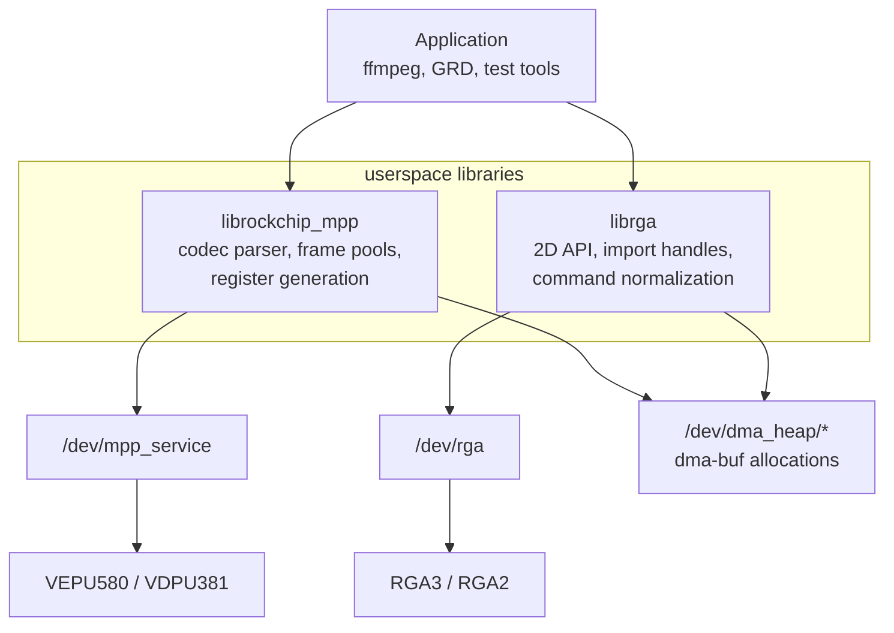

# vendor-libraries/ — librockchip_mpp and librga

The userspace libraries that sit between applications and the kernel devices:
Rockchip's `librockchip_mpp` for codec work and `librga` for 2D blits, scale,
color conversion, and composition. Library source lives in the sibling trees
(`mpp-rockchip`, `librga`, `librga-src`); this project holds the architecture
notes and the kernel boundary.

Split into two sub-projects — [`mpp/`](mpp/README.md) and [`rga/`](rga/README.md)
— each with its own `README.md` + `keywords.md`. The **shared** cross-library
explanation stays at this top level.

## Project brief

| Field | Contents |
|-------|----------|
| Purpose | Build or install the libraries FFmpeg/GRD/tests need, with the right headers, `.pc` files, and device-node permissions. |
| Developer focus | Which work happens in userspace vs kernel, how dma-buf handles and register recipes reach `/dev/mpp_service` and `/dev/rga`, and why FFmpeg lineages use the libraries differently. |
| Owns | The shared explanation in [`docs/how-the-userspace-libs-work.md`](docs/how-the-userspace-libs-work.md); the `mpp`/`rga` sub-projects; ABI detail cross-linked from [`../kernel-drivers/docs/dev-uapis.md`](../kernel-drivers/docs/dev-uapis.md). |
| Depends on | Working kernel nodes from [`../kernel-drivers/`](../kernel-drivers/README.md); `video`-group access to `/dev/mpp_service`, `/dev/rga`, `/dev/dma_heap/*`; `libdrm` for DRM PRIME. |
| Current state | The source-built MPP/librga path is hardware-validated through the tests; the patched librga (`github.com/yisding/librga` `main` @ `a632217`) still needs P010/P210 hardware validation; the PPA route built locally but is not uploaded. See [`../status.md`](../status.md). |

## How the library package fits

The important division of responsibility:

| Layer | Does |
|-------|------|
| Application | Chooses codec/filter settings and owns the media pipeline. |
| `librockchip_mpp` | Parses bitstreams, manages codec state, allocates/imports buffers, builds register tables, issues MPP ioctls. |
| `librga` | Normalizes RGA requests, imports fd or virtual-address buffers, chooses a core profile, issues RGA ioctls. |
| Kernel drivers | Validate and run already-materialized jobs on the hardware. |

## Sub-projects

| Sub-project | Covers | Scoped docs |
|-------------|--------|-------------|
| [`mpp/`](mpp/README.md) | `librockchip_mpp`: internal architecture, KMPP reverse-engineering, Rust-rewrite assessment. | [`mpp-library-architecture.md`](mpp/docs/mpp-library-architecture.md), [`mpp-kmpp-reverse-engineering.md`](mpp/docs/mpp-kmpp-reverse-engineering.md), [`mpp-rust-rewrite-assessment.md`](mpp/docs/mpp-rust-rewrite-assessment.md) |
| [`rga/`](rga/README.md) | `librga`: usage guide, P010/P210 10-bit RKRGA investigation, Rust-rewrite assessment. | [`librga-guide.md`](rga/docs/librga-guide.md), [`librga-p010-p210-rkrga.md`](rga/docs/librga-p010-p210-rkrga.md), [`librga-rust-rewrite-assessment.md`](rga/docs/librga-rust-rewrite-assessment.md) |

## Developer path

| Question | Canonical doc |
|----------|---------------|
| What do libmpp and librga hide from an app, and where do they meet the kernel? | [`docs/how-the-userspace-libs-work.md`](docs/how-the-userspace-libs-work.md) |
| How is libmpp structured internally? | [`mpp/docs/mpp-library-architecture.md`](mpp/docs/mpp-library-architecture.md) |
| How do users and media developers use librga well? | [`rga/docs/librga-guide.md`](rga/docs/librga-guide.md) |
| What did we learn about RKRGA P010/P210 and librga 10-bit ABI? | [`rga/docs/librga-p010-p210-rkrga.md`](rga/docs/librga-p010-p210-rkrga.md) |
| What did we learn about Rockchip's newer KMPP path? | [`mpp/docs/mpp-kmpp-reverse-engineering.md`](mpp/docs/mpp-kmpp-reverse-engineering.md) |
| What ioctls cross into the kernel? | [`../kernel-drivers/docs/dev-uapis.md`](../kernel-drivers/docs/dev-uapis.md) |
| Why does GRD use upstream FFmpeg instead of `ffmpeg-rockchip`? | [`../video-libraries/ffmpeg/docs/implementation-comparison.md`](../video-libraries/ffmpeg/docs/implementation-comparison.md) |

## Common traps

| Trap | Explanation |
|------|-------------|
| Device access is three nodes, not one | Non-root MPP encode needs `/dev/mpp_service` and `/dev/dma_heap/*`; RGA also needs `/dev/rga`. Install [`../kernel-drivers/scripts/99-rockchip-codec.rules`](../kernel-drivers/scripts/99-rockchip-codec.rules) or the [`../packaging/codec-udev/`](../packaging/codec-udev/README.md) deb. |
| `librga` has source even when the official drop ships a prebuilt `.so` | The buildable source lineage is in [`../docs/gotchas.md`](../docs/gotchas.md); the current patched tree is `github.com/yisding/librga` `main` @ `a632217`. |
| P010/P210 via legacy RKRGA needs librga to copy 10-bit layout fields | Older librga dropped `is_10b_compact`/`is_10b_endian` before the ioctl. See [`rga/docs/librga-p010-p210-rkrga.md`](rga/docs/librga-p010-p210-rkrga.md). **The fix is not yet exported in-repo** — it lives only in the dev-box `../librga-src` tree, tracked on the [`../status.md`](../status.md) watchlist for export under a future `vendor-libraries/rga/patches/`. |
| `h264_rkmpp` does not always mean the same implementation | `ffmpeg-rockchip` and upstream FFmpeg 8.1.2 both expose rkmpp names, but the control surface differs. See [`../video-libraries/ffmpeg/docs/implementation-comparison.md`](../video-libraries/ffmpeg/docs/implementation-comparison.md). |
