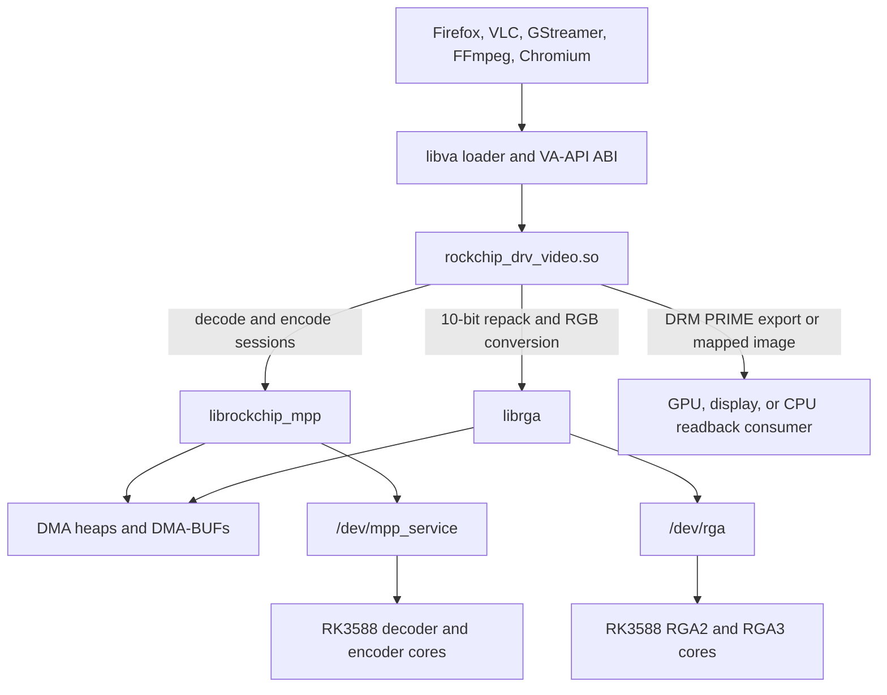
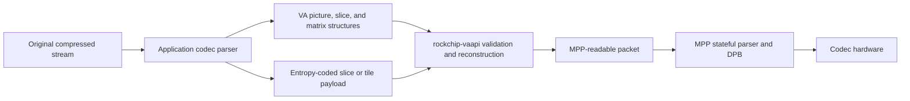
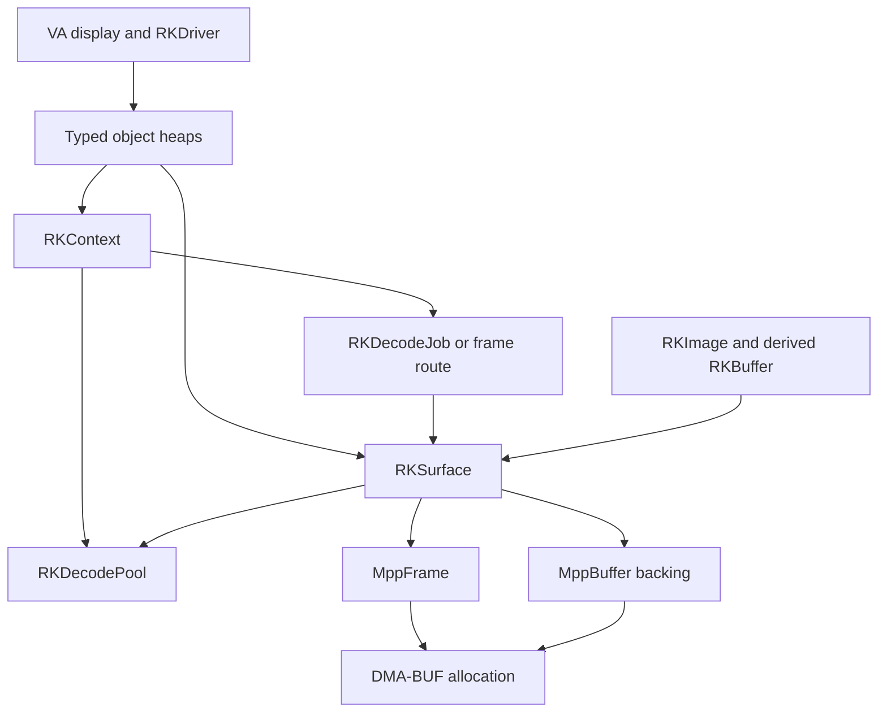
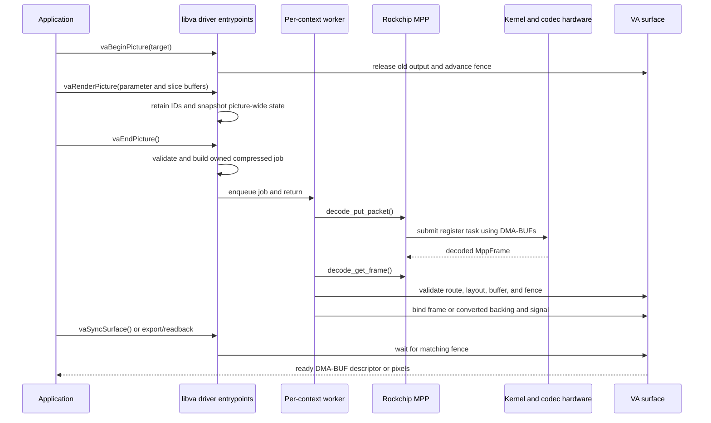
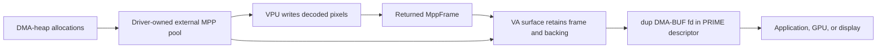
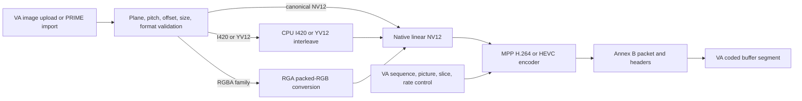
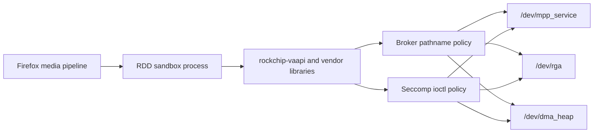

# How `rockchip-vaapi` bridges VA-API to Rockchip MPP

`rockchip-vaapi` is a userspace libva driver that makes the RK3588 vendor
codec stack look like a standard VA-API implementation. Applications speak
VA-API to `rockchip_drv_video.so`; the driver rebuilds the stateful input that
Rockchip MPP expects, manages hardware-visible DMA-BUFs, and presents decoded
or encoded data through normal libva objects.

The short version is:

```text
parsed VA codec state + slice payloads
  -> validated/reconstructed compressed packet
  -> stateful MPP decode or encode session
  -> retained DMA-BUF-backed frame or coded packet
  -> standard VA surface/image/export/coded-buffer contract
```

This is the durable architecture guide. The
[project front door](../README.md) owns the moving capability matrix and
evidence map; [`status.md` track 14](../../../status.md) owns the public
support verdict and next gate. Dated experiments stay in
[`findings/`](../../../findings/README.md).

The implementation descriptions below were source-inspected against
`yisding/rockchip-vaapi` implementation commit
`491533ec6bb375ef3ccba18ace26106417a76c3d` on 2026-07-29. The following
packaging-only commit does not change the architecture described here. The
pre-decode stable-export ownership update is separately inspected against the
local UNRELEASED ysp13 worktree over `main@184d7d4` on 2026-08-04 and is not
yet a public source pin. Its locally built package is installed and has passed
Google Chrome H.264 presentation plus VP9 hardware selection, but remains
uncommitted and unpublished.

## Fast re-entry

| Question | Go to | Load-bearing fact |
|----------|-------|-------------------|
| Why does this bridge exist? | [The impedance mismatch](#2-the-impedance-mismatch-stateless-va-stateful-mpp) | VA supplies parsed state; MPP wants a compressed stream it can parse itself. |
| What runs where? | [System position](#1-system-position-and-layer-ownership) | The driver is an in-process libva plugin above MPP/RGA, not a kernel driver or application fork. |
| What happens to one decoded picture? | [Decode lifecycle](#4-one-decode-picture-end-to-end) | `EndPicture` queues an owned job; a per-context worker submits to MPP and completes a generation fence on the target surface. |
| When is the path genuinely zero-copy? | [Surface ownership](#6-surface-memory-and-zero-copy-ownership) | Ordinary post-decode exports retain MPP's exact external-pool buffer. A consumer that already retained a pre-decode export requires a copy into that stable object. |
| Why is 10-bit special? | [The 10-bit path](#7-the-10-bit-path-afbc-nv15-to-linear-p010) | RK3588 produces compact NV15; the compatible public surface is P010, so RGA performs a checked repack. |
| How does encode differ? | [Encode lifecycle](#8-encode-path-and-input-normalization) | Encode is synchronous and accepts only a deliberately narrow, validated input-surface contract. |
| Why did VLC and Firefox need different work? | [Application contracts](#9-application-and-sandbox-contracts) | VLC derives and exports an image buffer; Firefox exports a surface and runs the driver inside RDD. |
| What did the renovation replace? | [Bridge construction record](#10-what-we-had-to-build-and-replace) | The strategic VA-to-MPP idea survived; fixed arrays, CPU frame copies, polling, incomplete reconstruction, and unsafe negotiation did not. |
| What is still open? | [Remaining issues](#12-remaining-issues-and-next-proofs) | Deployment, sandbox, 10-bit presentation, encoder qualification, Chromium, and AV1 are separate gates. |

### Similar objects and green signals that must not be conflated

| Do not conflate | Distinction |
|-----------------|-------------|
| VA surface | A logical application-visible object with a handle, format contract, fence, and current backing. It is not itself an allocation. |
| `MppFrame` | MPP metadata and a reference to a decoded hardware frame. Retaining it prevents MPP from recycling that frame too early. |
| `MppBuffer` | A userspace MPP wrapper around an allocation or imported fd. The external-pool backing reference keeps a borrowed fd alive. |
| DMA-BUF fd | A process-local handle to shared memory. Export duplicates the fd; closing the duplicate must not destroy the surface. |
| NV15 | Rockchip's compact 10-bit 4:2:0 storage, four 10-bit samples in five bytes. It is not P010. |
| P010 | The application-facing 16-bit-container 10-bit 4:2:0 format. It has different pitch and plane semantics from NV15. |
| “Code exists” | An implementation path may be present behind an environment opt-in. |
| “Advertised” | `vaQueryConfigProfiles` and related queries expose the path to ordinary applications. |
| “Gate passed” | A named command observed a specific output class on a pinned stack. A build, decoded frame count, byte-exact comparison, app display, sandbox proof, and soak are different evidence. |
| “Package installed” | Files are registered with `dpkg`; this does not prove that app gates ran through the installed `.so` without an override. |

## 1. System position and layer ownership

The bridge sits at the standard libva driver boundary. It does not emulate
V4L2, patch every media application, or move codec parsing into the kernel.



| Layer | Owns | Does not own |
|-------|------|--------------|
| Application and libavcodec/GStreamer | Container demux, compressed-stream parsing, VA object calls, software fallback, presentation metadata | Rockchip register programming |
| libva | Driver loading, ABI dispatch, public handles and structures | Codec translation or hardware scheduling |
| `rockchip-vaapi` | Capability policy, VA object lifetime, reconstruction, MPP session use, surface routing, synchronization, import/export validation | Pixel decoding, codec hardware registers, browser display composition |
| `librockchip_mpp` | Stateful codec parser, decoded-picture state, HAL/register generation, hardware task submission | VA-API semantics |
| `librga` | Userspace image-operation validation and RGA request construction | Codec parsing |
| Kernel MPP/RGA drivers | DMA-BUF import, IOMMU mapping, scheduling, register execution, interrupts and results | Full compressed-stream parsing or VA objects |
| Hardware | Decode, encode, and image conversion | Application-visible lifetime and fallback policy |

This separation explains why the project lives under `video-libraries/`.
The kernel-facing protocols are documented separately in the
[MPP library architecture](../../../vendor-libraries/mpp/docs/mpp-library-architecture.md),
[RGA guide](../../../vendor-libraries/rga/docs/librga-guide.md), and
[`/dev` uAPI guide](../../../kernel-drivers/docs/dev-uapis.md).

## 2. The impedance mismatch: stateless VA, stateful MPP

VA-API decode and MPP decode expose opposite abstractions:



The application has already parsed the stream before the driver sees it.
VA-API gives the driver C structures such as picture parameters, slice
parameters, scaling matrices, and a payload buffer. A normal stateless VA
driver would translate those structures directly into hardware registers.

Rockchip MPP instead wants a stateful compressed packet. Its own parser
reconstructs codec state and manages the decoded picture buffer
([glossary](../../../glossary.md)). The bridge therefore has
to turn the VA representation back into enough of a legal compressed stream
for MPP to parse again.

The amount of reconstruction is codec-specific:

| Codec | What survives the VA boundary | Bridge work |
|-------|-------------------------------|-------------|
| VP9 | The coded frame header and payload arrive together | Mostly pass-through, plus hidden-reference parsing and output routing |
| H.264 | Slice NAL payloads survive; SPS/PPS arrive only as parsed structures | Rebuild SPS/PPS, add Annex B start codes, preserve scaling and reference defaults |
| HEVC | Slice NAL payloads survive; VPS/SPS/PPS and DPB state arrive as structures | Rebuild VPS/SPS/PPS, reproduce reference-picture syntax, and rewrite the slice portion that depends on reconstructed parameter sets |
| AV1 | VA supplies effective parsed picture state and headerless tile data | The public packet path would need unsound OBU reconstruction; the credible vendor alternative is a separate parsed-picture VDPU compiler and direct `/dev/mpp_service` transport |

This is why AV1 hardware capability does not imply AV1 VA-API support. The
same RK3588 and MPP stack can decode AV1 when `av1_rkmpp` supplies original
OBUs, yet the normal VA bridge cannot feed MPP's packet parser with the state
that survives the VA boundary. Complete OBU reconstruction remains unsuitable
for stock clients. A separate direct vendor backend can instead translate the
effective VA state into hardware jobs and key persistent CDF/segmentation/MV
state to explicit VA surfaces. The packet mismatch is detailed in the
[AV1 reconstruction finding](../../../findings/2026-07-21-vaapi-mpp-bitstream-reconstruction-av1.md);
the bounded alternative is the
[direct AV1 backend design](av1-direct-mpp-service-backend.md).

## 3. Driver structure and object model

The maintained fork split the original single-file proof of concept into
modules with explicit ownership:

| Module | Main responsibility |
|--------|---------------------|
| `rockchip_drv_video.c` | `__vaDriverInit_1_20`, vtable wiring, profiles, entrypoints, attributes, unsupported-operation policy |
| `object_heap.c` | Dynamic generation-tagged handles for configs, contexts, surfaces, buffers, and images |
| `context.c` | Context creation, picture lifecycle, pending VA buffers, MPP decoder setup, worker creation |
| `mpp_dec.c` | Decode packet construction, external pools, frame routes, worker submission/drain, backend watchdog |
| `surface.c` | Surface allocation/import, placeholder storage, fence waits, status, readback |
| `buffer.c` | VA buffers and images, map/unmap, `vaDeriveImage`, buffer-handle acquisition, checked image uploads |
| `export.c` | DRM PRIME 2 descriptor construction |
| `h264.c`, `hevc.c`, `vp9.c` | Codec reconstruction and narrow parsing |
| `convert.c` | RGA-backed NV15-to-P010 and packed-RGB-to-NV12 conversion |
| `mpp_enc.c` | Experimental VA encode parameter translation and synchronous MPP encode |
| `frame_layout.c` | Overflow-safe NV12/P010 allocation and layout calculations |
| `log.c` | Thread-safe leveled text or JSON logging |

### Generation-tagged handles

The proof of concept used fixed global arrays and handles that could alias a
recycled slot. The maintained object heap encodes:

```text
4-bit type | 8-bit generation | 20-bit slot index
```

Lookup checks both type and generation. A destroyed surface handle therefore
cannot silently become a later buffer or surface. The heaps grow dynamically,
and a slot is retired before its generation can wrap.

All heap insertion, lookup-acquire, and removal operations are serialized by
the driver's `object_lock`. The acquired object then carries an atomic
reference, so the global lock is released before an MPP call, a fence wait, or
other long operation.

### Ownership graph



The important inversion is that a surface can outlive the context that decoded
into it. Jobs and route records retain their target surface; a surface holding
an external output retains the shared decode pool. Destroying a context cannot
free a DMA-BUF that an application still displays.

## 4. One decode picture end to end

### Call and worker sequence



### 4.1 Context creation

`vaCreateContext` resolves the selected profile and entrypoint before the
configuration object can disappear. It rejects invalid dimensions and the
advertised 7680×4320 ceiling, creates one MPP context, and initializes it for
decode or encode.

For decode it also:

- starts a dedicated worker thread;
- makes input nonblocking and output wait in bounded 20 ms intervals;
- requests immediate output for H.264 and HEVC, whose frames are routed by a
  unique token;
- requests AFBC V2 output for experimental HEVC Main10 and VP9 Profile 2;
- rejects a 10-bit width below the RGA3 68-pixel active-width floor before MPP
  or RGA work begins.

MPP calls during steady-state decode belong to the worker. VA caller threads
create jobs and wait on surfaces; they do not poll MPP directly.

### 4.2 `BeginPicture`: establish the generation fence

Reusing a surface releases its old `MppFrame`, converted backing, and decode
pool reference. The surface fence is incremented, its state becomes in-flight,
and the context records the target plus the exact fence value.

A late frame can carry the correct surface handle but belong to an older use
of that handle. Matching both surface and fence prevents it from overwriting
the newer picture.

H.264 field pictures are the narrow exception. FFmpeg submits two fields in
separate Begin/Render/End cycles, while MPP reports the completed frame with
the first field's token. A declared field continuation therefore shares the
first field's fence and route. Applying that rule to ordinary frame reuse
would reintroduce stale-output bugs.

### 4.3 `RenderPicture`: preserve caller-owned state

The application may destroy a VA buffer as soon as `vaRenderPicture` returns.
The driver therefore:

- records every buffer ID in a dynamically grown pending list;
- snapshots H.264 or HEVC picture and IQ-matrix state immediately;
- caps only hostile unbounded growth, not legal many-slice pictures;
- validates and snapshots encoder parameters on the encode path.

The original 64-buffer-per-picture ceiling was removed after legal HEVC
conformance streams exceeded it.

### 4.4 `EndPicture`: build, transfer ownership, return

For decode, `vaEndPicture` asks the codec backend to build an owned job. That
job contains the complete reconstructed packet, target surface reference,
surface fence, and routing metadata. Once queued, the picture call returns
without waiting for hardware.

If packet construction, validation, or queue insertion fails, the surface
fence is completed as failed. The driver never leaves an application waiting
on work it did not accept.

### 4.5 Worker submission, backpressure, and routing

MPP's input queue can fill. Treating a failed nonblocking
`decode_put_packet()` as a fatal picture error caused nondeterministic VP9
frame drops. The worker now drains available output and retries submission
within bounded waits.

Each submitted H.264 or HEVC job receives a unique token stored in the MPP
packet timestamp. The output route table maps that token back to a surface and
fence even when display order differs from submission order.

VP9 does not use output PTS as identity. A `show_existing_frame` operation may
surface a hidden alternate-reference frame with that older frame's PTS. VP9
outputs are routed through the ordered submission queue instead.

Before binding a frame, the worker verifies:

- a live route exists;
- the route fence is still the surface's current fence;
- MPP did not mark the frame errored or discarded;
- dimensions, format, strides, offsets, and allocation size are safe;
- an external output belongs to the committed pool at the expected index/fd;
- a 10-bit output can be converted into a valid P010 allocation.

Only then does it swap the surface backing, mark the surface decoded, and
broadcast the condition variable.

### 4.6 Waiting, backend stalls, and teardown

`vaSyncSurface2` implements zero, finite, and infinite timeouts over the
surface condition variable. `vaSyncSurface` is specified as an unbounded wait,
so the worker adds a separate safety rule: if frames are outstanding and MPP
produces no output for ten seconds, all pending routes fail with a decoding
error. That converts a wedged backend into application-visible fallback
instead of a permanently hung media process.

Context destruction drains already submitted work rather than cancelling it.
Applications may destroy a context at a sequence change and then synchronize
surfaces that context was still filling. The worker sends end-of-stream,
drains healthy output, and uses a one-second teardown deadline so a broken
backend still cannot hold `vaDestroyContext` forever.

## 5. Codec-specific reconstruction

### H.264

For each access unit the driver assembles:

```text
SPS when first needed or at an IDR
  + PPS for the current picture
  + Annex B start code and each original slice NAL
```

The SPS/PPS writer uses bounded bit operations and Exp-Golomb coding. It
derives a representable level from the available frame/DPB constraints,
emits high-profile fields and scaling matrices, and performs emulation
prevention.

Re-emitting the PPS for every picture is intentional. VA does not provide the
original PPS bytes, and slice headers may rely on PPS default active-reference
counts. The original bridge hardcoded those counts to one reference, which
made common multi-reference/B-frame streams decode mostly wrong while still
appearing successful.

### HEVC

HEVC needs a wider reconstruction boundary:

- VPS/SPS/PPS generation for Main and the experimental Main10 path;
- scaling lists in picture state;
- tiles and parameter-set IDs;
- current short-term reference materialization;
- explicit long-term reference reproduction in original stream order;
- validation and rewriting of the slice syntax that selects reconstructed
  reference-picture state.

The driver regenerates the sequence bundle for comparison but prepends it only
when it changes. Resetting MPP's parser state on every random-access picture
would strand valid following pictures that still refer across the boundary.
A picture-specific PPS is sent for each access unit.

`ReferenceFrames[]` is not an ordered serialization of HEVC's long-term RPS.
Rebuilding explicit long-term entries by sorting that array produced
bitstream-valid but wrong output. The driver now consumes and reproduces the
original explicit order where it affects initial reference lists.

Some HEVC failures were below the bridge. The last default-profile TILES
failure reproduced in a libva-free MPP runner and was fixed in the paired MPP
parser. That distinction is why the conformance sweep classifies direct-MPP
backend failures separately from driver failures.

### VP9

VP9's coded frame generally passes through unchanged. The bridge still has to
solve two stateful sequencing problems:

1. Output PTS is not a reliable route for `show_existing_frame`, so displayed
   output follows the driver's submission queue.
2. libavcodec may consume a show-existing operation internally while MPP keeps
   a `show_frame=0` reference hidden. The driver parses the refresh mask and
   submits a bounded synthetic show-existing packet so MPP exposes the hidden
   buffer that must be bound to the logical VA reference surface.

The parser understands the exposed Profile 0 and experimental Profile 2
syntax and rejects Profile 2 combinations that cannot be represented as 10-bit
4:2:0 P010.

### AV1

There is no VA-API AV1 path. VA hands the driver tile data without the original
frame-header OBU, and stock libva also omits `refresh_frame_flags`. Complete OBU
reconstruction would require a large conditional header on every frame and
still could not reproduce all original parser state soundly.

The source-inspected vendor alternative is a distinct backend:

```text
VA AV1 picture + tiles + explicit surfaces
  -> validated RKAV1Picture
  -> VDPU383 hardware-job compiler
  -> /dev/mpp_service register transport
  -> pixels plus surface-keyed CDF/segmentation/MV state
```

Attaching hardware state to actual surface generations removes the need for
the VA driver to update abstract AV1 DPB slots using the missing refresh mask.
This bypasses userspace libmpp, not the kernel MPP framework, and transfers the
AV1 HAL, DMA-BUF allocation, stream packing, validation, and recovery burden
into the driver. The architecture, threat boundary, open discriminators, and
golden-job replay sequence are in the
[direct backend design](av1-direct-mpp-service-backend.md).

No direct job has been submitted, so discovery probes deliberately do not
advertise an AV1 VA profile or send incomplete data.

## 6. Surface memory and zero-copy ownership

### Why the proof of concept copied every frame

MPP's internal pool is smaller than the lifetime of surfaces held by a browser
or compositor. Exporting an internal frame directly allowed MPP to recycle and
overwrite it while the application was still displaying it. The proof of
concept avoided corruption by copying every decoded picture into a private
per-surface buffer—roughly 1.5 GB/s of extra memory traffic at 4K60.

### The external-pool redesign



On MPP's first information-change frame, the driver learns the real output
layout, creates 24 DRM-backed buffers, wraps them as stable-index `EXT_DMA`
buffers, and commits the group with `MPP_DEC_SET_EXT_BUF_GROUP`. MPP then
decodes directly into those buffers.

Twenty-four is a starting size, not a fixed promise. Frame-threaded HEVC
consumers have held more surfaces than that, leaving MPP unable to obtain a
free output and deadlocking the pipeline. When backpressure cannot be relieved
by draining output, the pool grows on demand to 64. At that final ceiling the
driver reports an error instead of waiting forever.

An 8-bit output surface retains:

- the returned `MppFrame`, which prevents codec-side reuse;
- an incremented reference on the external pool's backing `MppBuffer`, because
  MPP's wrapper borrows rather than owns that fd;
- the `RKDecodePool`, which keeps both buffer groups alive after context
  destruction.

Surface reuse drops those references and returns the allocation to MPP when
the codec no longer needs it either.

### Pre-decode exports make placeholder storage permanent

Firefox and other consumers can export a surface before the first decode while
probing capability and allocating their display pipeline. Each VA surface
therefore starts with a conservative driver-owned placeholder in its declared
NV12 or P010 format.

Google Chrome establishes a stronger lifetime: it imports that early DMA-BUF
into a persistent NativePixmap and expects later decoded pictures to appear in
the same object. The first pre-decode export therefore marks the placeholder as
stable external storage. Completed output is copied into it under the surface
generation fence rather than replacing the externally visible allocation.
NV12 uses RGA; converted P010 uses synchronized CPU row copies because the
qualified RGA stack reports P010-to-P010 success without writing. Driver-owned
NV12 placeholders begin with a 64-byte-aligned pitch so retained exports are
also Panfrost-importable.

This fallback is conditional. A consumer that first exports after decode still
receives the retained MPP output directly and remains zero-copy. Imported
surfaces already have stable caller-owned storage, and encoder inputs use a
separate ownership path.

### What “zero-copy” means here

| Path | Pixel movement |
|------|----------------|
| 8-bit decode, first export after completion | VPU writes the external pool; the consumer receives a duplicated fd for the same allocation. No driver pixel copy. |
| 8-bit decode, surface exported before completion | VPU writes the external pool; RGA copies the completed NV12 picture into the permanently exported placeholder. |
| 8-bit decode to `vaDeriveImage` | The image aliases the surface allocation. Mapping opens a CPU access window but does not create a second image. |
| `vaGetImage` | CPU readback/copy into the application's image; this is deliberately not zero-copy. |
| 10-bit decode | VPU writes AFBC NV15; RGA repacks it to linear P010. A retained pre-decode export adds a synchronized CPU copy into its permanent P010 object; ordinary post-decode export does not. |
| Planar encode upload | CPU interleaves I420/YV12 into native NV12. |
| Packed-RGB encode import | RGA converts the imported RGB object to driver-owned NV12. |

### DMA synchronization

A DMA-BUF shared by VPU, RGA, and CPU needs explicit ownership transitions.
`vaGetImage`, derived-image mapping, and image upload bracket CPU access with
`DMA_BUF_IOCTL_SYNC`. Missing the read transition produced intermittent stale
VP9 frames even when buffer indices and route tokens were correct.

This creates a kernel configuration precondition. The upstream
`CONFIG_DMABUF_DEBUG` implementation mangles scatterlists while mapped and is
incompatible with the system heap's CPU-sync path on this stack. The
production-shaped kernel used for the current gates disables that option; the
[root-cause finding](../../../findings/2026-07-28-dmabuf-debug-mangle-sg-table-is-the-sg-writer.md)
owns the exact boundary.

### Export and derive are different APIs

`vaExportSurfaceHandle` produces a DRM PRIME 2 descriptor for the active
buffer:

- composed NV12/P010 for consumers that want one two-plane layer; or
- split `R8` + `GR88` and `R16` + `GR1616` layers for Firefox-style YUV
  imports.

The driver duplicates the object fd because the caller owns and closes the
exported fd.

VLC's OpenGL converter uses another route:

```text
vaDeriveImage(surface)
  -> VAImage whose VABuffer aliases the surface
  -> vaAcquireBufferHandle(image buffer)
  -> duplicated DRM PRIME fd
  -> EGLImage import
```

The derived image has fixed pitches and offsets, so the driver offers it only
for stable linear 8-bit decoded surfaces. It rejects:

- 10-bit surfaces whose placeholder and post-conversion strides may differ;
- still-compressed AFBC;
- imported packed RGB;
- encoder-input surfaces, whose app-visible upload format may differ from the
  native NV12 storage.

Map and handle-acquire operations re-check that the live buffer still has the
derived layout. A changed layout fails rather than exposing pixels with stale
pitches.

## 7. The 10-bit path: AFBC NV15 to linear P010

RK3588's VDPU383 decoder produces `MPP_FMT_YUV420SP_10BIT`, a compact NV15
layout. Applications negotiate P010. Labeling the compact allocation as P010
would produce corrupt pixels and unsafe pitch arithmetic.

```mermaid
flowchart LR
    va["HEVC Main10 or VP9 Profile 2 VA context"]
    mpp["MPP requests AFBC V2 output"]
    nv15["AFBC NV15 external-pool frame"]
    meta["Header stride, vertical stride, crop offsets"]
    guard["Layout and RGA geometry validation"]
    rga["RGA3 NV15-to-P010 repack"]
    p010["Linear P010 backing DMA-BUF"]
    consumer["PRIME export or image readback"]

    va --> mpp
    mpp --> nv15
    nv15 --> meta
    meta --> guard
    guard --> rga
    rga --> p010
    p010 --> consumer
```



### Why AFBC is requested

For a measured 320-pixel frame, normal linear MPP output reported a 448-byte
stride. NV15 packs four pixels into five bytes, so MPP's integer conversion
described that as 358 pixels. That value cannot represent the original byte
layout and violates librga's compact 10-bit stride alignment.

The working MPP contract is AFBC V2:

- format `MPP_FMT_YUV420SP_10BIT | MPP_FRAME_FBC_AFBC_V2`;
- pixel stride from `mpp_frame_get_fbc_hdr_stride()`;
- vertical stride from `mpp_frame_get_ver_stride()`;
- source origin from `mpp_frame_get_offset_x/y()`;
- RGA read mode `IM_AFBC16x16_MODE`;
- visible rectangle converted to a linear P010 destination.

The crop origin is not decoration. Ignoring a measured four-row Y offset
produced a vertically shifted result; honoring it made the P010 bytes match
software decode exactly.

### The 68-pixel guard

Only RGA3 can read AFBC on RK3588, and the vendor RGA3 capability table requires
both source and destination active widths to be at least 68 pixels. RGA2 can
process narrower raster images but cannot read AFBC.

Padding only the stride cannot bypass this policy because the kernel checks the
active rectangle. The driver now rejects a narrower experimental 10-bit
context with `VA_STATUS_ERROR_RESOLUTION_NOT_SUPPORTED`, then repeats the same
guard immediately before conversion. This gives the application a clean
software fallback without submitting an impossible RGA job. The exact kernel
and runtime evidence is in the
[narrow-AFBC finding](../../../findings/2026-07-29-rga-no-core-match-narrow-afbc-10bit.md).

### Metadata boundary

libavcodec parses colorimetry and HDR metadata from the original stream before
VA submission and keeps it on the output frame. VA's HEVC picture structures
do not preserve every original VUI/SEI bit, so the private SPS rebuilt for MPP
does not try to regenerate application-facing metadata. The measured HDR gate
proved that BT.2020/PQ and static mastering/content-light metadata survived the
hardware-frame path; it did not prove correct HDR display presentation.

### Kernel and librga are a pair

P010 correctness depends on both sides agreeing about compact/padded 10-bit
flags, pitches, UV offsets, and RGA request fields. An older librga against a
newer kernel—or vice versa—can turn a valid VA request into wrong chroma below
the bridge. The paired contract is documented in the
[librga P010/P210 guide](../../../vendor-libraries/rga/docs/librga-p010-p210-rkrga.md).

## 8. Encode path and input normalization

Experimental H.264 Main/High and HEVC Main use `VAEntrypointEncSlice`.
Unlike decode, encode completes synchronously in `vaEndPicture`: the driver
configures MPP, submits one frame, receives one packet, and stores it in a
`VACodedBufferSegment`.



### Parameter translation

`vaRenderPicture` snapshots the encoder sequence, picture, slice, and supported
miscellaneous rate-control/frame-rate buffers. `mpp_enc.c` translates them to
MPP preparation, rate-control, H.264, or HEVC keys.

The exposed rate-control modes are CQP, CBR, and VBR. MPP emits headers on
each IDR. A coded packet larger than the caller's VA buffer reports
`VA_CODED_BUF_STATUS_FRAME_SIZE_OVERFLOW` rather than truncating.

HEVC required an explicit hardware contract. Without advertised block-size
attributes, FFmpeg guessed 32×32 CTUs while RK3588 MPP encoded native 64×64
CTUs, producing a decodable stream with parser errors. The driver now
advertises 64×64 coding-tree blocks, 8×8 minimum luma coding blocks, and
4×4–32×32 transform blocks.

### Native and uploaded surfaces

MPP encoder input is progressive 8-bit NV12. The application-visible surface
formats are broader, but their storage is normalized:

- native NV12 is copied or imported directly under checked layout rules;
- I420 and YV12 uploads validate every plane, then interleave U/V into NV12;
- the reverse `vaGetImage` path deinterleaves for checked round trips;
- encoder surfaces reject mismatched context dimensions or bit depth.

The separation between upload format and storage format is essential.
Advertising I420 without converting it would feed planar chroma to hardware
that interprets the memory as interleaved NV12.

### PRIME import contract

External encode surfaces deliberately accept only:

- one DMA-BUF object;
- one composed layer;
- `DRM_FORMAT_MOD_LINEAR`;
- exact visible dimensions and sufficient object capacity;
- canonical NV12 offsets and equal pitches; or
- zero-offset RGBA/RGBX/BGRA/BGRX with a checked packed pitch.

The driver duplicates the application fd and owns that duplicate for the
surface lifetime. Linear NV12 reaches MPP directly. Packed RGB is converted
through RGA into the driver's aligned NV12 buffer on every encoded frame.

Multi-object, tiled/modifier-bearing, undersized, mismatched, and non-DMA-BUF
descriptors fail during surface creation. Imported surfaces reject
`vaPutImage`, so an upload cannot silently modify unrelated driver-owned
storage.

### Why encode remains experimental

The current path intentionally accepts one complete frame slice, progressive
8-bit input, MPP-managed references, and synchronous completion. This avoids
claiming the kernel's historically fragile multi-slice path. Linear P010
surface import/readback exists as a checked memory contract, but RK3588's MPP
`vepu5xx` HAL rejects the compact 10-bit encoder input format, so it is not a
Main10 encode capability.

## 9. Application and sandbox contracts

Standardizing the codec call is necessary but not sufficient. Each application
reaches a different part of libva:

| Consumer | Critical contract | Proven boundary |
|----------|-------------------|-----------------|
| FFmpeg VAAPI | Config/context, surfaces, picture buffers, sync, hardware-frame download | Decode conformance reference path; experimental encode interop path |
| GStreamer `va` | Vendor opt-in, image upload/readback, advertised formats | `GST_VA_ALL_DRIVERS=1` is required for the unfamiliar Rockchip vendor; system-memory gates pass |
| VLC | `vaDeriveImage` plus `vaAcquireBufferHandle` for EGLImage import | Stock VLC decodes H.264/HEVC in a real display session; headless dummy output is not evidence |
| Firefox | PRIME 2 surface attributes/export, pre-decode placeholder, RDD device and ioctl policy | Decode/export passes with RDD sandbox disabled; the narrow sandbox patch still needs a live packaged proof |
| Chromium / Google Chrome | A binary compiled with VA-API, stable pre-decode surface export, GPU-media presentation and sandbox access | XtraDeb Chromium exposes only Hantro V4L2 VP8. Google Chrome 151 with installed ysp13 presents H.264 correctly and selects `VaapiVideoDecoder` for 640x480 VP9; 384x240 VP9 intentionally prefers software. Stock Chrome uses no disabling flags, but its GPU process reports unsandboxed and has no seccomp filter. Automated replay and sandbox remain |

### Firefox RDD has two independent gates



The broker must allow the paths that the vendor libraries open:

- `/dev/mpp_service`;
- `/dev/rga`;
- `/dev/dma_heap` and its heap nodes.

After a file opens, seccomp must allow the request numbers actually used. The
measured Rockchip-specific set was:

| Device | Request | Purpose |
|--------|--------:|---------|
| `/dev/mpp_service` | `0x40047601` | MPP v1 command transport |
| `/dev/rga` | `0x801c7201` | Driver version query |
| `/dev/rga` | `0x80907202` | Hardware version query |
| `/dev/rga` | `0x5017` | Legacy synchronous blit used by the measured librga path |

Firefox already allowed the measured DMA-BUF sync and, on arm64, the
dma-heap ioctl family; the missing heap element was the broker path. The
source-hash-pinned Firefox patch adds only existing character-device paths and
the measured MPP/RGA requests. It deliberately does not set
`MOZ_DISABLE_RDD_SANDBOX`.

Disabling RDD is useful only as a short diagnostic. The driver runs inside a
process decoding untrusted media and gains access to vendor kernel interfaces,
so permanently disabling the sandbox would convert an integration workaround
into a security regression.

### Ordinary device permissions

Outside browser sandboxing, the login or service account still needs normal
DAC access. `/dev/mpp_service`, `/dev/rga`, and `/dev/dma_heap/*` are separate
permission gates. Granting only the codec node leaves MPP unable to allocate
frames and can fail initialization with `MppBufferService get_group failed`.
The canonical udev package grants all three device classes to the `video`
group; see the
[codec udev guide](../../../packaging/codec-udev/README.md).

## 10. What we had to build and replace

The original v1.0.11 proof of concept established the right strategic path:
use libva's standard plugin boundary, reconstruct enough bitstream for MPP,
and export DMA-BUFs. The maintained fork renovated the load-bearing parts
rather than starting over.

| Symptom or debt | Discriminating observation | Change |
|-----------------|----------------------------|--------|
| Profiles were advertised before they worked | HEVC lacked VPS/SPS/PPS; VP8 crashed; AV1 decoded zero frames | Centralized capability policy and hid every path until its fallback and hardware gates existed |
| Common H.264 streams produced wrong frames | Multi-reference slices inherited bad PPS defaults | Rebuilt the PPS per picture from current slice parameters and added scaling/level correctness |
| VP9 lost packets nondeterministically | `decode_put_packet` failed only when the MPP queue filled | Added a dedicated worker that drains output and retries backpressured submission |
| VP9 output shifted to the wrong surfaces | Show-existing output reused hidden-frame PTS | Routed VP9 by submission order and synthesized bounded hidden-reference exposure |
| Exported frames changed while displayed | MPP recycled its small internal pool | Inverted ownership with a driver-created external group and retained frame/backing references |
| 4K decode spent heavy CPU/memory bandwidth | Every completed frame was copied to private surface memory | Removed the decoded-pixel memcpy; exported the retained external allocation |
| Surface waits polled and raced | Caller threads used sleeps and fixed deadlines | Added one MPP-owning worker per context and condition-variable fences per surface generation |
| Recycled handles and concurrent clients were unsafe | Fixed arrays had no type/generation or global synchronization | Added dynamic typed generation heaps, atomic object references, and a short-held driver lock |
| Legal HEVC pictures hit arbitrary ceilings | More than 64 VA buffers and more than 24 held surfaces occurred | Grew picture buffer lists dynamically and external pools on demand up to a fail-closed ceiling |
| Destroying a context corrupted later sync | Surfaces outlived the context that was still filling them | Made teardown drain submitted work and made surfaces retain their shared pool |
| A stopped backend hung forever | `vaSyncSurface` has no API timeout | Added a worker progress watchdog that fails stranded fences |
| HEVC parsed but decoded wrong on broad vectors | RPS ordering, slice rewrite, sequence updates, and same-ID PPS behavior differed | Implemented complete bounded reconstruction and split direct-MPP backend failures from bridge failures |
| Main10 looked like P010 but was not | MPP returned compact NV15 with an unrepresentable linear stride | Requested AFBC V2 and repacked with RGA using header stride and crop metadata |
| A 64-pixel Main10 picture reached `no core match` | RGA3 requires width 68 and RGA2 cannot read AFBC | Refused unsupported geometry at context creation and repeated the guard before submission |
| VLC allocated VA surfaces then fell back | Its GL converter required derive-image and buffer-handle APIs | Implemented a stable linear NV12 alias with checked DRM PRIME handle export |
| System-memory encoders produced wrong chroma or no data | `vaPutImage` could not be a success-returning stub | Added capacity-checked NV12/P010/planar image layouts and explicit upload conversion |
| HEVC encode emitted parser warnings | Clients guessed CTU32 while MPP encoded CTU64 | Advertised the actual RK3588 block-size contract |
| RGB DMA-BUF input had no safe path | PRIME descriptor shapes and fd lifetime were underspecified | Accepted one narrow linear contract, duplicated fds, and converted packed RGB through RGA |
| Browser decode required disabling RDD | Device opens and MPP/RGA ioctls were blocked independently | Measured the request set and built a version/hash-pinned broker and seccomp patch |
| A soak claim could go stale when log wording changed | Audit grep no longer matched after a log field was inserted | Repaired the gate and re-ran it; structured logs and explicit evidence classes reduce future ambiguity |

The causal record behind those changes starts with the
[original renovation review](../../../findings/2026-07-21-rockchip-vaapi-driver-review.md)
and continues through the project
[evidence map](../README.md#evidence-map).

## 11. Failure policy and validation model

### Fail closed at the earliest useful layer

| Condition | Required behavior |
|-----------|-------------------|
| Unsupported codec/profile | Do not advertise it; ordinary applications choose software |
| Unsupported dimensions | Reject config/context before allocation or hardware submission |
| Malformed or incomplete codec structures | Return a real `VAStatus`; do not queue a partial packet |
| Stale surface generation | Drop the late output and leave the newer picture untouched |
| MPP frame error/discard | Fail the matching surface rather than export corrupt output |
| Unsafe stride, crop, offset, or backing size | Fail the frame before mapping or conversion |
| Unsupported PRIME descriptor shape | Reject at surface creation |
| RGA unavailable for required 10-bit/RGB path | Hide/reject the path; never relabel the source storage |
| Coded-buffer overflow | Set the VA overflow status and return an error |
| Backend stops making progress | Fail pending fences so the application can recover |

### Evidence ladder

```mermaid
flowchart LR
    build["Warning-clean build"]
    unit["Unit and object-lifecycle tests"]
    safety["ASan, UBSan, TSan, Valgrind, fuzzing"]
    codec["Byte-exact decode or encode PSNR and parser gate"]
    concurrent["Concurrent contexts and resource soak"]
    app["Real application and display session"]
    sandbox["Sandboxed device and ioctl proof"]
    package["Installed clean-image artifact"]

    build --> unit
    unit --> safety
    safety --> codec
    codec --> concurrent
    concurrent --> app
    app --> sandbox
    sandbox --> package
```



Later evidence does not erase the meaning of earlier evidence, and earlier
evidence cannot stand in for later evidence. Examples:

- `vainfo` proves advertised capabilities, not decoded pixels.
- A decoded frame count proves activity, not pixel correctness.
- Byte-exact download proves codec and readback correctness, not display HDR.
- A source patch that applies proves policy construction, not a live sandbox.
- An isolated-root package lifecycle proves packaging behavior, not hardware
  decode through the installed artifact.

The maintained source tree carries host tests, full-driver sanitizers,
libFuzzer reconstructors, pinned codec vectors, direct-MPP classifiers,
application gates, concurrent decode/encode gates, and paced soak harnesses.
The exact measured results and stack fingerprints belong in dated findings,
not in this architectural model.

## 12. Remaining issues and next proofs

This table records durable open boundaries as of 2026-07-29. Consult the
[project summary](../README.md), [application map](../../../docs/app-enablement.md),
and [`status.md` next gate](../../../status.md#next-gates) before acting,
because package and upstream state can change without an architecture edit.

| Area | What is already bounded | What remains | Next discriminating proof |
|------|-------------------------|--------------|---------------------------|
| Installed artifact | Source-path gates cover the maintained implementation; package build/lifecycle checks exist | A package being built or installed is not the same as running the full gates through the installed driver | Run safe decode, HEVC, narrow fallback, VLC, and Firefox with the installed driver and no `LIBVA_DRIVERS_PATH` override |
| Firefox sandbox | Exact 153.0 source preimages and a narrow broker/seccomp patch are checked; unsandboxed hardware decode works | No patched Firefox binary has proved live RDD decode with the sandbox enabled | Build/install the pinned Firefox package, leave `MOZ_DISABLE_RDD_SANDBOX` unset, and audit driver frames plus allowed device/ioctl access |
| HEVC Main10 | 10 of 11 real Main10 vectors are P010-exact; the unsupported 64-pixel case falls back before RGA | Profile is hidden; throughput, broader app use, and actual HDR presentation are unqualified | Measure sustained 10-bit throughput and HDR output in a real display path, then run the app matrix before advertising |
| VP9 Profile 2 | Generated and official vectors are P010-exact through AFBC/RGA | Profile is hidden and lacks broad application/display qualification | Run browser/player PRIME presentation and sustained resource gates on the pinned stack |
| Narrow 10-bit geometry | Driver refuses widths below 68 under the inherited vendor policy | It is unknown whether the limit is physical or can be avoided with padded AFBC, another MPP layout, or CPU unpack | Prototype only if narrow 10-bit hardware decode matters; keep the proven software fallback regardless |
| MPP decode backend | HEVC Main has zero bridge failures in the broad sweep | Two conformance streams remain undecodable by MPP itself; oversize pictures exceed the public constraint | Fix or classify in MPP; do not weaken bridge validation to make them appear supported |
| External pool ceiling | On-demand growth prevents the observed 24-buffer deadlock | A consumer holding more than 64 outputs receives an error rather than unlimited growth | Measure real high-DPB clients before changing the ceiling; preserve bounded resource use |
| Encode qualification | H.264/HEVC one-slice CQP/CBR/VBR, GStreamer/FFmpeg interop, concurrency, RTP, RGB import, and short soak pass | Two-hour qualification, full hardware WebRTC peer gate, browser encode integration, multi-slice, B-frames, and broader rate-control behavior remain | Complete the paced long soak and native `vah264enc` peer run before considering default exposure |
| Main10 encode | Linear P010 memory handling is checked | RK3588 MPP `vepu5xx` rejects the required 10-bit input format | Obtain backend/HAL support first, then add Main10 bitstream, quality, sanitizer, concurrency, and soak gates |
| PRIME imports | One-object linear NV12 and packed RGB are validated | Multi-object, planar external, AFBC/tiled, and other modifiers are rejected | Add one descriptor shape at a time with fd-lifetime, capacity, conversion, and standard-decoder evidence |
| Chromium / Google Chrome | Wayland/ANGLE/Panfrost is healthy; XtraDeb Chromium exposes Hantro V4L2 VP8, while Google Chrome enumerates this driver's H.264/VP9/HEVC profiles. Installed ysp13 presents H.264 correctly and selects VA-API for 640x480 VP9; 384x240 selects software by the below-360p policy | Manual H.264 presentation and VP9 selection are proven. Stock Chrome uses no sandbox-disabling flags, but the GPU process has `Seccomp: 0`; browser stable-copy markers, automated visible-output checking, HEVC playback and sandbox attribution are not | Automate H.264/VP9 playback with checked output and stable-copy markers, add HEVC, identify what precedes the multiple-thread sandbox warning, then prove MPP/RGA/DMA-heap access in a sandboxed GPU process. A mixed Chromium build remains useful but is no longer prerequisite to the Google Chrome gate |
| AV1 | Hardware and ordinary RKMPP packet decode exist; a source-inspected direct `/dev/mpp_service` backend has a bounded architecture | No normalized golden-job replay, direct compiler, surface-state conformance, output-layout proof, recovery, film-grain, or app gate exists; AV1 remains unadvertised | Capture and replay one known-good libmpp job through a standalone direct transport before integrating any VA capability |
| Long-term maintenance | The fork has structured gates and source-pinned browser policy | MPP, librga, kernel, libva, Firefox, and Chromium can drift independently | Re-run the relevant conformance/app/sandbox gates on every component bump and update the source pins |

### Recommended priority

1. Close the installed-driver and Firefox sandbox proofs for the default decode
   set.
2. Qualify 10-bit throughput and HDR presentation before exposing Main10 or
   VP9 Profile 2.
3. Complete long encode and native WebRTC qualification before widening or
   default-enabling encode.
4. Treat Google Chrome replay automation and sandbox qualification, the XtraDeb
   Chromium mixed-backend package gate, the AV1
   direct-backend proof, and new PRIME descriptor shapes as independent work
   packages, not extensions implied by existing green gates.

## 13. Debugging by boundary

When something fails, identify the last boundary that produced positive
evidence:

| Symptom | First discriminator | Likely owner |
|---------|---------------------|--------------|
| Driver does not load | libva loader message and selected driver path | Package/config/libva |
| MPP initialization fails with `get_group` | Access to every `/dev/dma_heap/*` node | udev/group/sandbox broker |
| No MPP information change or output | Reconstructed packet validity versus direct MPP | Codec reconstructor or MPP parser |
| Frame count is right but pixels differ | Software-vs-VA byte comparison and route audit | Reconstruction, routing, layout, or backend decode |
| Stale or changing displayed frames | Pool index/fd, retained frame lifetime, surface fence | Surface ownership |
| Main10 is shifted or corrupt | AFBC header stride and MPP crop offsets | MPP layout to RGA conversion |
| Kernel logs `no core match` | Active width and AFBC core eligibility | RGA geometry policy |
| VLC creates surfaces then falls back | `vaDeriveImage` and `vaAcquireBufferHandle` audit | VA image/export contract |
| Firefox works only with RDD disabled | Broker path denial versus seccomp request denial | Firefox sandbox package |
| Chromium GPU works but never loads the driver | `chrome://gpu` backend profiles plus binary libva symbols and VA logs | Package-specific backend selection: XtraDeb Chromium omits libva, while Google Chrome loads this driver |
| Chrome selects `VaapiVideoDecoder` but shows green | Compare the pre-decode exported DMA-BUF with MPP's completed output allocation | Retained surface-storage identity; use the stable-export worker gate before visual replay |
| CPU readback is intermittently stale | DMA-BUF sync markers and kernel configuration | CPU/device ownership transition |
| Process hangs during sync or teardown | Worker progress, pending route count, watchdog/drain log | MPP backend or worker lifecycle |

Use structured driver logging to prove that this driver loaded and to correlate
context, worker, pool, route, conversion, export, and error events. Pair that
with MPP/RGA kernel logs and application-visible output; a clean log alone is
not a correctness result.

## Further reading

- [Project capability and evidence map](../README.md)
- [Application enablement map](../../../docs/app-enablement.md)
- [Original driver review and renovation decision](../../../findings/2026-07-21-rockchip-vaapi-driver-review.md)
- [Bitstream reconstruction and AV1 boundary](../../../findings/2026-07-21-vaapi-mpp-bitstream-reconstruction-av1.md)
- [Direct AV1 `/dev/mpp_service` backend design](av1-direct-mpp-service-backend.md)
- [Main10 AFBC/P010 validation](../../../findings/2026-07-26-rockchip-vaapi-main10-afbc-p010-validation.md)
- [Shipping-stack, HEVC, VLC, and Firefox gates](../../../findings/2026-07-28-vaapi-shipping-stack-gates-hevc-main-and-vlc-firefox-decode.md)
- [Narrow AFBC 10-bit refusal](../../../findings/2026-07-29-rga-no-core-match-narrow-afbc-10bit.md)
- [H.264 encode](../../../findings/2026-07-26-rockchip-vaapi-h264-va-encode-validation.md)
  and [HEVC encode](../../../findings/2026-07-26-rockchip-vaapi-hevc-va-encode-validation.md)
- [Planar uploads](../../../findings/2026-07-26-rockchip-vaapi-planar-encode-upload-validation.md)
  and [PRIME RGB import](../../../findings/2026-07-26-rockchip-vaapi-drm-prime-rgb-encode-validation.md)
- [Firefox RDD policy](../../../findings/2026-07-26-firefox-rdd-rockchip-vaapi-policy.md)
- [MPP library architecture](../../../vendor-libraries/mpp/docs/mpp-library-architecture.md)
- [librga guide](../../../vendor-libraries/rga/docs/librga-guide.md)
- [Kernel codec/RGA uAPIs](../../../kernel-drivers/docs/dev-uapis.md)
