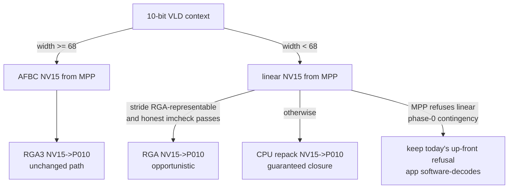

# Plan: close the narrow AFBC 10-bit gap — per-core imcheck honesty + linear-NV15 narrow path

> Scope: two independent workstreams that remediate the
> [no-core-match finding](../../../findings/2026-07-29-rga-no-core-match-narrow-afbc-10bit.md):
> **A** makes librga's `imcheck()`/`improcess()` reject per-core-impossible jobs
> early and precisely (fixes every librga consumer); **B** replaces
> rockchip-vaapi's up-front narrow-context refusal with a linear-NV15 decode
> path and CPU repack (closes the last Main10 sweep failure, 10/11 → 11/11).
>
> Source pins: librga fork `~/Code/rock-5b/rockchip-userspace/librga-fork`
> (`yisding/librga@main`, tip `26a50ef`); rockchip-vaapi
> `~/Code/rock-5b/rockchip-vaapi` (`yisding/rockchip-vaapi@main`, tip `3f1aaa0`,
> packaged `1.0.11+ysp6`); kernel policy oracle
> `drivers/video/rockchip/rga3/rga_hw_config.c` + `rga_policy.c` on the
> forward-port tree ([source-trees §1](../../../docs/source-trees.md)).
>
> Date: 2026-07-29. Status: **PLANNED** — file:line cites below are
> SOURCE-CONFIRMED from the pinned trees; items marked UNVERIFIED are
> assumptions a phase-0 spike must retire before the dependent step.

## Non-goals

- No relaxation of the kernel's 68-pixel RGA3 range — it is the vendor-published
  hardware envelope (`Rockchip_FAQ_RGA_EN.md:688`, debugfs `hardware` report).
- No allocation-side AFBC padding (uninitialized superblock headers in pad
  columns; unverified MPP geometry control; serves a vanishing case).
- No software AFBC decode.
- No new public librga API surface and **no separate wrapper library** —
  rationale in §A.1.

---

## Workstream A — librga per-core imcheck honesty

### A.1 Design decision: fix in the fork, not a separate library

The question was whether a separate library should carry the per-core check so
the vendor API surface stays untouched. Answer: **no separate library** —

1. **Honesty needs zero API-surface change.** `imcheck_t`'s signature, the
   `IM_STATUS` codes, and `IM_STATUS_NOT_SUPPORTED` as a documented return are
   all unchanged; the fix only makes existing answers accurate. The capability
   struct that must grow (`rga_info_table_entry`,
   `im2d_api/src/im2d_hardware.h:162-175`) lives under `src/` and is not among
   the installed headers (`meson.build:55-75`), so ABI is untouched.
2. **The whole value is that imcheck is the choke point existing callers
   already use.** ffmpeg-rockchip, GStreamer, and rockchip-vaapi call
   `imcheck`/`improcess` today; a side library helps only code that adopts it,
   which defeats the purpose.
3. **It is upstream's own stated direction.** The merge code carries an in-tree
   comment (`im2d_api/src/im2d_impl.cpp:462-470`): *"Currently, this only
   applies to full_csc. In the future, plan to perform validation on a
   per-core basis, rather than merging them into a single table."* This is an
   upstreamable bug fix aligned with the vendor's plan, not a fork divergence —
   and the fork already ships behavior fixes (P010/P210 stride series) in the
   PPA `librga2` package.

If a negotiation-time capability query is ever needed outside librga, none is
required either: `imcheck` is already a pure-descriptor query — nothing under
`rga_check_external` dereferences `fd`/`vir_addr`/`handle`
(`im2d_impl.cpp:769-774` is only used to gate the pat channel, and the
two-image `imcheck` macro zero-fills pat, `im2d_common.h:95`).

**Containment contract** (what "no API change" means, checkable at review
time): the exported symbol set is unchanged; every *installed* header
(`meson.build:55-75`) stays byte-identical to the vendor tree — all struct
growth is confined to `src/`-internal headers; no new `IM_STATUS` values or
public types; the only behavior delta is that `imcheck`/`improcess` return the
already-documented `IM_STATUS_NOT_SUPPORTED` for jobs the kernel scheduler is
guaranteed to refuse. (Skipping the customary `im2d_version.h` build-version
bump is part of this contract — the Debian package version carries the
provenance instead.) If the vendor later lands their own per-core validation,
the fork patch is dropped at rebase time; until then the delta lives entirely
in internal files the fork already patches.

### A.2 Current state (why imcheck lies)

- The kernel reports **per-core** version triples: `RGA_IOC_GET_HW_VERSION` →
  `struct rga_hw_versions_t` (up to 5 cores + count,
  `core/hardware/rga_ioctl.h:42-43,365-378`), retained for the session life in
  `session->core_version` (`im2d_api/src/im2d_context.h:64`). On RK3588:
  `size == 3` (2× RGA3 `0x76831`, 1× RGA2e).
- `rga_get_info()` (`im2d_impl.cpp:964-1282`) resolves each core to a static
  row of `hw_info_table[]` (`im2d_hardware.h:182-457`), then collapses all rows
  into the single `session->hardware_info` via
  `rga_support_info_merge_table()` (`im2d_impl.cpp:433-472`): formats and
  feature bits are **OR'd**, resolutions take the **larger** core. The union is
  over-permissive by construction.
- `rga_info_table_entry` has **no minimum-resolution field** at all; the only
  floor in the check path is the universal `width < 2 || height < 2`
  (`im2d_impl.cpp:1328-1333`). No `68` exists anywhere in the tree.
- Storage mode is nearly invisible to the checks: `rd_mode` feeds only
  alignment rules (`rga_check_align`, `im2d_impl.cpp:1640-1731`);
  `IM_RGA_SUPPORT_FEATURE_FBC` is set in the RGA3 table row and **never
  consulted** by any check (only printed by `querystring`, `im2d.cpp:765-766`).
  Core-vs-rd_mode matching happens only in the kernel scheduler — hence
  accept-then-`no core match`.
- `rga_check()` (`im2d_impl.cpp:1946-2038`) is shared by `imcheck`
  (`im2d_impl.cpp:2040-2050`) and the submit path (`:2656`), so one fix
  upgrades both: early `NOT_SUPPORTED` from `imcheck`, and a precise error
  instead of `IM_STATUS_FAILED`(0) from `improcess`.

### A.3 Changes

> Superseded in detail by the
> [per-core imcheck implementation plan](../../../vendor-libraries/rga/docs/imcheck-per-core-implementation.md),
> which pins the kernel-oracle semantics, the sidecar-table design (no vendor
> row edits), the quiet-predicate matcher, and the kernel-equivalence test
> harness. The outline below is the summary view.

1. **Table model** (`im2d_hardware.h`, internal): extend
   `rga_info_table_entry` with `input_min_resolution` / `output_min_resolution`
   (two `rga_info_resolution_t` = 16 bytes; can exactly replace
   `reserved[16]` if size stability is preferred) and per-direction
   `input_rd_mode` / `output_rd_mode` masks over the `IM_*_MODE` enum
   (`im2d_type.h:98-106`). Populate from the kernel oracle
   (`rga_hw_config.c` `rga3_data`/`rga2e_data` ranges, `rga3_win_data`/
   `rga2e_win_data` `.rd_mode`) and the vendor FAQ: RGA3 row gets min
   `{68,2}`/`{68,2}` and raster|AFBC16×16|TILE rd_modes; RGA2e stays min
   `{2,2}` raster-only. Rows for cores absent on RK3588 (RGA2_PRO etc.) get
   constraints only where vendor docs state them — mark those UNVERIFIED in
   comments.
2. **Session model** (`im2d_context.h:53-70`): keep the merged
   `hardware_info` (compatibility, `querystring`), add
   `rga_info_table_entry per_core_info[RGA_HW_SIZE]` + count, filled in the
   existing `rga_get_info()` per-core loop just before the merge call
   (`im2d_impl.cpp:1247`).
3. **Matching pass**: new `rga_check_core_match()` called from `rga_check()`
   after the existing merged checks. For each core (intersected with the
   scheduler core mask if the caller set one via `IM_CONFIG_SCHEDULER_CORE` /
   `im_opt_t`): every enabled channel (src, pat, dst) must satisfy that same
   core's min/max ranges, per-direction format bits, per-direction rd_mode,
   feature bits, and pixel depth. Mirror the kernel's RGA3 rectangle semantics
   (`rga_check_channel()` checks `act_w + x_offset`). The job passes if ≥1
   core accepts all channels; otherwise return `IM_STATUS_NOT_SUPPORTED` and
   `IM_LOGW` one line per core naming its first disqualifier (e.g.
   `RGA3: act_w 64 < min 68; RGA2: rd_mode AFBC16x16 unsupported`) — the
   text reaches callers via `imStrError()`.
4. **Strictly-narrowing first step.** The initial patch only *adds* the
   per-core pass; every existing merged check stays. Result: the only behavior
   change is jobs the kernel would refuse anyway now fail early. The known
   over-strict merged constraint (`byte_stride` merges to MAX, so RGA3's 16
   masks RGA2's 4, `im2d_impl.cpp:456-458`) is a *false-rejection* bug worth
   fixing, but relaxing it changes behavior in the permissive direction —
   defer to a follow-up validated separately on hardware.
5. **Escape hatch**: env opt-out `ROCKCHIP_RGA_PER_CORE_CHECK=0` (default on),
   read alongside the existing log env vars (`im2d_log.cpp:90-108` precedent).
   The dead `IM_CONFIG_CHECK` knob (`im2d.cpp:895`, written but never read) is
   available if a per-thread toggle is ever wanted; not needed initially.
6. **Optional diagnostics** (follow-up): teach `querystring(RGA_ALL)` to print
   per-core capability sections instead of only the merged blob.

### A.4 Tests and acceptance

Descriptor-only self-test (new test binary in the fork; wired into the
conformance harness alongside `librga-smoke.sh`):

| Case | Expect |
|---|---|
| NV15 AFBC16×16 64×240 → P010 64×240 | `NOT_SUPPORTED` at imcheck **and** improcess; zero kernel `no core match` in dmesg |
| NV15 AFBC16×16 68×240 → P010 | `SUCCESS` (boundary; matches the measured 68×240 context-create pass) |
| NV12 raster 64×240 | `SUCCESS` — guards against regressing to a global 68 floor (RGA2 min is 2) |
| Forced core mask = RGA2 + AFBC src | `NOT_SUPPORTED` |
| Forced core mask = RGA3 + 64-wide raster | `NOT_SUPPORTED` (RGA3's floor applies to raster too) |

Hardware regression: full `librga-smoke.sh`, `gstreamer-suite.sh`, and the
FFmpeg wrapper from the conformance bundle before/after — identical pass/fail
sets, zero new kernel `no core match` lines. Drift guard: a root-only test that
parses the driver's debugfs `hardware` report and asserts the userspace
per-core ranges match what the kernel advertises (path on the shipping kernel
to be confirmed when the test is written).

Acceptance: the finding's 64×240 job is refused in userspace with a message
naming both disqualifiers; conformance suites unchanged; `CHANGELOG.md` entry
added (no `im2d_version.h` bump — see the containment contract in §A.1); PPA
`librga2` re-cut; upstream PR opened against `airockchip/librga` citing their
own per-core-validation comment.
(Fork policy reminder: work lands on `yisding/librga@main`; `librga-mirror`
stays vendor-mirror-only.)

### A.5 Risks

- **False rejections from table drift** vs kernel policy. Mitigations: kernel
  files are the sole population oracle; debugfs drift test; env opt-out; the
  strictly-narrowing first step means any wrong rejection corresponds to a job
  the modeled kernel would also reject — conformance suites will surface it.
- **Non-RK3588 SoCs**: rows we cannot measure stay permissive unless
  vendor-documented; per-core matching only ever narrows toward the kernel's
  own refusal, so the failure mode off-target is "still accepts, kernel
  refuses" — today's behavior.

---

## Workstream B — linear-NV15 narrow path in rockchip-vaapi

### B.1 Current state

- AFBC is requested all-or-nothing per 10-bit context:
  `src/context.c:172-184` sets `MPP_FRAME_FBC_AFBC_V2` for every
  HEVC Main10 / VP9 Profile 2 VLD context; 8-bit paths never call
  `MPP_DEC_SET_OUTPUT_FORMAT` and take linear NV12 by default.
- The up-front refusal (`491533e`) at `src/context.c:88-96` calls
  `rk_rga_nv15_to_p010_geometry_supported((uint32_t)width, /*afbc=*/true)` —
  the hard-coded `true` is exactly the assumption this workstream relaxes. The
  predicate (`src/convert.c:24-31`) already returns true for
  `!source_afbc`, and the unit test already asserts 64/linear is allowed
  (`tests/driver_objects_test.c:339-347`).
- Linear NV15 handling half-exists: `assign_mpp_frame()` derives the pixel
  stride from the byte stride (`src/mpp_dec.c:446-448`, 5 bytes per 4 pixels)
  but then **requires** `(src_hs_pixels % 64) == 0` (`mpp_dec.c:450-457`) —
  the "not RGA-representable" rule that forced AFBC in the first place
  (`docs/ROADMAP.md:375-380`: VDPU383 reports e.g. 448 bytes for 320 pixels).
  A CPU repack does not care about any of this — it reads the raw byte stride.
- CPU map/sync repack idioms to copy exist (`src/buffer.c:820-861`,
  `src/surface.c:371-413`: `mpp_buffer_get_ptr` + `dmabuf_cpu_sync`
  START/END brackets); the converted-P010 destination is allocated from
  `pool->backing_group` (`src/convert.c:255-259`, `src/mpp_dec.c:186-191`).
  No NV15 unpack exists yet anywhere in the tree.

### B.2 Fallback ladder (target behavior)

The CPU branch is the design anchor: its cost scales with frame area, and the
trigger condition is smallness (width < 68), so it is cheapest exactly where
hardware coverage disappears. The RGA-linear branch is opportunistic only.

### B.3 Phase 0 — retire the UNVERIFIED assumptions

- **S1 — MPP grants linear NV15 for these streams.** On the pinned 64×240
  vector, skip the AFBC `MPP_DEC_SET_OUTPUT_FORMAT` (or explicitly request
  bare `MPP_FMT_YUV420SP_10BIT`) and log `fmt` / `hor_stride` /
  `hor_stride_pixel` at `assign_mpp_frame()`. Record the actual byte stride
  VDPU383 produces at width 64. Contingency: if MPP forces AFBC or errors,
  abort the workstream — the shipped refusal remains correct behavior.
- **S2 — can any RGA core take the measured linear geometry?** Probe with a
  descriptor-only `imcheck` (honest per-core imcheck if Workstream A has
  landed) using the measured stride. Expected answer: no (RGA3 floor, RGA2
  10-bit output support doubtful) — in which case the RGA-linear branch is
  dropped and the ladder is AFBC→RGA / linear→CPU only. Either answer is fine;
  the plan does not depend on S2.

### B.4 Implementation

| Step | Where |
|---|---|
| Narrow decision at context create: for `output_10bit && width < 68`, don't refuse and don't request AFBC; set a `narrow_linear_10bit` flag on the context | `src/context.c:88-96`, `:172-184`; flag in `src/driver_internal.h` |
| Accept non-64-aligned / non-integral linear NV15 strides when the narrow flag is set, carrying the raw byte stride through | `src/mpp_dec.c:446-457` |
| Route narrow linear frames to the CPU repack (RGA branch only if S2 says yes) | `src/mpp_dec.c:474-488` |
| New `rk_repack_nv15_to_p010_cpu()` beside the RGA converter, reusing the geometry-guard header constant and the same destination allocation from `pool->backing_group`; keep `s->hstride` = pixel stride on success, matching the RGA converter's output contract (`mpp_dec.c:487,522`) | `src/convert.c` (+ decl `src/convert.h`) |
| CPU map/sync bracket per the existing idiom | pattern from `src/buffer.c:820-861`, `src/surface.c:371-413` |

**Repack spec.** NV15 (compact 10-bit NV12): each 5 consecutive bytes hold 4
samples as a 40-bit little-endian word; sample *i* of the group is bits
`[10i, 10i+10)`. Luma plane is `height` rows of `hor_stride` bytes; chroma is
`height/2` rows of interleaved 10-bit Cb/Cr in the same packing. P010 output:
16-bit little-endian per sample, value in the 10 MSBs (`sample << 6`), NV12
plane order, destination strides per `rk_p010_layout_size()`
(`src/frame_layout.c:28-35`). Handle MPP's `offset_x/offset_y` (assert 0 for
linear narrow frames if S1 confirms that, otherwise honor them). Scalar C is
sufficient: the path only runs for width < 68, so worst realistic frames are
~67×2160 ≈ 145K pixels; no NEON until a measurement says otherwise. The
unpack is lossless bit relocation, so byte-exactness against the software
decoder is expected to hold.

### B.5 Tests and acceptance

- **Unit** (`tests/driver_objects_test.c`): keep the three geometry cases
  (`:339-347`); add golden-pattern NV15→P010 unpack cases (synthetic 5-byte
  groups with known expansions, edge widths 2/63/64/67, odd heights, stride >
  width×1.25) — pure CPU, no hardware needed.
- **Integration**: invert `tests/check-main10-narrow-fallback.sh` (assertions
  at `:86-101`): 0 context refusals, a narrow-linear log marker instead of
  `mode=AFBC_V2`, 48/48 frames hardware-decoded, FFmpeg no longer logs the
  hwaccel fallback, 0 kernel `no core match` (keep the journal-cursor diff).
- **Sweep**: `WPP_D_ericsson_MAIN10_2.bit` moves from class `driver` to
  `exact` in `tests/hevc-main10-sweep-vectors.tsv:13`; full sweep target
  11/11 byte-exact. Re-run the 68×240 boundary, 320×240 and 416×240
  regressions (AFBC path must be untouched), `check-10bit-throughput.sh`,
  and the ASan/UBSan gates as done for `491533e`.
- **VP9 Profile 2 narrow**: no pinned narrow vector exists; synthesize one
  (or record its absence in the test README) — optional, same code path.

Acceptance: sweep 11/11; no AFBC-path regressions; packaged as the next
`ysp` revision, PPA-published, installed-driver gates re-run; finding and
status ledger updated. Note: this removes **one of the three** reasons
`VAProfileHEVCMain10` is hidden (`src/rockchip_drv_video.c:61-85`) — it does
not by itself unhide the profile.

### B.6 Risks

- **MPP declines linear NV15** for these streams (UNVERIFIED until S1): plan
  dies cleanly at phase 0; shipped refusal stays.
- **Runtime linear failure after context accept** would surface mid-decode,
  later than today's up-front refusal. Mitigation: the narrow flag is set only
  when phase-0-verified conditions hold; on unexpected info-change geometry
  the decoder errors out and the app still falls back, just less gracefully —
  keep the existing pre-submit geometry guard as the safety net.
- **Chroma siting / colorimetry drift in the CPU path**: none expected (pure
  bit relocation, no resampling), and byte-exact sweep comparison is the
  detector.

---

## Sequencing

The workstreams are independent; neither blocks the other.

1. **A first is slightly preferred**: it is standalone value for every librga
   consumer, and it turns B's S2 probe into a one-liner (descriptor imcheck as
   the oracle). B's CPU-first design works without it.
2. B phase 0 (S1) can run any time — it is a log-only spike.
3. Both should land before the next full Main10 conformance re-run so the
   sweep exercises honest-imcheck + narrow-linear together (the integration
   test's `no core match` assertion then covers the whole stack).

Future simplification once A ships: rockchip-vaapi's hard-coded
`RK_RGA3_MIN_ACTIVE_WIDTH 68` (`src/convert.h:10`) could be replaced by a
startup descriptor-imcheck probe, removing the duplicated vendor constant —
optional, not part of this plan.
